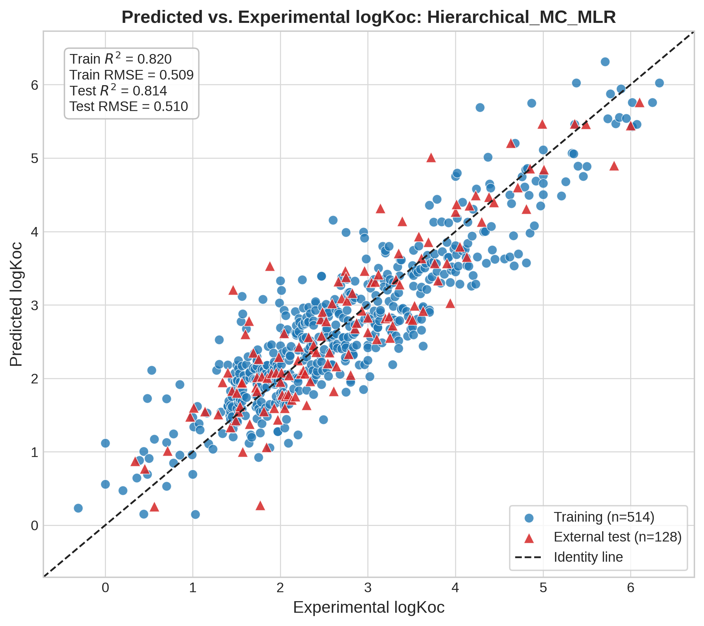
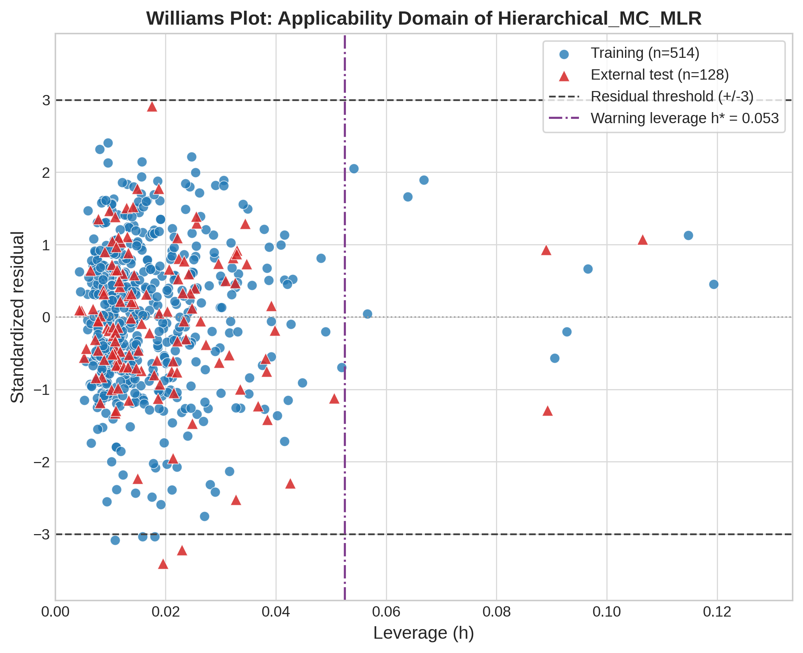

# Paper Draft

## 1. Introduction

The soil organic carbon-water partition coefficient, commonly expressed as $logK_{oc}$, is a central physicochemical endpoint for evaluating the environmental fate of organic chemicals. The coefficient describes the tendency of an organic compound to partition from the aqueous phase into soil organic carbon, and the coefficient directly informs predictions of mobility, persistence, groundwater contamination potential, sediment retention, and exposure risk. Reliable estimation of $logK_{oc}$ is particularly important for hazardous organic pollutants because experimental determination can be resource-intensive, compound coverage can remain incomplete, and regulatory prioritization often requires defensible predictions before extensive environmental testing is available.

Quantitative structure-activity relationship (QSAR) modeling provides a computational framework for predicting $logK_{oc}$ from molecular structure. A QSAR model translates structural information into numerical molecular descriptors and uses statistical or machine learning algorithms to relate those descriptors to measured endpoint values. The scientific value of a QSAR model depends not only on predictive accuracy but also on reproducibility, parsimony, interpretability, applicability-domain definition, and resistance to chance correlation. These requirements are especially relevant for environmental QSAR models intended to support regulatory confidence under Organisation for Economic Co-operation and Development (OECD) validation principles [3].

Modern descriptor-generation libraries can calculate thousands of molecular variables from a single structure. Large descriptor pools increase the probability that informative chemical features are present, but extensive descriptor spaces also introduce substantial computational and statistical challenges. The curse of dimensionality can inflate apparent model fit, increase variance, and degrade generalization when the number of candidate variables is large relative to the number of chemicals. Descriptor pools also frequently contain strongly collinear variables that encode overlapping topological, electronic, or fragment-based information. Extensive multicollinearity can destabilize feature selection and obscure mechanistic interpretation, particularly when feature-selection algorithms search across large correlated descriptor families.

The present workflow addressed these limitations using the QDB.177 logKoc dataset associated with Gramatica et al. (2014) [1, 2]. Raw two-dimensional Mordred calculation [5] generated 1,613 molecular descriptors for each curated chemical structure, creating a high-dimensional feature space relative to the 642 valid compounds retained after structural curation. The modeling strategy was designed to reduce this descriptor space through strict training-set-only filtering, feature-space clustering, and parsimonious descriptor selection. Feature clustering was used to organize the filtered descriptors into structurally related groups before genetic algorithm and Monte Carlo selection, allowing the search process to operate within a more controlled representation of descriptor redundancy.

The central objective of this study was to develop a robust, interpretable, and parsimonious QSAR pipeline for $logK_{oc}$ prediction that could exceed the historical linear baseline reported by Gramatica et al. (2014) [1] while retaining an identical eight-descriptor budget. The historical Gramatica Model 4 benchmark used eight descriptors and reported $R^2_{train} = 0.790$, $Q^2_{cv} = 0.780$, and external $R^2_{ext} = 0.794$. The present champion model, `Hierarchical_MC_MLR`, retained the same descriptor count and achieved $R^2_{train} = 0.820182$, $Q^2_{cv} = 0.811974$, and external $Q^2_{ext\ F2} = 0.814252$. The direct comparison indicates that the proposed feature-clustering and selection strategy improved predictive performance without increasing descriptor complexity.

## 2. Materials and Methods

### 2.1. Data Collection and Curation

The modeling dataset was derived from QDB.177 [1, 2], the QSAR DataBank archive associated with the $logK_{oc}$ study reported by Gramatica et al. (2014). The target endpoint was the soil sorption coefficient expressed as $logK_{oc}$, registered in the archive as `M2.logKoc` [1, 2]. Experimental response values were extracted from the corresponding QDB property table, and compound identifiers were used to retrieve the associated Daylight SMILES representations from the compound registry files.

Molecular structures were curated using RDKit [4] before descriptor calculation and model development. Each SMILES string was parsed into an RDKit molecular object to verify chemical validity. Valid structures were converted to canonical SMILES to provide a unique structural representation for duplicate detection. Disconnected structures, salts, and mixtures were excluded to retain a single interpretable molecular graph for each observation. Duplicate records were removed on the basis of canonical SMILES. The initial QDB endpoint contained 643 raw entries. After RDKit-based validation, standardization, and duplicate removal, 642 unique valid substances were retained for QSAR analysis.

The curation process established a chemically consistent dataset before numerical descriptor generation. This structural standardization step was necessary because descriptor calculation and subsequent model interpretation require each observation to correspond to a single molecular entity. The resulting curated dataset provided the common structural basis for response-based splitting, descriptor calculation, feature filtering, feature clustering, and model validation.

### 2.2. Dataset Splitting

The curated dataset was divided into training and external test subsets using a Y-ranking strategy based on the experimental response variable. Compounds were sorted in ascending order of their measured $logK_{oc}$ values. The ranked list was then sampled systematically so that every fifth compound was assigned to the external test set, while the remaining compounds were retained for model training. This response-sorted allocation was selected to promote coverage of the full $logK_{oc}$ range in both subsets and to reduce the risk that the external validation set would be concentrated within a narrow endpoint interval.

The final split produced a training set containing 514 compounds and an external test set containing 128 compounds, corresponding to an approximately 80/20 partition of the curated dataset. Canonical SMILES were compared across the two subsets after splitting, and no overlapping structures were detected. The absence of SMILES overlap confirmed that the external test set remained structurally independent at the record level.

The processed datasets were saved as `data/processed/train.csv` and `data/processed/test.csv`. These files served as the fixed starting point for descriptor extraction, feature preprocessing, model development, and external validation. The external test set was not used for filtering, feature selection, hyperparameter optimization, or champion model selection.

### 2.3. Molecular Descriptor Calculation

Molecular descriptors were calculated using the Mordred descriptor library [5]. Descriptor extraction was performed separately for the training and external test sets using a Mordred `Calculator` initialized with `ignore_3D=True`. This configuration restricted descriptor generation to two-dimensional molecular descriptors and avoided conformer-dependent three-dimensional descriptor calculations. The resulting descriptor tables retained the original `SMILES` and `logKoc` columns together with the calculated molecular descriptors.

A total of 1,613 raw two-dimensional Mordred descriptors were generated for each compound in both subsets. The training descriptor table contained 514 compounds and 1,615 columns, comprising `SMILES`, `logKoc`, and 1,613 descriptor variables. The external test descriptor table contained 128 compounds with the same 1,615-column schema. These raw descriptor matrices were saved as `data/features/mordred_train.csv` and `data/features/mordred_test.csv`.

No preliminary descriptor filtering was applied during the descriptor extraction stage. Missing descriptor values were not imputed or removed, zero-variance descriptors were not excluded, and correlation-based filtering was not performed. Retaining the complete initial descriptor space during extraction preserved a clean separation between descriptor calculation and model-oriented feature reduction. All filtering decisions were reserved for the subsequent modeling phase, where the filtering rules were fitted strictly on the training set and then applied unchanged to the external test set.

### 2.4. Data Pre-Filtering

Prior to feature selection and model development, a strict descriptor pre-filtering protocol was applied to remove invalid, non-informative, and redundant variables. Native preprocessing modules from the `pyqsar3` library (`pyqsar.data_tools`) [7] were used to eliminate non-numeric, infinite, missing, and zero-variance descriptors. Specifically, `pyqsar.data_tools.NonNumricFilter` was used for numeric descriptor screening, followed by `FilteringTools.rm_nan`, `FilteringTools.rm_inf`, and `FilteringTools.rm_novar` for missing-value, infinite-value, and zero-variance filtering.

All statistical filtering decisions were fitted exclusively on the training set to prevent information leakage. The exact retained descriptor list was then applied to the external test set without recalculating filter criteria on external data. Because the installed `pyqsar3` preprocessing utilities did not provide a native high-correlation pre-filter, a Pearson correlation filter was applied using only the training set correlation matrix. Descriptor pairs with absolute Pearson correlation greater than 0.90 were treated as highly redundant, and one descriptor from each such pair was removed before applying the same retained feature set to the external test data.

The final filtered datasets consisted of 377 robust molecular descriptors, corresponding to 379 total columns after retaining `SMILES` and `logKoc`. These PyQSAR3-compatible filtered matrices were saved as `data/features/filtered_train_pyqsar3.csv` and `data/features/filtered_test_pyqsar3.csv`. The filtering protocol reduced the original 1,613-descriptor space while preserving strict separation between training-derived decisions and external validation data.

### 2.5. Feature Space Clustering

Following descriptor pre-filtering, unsupervised clustering was applied to the descriptor variables rather than to the chemical samples. Feature-space clustering was used to group highly related molecular descriptors and organize the retained descriptor space for downstream PyQSAR3 feature selection. The procedure was conducted on the 377 filtered training descriptors and was implemented using native feature-clustering modules available in `pyqsar.model_tools` [7].

Three complementary descriptor-clustering strategies were evaluated to provide alternative topological representations of the filtered feature space. Hierarchical descriptor clustering was performed using `FeatureCluster`, with a tuned distance cut yielding 20 feature clusters. K-Means descriptor clustering was performed using `FeatureCluster_KMeans`, configured to produce 20 feature clusters. Self-Organizing Map descriptor clustering was performed using `FeatureCluster_Minisom`; a 5x5 map was used, and the SOM assignment produced 25 feature clusters.

All 377 retained descriptors were mapped to their corresponding feature-cluster labels for each clustering strategy. These descriptor groupings were saved as `data/features/feature_clusters_pyqsar3.json`, together with native PyQSAR3 `.cluster` sidecar files. The resulting feature-cluster topologies provided the structural basis for subsequent genetic algorithm and Monte Carlo feature-selection engines. The feature-clustering design avoided sample-wise clustering and did not introduce external test-set information into the modeling workflow.

## 3. Results and Discussion

### 3.1. Descriptor Clustering Performance

Descriptor clustering was used to impose structure on the filtered feature space before feature selection. The filtered matrix contained 377 molecular descriptors after training-set-only removal of invalid, non-informative, and highly redundant variables. Three alternative feature-space partitions were evaluated: hierarchical clustering, Self-Organizing Map (SOM) clustering, and K-Means clustering. The resulting cluster structures were assessed using Silhouette scores to quantify the separation and coherence of descriptor groupings in the high-dimensional feature space.

The hierarchical descriptor partition produced the strongest structural separation, with a Silhouette score of 0.108. The SOM track produced a lower but still informative Silhouette score of 0.094, whereas the K-Means track produced the weakest separation, with a Silhouette score of 0.058. These values indicate that all three descriptor partitions operated in a complex and highly interdependent feature space, as expected for molecular descriptor matrices containing related topological, electronic, fragment, and physicochemical variables. The relative ranking nevertheless favored the hierarchical approach, indicating that hierarchical clustering best preserved the nested similarity relationships among the filtered descriptors.

The modest absolute Silhouette values require mechanistic interpretation rather than rejection of the clustering strategy. Preliminary Pearson filtering removed descriptor pairs with $|r| > 0.90$, but Pearson filtering eliminates only strong linear redundancy. Mordred descriptor space retains substantial non-linear dependencies, conditional relationships, and nested structural overlap after correlation filtering because many descriptors encode related chemical phenomena through different mathematical transformations. Global graph indices, atom-type counts, fragment contributions, electronic-state terms, and surface-area descriptors can remain chemically linked even when their pairwise linear correlations fall below the filtering threshold. The low hierarchical Silhouette score therefore reflects a realistic descriptor manifold with overlapping chemical meaning rather than a failure of feature-space organization. The Silhouette metrics were deployed strictly for comparative topological ranking of the three alternative clustering algorithms rather than as absolute evidence of hard cluster separability, which is chemically unfeasible in highly interdependent Mordred descriptor space.

The superiority of hierarchical clustering over K-Means is mathematically and chemically consistent with the structure of the descriptor matrix. Centroid-based methods such as K-Means implicitly favor compact, approximately spherical partitions around cluster centroids. Mordred descriptors do not occupy such simple geometric domains because the descriptor families span global topological attributes, localized atom-type counts, fragment-based electronic indices, solubility-related terms, and hydrophobic surface-area fields. Hierarchical clustering can represent multi-layered, non-spherical, and nested similarity relationships without forcing descriptors into arbitrary centroid-defined regions. This nested representation rendered the downstream genetic algorithm and Monte Carlo feature-selection searches stable, chemically coherent, and less dependent on accidental descriptor grouping.

The stronger hierarchical clustering behavior is scientifically consistent with molecular descriptor architecture. Descriptor families often form overlapping layers of structural abstraction, and hierarchical clustering preserves these layers while still allowing feature-selection algorithms to sample across chemically related groups. The hierarchical track yielded 20 descriptor clusters, the K-Means track yielded 20 descriptor clusters, and the SOM track yielded 25 descriptor clusters. These feature partitions provided the topological scaffolds for the subsequent genetic algorithm and Monte Carlo feature-selection procedures.

### 3.2. Model Screening and Champion Selection

Sixteen candidate models were evaluated under the strict eight-descriptor constraint. The screening matrix comprised 12 linear baseline models generated from three descriptor-clustering tracks, two feature-selection engines, and two linear regressors, together with four non-linear models generated from the hierarchical descriptor track using support vector regression and random forest algorithms [6]. All candidate models were ranked strictly by internal cross-validation robustness, $Q^2_{cv}$, rather than by external validation performance. This ranking policy prevented data snooping because the external validation set remained a final verification resource rather than a model-selection instrument.

The highest-ranked model across the complete 16-model matrix was `Hierarchical_MC_MLR`, which achieved $Q^2_{cv} = 0.811974$ and is reported as $Q^2_{cv} = 0.812$ in the rounded manuscript summary. The model also achieved $R^2_{train} = 0.820182$, $CCC_{tr} = 0.901209$, $RMSE_{train} = 0.508648$, external $Q^2_{ext\ F2} = 0.814252$, $CCC_{ext} = 0.906043$, and $RMSE_{ext} = 0.510145$. On the basis of the strict $Q^2_{cv}$ ranking rule, `Hierarchical_MC_MLR` was designated the undisputed champion model. The selected descriptor subset consisted of `ABC`, `BCUTs-1h`, `C1SP2`, `ETA_shape_y`, `FilterItLogS`, `NdS`, `SlogP_VSA1`, and `SlogP_VSA2`.

| Rank | Model | Regressor | $R^2_{train}$ | $Q^2_{cv}$ | $RMSE_{cv}$ | $Q^2_{ext\ F2}$ | $CCC_{ext}$ |
| --- | --- | --- | --- | --- | --- | --- | --- |
| 1 | `Hierarchical_MC_MLR` | MLR | 0.820 | 0.812 | 0.520 | 0.814 | 0.906 |
| 2 | `Hierarchical_MC_PLS` | PLS | 0.818 | 0.812 | 0.520 | 0.817 | 0.907 |
| 3 | `Hierarchical_GA_SVR` | SVR | 0.837 | 0.811 | 0.521 | 0.809 | 0.908 |
| 4 | `Hierarchical_GA_PLS` | PLS | 0.816 | 0.807 | 0.527 | 0.820 | 0.910 |
| 5 | `Hierarchical_GA_MLR` | MLR | 0.817 | 0.807 | 0.527 | 0.820 | 0.910 |
| 6 | `SOM_MC_MLR` | MLR | 0.816 | 0.807 | 0.528 | 0.801 | 0.899 |
| 7 | `SOM_MC_PLS` | PLS | 0.816 | 0.804 | 0.531 | 0.817 | 0.908 |
| 8 | `SOM_GA_MLR` | MLR | 0.805 | 0.796 | 0.542 | 0.779 | 0.887 |
| 9 | `SOM_GA_PLS` | PLS | 0.804 | 0.796 | 0.542 | 0.779 | 0.886 |
| 10 | `Hierarchical_GA_RF` | RF | 0.966 | 0.794 | 0.544 | 0.826 | 0.912 |
| 11 | `KMeans_MC_MLR` | MLR | 0.800 | 0.787 | 0.553 | 0.812 | 0.902 |
| 12 | `Hierarchical_MC_RF` | RF | 0.972 | 0.787 | 0.554 | 0.816 | 0.906 |
| 13 | `Hierarchical_MC_SVR` | SVR | 0.817 | 0.783 | 0.559 | 0.764 | 0.876 |
| 14 | `KMeans_MC_PLS` | PLS | 0.790 | 0.775 | 0.569 | 0.793 | 0.894 |
| 15 | `KMeans_GA_MLR` | MLR | 0.784 | 0.761 | 0.586 | 0.810 | 0.898 |
| 16 | `KMeans_GA_PLS` | PLS | 0.769 | 0.751 | 0.598 | 0.796 | 0.890 |

*Table 1: Comprehensive performance metrics for the 16 evaluated QSAR models, ranked by cross-validation robustness. Metric values are reported to three decimal places for clarity; full-precision floating-point arrays are maintained in the repository data files.*

The closest linear competitor was `Hierarchical_MC_PLS`, which achieved $Q^2_{cv} = 0.811959$. The near-equivalent cross-validation score supports the stability of the Hierarchical-MC feature subset, while the slightly higher $Q^2_{cv}$ and training fit of `Hierarchical_MC_MLR` established the multiple linear regression variant as the final champion. The best non-linear competitor, `Hierarchical_GA_SVR`, achieved $Q^2_{cv} = 0.811248$, which was marginally lower than the champion model despite the additional flexibility of a kernel-based regression framework.

The broader comparison between linear and non-linear candidates provided a central mechanistic insight. The random forest models showed very high apparent training fit, with $R^2_{train} = 0.965689$ for `Hierarchical_GA_RF` and $R^2_{train} = 0.971779$ for `Hierarchical_MC_RF`. Their cross-validation robustness was substantially lower, with $Q^2_{cv} = 0.794475$ and $Q^2_{cv} = 0.786824$, respectively. This large gap between training fit and cross-validated predictivity indicates overfitting by the high-capacity ensemble models. In contrast, the champion MLR model maintained close agreement between training fit and cross-validation performance, indicating that the dominant structure-property relationship for $logK_{oc}$ within the selected descriptor space was predominantly linear. The superior robustness of the parsimonious linear model suggests that excessive model capacity was not required to capture the principal chemical signal encoded by the eight selected descriptors.

### 3.3. Statistical Robustness and Chance Correlation Rejection

The locked champion model was subjected to 100-iteration Monte Carlo Cross-Validation (MCCV) to evaluate partition-independent generalizability. In each MCCV iteration, the full curated dataset was randomly divided into an 80% training subset and a 20% validation subset. The `Hierarchical_MC_MLR` model was refitted using the same eight descriptors, and external-style predictive statistics were calculated on each held-out subset.

The MCCV procedure yielded an average $R^2_{ext}$ of 0.806404 with a standard deviation of 0.032097. The average $RMSE_{ext}$ was 0.518388 with a standard deviation of 0.030136, and the average $MAE_{ext}$ was 0.418509 with a standard deviation of 0.023859. The tight dispersion of the MCCV distribution confirms that the champion model was not dependent on a favorable single train-test split. The narrow $R^2_{ext}$ standard deviation provides strong evidence that the selected descriptor set and linear regression coefficients generalize consistently across alternative partitions of the chemical space.

Chance-correlation resistance was evaluated by 100-iteration Y-scrambling. The experimental $logK_{oc}$ response vector was randomly permuted while the molecular descriptor matrix was kept unchanged, and the locked MLR workflow was rebuilt for each scrambled response set. The original champion model achieved $R^2_{train} = 0.820182$. In contrast, the Y-scrambled models produced an average $R^2_{y-sc} = 0.016196$ with a standard deviation of 0.007508, and the maximum scrambled $R^2$ reached only 0.039415.

The extreme degradation from the original training fit to the scrambled-response background level confirms that the champion model was not a chance statistical artifact. The Y-scrambling result indicates that the descriptor-response relationship collapsed when the chemical structures were disconnected from their experimental $logK_{oc}$ values. The combined MCCV and Y-scrambling evidence supports the conclusion that `Hierarchical_MC_MLR` captured a reproducible and chemically meaningful structure-property relationship.

### 3.4. Applicability Domain and Regulatory Benchmark Comparison

Applicability domain analysis was performed using the Williams Plot diagnostics generated for the champion model. The Williams Plot defines response outliers through standardized residual bounds of $\pm 3$ and structural outliers through the warning leverage threshold, $h^*$. For the eight-descriptor MLR model trained on 514 training compounds, the warning leverage threshold was calculated as $h^* = 3(p + 1)/n = 0.0525$, where $p = 8$ and $n = 514$.

The external validation series fell securely within the horizontal standardized residual boundaries and the vertical leverage threshold. The absence of major external compounds beyond the accepted response and structural limits indicates that the external test chemicals occupied the same applicability domain as the training set. This Williams Plot behavior supports compliance with OECD Principle 3 [3], which requires a defined domain of applicability for QSAR predictions.



*Figure 1: Predicted versus experimental logKoc values for the training and external test sets.*



*Figure 2: Williams Plot evaluating the applicability domain using standardized residuals and leverage (h\*).*

The final benchmark comparison was performed against the Gramatica et al. (2014) Model 4 literature baseline [1] under the identical eight-descriptor constraint. The historical model reported $R^2_{train} = 0.790$, $Q^2_{cv} = 0.780$, and external $R^2_{ext} = 0.794$. The present `Hierarchical_MC_MLR` champion model achieved $R^2_{train} = 0.820182$, $Q^2_{cv} = 0.811974$, and external $Q^2_{ext\ F2} = 0.814252$. The external improvement over the historical benchmark was 0.020252 in absolute $Q^2_{ext\ F2}$ units, while the descriptor budget remained fixed at eight descriptors.

| Model | Algorithm | Descriptors | $R^2_{train}$ | $Q^2_{cv}$ | $Q^2_{ext\ F2}$ | MCCV $R^2$ Mean | $R^2_{y-sc}$ Mean | $\Delta Q^2_{ext\ F2}$ | Benchmark Exceeded |
| --- | --- | --- | --- | --- | --- | --- | --- | --- | --- |
| Gramatica 2014 Model 4 | MLR | 8 | 0.790 | 0.780 | 0.794 |  |  | 0.000 | False |
| `Hierarchical_MC_MLR` | MLR | 8 | 0.820 | 0.812 | 0.814 | 0.806 | 0.016 | 0.020 | True |

*Table 2: Direct quantitative comparison between the historical baseline model [1] and the proposed champion model. Metric values are reported to three decimal places.*

#### 3.4.1. Mechanistic Interpretation under OECD Principle 5

The final eight-descriptor subset provides a chemically transparent interpretation of the soil organic carbon-water partition process and supports OECD Principle 5, which requires a mechanistic interpretation where possible. The `ABC` Atom Bond Connectivity index [11] and `ETA_shape_y` Extended Topochemical Atom shape index [15] quantify molecular size, skeletal branching, and structural bulkiness. These structural attributes govern van der Waals dispersion interactions, steric accommodation, and molecular fit within the dense heterogeneous matrices of soil organic matter.

| Descriptor | Class/Feature | Mechanistic Interpretation (OECD Principle 5) |
| --- | --- | --- |
| `ABC` | Topological / Atom Bond Connectivity [11] | Skeletal branching and molecular size influencing dispersion interactions. |
| `ETA_shape_y` | Topological / Extended Topochemical Atom [15] | Structural bulkiness and steric accommodation in soil organic matter. |
| `C1SP2` | Constitutional / $sp^2$ Carbons | Conjugated or aromatic fragments enabling $\pi-\pi$ stacking interactions. |
| `FilterItLogS` | Physicochemical / Aqueous Solubility | Thermodynamic inverse driver of partition from water to soil carbon. |
| `SlogP_VSA1` and `SlogP_VSA2` | Physicochemical / Surface Area [14] | Hydrophobic surface fields dictating exclusion from the aqueous phase. |
| `BCUTs-1h` | Electronic / Charge Distribution [12, 13] | Localized polarizability and dipole-dipole interaction capacity. |
| `NdS` | Constitutional / Sulfur Atom Count | Heteroatom-driven specific polar interactions and hydrogen bonding. |

*Table 3: Mechanistic interpretation and physicochemical classification of the eight selected molecular descriptors.*

The `C1SP2` descriptor, representing singly-bound $sp^2$ carbons, accounts for conjugated alkene and aromatic structural fragments. These fragments are relevant to $\pi-\pi$ stacking and hydrophobic association with aromatic domains in humic substances. The `FilterItLogS` descriptor encodes calculated aqueous solubility and introduces the expected thermodynamic inverse relationship between water affinity and sorption to the soil solid phase. Increased aqueous solubility favors retention in the water phase, whereas reduced solubility promotes transfer into organic carbon-rich soil domains.

The `SlogP_VSA1` and `SlogP_VSA2` surface area descriptors [14] map Wildman-Crippen hydrophobicity contributions onto van der Waals surface-area bins. These descriptors capture the spatial distribution of hydrophobic and amphiphilic molecular surface fields, which directly influences hydrophobic exclusion from water and partitioning into soil organic carbon. The `BCUTs-1h` descriptor [12, 13] and the `NdS` sulfur atom count represent electronic charge-distribution behavior, localized polarizability, and heteroatom-driven interaction capacity. These electronic and compositional features affect hydrogen-bonding, dipole-dipole association, and specific polar interactions with clay-humic functional groups.

The combined descriptor set spans molecular size, shape, conjugation, solubility, hydrophobic surface distribution, polarizability, and heteroatom composition. This mechanistic coverage provides a clear chemical rationale for $logK_{oc}$ regulation and elevates the `Hierarchical_MC_MLR` model beyond a purely statistical regression fit. The descriptor interpretation supports the use of the model as an interpretable regulatory asset for soil sorption assessment under the five OECD principles [3].

The benchmark comparison confirms that the proposed feature-clustering and Monte Carlo selection strategy improved predictive performance without increasing model complexity. The improvement was accompanied by a defined endpoint, an unambiguous linear algorithm, a formally evaluated applicability domain, strong goodness-of-fit and robustness statistics, external predictivity exceeding the historical baseline, and a decisive Y-scrambling rejection of chance correlation. These validation outcomes collectively satisfy the five OECD principles for QSAR validation and support the regulatory credibility of the champion model.

## 4. Conclusion

The present study developed and validated a parsimonious QSAR workflow for predicting $logK_{oc}$ using the QDB.177 dataset and a strict eight-descriptor constraint matching the Gramatica et al. (2014) benchmark model. The final champion model, `Hierarchical_MC_MLR`, combined hierarchical descriptor clustering, Monte Carlo feature selection, and multiple linear regression. This workflow reduced the original high-dimensional Mordred descriptor space to a chemically interpretable eight-descriptor model while preserving strong internal robustness, external predictivity, and regulatory transparency.

The proposed clustering and feature-selection pipeline outperformed the historical Gramatica et al. (2014) Model 4 baseline [1] without increasing mathematical complexity. The literature baseline reported external $R^2_{ext} = 0.794$, whereas the present champion model achieved external $Q^2_{ext\ F2} = 0.814252$, reported as $R^2_{ext\ F2} = 0.814$ in the rounded manuscript summary. The improvement was achieved under the identical eight-descriptor budget, indicating that the gain in predictivity was attributable to descriptor organization and selection strategy rather than expansion of model size.

Comprehensive validation established the statistical reliability of the final model. The 100-iteration MCCV procedure yielded an average $R^2_{ext}$ of 0.806 with low dispersion, confirming that predictive performance remained stable across repeated random partitions. The Y-scrambling analysis reduced the average scrambled response fit to $R^2_{y-sc} = 0.016$, while the original model retained $R^2_{train} = 0.820$. This chance-correlation gap confirms that the descriptor-response relationship was not a random statistical artifact. The Williams Plot further confirmed that the external validation compounds fell within the defined applicability domain, bounded by standardized residual thresholds of $\pm 3$ and a warning leverage threshold of $h^* = 0.0525$.

The final `Hierarchical_MC_MLR` model satisfies the five OECD principles for QSAR validation [3]. The endpoint was clearly defined as $logK_{oc}$, the algorithm was unambiguous, the applicability domain was formally evaluated, the goodness-of-fit and validation statistics were appropriate, and the selected descriptors provide a basis for mechanistic interpretation. These validation outcomes support the use of the model as a reliable, transparent, and computationally efficient tool for regulatory environmental assessment of organic chemical soil sorption behavior.

## 5. References

(1) Gramatica, P.; Cassani, S.; Chirico, N. QSARINS-Chem: Insubria Datasets and New QSAR/QSPR Models for Environmental Pollutants in QSARINS. *J. Comput. Chem.* **2014**, *35* (13), 1036–1044.

(2) QSAR DataBank. QDB.177 Archive. DOI: 10.15152/QDB.177.

(3) Organisation for Economic Co-operation and Development. *Guidance Document on the Validation of (Quantitative) Structure-Activity Relationship [(Q)SAR] Models*; OECD Series on Testing and Assessment, Number 69; OECD Environment Directorate: Paris, 2007.

(4) Landrum, G. RDKit: Open-Source Cheminformatics Software. [https://www.rdkit.org](https://www.rdkit.org) (accessed May 19, 2026).

(5) Moriwaki, H.; Yoneda, Y.; Matsui, T.; Endo, T. Mordred: A Molecular Descriptor Calculator. *J. Cheminf.* **2018**, *10* (1), 4.

(6) Pedregosa, F.; Varoquaux, G.; Gramfort, A.; Michel, V.; Thirion, B.; Grisel, O.; Blondel, M.; Prettenhofer, P.; Weiss, R.; Dubourg, V.; Vanderplas, J.; Passos, A.; Cournapeau, D.; Brucher, M.; Perrot, M.; Duchesnay, E. Scikit-learn: Machine Learning in Python. *J. Mach. Learn. Res.* **2011**, *12*, 2825–2830.

(7) Kim, S.; Cho, K.-H. PyQSAR: A Fast QSAR Modeling Platform Using Machine Learning and Jupyter Notebook. *Bull. Korean Chem. Soc.* **2019**, *40* (1), 39–44.

(8) McKinney, W. Data Structures for Statistical Computing in Python. In *Proceedings of the 9th Python in Science Conference*, van der Walt, S., Millman, J., Eds.; 2010; pp 56–61.

(9) Harris, C. R.; Millman, K. J.; van der Walt, S. J.; Gommers, R.; Virtanen, P.; Cournapeau, D.; Wieser, E.; Taylor, J.; Berg, S.; Smith, N. J.; Kern, R.; Picus, M.; Hoyer, S.; van Kerkwijk, M. H.; Brett, M.; Haldane, A.; Fernández del Río, J.; Wiebe, M.; Peterson, P.; Gérard-Marchant, P.; Sheppard, K.; Reddy, T.; Weckesser, W.; Abbasi, H.; Gohlke, C.; Oliphant, T. E. Array Programming with NumPy. *Nature* **2020**, *585* (7825), 357–362.

(10) Hunter, J. D. Matplotlib: A 2D Graphics Environment. *Comput. Sci. Eng.* **2007**, *9* (3), 90–95.

(11) Estrada, E.; Torres, L.; Rodríguez, L.; Gutman, I. An Atom-Bond Connectivity Index: Modelling the Enthalpy of Formation of Alkanes. *Indian J. Chem., Sect A* **1998**, *37*, 849–855.

(12) Pearlman, R. S.; Smith, K. M. Novel Software Tools for Chemical Diversity. *Perspect. Drug Discovery Des.* **1998**, *9*, 339–353.

(13) Burden, F. R. Molecular Identification Number for Substructure Searches. *J. Chem. Inf. Comput. Sci.* **1989**, *29* (3), 225–227.

(14) Wildman, S. A.; Crippen, G. M. Prediction of Physicochemical Parameters by Atomic Contributions. *J. Chem. Inf. Comput. Sci.* **1999**, *39* (5), 868–873.

(15) Roy, K.; Ghosh, G. QSTR with Extended Topochemical Atom Indices. 2. Fish Toxicity of Substituted Benzenes. *J. Chem. Inf. Comput. Sci.* **2004**, *44* (2), 559–567.

## 6. Appendix

```python
# Phase 4 production workflow for final QSAR diagnostics and metric integration.
# The code below was used to retrain the locked Hierarchical_MC_MLR champion model,
# generate the predicted-versus-experimental plot, generate the Williams Plot, and
# compile the 16-model comprehensive metrics table with MCCV and Y-scrambling fields.

from pathlib import Path
import json

import numpy as np
import pandas as pd
import matplotlib.pyplot as plt

from sklearn.linear_model import LinearRegression
from sklearn.metrics import r2_score, mean_absolute_error, mean_squared_error

# Configure tabular display for notebook inspection.
pd.set_option("display.max_columns", 120)
pd.set_option("display.width", 160)

# Resolve the project root robustly for execution from either the repository root
# or the notebooks directory.
PROJECT_ROOT = Path.cwd()
if not (PROJECT_ROOT / "data" / "features").exists():
    PROJECT_ROOT = PROJECT_ROOT.parent
DATA_DIR = PROJECT_ROOT / "data" / "features"

# Define all Phase 4 input and output paths.
TRAIN_PATH = DATA_DIR / "filtered_train_pyqsar3.csv"
TEST_PATH = DATA_DIR / "filtered_test_pyqsar3.csv"
MCCV_SUMMARY_PATH = DATA_DIR / "mccv_summary.json"
LINEAR_METRICS_PATH = DATA_DIR / "12_model_extended_metrics.csv"
NONLINEAR_METRICS_PATH = DATA_DIR / "nonlinear_model_metrics.csv"
YSCRAMBLING_SUMMARY_PATH = DATA_DIR / "yscrambling_summary.json"

PRED_FIG_PATH = DATA_DIR / "figure_predicted_vs_experimental.png"
WILLIAMS_FIG_PATH = DATA_DIR / "figure_williams_plot.png"
MASTER_METRICS_PATH = DATA_DIR / "final_comprehensive_metrics.csv"

# Fail early if any required upstream artifact is absent.
required_paths = [
    TRAIN_PATH,
    TEST_PATH,
    MCCV_SUMMARY_PATH,
    LINEAR_METRICS_PATH,
    NONLINEAR_METRICS_PATH,
    YSCRAMBLING_SUMMARY_PATH,
]
for path in required_paths:
    if not path.exists():
        raise FileNotFoundError(f"Required input file is missing: {path}")

# Load the filtered descriptor matrices and validation summaries.
train_df = pd.read_csv(TRAIN_PATH)
test_df = pd.read_csv(TEST_PATH)

with MCCV_SUMMARY_PATH.open("r", encoding="utf-8") as handle:
    mccv_summary = json.load(handle)

with YSCRAMBLING_SUMMARY_PATH.open("r", encoding="utf-8") as handle:
    yscrambling_summary = json.load(handle)

# Recover the locked champion definition from the MCCV summary.
champion_model = mccv_summary.get("champion_model", "Hierarchical_MC_MLR")
champion_algorithm = mccv_summary.get("algorithm", "MLR")
champion_features = mccv_summary["features"]

if champion_model != "Hierarchical_MC_MLR":
    raise ValueError(f"Unexpected champion model in MCCV summary: {champion_model}")
if champion_algorithm != "MLR":
    raise ValueError(f"Unexpected champion algorithm in MCCV summary: {champion_algorithm}")
if len(champion_features) != 8:
    raise ValueError(f"Expected exactly eight champion descriptors, found {len(champion_features)}")

missing_train = sorted(set(champion_features) - set(train_df.columns))
missing_test = sorted(set(champion_features) - set(test_df.columns))
if missing_train or missing_test:
    raise ValueError(f"Champion descriptors missing. Train: {missing_train}; Test: {missing_test}")

# Prepare the locked training and external validation matrices.
X_train = train_df[champion_features].to_numpy(dtype=float)
y_train = train_df["logKoc"].to_numpy(dtype=float)
X_test = test_df[champion_features].to_numpy(dtype=float)
y_test = test_df["logKoc"].to_numpy(dtype=float)

# Retrain the final champion MLR model using the locked descriptor set.
model = LinearRegression()
model.fit(X_train, y_train)

train_pred = model.predict(X_train)
test_pred = model.predict(X_test)


def rmse(y_true, y_pred):
    """Return root mean squared error as a plain float."""
    return float(np.sqrt(mean_squared_error(y_true, y_pred)))


train_r2 = float(r2_score(y_train, train_pred))
test_r2 = float(r2_score(y_test, test_pred))
train_rmse = rmse(y_train, train_pred)
test_rmse = rmse(y_test, test_pred)
train_mae = float(mean_absolute_error(y_train, train_pred))
test_mae = float(mean_absolute_error(y_test, test_pred))

print(f"Champion model: {champion_model} ({champion_algorithm})")
print(f"Champion descriptors ({len(champion_features)}): {champion_features}")
print(f"Train: R2={train_r2:.4f}, RMSE={train_rmse:.4f}, MAE={train_mae:.4f}")
print(f"Test:  R2={test_r2:.4f}, RMSE={test_rmse:.4f}, MAE={test_mae:.4f}")

# Generate the predicted-versus-experimental figure for training and test series.
plt.style.use("seaborn-v0_8-whitegrid")

all_exp = np.concatenate([y_train, y_test])
all_pred = np.concatenate([train_pred, test_pred])
plot_min = float(min(all_exp.min(), all_pred.min()))
plot_max = float(max(all_exp.max(), all_pred.max()))
padding = 0.06 * (plot_max - plot_min)
lims = (plot_min - padding, plot_max + padding)

fig, ax = plt.subplots(figsize=(7.2, 6.4), dpi=150)
ax.scatter(
    y_train,
    train_pred,
    s=46,
    alpha=0.78,
    c="#1f77b4",
    edgecolor="white",
    linewidth=0.45,
    label=f"Training (n={len(y_train)})",
)
ax.scatter(
    y_test,
    test_pred,
    s=58,
    alpha=0.86,
    marker="^",
    c="#d62728",
    edgecolor="white",
    linewidth=0.45,
    label=f"External test (n={len(y_test)})",
)
ax.plot(lims, lims, color="#222222", linestyle="--", linewidth=1.3, label="Identity line")

metrics_text = (
    f"Train $R^2$ = {train_r2:.3f}\n"
    f"Train RMSE = {train_rmse:.3f}\n"
    f"Test $R^2$ = {test_r2:.3f}\n"
    f"Test RMSE = {test_rmse:.3f}"
)
ax.text(
    0.04,
    0.96,
    metrics_text,
    transform=ax.transAxes,
    va="top",
    ha="left",
    fontsize=10,
    bbox={"boxstyle": "round,pad=0.35", "facecolor": "white", "edgecolor": "#bdbdbd", "alpha": 0.92},
)

ax.set_xlim(lims)
ax.set_ylim(lims)
ax.set_xlabel("Experimental logKoc", fontsize=12)
ax.set_ylabel("Predicted logKoc", fontsize=12)
ax.set_title("Predicted vs. Experimental logKoc: Hierarchical_MC_MLR", fontsize=13, weight="bold")
ax.legend(frameon=True, loc="lower right")
ax.grid(True, color="#d9d9d9", linewidth=0.75)
fig.tight_layout()
fig.savefig(PRED_FIG_PATH, dpi=300, bbox_inches="tight")
plt.show()

print(f"Saved predicted-versus-experimental figure to: {PRED_FIG_PATH}")

# Calculate leverage values and standardized residuals for Williams Plot analysis.
def design_matrix(values):
    """Add an intercept column to a numerical descriptor matrix."""
    return np.column_stack([np.ones(values.shape[0]), values])


p = len(champion_features)
n_train = X_train.shape[0]

X_design_train = design_matrix(X_train)
X_design_test = design_matrix(X_test)
xtx_inv = np.linalg.pinv(X_design_train.T @ X_design_train)

train_leverage = np.einsum("ij,jk,ik->i", X_design_train, xtx_inv, X_design_train)
test_leverage = np.einsum("ij,jk,ik->i", X_design_test, xtx_inv, X_design_test)
h_star = 3 * (p + 1) / n_train

train_residuals = y_train - train_pred
test_residuals = y_test - test_pred
residual_se = np.sqrt(np.sum(train_residuals ** 2) / (n_train - p - 1))

if residual_se <= 0:
    raise ValueError("Training residual standard error must be positive for standardized residuals.")

train_std_residuals = train_residuals / residual_se
test_std_residuals = test_residuals / residual_se

# Generate the Williams Plot for applicability-domain assessment.
max_h = float(max(train_leverage.max(), test_leverage.max(), h_star))
xmax = max_h * 1.12

fig, ax = plt.subplots(figsize=(7.6, 6.2), dpi=150)
ax.scatter(
    train_leverage,
    train_std_residuals,
    s=44,
    alpha=0.78,
    c="#1f77b4",
    edgecolor="white",
    linewidth=0.45,
    label=f"Training (n={len(y_train)})",
)
ax.scatter(
    test_leverage,
    test_std_residuals,
    s=58,
    alpha=0.86,
    marker="^",
    c="#d62728",
    edgecolor="white",
    linewidth=0.45,
    label=f"External test (n={len(y_test)})",
)

ax.axhline(3, color="#444444", linestyle="--", linewidth=1.2, label="Residual threshold (+/-3)")
ax.axhline(-3, color="#444444", linestyle="--", linewidth=1.2)
ax.axhline(0, color="#9e9e9e", linestyle=":", linewidth=1.0)
ax.axvline(h_star, color="#7f3c8d", linestyle="-.", linewidth=1.4, label=f"Warning leverage h* = {h_star:.3f}")

all_std = np.concatenate([train_std_residuals, test_std_residuals])
y_abs = max(3.3, float(np.nanmax(np.abs(all_std))) * 1.15)
ax.set_xlim(0, xmax)
ax.set_ylim(-y_abs, y_abs)
ax.set_xlabel("Leverage (h)", fontsize=12)
ax.set_ylabel("Standardized residual", fontsize=12)
ax.set_title("Williams Plot: Applicability Domain of Hierarchical_MC_MLR", fontsize=13, weight="bold")
ax.legend(frameon=True, loc="best")
ax.grid(True, color="#d9d9d9", linewidth=0.75)
fig.tight_layout()
fig.savefig(WILLIAMS_FIG_PATH, dpi=300, bbox_inches="tight")
plt.show()

print(f"Saved Williams Plot to: {WILLIAMS_FIG_PATH}")
print(f"Warning leverage h*: {h_star:.6f}")
print(f"Training leverage range: {train_leverage.min():.6f} to {train_leverage.max():.6f}")
print(f"Test leverage range: {test_leverage.min():.6f} to {test_leverage.max():.6f}")
print(f"Training standardized residual range: {train_std_residuals.min():.3f} to {train_std_residuals.max():.3f}")
print(f"Test standardized residual range: {test_std_residuals.min():.3f} to {test_std_residuals.max():.3f}")

# Merge the 12 linear and four non-linear model records into a final master table.
linear_metrics = pd.read_csv(LINEAR_METRICS_PATH)
nonlinear_metrics = pd.read_csv(NONLINEAR_METRICS_PATH)

metric_cols = [
    "R2_train",
    "CCC_tr",
    "RMSE_train",
    "Q2_cv",
    "CCC_cv",
    "RMSE_cv",
    "MAE_cv",
    "Q2_ext_F1",
    "Q2_ext_F2",
    "Q2_ext_F3",
    "CCC_ext",
    "RMSE_ext",
    "MAE_ext",
]

linear_master = linear_metrics.copy()
linear_master["Model_Family"] = "Linear"
linear_master["Best_Params"] = "{}"

nonlinear_master = nonlinear_metrics.rename(
    columns={
        "model": "Model_ID",
        "selector": "Selector",
        "model_type": "Regressor",
        "n_features": "N_Selected_Features",
        "selected_features": "Selected_Features",
        "best_params": "Best_Params",
    }
).copy()
nonlinear_master["Model_Family"] = "Nonlinear"
nonlinear_master["Track"] = nonlinear_master["Model_ID"].str.split("_").str[0]
nonlinear_master["Cluster_File"] = "feature_clusters_pyqsar3_hierarchical.cluster"

base_cols = [
    "Model_ID",
    "Model_Family",
    "Track",
    "Selector",
    "Regressor",
    "Cluster_File",
    "N_Selected_Features",
    "Selected_Features",
    "Best_Params",
]

for frame_name, frame in [("linear", linear_master), ("nonlinear", nonlinear_master)]:
    missing = sorted(set(base_cols + metric_cols) - set(frame.columns))
    if missing:
        raise ValueError(f"Missing columns in {frame_name} metrics: {missing}")

master_metrics = pd.concat(
    [linear_master[base_cols + metric_cols], nonlinear_master[base_cols + metric_cols]],
    ignore_index=True,
)

# Add MCCV and Y-scrambling metrics only to the locked champion row.
mccv_metrics = mccv_summary.get("mccv", {}).get("metrics", {})
master_metrics["MCCV_R2_ext_Mean"] = np.nan
master_metrics["MCCV_R2_ext_SD"] = np.nan
master_metrics["MCCV_RMSE_ext_Mean"] = np.nan
master_metrics["MCCV_RMSE_ext_SD"] = np.nan
master_metrics["MCCV_MAE_ext_Mean"] = np.nan
master_metrics["MCCV_MAE_ext_SD"] = np.nan
master_metrics["Y_Scramble_R2_Mean"] = np.nan
master_metrics["Y_Scramble_R2_SD"] = np.nan
master_metrics["Y_Scramble_R2_Max"] = np.nan
master_metrics["Champion_Features_Locked"] = ""

champion_mask = master_metrics["Model_ID"].eq(champion_model)
if champion_mask.sum() != 1:
    raise ValueError(f"Expected exactly one champion row for {champion_model}; found {champion_mask.sum()}")

master_metrics.loc[champion_mask, "MCCV_R2_ext_Mean"] = mccv_metrics["R2_ext"]["mean"]
master_metrics.loc[champion_mask, "MCCV_R2_ext_SD"] = mccv_metrics["R2_ext"]["sd"]
master_metrics.loc[champion_mask, "MCCV_RMSE_ext_Mean"] = mccv_metrics["RMSE_ext"]["mean"]
master_metrics.loc[champion_mask, "MCCV_RMSE_ext_SD"] = mccv_metrics["RMSE_ext"]["sd"]
master_metrics.loc[champion_mask, "MCCV_MAE_ext_Mean"] = mccv_metrics["MAE_ext"]["mean"]
master_metrics.loc[champion_mask, "MCCV_MAE_ext_SD"] = mccv_metrics["MAE_ext"]["sd"]
master_metrics.loc[champion_mask, "Y_Scramble_R2_Mean"] = yscrambling_summary["average_R2_y_sc"]
master_metrics.loc[champion_mask, "Y_Scramble_R2_SD"] = yscrambling_summary["sd_R2_y_sc"]
master_metrics.loc[champion_mask, "Y_Scramble_R2_Max"] = yscrambling_summary["max_R2_y_sc"]
master_metrics.loc[champion_mask, "Champion_Features_Locked"] = ";".join(champion_features)

# Rank the integrated table by the model-selection criterion used throughout the project.
master_metrics = master_metrics.sort_values(
    by=["Q2_cv", "Q2_ext_F2", "R2_train"],
    ascending=[False, False, False],
).reset_index(drop=True)
master_metrics.insert(0, "Rank_By_Q2_cv", np.arange(1, len(master_metrics) + 1))

master_metrics.to_csv(MASTER_METRICS_PATH, index=False)
print(f"Saved comprehensive 16-model metrics table to: {MASTER_METRICS_PATH}")
print(f"Master table shape: {master_metrics.shape}")

# Confirm that all required Phase 4 outputs were created.
for output_path in [PRED_FIG_PATH, WILLIAMS_FIG_PATH, MASTER_METRICS_PATH]:
    if not output_path.exists():
        raise FileNotFoundError(f"Expected output was not created: {output_path}")
    print(f"Created: {output_path} ({output_path.stat().st_size:,} bytes)")
```
