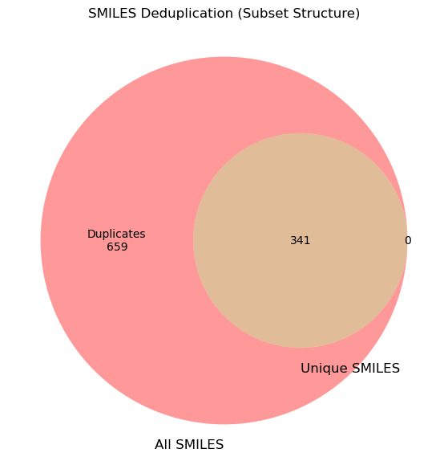
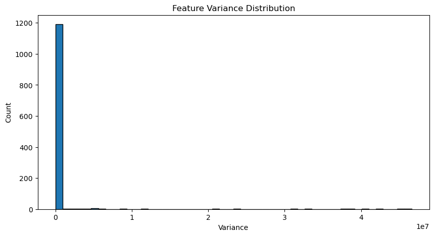
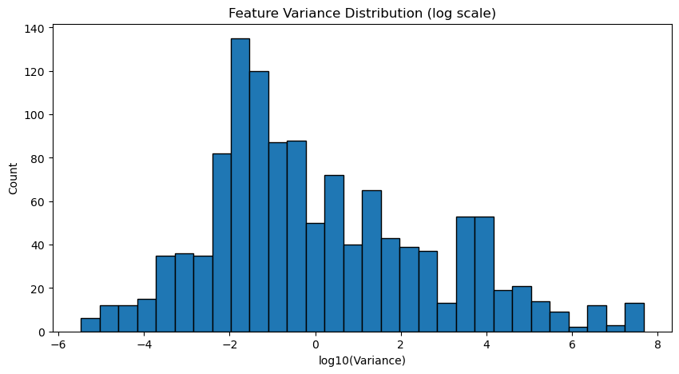
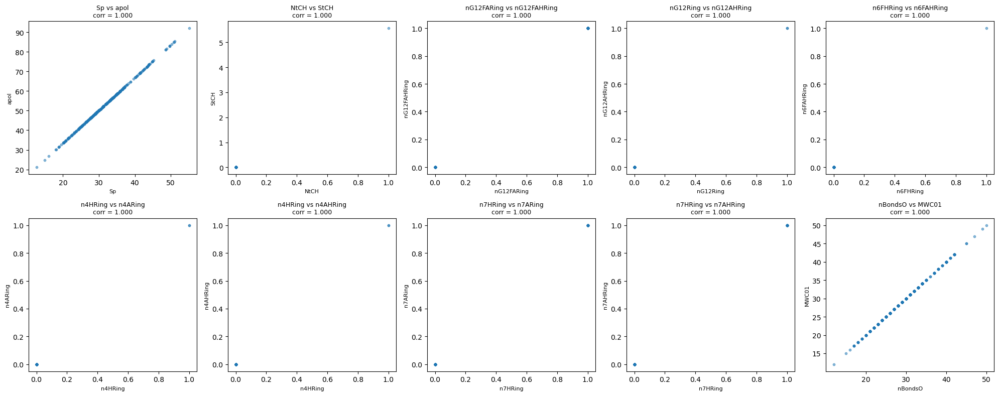
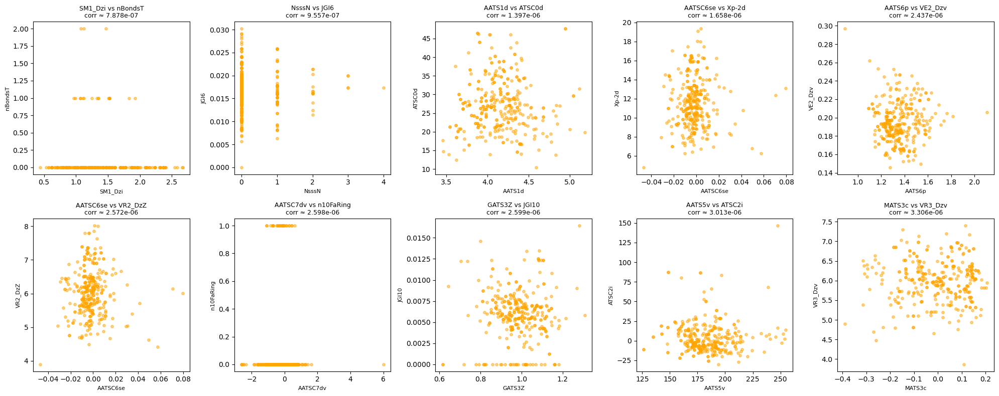

```python
import pandas as pd

fn = "des_smiles.csv"
df = pd.read_csv(fn, sep=";")
df
```


<div>
<style scoped>
    .dataframe tbody tr th:only-of-type {
        vertical-align: middle;
    }

    .dataframe tbody tr th {
        vertical-align: top;
    }

    .dataframe thead th {
        text-align: right;
    }
</style>
<table border="1" class="dataframe">
  <thead>
    <tr style="text-align: right;">
      <th></th>
      <th>Isomeric_Smiles</th>
      <th>End_Point</th>
    </tr>
  </thead>
  <tbody>
    <tr>
      <th>0</th>
      <td>COc1cccc([C@H](C)NC(=O)c2ccc(-c3ccncn3)cc2)c1</td>
      <td>5.7</td>
    </tr>
    <tr>
      <th>1</th>
      <td>COc1cccc([C@@H](C)NC(c2ccc(cc2)-c2ccncn2)=O)c1</td>
      <td>5.4</td>
    </tr>
    <tr>
      <th>2</th>
      <td>COc1cccc([C@H](C)NC(=O)c2ccc(-c3ccncn3)cc2)c1</td>
      <td>5.9</td>
    </tr>
    <tr>
      <th>3</th>
      <td>O=C(c1ccc(cc1)-c1ncncc1)N[C@@H](c1cc(OC)ccc1)C</td>
      <td>5.1</td>
    </tr>
    <tr>
      <th>4</th>
      <td>COc1cccc([C@H](C)NC(=O)c2ccc(-c3ccncn3)cc2)c1</td>
      <td>5.7</td>
    </tr>
    <tr>
      <th>...</th>
      <td>...</td>
      <td>...</td>
    </tr>
    <tr>
      <th>995</th>
      <td>COc1cccc([C@H](C)NC(=O)c2ccc(-c3ccncc3)cc2)c1</td>
      <td>5.5</td>
    </tr>
    <tr>
      <th>996</th>
      <td>c1cc(cc([C@@H](C)NC(c2ccc(cc2)-c2ccncc2)=O)c1)OC</td>
      <td>7.8</td>
    </tr>
    <tr>
      <th>997</th>
      <td>COc1cccc([C@H](C)NC(=O)c2ccc(-c3ccncc3)cc2)c1</td>
      <td>6.2</td>
    </tr>
    <tr>
      <th>998</th>
      <td>Cn1c(=O)c(Oc2ccc(F)cc2F)cc2cnc(NC3CCOCC3)nc21</td>
      <td>5.0</td>
    </tr>
    <tr>
      <th>999</th>
      <td>CCn1c(=O)/c(=C\Nc2ccccc2)s/c1=C(/C#N)C(=O)O</td>
      <td>5.4</td>
    </tr>
  </tbody>
</table>
<p>1000 rows × 2 columns</p>
</div>


# 1. 몇 개의 Isomeric Smiles가 있는지 구하기.


```python
num_molecules = len(df)
print(f"전체 분자 개수: {num_molecules}개")
df.head()
```

    전체 분자 개수: 1000개


<div>
<style scoped>
    .dataframe tbody tr th:only-of-type {
        vertical-align: middle;
    }

    .dataframe tbody tr th {
        vertical-align: top;
    }

    .dataframe thead th {
        text-align: right;
    }
</style>
<table border="1" class="dataframe">
  <thead>
    <tr style="text-align: right;">
      <th></th>
      <th>Isomeric_Smiles</th>
      <th>End_Point</th>
    </tr>
  </thead>
  <tbody>
    <tr>
      <th>0</th>
      <td>COc1cccc([C@H](C)NC(=O)c2ccc(-c3ccncn3)cc2)c1</td>
      <td>5.7</td>
    </tr>
    <tr>
      <th>1</th>
      <td>COc1cccc([C@@H](C)NC(c2ccc(cc2)-c2ccncn2)=O)c1</td>
      <td>5.4</td>
    </tr>
    <tr>
      <th>2</th>
      <td>COc1cccc([C@H](C)NC(=O)c2ccc(-c3ccncn3)cc2)c1</td>
      <td>5.9</td>
    </tr>
    <tr>
      <th>3</th>
      <td>O=C(c1ccc(cc1)-c1ncncc1)N[C@@H](c1cc(OC)ccc1)C</td>
      <td>5.1</td>
    </tr>
    <tr>
      <th>4</th>
      <td>COc1cccc([C@H](C)NC(=O)c2ccc(-c3ccncn3)cc2)c1</td>
      <td>5.7</td>
    </tr>
  </tbody>
</table>
</div>


# 2. Isomeric Smiles 중에 duplicate이 얼마나 있는지 구하기.


```python
from rdkit import Chem
unique_count = df['Isomeric_Smiles'].nunique()
duplicated_count = num_molecules - unique_count

print(f"전체 개수 : {num_molecules}")
print(f"중복 개수 : {duplicated_count}")
print(f"Unique 개수 : {unique_count}")
```

    전체 개수 : 1000
    중복 개수 : 340
    Unique 개수 : 660


# 3. 각각의 Isomeric Smiles를 Canonical Smiles로 변환하고 그 smiles를 새로운 column에 추가.


```python
def to_canonical(smiles):
    mol = Chem.MolFromSmiles(smiles)
    if mol:
        return Chem.MolToSmiles(mol, isomericSmiles=True, canonical=True)# somericSmiles=False로 설정하여 입체 정보를 제외한 표준 구조를 얻거나,
        # 기본값(True)을 사용하여 입체 정보를 포함한 표준 구조를 얻을 수 있다.. 우린 기본값으로 일반적인 중복값 제거ㅓ 
    return None

# canonical smiles column  추가 
df['Canonical_Smiles'] = df['Isomeric_Smiles'].apply(to_canonical)

# 3. 기존 Isomeric_Smiles와 Canonical_Smiles 비교 출력

diff_df = df[df['Isomeric_Smiles'] != df['Canonical_Smiles']]
print(f"표기법이 달라진 분자 수: {len(diff_df)}개")
df[['Isomeric_Smiles', 'Canonical_Smiles', 'End_Point']].head()

```

    표기법이 달라진 분자 수: 398개


<div>
<style scoped>
    .dataframe tbody tr th:only-of-type {
        vertical-align: middle;
    }

    .dataframe tbody tr th {
        vertical-align: top;
    }

    .dataframe thead th {
        text-align: right;
    }
</style>
<table border="1" class="dataframe">
  <thead>
    <tr style="text-align: right;">
      <th></th>
      <th>Isomeric_Smiles</th>
      <th>Canonical_Smiles</th>
      <th>End_Point</th>
    </tr>
  </thead>
  <tbody>
    <tr>
      <th>0</th>
      <td>COc1cccc([C@H](C)NC(=O)c2ccc(-c3ccncn3)cc2)c1</td>
      <td>COc1cccc([C@H](C)NC(=O)c2ccc(-c3ccncn3)cc2)c1</td>
      <td>5.7</td>
    </tr>
    <tr>
      <th>1</th>
      <td>COc1cccc([C@@H](C)NC(c2ccc(cc2)-c2ccncn2)=O)c1</td>
      <td>COc1cccc([C@@H](C)NC(=O)c2ccc(-c3ccncn3)cc2)c1</td>
      <td>5.4</td>
    </tr>
    <tr>
      <th>2</th>
      <td>COc1cccc([C@H](C)NC(=O)c2ccc(-c3ccncn3)cc2)c1</td>
      <td>COc1cccc([C@H](C)NC(=O)c2ccc(-c3ccncn3)cc2)c1</td>
      <td>5.9</td>
    </tr>
    <tr>
      <th>3</th>
      <td>O=C(c1ccc(cc1)-c1ncncc1)N[C@@H](c1cc(OC)ccc1)C</td>
      <td>COc1cccc([C@@H](C)NC(=O)c2ccc(-c3ccncn3)cc2)c1</td>
      <td>5.1</td>
    </tr>
    <tr>
      <th>4</th>
      <td>COc1cccc([C@H](C)NC(=O)c2ccc(-c3ccncn3)cc2)c1</td>
      <td>COc1cccc([C@H](C)NC(=O)c2ccc(-c3ccncn3)cc2)c1</td>
      <td>5.7</td>
    </tr>
  </tbody>
</table>
</div>


# 4. Canonical Smiles 기준으로 duplicate의 개수를 구하고 그림으로 표현.
#### 아래는 그림 그리기 위한 라이브러리 설치 명령어
#### ※ 반드시 Mordred 가상환경에서 실행해야 함.
#### pip install matplotlib-venn


```python
from rdkit import Chem
num_total = len(df)
num_unique_canonical = df['Canonical_Smiles'].nunique()
num_duplicates_canonical = num_total - num_unique_canonical

print(f"전체 개수: {num_total}")
print(f"중복 개수 : {num_duplicates_canonical}")
print(f"Unique 개수: {num_unique_canonical}")
```

    전체 개수: 1000
    중복 개수 : 659
    Unique 개수: 341


```python
import matplotlib.pyplot as plt
from matplotlib_venn import venn2
# 데이터 계산 
num_total = len(df) # 전체 개수 (1000)
num_unique = df['Canonical_Smiles'].nunique() # Unique 개수 ( 결과: 341) 
num_duplicates = num_total - num_unique # 중복 개수 ( 결과: 659) 

#  시각화 설정
plt.figure(figsize=(7, 7))

# subsets=(Ab, aB, AB) 설정 논리:
# Ab (왼쪽 원에만 해당): 전체에서 고유값을 뺀 'Duplicates' 영역 
# aB (오른쪽 원에만 해당): 고유값 중 전체에 포함 안 되는 것은 없으므로 '0'
v = venn2(subsets=(num_duplicates, 0, num_unique), 
          set_labels=('All SMILES', 'Unique SMILES'))


if v.get_label_by_id('10'): 
    v.get_label_by_id('10').set_text(f'Duplicates\n{num_duplicates}') # 'Duplicates 739' 형태 
if v.get_label_by_id('11'): 
    v.get_label_by_id('11').set_text(f'{num_unique}') # '261' 형태 
if v.get_label_by_id('01'): 
    v.get_label_by_id('01').set_text('0') # '0' 형태 

plt.title("SMILES Deduplication (Subset Structure)") 
plt.show()
```


    

    


# 5. Isomeric Smiles Column 제거, Canonical_Smiles duplicate 제거.
#### 여러개의 같은 Canonical Smiles의 End_Point 값을 평균 내서 새로운 End_Point에 넣기.
#### ex)  c1_smiles  4.0
####      c2_smiles  5.0
####      c3_smiles  6.0
#### 이런 경우에는  "c_smiles  5.0"  이렇게 입력이 되도록


```python
#  Isomeric_Smiles 컬럼 제거
df_refined = df.drop(columns=['Isomeric_Smiles'])

#  Canonical_Smiles 기준으로 그룹화하고 End_Point 평균 계산
# 이 과정에서 그룹화를 하니 자동으로 Canonical_Smiles의 중복이 제거
df_final = df_refined.groupby('Canonical_Smiles')['End_Point'].mean().reset_index()

# 3. 결과 확인
print(f"제거 전 행 개수: {len(df)}")
print(f"제거 후 행 개수: {len(df_final)}")
df_final
```

    제거 전 행 개수: 1000
    제거 후 행 개수: 341


<div>
<style scoped>
    .dataframe tbody tr th:only-of-type {
        vertical-align: middle;
    }

    .dataframe tbody tr th {
        vertical-align: top;
    }

    .dataframe thead th {
        text-align: right;
    }
</style>
<table border="1" class="dataframe">
  <thead>
    <tr style="text-align: right;">
      <th></th>
      <th>Canonical_Smiles</th>
      <th>End_Point</th>
    </tr>
  </thead>
  <tbody>
    <tr>
      <th>0</th>
      <td>C#Cc1cc2c(cc1OC)-c1[nH]nc(-c3ccc(C#N)nc3)c1C2</td>
      <td>5.000</td>
    </tr>
    <tr>
      <th>1</th>
      <td>C(=C/c1cncc(O[C@@H]2CCNC2)c1)\c1ccncc1</td>
      <td>5.400</td>
    </tr>
    <tr>
      <th>2</th>
      <td>C(=C/c1cncc(O[C@H]2CCNC2)c1)\c1ccncc1</td>
      <td>5.175</td>
    </tr>
    <tr>
      <th>3</th>
      <td>C(=N/Nc1nc2ccccc2[nH]1)\c1c[nH]c2ccccc12</td>
      <td>5.200</td>
    </tr>
    <tr>
      <th>4</th>
      <td>C/C(=N\NC(=O)c1nnn(-c2nonc2N)c1-c1ccccc1)c1ccco1</td>
      <td>5.150</td>
    </tr>
    <tr>
      <th>...</th>
      <td>...</td>
      <td>...</td>
    </tr>
    <tr>
      <th>336</th>
      <td>Oc1nn2ccccc2c1Br</td>
      <td>5.550</td>
    </tr>
    <tr>
      <th>337</th>
      <td>c1ccc(-c2c[nH]c3ncnc(N4CCCCC4)c23)cc1</td>
      <td>5.200</td>
    </tr>
    <tr>
      <th>338</th>
      <td>c1ccc(COc2ccc(Nc3ncnc4ccccc34)cc2)cc1</td>
      <td>5.000</td>
    </tr>
    <tr>
      <th>339</th>
      <td>c1ccc(CSc2nc(-c3ccncc3)n[nH]2)cc1</td>
      <td>5.100</td>
    </tr>
    <tr>
      <th>340</th>
      <td>c1cnc2nc(-c3ccc4[nH]ncc4c3)c(NC3CCCCC3)n2c1</td>
      <td>5.600</td>
    </tr>
  </tbody>
</table>
<p>341 rows × 2 columns</p>
</div>


# 6. Duplicate 제거한 Canonical Smiles를 이용하여 모든 RDKit Descriptor를 계산하고 그 결과를 dataframe 만들기. 그리고 총 몇 개의 descriptor가 계산 되었는지 출력.


```python
from rdkit import Chem
from rdkit.Chem import Descriptors
import numpy as np
from tqdm import tqdm


# 모든 RDKit Descriptor 리스트 가져오기
all_descriptors = [d[0] for d in Descriptors._descList]

# 2. 기술자 계산 함수 정의
def calculate_descriptors(smiles):
    mol = Chem.MolFromSmiles(smiles)
    if mol:
        results = {}
        for name, func in Descriptors._descList:
            results[name] = func(mol)
        return results
    return {name: None for name in all_descriptors}

# 3. 진행 상황을 확인하며 계산 수행 (tqdm 사용)
print("RDKit Descriptor 계산 중")
desc_data = []
for smiles in tqdm(df_final['Canonical_Smiles']):
    desc_data.append(calculate_descriptors(smiles))

# 4. 결과를 데이터프레임으로 변환 및 병합
df_descriptors = pd.DataFrame(desc_data)
# 인덱스 유지를 위해 df_final과 옆으로 합치기
df_rdkit = pd.concat([df_final[['Canonical_Smiles']], df_descriptors], axis=1)

# 5. 총 기술자 개수 출력
print(f"RDKit Descriptor 개수 : {len(all_descriptors)}")
print(f"데이터프레임 크기: {df_rdkit.shape}")
df_rdkit.head()
```

    RDKit Descriptor 계산 중


    100%|██████████████████████████████████████████████████████| 341/341 [00:02<00:00, 166.03it/s]

    RDKit Descriptor 개수 : 217
    데이터프레임 크기: (341, 218)


    


<div>
<style scoped>
    .dataframe tbody tr th:only-of-type {
        vertical-align: middle;
    }

    .dataframe tbody tr th {
        vertical-align: top;
    }

    .dataframe thead th {
        text-align: right;
    }
</style>
<table border="1" class="dataframe">
  <thead>
    <tr style="text-align: right;">
      <th></th>
      <th>Canonical_Smiles</th>
      <th>MaxAbsEStateIndex</th>
      <th>MaxEStateIndex</th>
      <th>MinAbsEStateIndex</th>
      <th>MinEStateIndex</th>
      <th>qed</th>
      <th>SPS</th>
      <th>MolWt</th>
      <th>HeavyAtomMolWt</th>
      <th>ExactMolWt</th>
      <th>...</th>
      <th>fr_sulfide</th>
      <th>fr_sulfonamd</th>
      <th>fr_sulfone</th>
      <th>fr_term_acetylene</th>
      <th>fr_tetrazole</th>
      <th>fr_thiazole</th>
      <th>fr_thiocyan</th>
      <th>fr_thiophene</th>
      <th>fr_unbrch_alkane</th>
      <th>fr_urea</th>
    </tr>
  </thead>
  <tbody>
    <tr>
      <th>0</th>
      <td>C#Cc1cc2c(cc1OC)-c1[nH]nc(-c3ccc(C#N)nc3)c1C2</td>
      <td>8.868717</td>
      <td>8.868717</td>
      <td>0.386681</td>
      <td>0.386681</td>
      <td>0.577516</td>
      <td>11.291667</td>
      <td>312.332</td>
      <td>300.236</td>
      <td>312.101111</td>
      <td>...</td>
      <td>0</td>
      <td>0</td>
      <td>0</td>
      <td>1</td>
      <td>0</td>
      <td>0</td>
      <td>0</td>
      <td>0</td>
      <td>0</td>
      <td>0</td>
    </tr>
    <tr>
      <th>1</th>
      <td>C(=C/c1cncc(O[C@@H]2CCNC2)c1)\c1ccncc1</td>
      <td>5.899105</td>
      <td>5.899105</td>
      <td>0.260396</td>
      <td>0.260396</td>
      <td>0.923655</td>
      <td>18.500000</td>
      <td>267.332</td>
      <td>250.196</td>
      <td>267.137162</td>
      <td>...</td>
      <td>0</td>
      <td>0</td>
      <td>0</td>
      <td>0</td>
      <td>0</td>
      <td>0</td>
      <td>0</td>
      <td>0</td>
      <td>0</td>
      <td>0</td>
    </tr>
    <tr>
      <th>2</th>
      <td>C(=C/c1cncc(O[C@H]2CCNC2)c1)\c1ccncc1</td>
      <td>5.899105</td>
      <td>5.899105</td>
      <td>0.260396</td>
      <td>0.260396</td>
      <td>0.923655</td>
      <td>18.500000</td>
      <td>267.332</td>
      <td>250.196</td>
      <td>267.137162</td>
      <td>...</td>
      <td>0</td>
      <td>0</td>
      <td>0</td>
      <td>0</td>
      <td>0</td>
      <td>0</td>
      <td>0</td>
      <td>0</td>
      <td>0</td>
      <td>0</td>
    </tr>
    <tr>
      <th>3</th>
      <td>C(=N/Nc1nc2ccccc2[nH]1)\c1c[nH]c2ccccc12</td>
      <td>4.405655</td>
      <td>4.405655</td>
      <td>0.631751</td>
      <td>0.631751</td>
      <td>0.395491</td>
      <td>11.619048</td>
      <td>275.315</td>
      <td>262.211</td>
      <td>275.117095</td>
      <td>...</td>
      <td>0</td>
      <td>0</td>
      <td>0</td>
      <td>0</td>
      <td>0</td>
      <td>0</td>
      <td>0</td>
      <td>0</td>
      <td>0</td>
      <td>0</td>
    </tr>
    <tr>
      <th>4</th>
      <td>C/C(=N\NC(=O)c1nnn(-c2nonc2N)c1-c1ccccc1)c1ccco1</td>
      <td>12.725354</td>
      <td>12.725354</td>
      <td>0.014559</td>
      <td>-0.563857</td>
      <td>0.392870</td>
      <td>11.535714</td>
      <td>378.352</td>
      <td>364.240</td>
      <td>378.118886</td>
      <td>...</td>
      <td>0</td>
      <td>0</td>
      <td>0</td>
      <td>0</td>
      <td>0</td>
      <td>0</td>
      <td>0</td>
      <td>0</td>
      <td>0</td>
      <td>0</td>
    </tr>
  </tbody>
</table>
<p>5 rows × 218 columns</p>
</div>


# 7-1. RDKit에서 Morgan Fingerprint 계산하기
### radius 값과 nBits 값을 변화 시키면서 몇 bit 까지 만들 수 있는지 test


```python
from rdkit import Chem
from rdkit.Chem import AllChem
from rdkit.DataStructs import ConvertToNumpyArray
import numpy as np
import pandas as pd
from tqdm import tqdm

# 테스트 
nBits = 1024
radius = 2

fps_list = []
print(f"Morgan Fingerprint 계산 중 (Bits: {nBits}, Radius: {radius})...")

for smiles in tqdm(df_final['Canonical_Smiles']):
    mol = Chem.MolFromSmiles(smiles)
    if mol:
        #  Morgan Fingerprint 비트 벡터 생성
        fp = AllChem.GetMorganFingerprintAsBitVect(mol, radius=radius, nBits=nBits)
        
        #  ConvertToNumpyArray를 사용하기 위한 빈 배열 생성
        arr = np.zeros((nBits,), dtype=int)
        
        #  비트 정보를 넘파이 배열로 복사
        ConvertToNumpyArray(fp, arr)
        fps_list.append(arr)
    else:
        fps_list.append(np.zeros((nBits,), dtype=int))

# 4. 데이터프레임 생성 (MorganFP_0 ~ MorganFP_1023)
col_names = [f'MorganFP_{i}' for i in range(nBits)]
df_morgan = pd.DataFrame(fps_list, columns=col_names)

# 5. Canonical_Smiles와 결합 
df_morgan_final = pd.concat([df_final[['Canonical_Smiles']], df_morgan], axis=1)

print(f"최종 데이터프레임 크기: {df_morgan_final.shape}")
df_morgan_final.head()
```

    Morgan Fingerprint 계산 중 (Bits: 1024, Radius: 2)...


      0%|                                                                 | 0/341 [00:00<?, ?it/s][11:02:47] DEPRECATION WARNING: please use MorganGenerator
    [11:02:47] DEPRECATION WARNING: please use MorganGenerator
    [11:02:47] DEPRECATION WARNING: please use MorganGenerator
    [11:02:47] DEPRECATION WARNING: please use MorganGenerator
    [11:02:47] DEPRECATION WARNING: please use MorganGenerator
    [11:02:47] DEPRECATION WARNING: please use MorganGenerator
    [11:02:47] DEPRECATION WARNING: please use MorganGenerator
    [11:02:47] DEPRECATION WARNING: please use MorganGenerator
    [11:02:47] DEPRECATION WARNING: please use MorganGenerator
    [11:02:47] DEPRECATION WARNING: please use MorganGenerator
    [11:02:47] DEPRECATION WARNING: please use MorganGenerator
    [11:02:47] DEPRECATION WARNING: please use MorganGenerator
    [11:02:47] DEPRECATION WARNING: please use MorganGenerator
    [11:02:47] DEPRECATION WARNING: please use MorganGenerator
    [11:02:47] DEPRECATION WARNING: please use MorganGenerator
    [11:02:47] DEPRECATION WARNING: please use MorganGenerator
    [11:02:47] DEPRECATION WARNING: please use MorganGenerator
    [11:02:47] DEPRECATION WARNING: please use MorganGenerator
    [11:02:47] DEPRECATION WARNING: please use MorganGenerator
    [11:02:47] DEPRECATION WARNING: please use MorganGenerator
    [11:02:47] DEPRECATION WARNING: please use MorganGenerator
    [11:02:47] DEPRECATION WARNING: please use MorganGenerator
    [11:02:47] DEPRECATION WARNING: please use MorganGenerator
    [11:02:47] DEPRECATION WARNING: please use MorganGenerator
    [11:02:47] DEPRECATION WARNING: please use MorganGenerator
    [11:02:47] DEPRECATION WARNING: please use MorganGenerator
    [11:02:47] DEPRECATION WARNING: please use MorganGenerator
    [11:02:47] DEPRECATION WARNING: please use MorganGenerator
    [11:02:47] DEPRECATION WARNING: please use MorganGenerator
    [11:02:47] DEPRECATION WARNING: please use MorganGenerator
    [11:02:47] DEPRECATION WARNING: please use MorganGenerator
    [11:02:47] DEPRECATION WARNING: please use MorganGenerator
    [11:02:47] DEPRECATION WARNING: please use MorganGenerator
    [11:02:47] DEPRECATION WARNING: please use MorganGenerator
    [11:02:47] DEPRECATION WARNING: please use MorganGenerator
    [11:02:47] DEPRECATION WARNING: please use MorganGenerator
    [11:02:47] DEPRECATION WARNING: please use MorganGenerator
    [11:02:47] DEPRECATION WARNING: please use MorganGenerator
    [11:02:47] DEPRECATION WARNING: please use MorganGenerator
    [11:02:47] DEPRECATION WARNING: please use MorganGenerator
    [11:02:47] DEPRECATION WARNING: please use MorganGenerator
    [11:02:47] DEPRECATION WARNING: please use MorganGenerator
    [11:02:47] DEPRECATION WARNING: please use MorganGenerator
    [11:02:47] DEPRECATION WARNING: please use MorganGenerator
    [11:02:47] DEPRECATION WARNING: please use MorganGenerator
    [11:02:47] DEPRECATION WARNING: please use MorganGenerator
    [11:02:47] DEPRECATION WARNING: please use MorganGenerator
    [11:02:47] DEPRECATION WARNING: please use MorganGenerator
    [11:02:47] DEPRECATION WARNING: please use MorganGenerator
    [11:02:47] DEPRECATION WARNING: please use MorganGenerator
    [11:02:47] DEPRECATION WARNING: please use MorganGenerator
    [11:02:47] DEPRECATION WARNING: please use MorganGenerator
    [11:02:47] DEPRECATION WARNING: please use MorganGenerator
    [11:02:47] DEPRECATION WARNING: please use MorganGenerator
    [11:02:47] DEPRECATION WARNING: please use MorganGenerator
    [11:02:47] DEPRECATION WARNING: please use MorganGenerator
    [11:02:47] DEPRECATION WARNING: please use MorganGenerator
    [11:02:47] DEPRECATION WARNING: please use MorganGenerator
    [11:02:47] DEPRECATION WARNING: please use MorganGenerator
    [11:02:47] DEPRECATION WARNING: please use MorganGenerator
    [11:02:47] DEPRECATION WARNING: please use MorganGenerator
    [11:02:47] DEPRECATION WARNING: please use MorganGenerator
    [11:02:47] DEPRECATION WARNING: please use MorganGenerator
    [11:02:47] DEPRECATION WARNING: please use MorganGenerator
    [11:02:47] DEPRECATION WARNING: please use MorganGenerator
    [11:02:47] DEPRECATION WARNING: please use MorganGenerator
    [11:02:47] DEPRECATION WARNING: please use MorganGenerator
    [11:02:47] DEPRECATION WARNING: please use MorganGenerator
    [11:02:47] DEPRECATION WARNING: please use MorganGenerator
    [11:02:47] DEPRECATION WARNING: please use MorganGenerator
    [11:02:47] DEPRECATION WARNING: please use MorganGenerator
    [11:02:47] DEPRECATION WARNING: please use MorganGenerator
    [11:02:47] DEPRECATION WARNING: please use MorganGenerator
    [11:02:47] DEPRECATION WARNING: please use MorganGenerator
    [11:02:47] DEPRECATION WARNING: please use MorganGenerator
    [11:02:47] DEPRECATION WARNING: please use MorganGenerator
    [11:02:47] DEPRECATION WARNING: please use MorganGenerator
    [11:02:47] DEPRECATION WARNING: please use MorganGenerator
    [11:02:47] DEPRECATION WARNING: please use MorganGenerator
    [11:02:47] DEPRECATION WARNING: please use MorganGenerator
    [11:02:47] DEPRECATION WARNING: please use MorganGenerator
    [11:02:47] DEPRECATION WARNING: please use MorganGenerator
    [11:02:47] DEPRECATION WARNING: please use MorganGenerator
    [11:02:47] DEPRECATION WARNING: please use MorganGenerator
    [11:02:47] DEPRECATION WARNING: please use MorganGenerator
    [11:02:47] DEPRECATION WARNING: please use MorganGenerator
    [11:02:47] DEPRECATION WARNING: please use MorganGenerator
    [11:02:47] DEPRECATION WARNING: please use MorganGenerator
    [11:02:47] DEPRECATION WARNING: please use MorganGenerator
    [11:02:47] DEPRECATION WARNING: please use MorganGenerator
    [11:02:47] DEPRECATION WARNING: please use MorganGenerator
    [11:02:47] DEPRECATION WARNING: please use MorganGenerator
    [11:02:47] DEPRECATION WARNING: please use MorganGenerator
    [11:02:47] DEPRECATION WARNING: please use MorganGenerator
    [11:02:47] DEPRECATION WARNING: please use MorganGenerator
    [11:02:47] DEPRECATION WARNING: please use MorganGenerator
    [11:02:47] DEPRECATION WARNING: please use MorganGenerator
    [11:02:47] DEPRECATION WARNING: please use MorganGenerator
    [11:02:47] DEPRECATION WARNING: please use MorganGenerator
    [11:02:47] DEPRECATION WARNING: please use MorganGenerator
    [11:02:47] DEPRECATION WARNING: please use MorganGenerator
    [11:02:47] DEPRECATION WARNING: please use MorganGenerator
    [11:02:47] DEPRECATION WARNING: please use MorganGenerator
    [11:02:47] DEPRECATION WARNING: please use MorganGenerator
    [11:02:47] DEPRECATION WARNING: please use MorganGenerator
    [11:02:47] DEPRECATION WARNING: please use MorganGenerator
    [11:02:47] DEPRECATION WARNING: please use MorganGenerator
    [11:02:47] DEPRECATION WARNING: please use MorganGenerator
    [11:02:47] DEPRECATION WARNING: please use MorganGenerator
    [11:02:47] DEPRECATION WARNING: please use MorganGenerator
    [11:02:47] DEPRECATION WARNING: please use MorganGenerator
    [11:02:47] DEPRECATION WARNING: please use MorganGenerator
    [11:02:47] DEPRECATION WARNING: please use MorganGenerator
    [11:02:47] DEPRECATION WARNING: please use MorganGenerator
    [11:02:47] DEPRECATION WARNING: please use MorganGenerator
    [11:02:47] DEPRECATION WARNING: please use MorganGenerator
    [11:02:47] DEPRECATION WARNING: please use MorganGenerator
    [11:02:47] DEPRECATION WARNING: please use MorganGenerator
    [11:02:47] DEPRECATION WARNING: please use MorganGenerator
    [11:02:47] DEPRECATION WARNING: please use MorganGenerator
    [11:02:47] DEPRECATION WARNING: please use MorganGenerator
    [11:02:47] DEPRECATION WARNING: please use MorganGenerator
    [11:02:47] DEPRECATION WARNING: please use MorganGenerator
    [11:02:47] DEPRECATION WARNING: please use MorganGenerator
    [11:02:47] DEPRECATION WARNING: please use MorganGenerator
    [11:02:47] DEPRECATION WARNING: please use MorganGenerator
    [11:02:47] DEPRECATION WARNING: please use MorganGenerator
    [11:02:47] DEPRECATION WARNING: please use MorganGenerator
    [11:02:47] DEPRECATION WARNING: please use MorganGenerator
    [11:02:47] DEPRECATION WARNING: please use MorganGenerator
    [11:02:47] DEPRECATION WARNING: please use MorganGenerator
    [11:02:47] DEPRECATION WARNING: please use MorganGenerator
    [11:02:47] DEPRECATION WARNING: please use MorganGenerator
    [11:02:47] DEPRECATION WARNING: please use MorganGenerator
    [11:02:47] DEPRECATION WARNING: please use MorganGenerator
    [11:02:47] DEPRECATION WARNING: please use MorganGenerator
    [11:02:47] DEPRECATION WARNING: please use MorganGenerator
    [11:02:47] DEPRECATION WARNING: please use MorganGenerator
    [11:02:47] DEPRECATION WARNING: please use MorganGenerator
    [11:02:47] DEPRECATION WARNING: please use MorganGenerator
    [11:02:47] DEPRECATION WARNING: please use MorganGenerator
    [11:02:47] DEPRECATION WARNING: please use MorganGenerator
    [11:02:47] DEPRECATION WARNING: please use MorganGenerator
    [11:02:47] DEPRECATION WARNING: please use MorganGenerator
    [11:02:47] DEPRECATION WARNING: please use MorganGenerator
    [11:02:47] DEPRECATION WARNING: please use MorganGenerator
    [11:02:47] DEPRECATION WARNING: please use MorganGenerator
    [11:02:47] DEPRECATION WARNING: please use MorganGenerator
    [11:02:47] DEPRECATION WARNING: please use MorganGenerator
    [11:02:47] DEPRECATION WARNING: please use MorganGenerator
    [11:02:47] DEPRECATION WARNING: please use MorganGenerator
    [11:02:47] DEPRECATION WARNING: please use MorganGenerator
    [11:02:47] DEPRECATION WARNING: please use MorganGenerator
    [11:02:47] DEPRECATION WARNING: please use MorganGenerator
    [11:02:47] DEPRECATION WARNING: please use MorganGenerator
    [11:02:47] DEPRECATION WARNING: please use MorganGenerator
    [11:02:47] DEPRECATION WARNING: please use MorganGenerator
    [11:02:47] DEPRECATION WARNING: please use MorganGenerator
    [11:02:47] DEPRECATION WARNING: please use MorganGenerator
    [11:02:47] DEPRECATION WARNING: please use MorganGenerator
    [11:02:47] DEPRECATION WARNING: please use MorganGenerator
    [11:02:47] DEPRECATION WARNING: please use MorganGenerator
    [11:02:47] DEPRECATION WARNING: please use MorganGenerator
    [11:02:47] DEPRECATION WARNING: please use MorganGenerator
    [11:02:47] DEPRECATION WARNING: please use MorganGenerator
    [11:02:47] DEPRECATION WARNING: please use MorganGenerator
    [11:02:47] DEPRECATION WARNING: please use MorganGenerator
    [11:02:47] DEPRECATION WARNING: please use MorganGenerator
    [11:02:47] DEPRECATION WARNING: please use MorganGenerator
    [11:02:47] DEPRECATION WARNING: please use MorganGenerator
    [11:02:47] DEPRECATION WARNING: please use MorganGenerator
    [11:02:47] DEPRECATION WARNING: please use MorganGenerator
    [11:02:47] DEPRECATION WARNING: please use MorganGenerator
    [11:02:47] DEPRECATION WARNING: please use MorganGenerator
    [11:02:47] DEPRECATION WARNING: please use MorganGenerator
    [11:02:47] DEPRECATION WARNING: please use MorganGenerator
    [11:02:47] DEPRECATION WARNING: please use MorganGenerator
    [11:02:47] DEPRECATION WARNING: please use MorganGenerator
    [11:02:47] DEPRECATION WARNING: please use MorganGenerator
    [11:02:47] DEPRECATION WARNING: please use MorganGenerator
    [11:02:47] DEPRECATION WARNING: please use MorganGenerator
    [11:02:47] DEPRECATION WARNING: please use MorganGenerator
    [11:02:47] DEPRECATION WARNING: please use MorganGenerator
    [11:02:47] DEPRECATION WARNING: please use MorganGenerator
    [11:02:47] DEPRECATION WARNING: please use MorganGenerator
    [11:02:47] DEPRECATION WARNING: please use MorganGenerator
    [11:02:47] DEPRECATION WARNING: please use MorganGenerator
    [11:02:47] DEPRECATION WARNING: please use MorganGenerator
    [11:02:47] DEPRECATION WARNING: please use MorganGenerator
    [11:02:47] DEPRECATION WARNING: please use MorganGenerator
    [11:02:47] DEPRECATION WARNING: please use MorganGenerator
    [11:02:47] DEPRECATION WARNING: please use MorganGenerator
    [11:02:47] DEPRECATION WARNING: please use MorganGenerator
    [11:02:47] DEPRECATION WARNING: please use MorganGenerator
    [11:02:47] DEPRECATION WARNING: please use MorganGenerator
    [11:02:47] DEPRECATION WARNING: please use MorganGenerator
    [11:02:47] DEPRECATION WARNING: please use MorganGenerator
    [11:02:47] DEPRECATION WARNING: please use MorganGenerator
    [11:02:47] DEPRECATION WARNING: please use MorganGenerator
    [11:02:47] DEPRECATION WARNING: please use MorganGenerator
    [11:02:47] DEPRECATION WARNING: please use MorganGenerator
    [11:02:47] DEPRECATION WARNING: please use MorganGenerator
    [11:02:47] DEPRECATION WARNING: please use MorganGenerator
    [11:02:47] DEPRECATION WARNING: please use MorganGenerator
    [11:02:47] DEPRECATION WARNING: please use MorganGenerator
    [11:02:47] DEPRECATION WARNING: please use MorganGenerator
    [11:02:47] DEPRECATION WARNING: please use MorganGenerator
    [11:02:47] DEPRECATION WARNING: please use MorganGenerator
    [11:02:47] DEPRECATION WARNING: please use MorganGenerator
    [11:02:47] DEPRECATION WARNING: please use MorganGenerator
    [11:02:47] DEPRECATION WARNING: please use MorganGenerator
    [11:02:47] DEPRECATION WARNING: please use MorganGenerator
    [11:02:47] DEPRECATION WARNING: please use MorganGenerator
    [11:02:47] DEPRECATION WARNING: please use MorganGenerator
    [11:02:47] DEPRECATION WARNING: please use MorganGenerator
    [11:02:47] DEPRECATION WARNING: please use MorganGenerator
    [11:02:47] DEPRECATION WARNING: please use MorganGenerator
    [11:02:47] DEPRECATION WARNING: please use MorganGenerator
    [11:02:47] DEPRECATION WARNING: please use MorganGenerator
    [11:02:47] DEPRECATION WARNING: please use MorganGenerator
    [11:02:47] DEPRECATION WARNING: please use MorganGenerator
    [11:02:47] DEPRECATION WARNING: please use MorganGenerator
    [11:02:47] DEPRECATION WARNING: please use MorganGenerator
    [11:02:47] DEPRECATION WARNING: please use MorganGenerator
    [11:02:47] DEPRECATION WARNING: please use MorganGenerator
    [11:02:47] DEPRECATION WARNING: please use MorganGenerator
    [11:02:47] DEPRECATION WARNING: please use MorganGenerator
    [11:02:47] DEPRECATION WARNING: please use MorganGenerator
    [11:02:47] DEPRECATION WARNING: please use MorganGenerator
    [11:02:47] DEPRECATION WARNING: please use MorganGenerator
    [11:02:47] DEPRECATION WARNING: please use MorganGenerator
    [11:02:47] DEPRECATION WARNING: please use MorganGenerator
    [11:02:47] DEPRECATION WARNING: please use MorganGenerator
    [11:02:47] DEPRECATION WARNING: please use MorganGenerator
    [11:02:47] DEPRECATION WARNING: please use MorganGenerator
    [11:02:47] DEPRECATION WARNING: please use MorganGenerator
    [11:02:47] DEPRECATION WARNING: please use MorganGenerator
    [11:02:47] DEPRECATION WARNING: please use MorganGenerator
    [11:02:47] DEPRECATION WARNING: please use MorganGenerator
    [11:02:47] DEPRECATION WARNING: please use MorganGenerator
    [11:02:47] DEPRECATION WARNING: please use MorganGenerator
    [11:02:47] DEPRECATION WARNING: please use MorganGenerator
    [11:02:47] DEPRECATION WARNING: please use MorganGenerator
    [11:02:47] DEPRECATION WARNING: please use MorganGenerator
    [11:02:47] DEPRECATION WARNING: please use MorganGenerator
    [11:02:47] DEPRECATION WARNING: please use MorganGenerator
    [11:02:47] DEPRECATION WARNING: please use MorganGenerator
    [11:02:47] DEPRECATION WARNING: please use MorganGenerator
    [11:02:47] DEPRECATION WARNING: please use MorganGenerator
    [11:02:47] DEPRECATION WARNING: please use MorganGenerator
    [11:02:47] DEPRECATION WARNING: please use MorganGenerator
    [11:02:47] DEPRECATION WARNING: please use MorganGenerator
    [11:02:47] DEPRECATION WARNING: please use MorganGenerator
    [11:02:47] DEPRECATION WARNING: please use MorganGenerator
    [11:02:47] DEPRECATION WARNING: please use MorganGenerator
    [11:02:47] DEPRECATION WARNING: please use MorganGenerator
    [11:02:47] DEPRECATION WARNING: please use MorganGenerator
    [11:02:47] DEPRECATION WARNING: please use MorganGenerator
    [11:02:47] DEPRECATION WARNING: please use MorganGenerator
    [11:02:47] DEPRECATION WARNING: please use MorganGenerator
    [11:02:47] DEPRECATION WARNING: please use MorganGenerator
    [11:02:47] DEPRECATION WARNING: please use MorganGenerator
    [11:02:47] DEPRECATION WARNING: please use MorganGenerator
    [11:02:47] DEPRECATION WARNING: please use MorganGenerator
    [11:02:47] DEPRECATION WARNING: please use MorganGenerator
    [11:02:47] DEPRECATION WARNING: please use MorganGenerator
    [11:02:47] DEPRECATION WARNING: please use MorganGenerator
    [11:02:47] DEPRECATION WARNING: please use MorganGenerator
    [11:02:47] DEPRECATION WARNING: please use MorganGenerator
    [11:02:47] DEPRECATION WARNING: please use MorganGenerator
    [11:02:47] DEPRECATION WARNING: please use MorganGenerator
    [11:02:47] DEPRECATION WARNING: please use MorganGenerator
    [11:02:47] DEPRECATION WARNING: please use MorganGenerator
    [11:02:47] DEPRECATION WARNING: please use MorganGenerator
    [11:02:47] DEPRECATION WARNING: please use MorganGenerator
    [11:02:47] DEPRECATION WARNING: please use MorganGenerator
    [11:02:47] DEPRECATION WARNING: please use MorganGenerator
    [11:02:47] DEPRECATION WARNING: please use MorganGenerator
    [11:02:47] DEPRECATION WARNING: please use MorganGenerator
    [11:02:47] DEPRECATION WARNING: please use MorganGenerator
    [11:02:47] DEPRECATION WARNING: please use MorganGenerator
    [11:02:47] DEPRECATION WARNING: please use MorganGenerator
    [11:02:47] DEPRECATION WARNING: please use MorganGenerator
    [11:02:47] DEPRECATION WARNING: please use MorganGenerator
    [11:02:47] DEPRECATION WARNING: please use MorganGenerator
    [11:02:47] DEPRECATION WARNING: please use MorganGenerator
    [11:02:47] DEPRECATION WARNING: please use MorganGenerator
    [11:02:47] DEPRECATION WARNING: please use MorganGenerator
    [11:02:47] DEPRECATION WARNING: please use MorganGenerator
    [11:02:47] DEPRECATION WARNING: please use MorganGenerator
    [11:02:47] DEPRECATION WARNING: please use MorganGenerator
    [11:02:47] DEPRECATION WARNING: please use MorganGenerator
    [11:02:47] DEPRECATION WARNING: please use MorganGenerator
    [11:02:47] DEPRECATION WARNING: please use MorganGenerator
    [11:02:47] DEPRECATION WARNING: please use MorganGenerator
    [11:02:47] DEPRECATION WARNING: please use MorganGenerator
    [11:02:47] DEPRECATION WARNING: please use MorganGenerator
    [11:02:47] DEPRECATION WARNING: please use MorganGenerator
    [11:02:47] DEPRECATION WARNING: please use MorganGenerator
    [11:02:47] DEPRECATION WARNING: please use MorganGenerator
    [11:02:47] DEPRECATION WARNING: please use MorganGenerator
    [11:02:47] DEPRECATION WARNING: please use MorganGenerator
    [11:02:47] DEPRECATION WARNING: please use MorganGenerator
    [11:02:47] DEPRECATION WARNING: please use MorganGenerator
    [11:02:47] DEPRECATION WARNING: please use MorganGenerator
    [11:02:47] DEPRECATION WARNING: please use MorganGenerator
    [11:02:47] DEPRECATION WARNING: please use MorganGenerator
    [11:02:47] DEPRECATION WARNING: please use MorganGenerator
    [11:02:47] DEPRECATION WARNING: please use MorganGenerator
    [11:02:47] DEPRECATION WARNING: please use MorganGenerator
    [11:02:47] DEPRECATION WARNING: please use MorganGenerator
    [11:02:47] DEPRECATION WARNING: please use MorganGenerator
    [11:02:47] DEPRECATION WARNING: please use MorganGenerator
    [11:02:47] DEPRECATION WARNING: please use MorganGenerator
    [11:02:47] DEPRECATION WARNING: please use MorganGenerator
    [11:02:47] DEPRECATION WARNING: please use MorganGenerator
    [11:02:47] DEPRECATION WARNING: please use MorganGenerator
    [11:02:47] DEPRECATION WARNING: please use MorganGenerator
    [11:02:47] DEPRECATION WARNING: please use MorganGenerator
    [11:02:47] DEPRECATION WARNING: please use MorganGenerator
    [11:02:47] DEPRECATION WARNING: please use MorganGenerator
    [11:02:47] DEPRECATION WARNING: please use MorganGenerator
    [11:02:47] DEPRECATION WARNING: please use MorganGenerator
    [11:02:47] DEPRECATION WARNING: please use MorganGenerator
    [11:02:47] DEPRECATION WARNING: please use MorganGenerator
    [11:02:47] DEPRECATION WARNING: please use MorganGenerator
    [11:02:47] DEPRECATION WARNING: please use MorganGenerator
    [11:02:47] DEPRECATION WARNING: please use MorganGenerator
    [11:02:47] DEPRECATION WARNING: please use MorganGenerator
    [11:02:47] DEPRECATION WARNING: please use MorganGenerator
    [11:02:47] DEPRECATION WARNING: please use MorganGenerator
    [11:02:47] DEPRECATION WARNING: please use MorganGenerator
    [11:02:47] DEPRECATION WARNING: please use MorganGenerator
    [11:02:47] DEPRECATION WARNING: please use MorganGenerator
    [11:02:47] DEPRECATION WARNING: please use MorganGenerator
    [11:02:47] DEPRECATION WARNING: please use MorganGenerator
    [11:02:47] DEPRECATION WARNING: please use MorganGenerator
    [11:02:47] DEPRECATION WARNING: please use MorganGenerator
    [11:02:47] DEPRECATION WARNING: please use MorganGenerator
    [11:02:47] DEPRECATION WARNING: please use MorganGenerator
    [11:02:47] DEPRECATION WARNING: please use MorganGenerator
    100%|█████████████████████████████████████████████████████| 341/341 [00:00<00:00, 5650.07it/s]

    최종 데이터프레임 크기: (341, 1025)


    


<div>
<style scoped>
    .dataframe tbody tr th:only-of-type {
        vertical-align: middle;
    }

    .dataframe tbody tr th {
        vertical-align: top;
    }

    .dataframe thead th {
        text-align: right;
    }
</style>
<table border="1" class="dataframe">
  <thead>
    <tr style="text-align: right;">
      <th></th>
      <th>Canonical_Smiles</th>
      <th>MorganFP_0</th>
      <th>MorganFP_1</th>
      <th>MorganFP_2</th>
      <th>MorganFP_3</th>
      <th>MorganFP_4</th>
      <th>MorganFP_5</th>
      <th>MorganFP_6</th>
      <th>MorganFP_7</th>
      <th>MorganFP_8</th>
      <th>...</th>
      <th>MorganFP_1014</th>
      <th>MorganFP_1015</th>
      <th>MorganFP_1016</th>
      <th>MorganFP_1017</th>
      <th>MorganFP_1018</th>
      <th>MorganFP_1019</th>
      <th>MorganFP_1020</th>
      <th>MorganFP_1021</th>
      <th>MorganFP_1022</th>
      <th>MorganFP_1023</th>
    </tr>
  </thead>
  <tbody>
    <tr>
      <th>0</th>
      <td>C#Cc1cc2c(cc1OC)-c1[nH]nc(-c3ccc(C#N)nc3)c1C2</td>
      <td>0</td>
      <td>0</td>
      <td>0</td>
      <td>0</td>
      <td>0</td>
      <td>0</td>
      <td>0</td>
      <td>0</td>
      <td>0</td>
      <td>...</td>
      <td>0</td>
      <td>0</td>
      <td>0</td>
      <td>0</td>
      <td>0</td>
      <td>0</td>
      <td>0</td>
      <td>0</td>
      <td>0</td>
      <td>0</td>
    </tr>
    <tr>
      <th>1</th>
      <td>C(=C/c1cncc(O[C@@H]2CCNC2)c1)\c1ccncc1</td>
      <td>0</td>
      <td>0</td>
      <td>0</td>
      <td>0</td>
      <td>0</td>
      <td>0</td>
      <td>0</td>
      <td>0</td>
      <td>0</td>
      <td>...</td>
      <td>0</td>
      <td>0</td>
      <td>0</td>
      <td>0</td>
      <td>0</td>
      <td>1</td>
      <td>0</td>
      <td>0</td>
      <td>0</td>
      <td>0</td>
    </tr>
    <tr>
      <th>2</th>
      <td>C(=C/c1cncc(O[C@H]2CCNC2)c1)\c1ccncc1</td>
      <td>0</td>
      <td>0</td>
      <td>0</td>
      <td>0</td>
      <td>0</td>
      <td>0</td>
      <td>0</td>
      <td>0</td>
      <td>0</td>
      <td>...</td>
      <td>0</td>
      <td>0</td>
      <td>0</td>
      <td>0</td>
      <td>0</td>
      <td>1</td>
      <td>0</td>
      <td>0</td>
      <td>0</td>
      <td>0</td>
    </tr>
    <tr>
      <th>3</th>
      <td>C(=N/Nc1nc2ccccc2[nH]1)\c1c[nH]c2ccccc12</td>
      <td>0</td>
      <td>0</td>
      <td>0</td>
      <td>0</td>
      <td>0</td>
      <td>0</td>
      <td>0</td>
      <td>0</td>
      <td>0</td>
      <td>...</td>
      <td>0</td>
      <td>0</td>
      <td>0</td>
      <td>0</td>
      <td>0</td>
      <td>0</td>
      <td>0</td>
      <td>0</td>
      <td>0</td>
      <td>0</td>
    </tr>
    <tr>
      <th>4</th>
      <td>C/C(=N\NC(=O)c1nnn(-c2nonc2N)c1-c1ccccc1)c1ccco1</td>
      <td>0</td>
      <td>0</td>
      <td>0</td>
      <td>0</td>
      <td>0</td>
      <td>0</td>
      <td>0</td>
      <td>0</td>
      <td>0</td>
      <td>...</td>
      <td>0</td>
      <td>0</td>
      <td>0</td>
      <td>1</td>
      <td>0</td>
      <td>0</td>
      <td>0</td>
      <td>0</td>
      <td>0</td>
      <td>0</td>
    </tr>
  </tbody>
</table>
<p>5 rows × 1025 columns</p>
</div>


# 7-2. RDKit에서 MACCS fingerprint 계산하기


```python
from rdkit.Chem import MACCSkeys
from rdkit.DataStructs import ConvertToNumpyArray
import numpy as np
import pandas as pd
from tqdm import tqdm

# MACCS 키는 167비트 고정, 별도의 nBits 설정이 필요 없음
maccs_fps = []

print("MACCS Fingerprint 계산 중...")
for smiles in tqdm(df_final['Canonical_Smiles']):
    mol = Chem.MolFromSmiles(smiles)
    if mol:
        # MACCS keys 생성
        fp = MACCSkeys.GenMACCSKeys(mol)
        
        # 넘파이 배열로 변환 (RDKit MACCS는 167비트
        arr = np.zeros((fp.GetNumBits(),), dtype=int)
        ConvertToNumpyArray(fp, arr)
        maccs_fps.append(arr)
    else:
        maccs_fps.append(np.zeros((167,), dtype=int))

# 3. 데이터프레임 생성 (MACCS_0 ~ MACCS_166)
col_names = [f'MACCS_{i}' for i in range(167)]
df_maccs = pd.DataFrame(maccs_fps, columns=col_names)

# 4. Canonical_Smiles와 병합
df_maccs_final = pd.concat([df_final[['Canonical_Smiles']], df_maccs], axis=1)

print(f"최종 데이터프레임 크기: {df_maccs_final.shape}")
df_maccs_final.head()
```

    MACCS Fingerprint 계산 중...


    100%|█████████████████████████████████████████████████████| 341/341 [00:00<00:00, 1455.22it/s]

    최종 데이터프레임 크기: (341, 168)


    


<div>
<style scoped>
    .dataframe tbody tr th:only-of-type {
        vertical-align: middle;
    }

    .dataframe tbody tr th {
        vertical-align: top;
    }

    .dataframe thead th {
        text-align: right;
    }
</style>
<table border="1" class="dataframe">
  <thead>
    <tr style="text-align: right;">
      <th></th>
      <th>Canonical_Smiles</th>
      <th>MACCS_0</th>
      <th>MACCS_1</th>
      <th>MACCS_2</th>
      <th>MACCS_3</th>
      <th>MACCS_4</th>
      <th>MACCS_5</th>
      <th>MACCS_6</th>
      <th>MACCS_7</th>
      <th>MACCS_8</th>
      <th>...</th>
      <th>MACCS_157</th>
      <th>MACCS_158</th>
      <th>MACCS_159</th>
      <th>MACCS_160</th>
      <th>MACCS_161</th>
      <th>MACCS_162</th>
      <th>MACCS_163</th>
      <th>MACCS_164</th>
      <th>MACCS_165</th>
      <th>MACCS_166</th>
    </tr>
  </thead>
  <tbody>
    <tr>
      <th>0</th>
      <td>C#Cc1cc2c(cc1OC)-c1[nH]nc(-c3ccc(C#N)nc3)c1C2</td>
      <td>0</td>
      <td>0</td>
      <td>0</td>
      <td>0</td>
      <td>0</td>
      <td>0</td>
      <td>0</td>
      <td>0</td>
      <td>0</td>
      <td>...</td>
      <td>1</td>
      <td>0</td>
      <td>0</td>
      <td>1</td>
      <td>1</td>
      <td>1</td>
      <td>1</td>
      <td>1</td>
      <td>1</td>
      <td>0</td>
    </tr>
    <tr>
      <th>1</th>
      <td>C(=C/c1cncc(O[C@@H]2CCNC2)c1)\c1ccncc1</td>
      <td>0</td>
      <td>0</td>
      <td>0</td>
      <td>0</td>
      <td>0</td>
      <td>0</td>
      <td>0</td>
      <td>0</td>
      <td>0</td>
      <td>...</td>
      <td>1</td>
      <td>1</td>
      <td>0</td>
      <td>0</td>
      <td>1</td>
      <td>1</td>
      <td>1</td>
      <td>1</td>
      <td>1</td>
      <td>0</td>
    </tr>
    <tr>
      <th>2</th>
      <td>C(=C/c1cncc(O[C@H]2CCNC2)c1)\c1ccncc1</td>
      <td>0</td>
      <td>0</td>
      <td>0</td>
      <td>0</td>
      <td>0</td>
      <td>0</td>
      <td>0</td>
      <td>0</td>
      <td>0</td>
      <td>...</td>
      <td>1</td>
      <td>1</td>
      <td>0</td>
      <td>0</td>
      <td>1</td>
      <td>1</td>
      <td>1</td>
      <td>1</td>
      <td>1</td>
      <td>0</td>
    </tr>
    <tr>
      <th>3</th>
      <td>C(=N/Nc1nc2ccccc2[nH]1)\c1c[nH]c2ccccc12</td>
      <td>0</td>
      <td>0</td>
      <td>0</td>
      <td>0</td>
      <td>0</td>
      <td>0</td>
      <td>0</td>
      <td>0</td>
      <td>0</td>
      <td>...</td>
      <td>0</td>
      <td>1</td>
      <td>0</td>
      <td>0</td>
      <td>1</td>
      <td>1</td>
      <td>1</td>
      <td>0</td>
      <td>1</td>
      <td>0</td>
    </tr>
    <tr>
      <th>4</th>
      <td>C/C(=N\NC(=O)c1nnn(-c2nonc2N)c1-c1ccccc1)c1ccco1</td>
      <td>0</td>
      <td>0</td>
      <td>0</td>
      <td>0</td>
      <td>0</td>
      <td>0</td>
      <td>0</td>
      <td>0</td>
      <td>0</td>
      <td>...</td>
      <td>0</td>
      <td>1</td>
      <td>1</td>
      <td>1</td>
      <td>1</td>
      <td>1</td>
      <td>1</td>
      <td>1</td>
      <td>1</td>
      <td>0</td>
    </tr>
  </tbody>
</table>
<p>5 rows × 168 columns</p>
</div>


# 8. Mordred Descriptor 계산하기
### 총 몇 개의 2D descriptor가 계산되는지 확인


```python

from mordred import Calculator, descriptors
from rdkit import Chem
import pandas as pd

#  Mordred 계산기 초기화 (2D 기술자만 사용하도록 ignore_3D=True 설정)
calc = Calculator(descriptors, ignore_3D=True)

# SMILES 리스트를 RDKit Mol 객체 리스트로 변환
mols = [Chem.MolFromSmiles(s) for s in df_final['Canonical_Smiles']]

# 기술자 계산 (pandas 데이터프레임 형태로 직접 반환)
print(f"Mordred 2D 기술자 계산 시작 (대상 분자: {len(mols)}개)...")
df_mordred_raw = calc.pandas(mols)

# Canonical_Smiles 컬럼 추가 및 정리
df_mordred_raw.insert(0, 'Canonical_Smiles', df_final['Canonical_Smiles'].values)

print(f"계산된 2D Descriptor 총 개수 : {len(calc.descriptors)}개")
print(f"최종 데이터프레임 크기: {df_mordred_raw.shape}")
df_mordred_raw.head()
```

    Mordred 2D 기술자 계산 시작 (대상 분자: 341개)...


    100%|███████████████████████████████████████████████████████| 341/341 [00:37<00:00,  9.09it/s]

    계산된 2D Descriptor 총 개수 : 1613개
    최종 데이터프레임 크기: (341, 1614)


    


<div>
<style scoped>
    .dataframe tbody tr th:only-of-type {
        vertical-align: middle;
    }

    .dataframe tbody tr th {
        vertical-align: top;
    }

    .dataframe thead th {
        text-align: right;
    }
</style>
<table border="1" class="dataframe">
  <thead>
    <tr style="text-align: right;">
      <th></th>
      <th>Canonical_Smiles</th>
      <th>ABC</th>
      <th>ABCGG</th>
      <th>nAcid</th>
      <th>nBase</th>
      <th>SpAbs_A</th>
      <th>SpMax_A</th>
      <th>SpDiam_A</th>
      <th>SpAD_A</th>
      <th>SpMAD_A</th>
      <th>...</th>
      <th>SRW10</th>
      <th>TSRW10</th>
      <th>MW</th>
      <th>AMW</th>
      <th>WPath</th>
      <th>WPol</th>
      <th>Zagreb1</th>
      <th>Zagreb2</th>
      <th>mZagreb1</th>
      <th>mZagreb2</th>
    </tr>
  </thead>
  <tbody>
    <tr>
      <th>0</th>
      <td>C#Cc1cc2c(cc1OC)-c1[nH]nc(-c3ccc(C#N)nc3)c1C2</td>
      <td>18.849242</td>
      <td>15.034433</td>
      <td>0</td>
      <td>0</td>
      <td>32.077631</td>
      <td>2.557420</td>
      <td>4.913099</td>
      <td>32.077631</td>
      <td>1.336568</td>
      <td>...</td>
      <td>10.252911</td>
      <td>75.234647</td>
      <td>312.101111</td>
      <td>8.669475</td>
      <td>1347</td>
      <td>41</td>
      <td>132.0</td>
      <td>162.0</td>
      <td>7.000000</td>
      <td>5.416667</td>
    </tr>
    <tr>
      <th>1</th>
      <td>C(=C/c1cncc(O[C@@H]2CCNC2)c1)\c1ccncc1</td>
      <td>15.556349</td>
      <td>12.287328</td>
      <td>0</td>
      <td>1</td>
      <td>26.857729</td>
      <td>2.294589</td>
      <td>4.567963</td>
      <td>26.857729</td>
      <td>1.342886</td>
      <td>...</td>
      <td>9.545741</td>
      <td>65.993788</td>
      <td>267.137162</td>
      <td>7.219923</td>
      <td>937</td>
      <td>23</td>
      <td>100.0</td>
      <td>112.0</td>
      <td>4.444444</td>
      <td>4.500000</td>
    </tr>
    <tr>
      <th>2</th>
      <td>C(=C/c1cncc(O[C@H]2CCNC2)c1)\c1ccncc1</td>
      <td>15.556349</td>
      <td>12.287328</td>
      <td>0</td>
      <td>1</td>
      <td>26.857729</td>
      <td>2.294589</td>
      <td>4.567963</td>
      <td>26.857729</td>
      <td>1.342886</td>
      <td>...</td>
      <td>9.545741</td>
      <td>65.993788</td>
      <td>267.137162</td>
      <td>7.219923</td>
      <td>937</td>
      <td>23</td>
      <td>100.0</td>
      <td>112.0</td>
      <td>4.444444</td>
      <td>4.500000</td>
    </tr>
    <tr>
      <th>3</th>
      <td>C(=N/Nc1nc2ccccc2[nH]1)\c1c[nH]c2ccccc12</td>
      <td>16.849242</td>
      <td>13.107364</td>
      <td>0</td>
      <td>0</td>
      <td>28.593773</td>
      <td>2.405085</td>
      <td>4.653779</td>
      <td>28.593773</td>
      <td>1.361608</td>
      <td>...</td>
      <td>9.916848</td>
      <td>70.967206</td>
      <td>275.117095</td>
      <td>8.091679</td>
      <td>1050</td>
      <td>29</td>
      <td>114.0</td>
      <td>135.0</td>
      <td>4.416667</td>
      <td>4.583333</td>
    </tr>
    <tr>
      <th>4</th>
      <td>C/C(=N\NC(=O)c1nnn(-c2nonc2N)c1-c1ccccc1)c1ccco1</td>
      <td>21.965399</td>
      <td>18.997252</td>
      <td>0</td>
      <td>0</td>
      <td>37.057961</td>
      <td>2.496435</td>
      <td>4.862435</td>
      <td>37.057961</td>
      <td>1.323499</td>
      <td>...</td>
      <td>10.184636</td>
      <td>80.108735</td>
      <td>378.118886</td>
      <td>9.002831</td>
      <td>2065</td>
      <td>41</td>
      <td>148.0</td>
      <td>176.0</td>
      <td>8.000000</td>
      <td>6.194444</td>
    </tr>
  </tbody>
</table>
<p>5 rows × 1614 columns</p>
</div>


# 9. Mordred 계산 결과에서 Non-Numerical 값이 있는 column 제거


```python
import pandas as pd
import numpy as np

#  Canonical_Smiles를 제외한 기술자 컬럼만 선택하여 수치형 변환
# errors='coerce' 옵션을 통해 Non-numerical 값을 NaN으로 
df_numeric_temp = df_mordred_raw.drop(columns=['Canonical_Smiles']).apply(pd.to_numeric, errors='coerce')

#  NaN이 하나라도 포함된 컬럼(즉, 원래 비수치값이 있었던 컬럼) 식별
cols_with_nan = df_numeric_temp.columns[df_numeric_temp.isna().any()].tolist()

# 해당 컬럼 제거
df_mordred_numeric_only = df_numeric_temp.dropna(axis=1)

# Canonical_Smiles 컬럼과 다시 병합
df_step9 = pd.concat([df_mordred_raw[['Canonical_Smiles']], df_mordred_numeric_only], axis=1)

#  결과 출력
print(f"Non-Numerical Column 개수: {len(cols_with_nan)}")
print(f"제거된 컬럼 목록: {cols_with_nan}")
print(f"최종 데이터프레임 크기: {df_step9.shape}")
df_step9.head()
```

    Non-Numerical Column 개수: 233
    제거된 컬럼 목록: ['AATS8dv', 'AATS8d', 'AATS8s', 'AATS8Z', 'AATS8m', 'AATS8v', 'AATS8se', 'AATS8pe', 'AATS8are', 'AATS8p', 'AATS8i', 'AATSC8c', 'AATSC8dv', 'AATSC8d', 'AATSC8s', 'AATSC8Z', 'AATSC8m', 'AATSC8v', 'AATSC8se', 'AATSC8pe', 'AATSC8are', 'AATSC8p', 'AATSC8i', 'MATS8c', 'MATS8dv', 'MATS8d', 'MATS8s', 'MATS8Z', 'MATS8m', 'MATS8v', 'MATS8se', 'MATS8pe', 'MATS8are', 'MATS8p', 'MATS8i', 'GATS8c', 'GATS8dv', 'GATS8d', 'GATS8s', 'GATS8Z', 'GATS8m', 'GATS8v', 'GATS8se', 'GATS8pe', 'GATS8are', 'GATS8p', 'GATS8i', 'SpAbs_Dt', 'SpMax_Dt', 'SpDiam_Dt', 'SpAD_Dt', 'SpMAD_Dt', 'LogEE_Dt', 'SM1_Dt', 'VE1_Dt', 'VE2_Dt', 'VE3_Dt', 'VR1_Dt', 'VR2_Dt', 'VR3_Dt', 'DetourIndex', 'MAXsLi', 'MAXssBe', 'MAXssssBe', 'MAXssBH', 'MAXsssB', 'MAXssssB', 'MAXsCH3', 'MAXdCH2', 'MAXssCH2', 'MAXtCH', 'MAXdsCH', 'MAXsssCH', 'MAXddC', 'MAXtsC', 'MAXdssC', 'MAXaaaC', 'MAXssssC', 'MAXsNH3', 'MAXsNH2', 'MAXssNH2', 'MAXdNH', 'MAXssNH', 'MAXaaNH', 'MAXtN', 'MAXsssNH', 'MAXdsN', 'MAXaaN', 'MAXsssN', 'MAXddsN', 'MAXaasN', 'MAXssssN', 'MAXsOH', 'MAXdO', 'MAXssO', 'MAXaaO', 'MAXsF', 'MAXsSiH3', 'MAXssSiH2', 'MAXsssSiH', 'MAXssssSi', 'MAXsPH2', 'MAXssPH', 'MAXsssP', 'MAXdsssP', 'MAXsssssP', 'MAXsSH', 'MAXdS', 'MAXssS', 'MAXaaS', 'MAXdssS', 'MAXddssS', 'MAXsCl', 'MAXsGeH3', 'MAXssGeH2', 'MAXsssGeH', 'MAXssssGe', 'MAXsAsH2', 'MAXssAsH', 'MAXsssAs', 'MAXsssdAs', 'MAXsssssAs', 'MAXsSeH', 'MAXdSe', 'MAXssSe', 'MAXaaSe', 'MAXdssSe', 'MAXddssSe', 'MAXsBr', 'MAXsSnH3', 'MAXssSnH2', 'MAXsssSnH', 'MAXssssSn', 'MAXsI', 'MAXsPbH3', 'MAXssPbH2', 'MAXsssPbH', 'MAXssssPb', 'MINsLi', 'MINssBe', 'MINssssBe', 'MINssBH', 'MINsssB', 'MINssssB', 'MINsCH3', 'MINdCH2', 'MINssCH2', 'MINtCH', 'MINdsCH', 'MINsssCH', 'MINddC', 'MINtsC', 'MINdssC', 'MINaaaC', 'MINssssC', 'MINsNH3', 'MINsNH2', 'MINssNH2', 'MINdNH', 'MINssNH', 'MINaaNH', 'MINtN', 'MINsssNH', 'MINdsN', 'MINaaN', 'MINsssN', 'MINddsN', 'MINaasN', 'MINssssN', 'MINsOH', 'MINdO', 'MINssO', 'MINaaO', 'MINsF', 'MINsSiH3', 'MINssSiH2', 'MINsssSiH', 'MINssssSi', 'MINsPH2', 'MINssPH', 'MINsssP', 'MINdsssP', 'MINsssssP', 'MINsSH', 'MINdS', 'MINssS', 'MINaaS', 'MINdssS', 'MINddssS', 'MINsCl', 'MINsGeH3', 'MINssGeH2', 'MINsssGeH', 'MINssssGe', 'MINsAsH2', 'MINssAsH', 'MINsssAs', 'MINsssdAs', 'MINsssssAs', 'MINsSeH', 'MINdSe', 'MINssSe', 'MINaaSe', 'MINdssSe', 'MINddssSe', 'MINsBr', 'MINsSnH3', 'MINssSnH2', 'MINsssSnH', 'MINssssSn', 'MINsI', 'MINsPbH3', 'MINssPbH2', 'MINsssPbH', 'MINssssPb', 'MDEC-11', 'MDEC-12', 'MDEC-13', 'MDEC-14', 'MDEC-22', 'MDEC-24', 'MDEC-34', 'MDEC-44', 'MDEO-11', 'MDEO-12', 'MDEO-22', 'MDEN-11', 'MDEN-12', 'MDEN-13', 'MDEN-22', 'MDEN-23', 'MDEN-33', 'Vabc']
    최종 데이터프레임 크기: (341, 1381)


<div>
<style scoped>
    .dataframe tbody tr th:only-of-type {
        vertical-align: middle;
    }

    .dataframe tbody tr th {
        vertical-align: top;
    }

    .dataframe thead th {
        text-align: right;
    }
</style>
<table border="1" class="dataframe">
  <thead>
    <tr style="text-align: right;">
      <th></th>
      <th>Canonical_Smiles</th>
      <th>ABC</th>
      <th>ABCGG</th>
      <th>nAcid</th>
      <th>nBase</th>
      <th>SpAbs_A</th>
      <th>SpMax_A</th>
      <th>SpDiam_A</th>
      <th>SpAD_A</th>
      <th>SpMAD_A</th>
      <th>...</th>
      <th>SRW10</th>
      <th>TSRW10</th>
      <th>MW</th>
      <th>AMW</th>
      <th>WPath</th>
      <th>WPol</th>
      <th>Zagreb1</th>
      <th>Zagreb2</th>
      <th>mZagreb1</th>
      <th>mZagreb2</th>
    </tr>
  </thead>
  <tbody>
    <tr>
      <th>0</th>
      <td>C#Cc1cc2c(cc1OC)-c1[nH]nc(-c3ccc(C#N)nc3)c1C2</td>
      <td>18.849242</td>
      <td>15.034433</td>
      <td>0</td>
      <td>0</td>
      <td>32.077631</td>
      <td>2.557420</td>
      <td>4.913099</td>
      <td>32.077631</td>
      <td>1.336568</td>
      <td>...</td>
      <td>10.252911</td>
      <td>75.234647</td>
      <td>312.101111</td>
      <td>8.669475</td>
      <td>1347</td>
      <td>41</td>
      <td>132.0</td>
      <td>162.0</td>
      <td>7.000000</td>
      <td>5.416667</td>
    </tr>
    <tr>
      <th>1</th>
      <td>C(=C/c1cncc(O[C@@H]2CCNC2)c1)\c1ccncc1</td>
      <td>15.556349</td>
      <td>12.287328</td>
      <td>0</td>
      <td>1</td>
      <td>26.857729</td>
      <td>2.294589</td>
      <td>4.567963</td>
      <td>26.857729</td>
      <td>1.342886</td>
      <td>...</td>
      <td>9.545741</td>
      <td>65.993788</td>
      <td>267.137162</td>
      <td>7.219923</td>
      <td>937</td>
      <td>23</td>
      <td>100.0</td>
      <td>112.0</td>
      <td>4.444444</td>
      <td>4.500000</td>
    </tr>
    <tr>
      <th>2</th>
      <td>C(=C/c1cncc(O[C@H]2CCNC2)c1)\c1ccncc1</td>
      <td>15.556349</td>
      <td>12.287328</td>
      <td>0</td>
      <td>1</td>
      <td>26.857729</td>
      <td>2.294589</td>
      <td>4.567963</td>
      <td>26.857729</td>
      <td>1.342886</td>
      <td>...</td>
      <td>9.545741</td>
      <td>65.993788</td>
      <td>267.137162</td>
      <td>7.219923</td>
      <td>937</td>
      <td>23</td>
      <td>100.0</td>
      <td>112.0</td>
      <td>4.444444</td>
      <td>4.500000</td>
    </tr>
    <tr>
      <th>3</th>
      <td>C(=N/Nc1nc2ccccc2[nH]1)\c1c[nH]c2ccccc12</td>
      <td>16.849242</td>
      <td>13.107364</td>
      <td>0</td>
      <td>0</td>
      <td>28.593773</td>
      <td>2.405085</td>
      <td>4.653779</td>
      <td>28.593773</td>
      <td>1.361608</td>
      <td>...</td>
      <td>9.916848</td>
      <td>70.967206</td>
      <td>275.117095</td>
      <td>8.091679</td>
      <td>1050</td>
      <td>29</td>
      <td>114.0</td>
      <td>135.0</td>
      <td>4.416667</td>
      <td>4.583333</td>
    </tr>
    <tr>
      <th>4</th>
      <td>C/C(=N\NC(=O)c1nnn(-c2nonc2N)c1-c1ccccc1)c1ccco1</td>
      <td>21.965399</td>
      <td>18.997252</td>
      <td>0</td>
      <td>0</td>
      <td>37.057961</td>
      <td>2.496435</td>
      <td>4.862435</td>
      <td>37.057961</td>
      <td>1.323499</td>
      <td>...</td>
      <td>10.184636</td>
      <td>80.108735</td>
      <td>378.118886</td>
      <td>9.002831</td>
      <td>2065</td>
      <td>41</td>
      <td>148.0</td>
      <td>176.0</td>
      <td>8.000000</td>
      <td>6.194444</td>
    </tr>
  </tbody>
</table>
<p>5 rows × 1381 columns</p>
</div>


# 10. 위 dataframe 에서 한 column의 값들이 모두 같은 경우를 제거.


```python
#  각 컬럼별 고유값(Unique value) 개수 확인
# nunique()가 1인 컬럼은 모든 행의 값이 같다는 뜻..
cols_all_same = [col for col in df_step9.columns if df_step9[col].nunique() <= 1]

# 고정값 컬럼을 제외한 나머지 컬럼만 선택
df_step10 = df_step9.drop(columns=cols_all_same)

#  결과 출력
print(f"All same value Column 개수: {len(cols_all_same)}")
print(f"제거된 컬럼 목록: {cols_all_same}") 
print(f"최종 데이터프레임 크기: {df_step10.shape}")
df_step10.head()
```

    All same value Column 개수: 159
    제거된 컬럼 목록: ['nSpiro', 'nB', 'nP', 'NsLi', 'NssBe', 'NssssBe', 'NssBH', 'NsssB', 'NssssB', 'NdCH2', 'NddC', 'NsNH3', 'NssNH2', 'NsssNH', 'NssssN', 'NsSiH3', 'NssSiH2', 'NsssSiH', 'NssssSi', 'NsPH2', 'NssPH', 'NsssP', 'NdsssP', 'NsssssP', 'NsSH', 'NsGeH3', 'NssGeH2', 'NsssGeH', 'NssssGe', 'NsAsH2', 'NssAsH', 'NsssAs', 'NsssdAs', 'NsssssAs', 'NsSeH', 'NdSe', 'NssSe', 'NaaSe', 'NdssSe', 'NddssSe', 'NsSnH3', 'NssSnH2', 'NsssSnH', 'NssssSn', 'NsPbH3', 'NssPbH2', 'NsssPbH', 'NssssPb', 'SsLi', 'SssBe', 'SssssBe', 'SssBH', 'SsssB', 'SssssB', 'SdCH2', 'SddC', 'SsNH3', 'SssNH2', 'SsssNH', 'SssssN', 'SsSiH3', 'SssSiH2', 'SsssSiH', 'SssssSi', 'SsPH2', 'SssPH', 'SsssP', 'SdsssP', 'SsssssP', 'SsSH', 'SsGeH3', 'SssGeH2', 'SsssGeH', 'SssssGe', 'SsAsH2', 'SssAsH', 'SsssAs', 'SsssdAs', 'SsssssAs', 'SsSeH', 'SdSe', 'SssSe', 'SaaSe', 'SdssSe', 'SddssSe', 'SsSnH3', 'SssSnH2', 'SsssSnH', 'SssssSn', 'SsPbH3', 'SssPbH2', 'SsssPbH', 'SssssPb', 'ETA_dPsi_B', 'SMR_VSA8', 'SlogP_VSA9', 'n8Ring', 'n9Ring', 'n10Ring', 'n11Ring', 'n12Ring', 'n3HRing', 'n8HRing', 'n9HRing', 'n10HRing', 'n11HRing', 'n12HRing', 'n3aRing', 'n7aRing', 'n8aRing', 'n9aRing', 'n10aRing', 'n11aRing', 'n12aRing', 'nG12aRing', 'n3aHRing', 'n4aHRing', 'n7aHRing', 'n8aHRing', 'n9aHRing', 'n10aHRing', 'n11aHRing', 'n12aHRing', 'nG12aHRing', 'n8ARing', 'n9ARing', 'n10ARing', 'n11ARing', 'n12ARing', 'n3AHRing', 'n8AHRing', 'n9AHRing', 'n10AHRing', 'n11AHRing', 'n12AHRing', 'n4FRing', 'n5FRing', 'n11FRing', 'n4FHRing', 'n5FHRing', 'n7FHRing', 'n11FHRing', 'n4FaRing', 'n5FaRing', 'n6FaRing', 'n7FaRing', 'n11FaRing', 'n4FaHRing', 'n5FaHRing', 'n6FaHRing', 'n7FaHRing', 'n11FaHRing', 'n4FARing', 'n5FARing', 'n11FARing', 'n4FAHRing', 'n5FAHRing', 'n7FAHRing', 'n11FAHRing']
    최종 데이터프레임 크기: (341, 1222)


<div>
<style scoped>
    .dataframe tbody tr th:only-of-type {
        vertical-align: middle;
    }

    .dataframe tbody tr th {
        vertical-align: top;
    }

    .dataframe thead th {
        text-align: right;
    }
</style>
<table border="1" class="dataframe">
  <thead>
    <tr style="text-align: right;">
      <th></th>
      <th>Canonical_Smiles</th>
      <th>ABC</th>
      <th>ABCGG</th>
      <th>nAcid</th>
      <th>nBase</th>
      <th>SpAbs_A</th>
      <th>SpMax_A</th>
      <th>SpDiam_A</th>
      <th>SpAD_A</th>
      <th>SpMAD_A</th>
      <th>...</th>
      <th>SRW10</th>
      <th>TSRW10</th>
      <th>MW</th>
      <th>AMW</th>
      <th>WPath</th>
      <th>WPol</th>
      <th>Zagreb1</th>
      <th>Zagreb2</th>
      <th>mZagreb1</th>
      <th>mZagreb2</th>
    </tr>
  </thead>
  <tbody>
    <tr>
      <th>0</th>
      <td>C#Cc1cc2c(cc1OC)-c1[nH]nc(-c3ccc(C#N)nc3)c1C2</td>
      <td>18.849242</td>
      <td>15.034433</td>
      <td>0</td>
      <td>0</td>
      <td>32.077631</td>
      <td>2.557420</td>
      <td>4.913099</td>
      <td>32.077631</td>
      <td>1.336568</td>
      <td>...</td>
      <td>10.252911</td>
      <td>75.234647</td>
      <td>312.101111</td>
      <td>8.669475</td>
      <td>1347</td>
      <td>41</td>
      <td>132.0</td>
      <td>162.0</td>
      <td>7.000000</td>
      <td>5.416667</td>
    </tr>
    <tr>
      <th>1</th>
      <td>C(=C/c1cncc(O[C@@H]2CCNC2)c1)\c1ccncc1</td>
      <td>15.556349</td>
      <td>12.287328</td>
      <td>0</td>
      <td>1</td>
      <td>26.857729</td>
      <td>2.294589</td>
      <td>4.567963</td>
      <td>26.857729</td>
      <td>1.342886</td>
      <td>...</td>
      <td>9.545741</td>
      <td>65.993788</td>
      <td>267.137162</td>
      <td>7.219923</td>
      <td>937</td>
      <td>23</td>
      <td>100.0</td>
      <td>112.0</td>
      <td>4.444444</td>
      <td>4.500000</td>
    </tr>
    <tr>
      <th>2</th>
      <td>C(=C/c1cncc(O[C@H]2CCNC2)c1)\c1ccncc1</td>
      <td>15.556349</td>
      <td>12.287328</td>
      <td>0</td>
      <td>1</td>
      <td>26.857729</td>
      <td>2.294589</td>
      <td>4.567963</td>
      <td>26.857729</td>
      <td>1.342886</td>
      <td>...</td>
      <td>9.545741</td>
      <td>65.993788</td>
      <td>267.137162</td>
      <td>7.219923</td>
      <td>937</td>
      <td>23</td>
      <td>100.0</td>
      <td>112.0</td>
      <td>4.444444</td>
      <td>4.500000</td>
    </tr>
    <tr>
      <th>3</th>
      <td>C(=N/Nc1nc2ccccc2[nH]1)\c1c[nH]c2ccccc12</td>
      <td>16.849242</td>
      <td>13.107364</td>
      <td>0</td>
      <td>0</td>
      <td>28.593773</td>
      <td>2.405085</td>
      <td>4.653779</td>
      <td>28.593773</td>
      <td>1.361608</td>
      <td>...</td>
      <td>9.916848</td>
      <td>70.967206</td>
      <td>275.117095</td>
      <td>8.091679</td>
      <td>1050</td>
      <td>29</td>
      <td>114.0</td>
      <td>135.0</td>
      <td>4.416667</td>
      <td>4.583333</td>
    </tr>
    <tr>
      <th>4</th>
      <td>C/C(=N\NC(=O)c1nnn(-c2nonc2N)c1-c1ccccc1)c1ccco1</td>
      <td>21.965399</td>
      <td>18.997252</td>
      <td>0</td>
      <td>0</td>
      <td>37.057961</td>
      <td>2.496435</td>
      <td>4.862435</td>
      <td>37.057961</td>
      <td>1.323499</td>
      <td>...</td>
      <td>10.184636</td>
      <td>80.108735</td>
      <td>378.118886</td>
      <td>9.002831</td>
      <td>2065</td>
      <td>41</td>
      <td>148.0</td>
      <td>176.0</td>
      <td>8.000000</td>
      <td>6.194444</td>
    </tr>
  </tbody>
</table>
<p>5 rows × 1222 columns</p>
</div>


# 11. Filtering이 완료된 dataframe에서 column 별 variance를 계산하고 그 결과를 Histogram으로 표시.


```python
import matplotlib.pyplot as plt
import numpy as np

# 분산계산 (문자열인 Canonical_Smiles 컬럼은 제외)
variances = df_step10.drop(columns=['Canonical_Smiles']).var()

#   히스토그램 출력 
# 대부분의 분산이 0 근처에 몰려 있어 분포 파악이 어렵
plt.figure(figsize=(10, 5))
plt.hist(variances, bins=50, edgecolor='black', log=False)
plt.title("Feature Variance Distribution")
plt.xlabel("Variance")
plt.ylabel("Count")
plt.show()


```


    

    


# Column 별 분산 값을 그냥 찍게 되면 아래와 같이 나옴. 그래서 log10 스케일로 변환해서 확인하기


```python
import matplotlib.pyplot as plt

#  Log10 스케일 히스토그램 출력 

log_variances = np.log10(variances)

plt.figure(figsize=(10, 5))
plt.hist(log_variances, bins=30, edgecolor='black')
plt.title("Feature Variance Distribution (log scale)")
plt.xlabel("log10(Variance)")
plt.ylabel("Count")
plt.show()
```


    

    


# 12. 자기 자신을 제외한 Correlation 중 가장 높은 Descriptor 쌍 10개에 대해 scatter plot


```python
import pandas as pd
import numpy as np
import matplotlib.pyplot as plt

# 상관관계 행렬 계산 (SMILES 컬럼 제외)
corr_matrix = df_step10.drop(columns=['Canonical_Smiles']).corr()

# 중복 계산 방지를 위해 상삼각행렬(Upper Triangle)만 추출 및 스택(Stack)
# 자기 자신과의 상관관계(대각선)를 제외하기 위해 k=1 설정
sol = corr_matrix.where(np.triu(np.ones(corr_matrix.shape), k=1).astype(bool)).stack()

# 상관계수 절대값 기준 내림차순 정렬 후 상위 10개 추출
top_10_pairs = sol.sort_values(ascending=False).head(10)

print("Top 10 correlation pairs:")
print(top_10_pairs)

#  시각화 (2행 5열 격자 구성)
fig, axes = plt.subplots(2, 5, figsize=(20, 8))
axes = axes.flatten()

for i, ((desc1, desc2), correlation) in enumerate(top_10_pairs.items()):
    axes[i].scatter(df_step10[desc1], df_step10[desc2], alpha=0.5, s=10)
    axes[i].set_title(f"{desc1} vs {desc2}\ncorr = {correlation:.3f}", fontsize=9)
    axes[i].set_xlabel(desc1, fontsize=8)
    axes[i].set_ylabel(desc2, fontsize=8)

plt.tight_layout()
plt.show()
```

    Top 10 correlation pairs:
    Sp          apol           1.0
    NtCH        StCH           1.0
    nG12FARing  nG12FAHRing    1.0
    nG12Ring    nG12AHRing     1.0
    n6FHRing    n6FAHRing      1.0
    n4HRing     n4ARing        1.0
                n4AHRing       1.0
    n7HRing     n7ARing        1.0
                n7AHRing       1.0
    nBondsO     MWC01          1.0
    dtype: float64


    

    


# 13. 자기 자신을 제외한 Correlation 중 가장 낮은 Descriptor 쌍 10개에 대해 scatter plot


```python
import pandas as pd
import numpy as np
import matplotlib.pyplot as plt

#  상관관계 행렬의 절대값 계산 (0에 가까운 정도를 측정하기 위함)
corr_abs = df_step10.drop(columns=['Canonical_Smiles']).corr().abs()

#  중복 방지를 위해 상삼각행렬만 추출 및 스택
sol_low = corr_abs.where(np.triu(np.ones(corr_abs.shape), k=1).astype(bool)).stack()

# 상관계수 기준 오름차순(가장 낮은 순) 정렬 후 상위 10개 추출
bottom_10_pairs = sol_low.sort_values(ascending=True).head(10)

print("Bottom 10 correlation pairs:")
print(bottom_10_pairs)

# 시각화 (2행 5열 격자 구성)
fig, axes = plt.subplots(2, 5, figsize=(20, 8))
axes = axes.flatten()

for i, ((desc1, desc2), correlation) in enumerate(bottom_10_pairs.items()):
    axes[i].scatter(df_step10[desc1], df_step10[desc2], alpha=0.5, s=15, color='orange')
    axes[i].set_title(f"{desc1} vs {desc2}\ncorr ≈ {correlation:.3e}", fontsize=9)
    axes[i].set_xlabel(desc1, fontsize=8)
    axes[i].set_ylabel(desc2, fontsize=8)

plt.tight_layout()
plt.show()
```

    Bottom 10 correlation pairs:
    SM1_Dzi   nBondsT      7.878480e-07
    NsssN     JGI6         9.557063e-07
    AATS1d    ATSC0d       1.397399e-06
    AATSC6se  Xp-2d        1.657565e-06
    AATS6p    VE2_Dzv      2.437002e-06
    AATSC6se  VR2_DzZ      2.571609e-06
    AATSC7dv  n10FaRing    2.597677e-06
    GATS3Z    JGI10        2.599122e-06
    AATS5v    ATSC2i       3.013404e-06
    MATS3c    VR3_Dzv      3.306350e-06
    dtype: float64


    

    


# 14. Canonical_Smiles, End_Point, Descriptor~~  순으로 dataframe 생성.


```python
import pandas as pd

#  5작업에서 df_final(Smiles, End_Point)과 10에서의 df_step10(Smiles, Descriptors) 병합
# 'Canonical_Smiles' 컬럼을 기준으로 결합합니다.
df_final_combined = pd.merge(df_final[['Canonical_Smiles', 'End_Point']], df_step10, on='Canonical_Smiles')

# 2. 결과 출력
print(f"최종 데이터프레임 크기: {df_final_combined.shape}")
# 컬럼 순서가 Canonical_Smiles, End_Point, Descriptor 확인
df_final_combined.head()
```

    최종 데이터프레임 크기: (341, 1223)


<div>
<style scoped>
    .dataframe tbody tr th:only-of-type {
        vertical-align: middle;
    }

    .dataframe tbody tr th {
        vertical-align: top;
    }

    .dataframe thead th {
        text-align: right;
    }
</style>
<table border="1" class="dataframe">
  <thead>
    <tr style="text-align: right;">
      <th></th>
      <th>Canonical_Smiles</th>
      <th>End_Point</th>
      <th>ABC</th>
      <th>ABCGG</th>
      <th>nAcid</th>
      <th>nBase</th>
      <th>SpAbs_A</th>
      <th>SpMax_A</th>
      <th>SpDiam_A</th>
      <th>SpAD_A</th>
      <th>...</th>
      <th>SRW10</th>
      <th>TSRW10</th>
      <th>MW</th>
      <th>AMW</th>
      <th>WPath</th>
      <th>WPol</th>
      <th>Zagreb1</th>
      <th>Zagreb2</th>
      <th>mZagreb1</th>
      <th>mZagreb2</th>
    </tr>
  </thead>
  <tbody>
    <tr>
      <th>0</th>
      <td>C#Cc1cc2c(cc1OC)-c1[nH]nc(-c3ccc(C#N)nc3)c1C2</td>
      <td>5.000</td>
      <td>18.849242</td>
      <td>15.034433</td>
      <td>0</td>
      <td>0</td>
      <td>32.077631</td>
      <td>2.557420</td>
      <td>4.913099</td>
      <td>32.077631</td>
      <td>...</td>
      <td>10.252911</td>
      <td>75.234647</td>
      <td>312.101111</td>
      <td>8.669475</td>
      <td>1347</td>
      <td>41</td>
      <td>132.0</td>
      <td>162.0</td>
      <td>7.000000</td>
      <td>5.416667</td>
    </tr>
    <tr>
      <th>1</th>
      <td>C(=C/c1cncc(O[C@@H]2CCNC2)c1)\c1ccncc1</td>
      <td>5.400</td>
      <td>15.556349</td>
      <td>12.287328</td>
      <td>0</td>
      <td>1</td>
      <td>26.857729</td>
      <td>2.294589</td>
      <td>4.567963</td>
      <td>26.857729</td>
      <td>...</td>
      <td>9.545741</td>
      <td>65.993788</td>
      <td>267.137162</td>
      <td>7.219923</td>
      <td>937</td>
      <td>23</td>
      <td>100.0</td>
      <td>112.0</td>
      <td>4.444444</td>
      <td>4.500000</td>
    </tr>
    <tr>
      <th>2</th>
      <td>C(=C/c1cncc(O[C@H]2CCNC2)c1)\c1ccncc1</td>
      <td>5.175</td>
      <td>15.556349</td>
      <td>12.287328</td>
      <td>0</td>
      <td>1</td>
      <td>26.857729</td>
      <td>2.294589</td>
      <td>4.567963</td>
      <td>26.857729</td>
      <td>...</td>
      <td>9.545741</td>
      <td>65.993788</td>
      <td>267.137162</td>
      <td>7.219923</td>
      <td>937</td>
      <td>23</td>
      <td>100.0</td>
      <td>112.0</td>
      <td>4.444444</td>
      <td>4.500000</td>
    </tr>
    <tr>
      <th>3</th>
      <td>C(=N/Nc1nc2ccccc2[nH]1)\c1c[nH]c2ccccc12</td>
      <td>5.200</td>
      <td>16.849242</td>
      <td>13.107364</td>
      <td>0</td>
      <td>0</td>
      <td>28.593773</td>
      <td>2.405085</td>
      <td>4.653779</td>
      <td>28.593773</td>
      <td>...</td>
      <td>9.916848</td>
      <td>70.967206</td>
      <td>275.117095</td>
      <td>8.091679</td>
      <td>1050</td>
      <td>29</td>
      <td>114.0</td>
      <td>135.0</td>
      <td>4.416667</td>
      <td>4.583333</td>
    </tr>
    <tr>
      <th>4</th>
      <td>C/C(=N\NC(=O)c1nnn(-c2nonc2N)c1-c1ccccc1)c1ccco1</td>
      <td>5.150</td>
      <td>21.965399</td>
      <td>18.997252</td>
      <td>0</td>
      <td>0</td>
      <td>37.057961</td>
      <td>2.496435</td>
      <td>4.862435</td>
      <td>37.057961</td>
      <td>...</td>
      <td>10.184636</td>
      <td>80.108735</td>
      <td>378.118886</td>
      <td>9.002831</td>
      <td>2065</td>
      <td>41</td>
      <td>148.0</td>
      <td>176.0</td>
      <td>8.000000</td>
      <td>6.194444</td>
    </tr>
  </tbody>
</table>
<p>5 rows × 1223 columns</p>
</div>


# 15. 방금 새로 만든 dataframe을 csv 파일로 저장.
### 파일명은 "학번_mordred.csv"


```python
#  최종 데이터프레임을 CSV 파일로 저장
fn_out = "20220536_mordred.csv"

# index=False 옵션을 사용하여 불필요한 행 번호가 저장되지 않게
df_final_combined.to_csv(fn_out, index=False)

# 저장된 파일이 잘 생성되었는지 다시 읽어서 최종 확인
df_check = pd.read_csv(fn_out)

print(f"파일 저장 완료: {fn_out}")
print(f"최종 저장된 데이터프레임 크기: {df_check.shape}")

# 상위 5개 행을 출력하여 데이터 구조 확인
df_check.head()
```

    파일 저장 완료: 20220536_mordred.csv
    최종 저장된 데이터프레임 크기: (341, 1223)


<div>
<style scoped>
    .dataframe tbody tr th:only-of-type {
        vertical-align: middle;
    }

    .dataframe tbody tr th {
        vertical-align: top;
    }

    .dataframe thead th {
        text-align: right;
    }
</style>
<table border="1" class="dataframe">
  <thead>
    <tr style="text-align: right;">
      <th></th>
      <th>Canonical_Smiles</th>
      <th>End_Point</th>
      <th>ABC</th>
      <th>ABCGG</th>
      <th>nAcid</th>
      <th>nBase</th>
      <th>SpAbs_A</th>
      <th>SpMax_A</th>
      <th>SpDiam_A</th>
      <th>SpAD_A</th>
      <th>...</th>
      <th>SRW10</th>
      <th>TSRW10</th>
      <th>MW</th>
      <th>AMW</th>
      <th>WPath</th>
      <th>WPol</th>
      <th>Zagreb1</th>
      <th>Zagreb2</th>
      <th>mZagreb1</th>
      <th>mZagreb2</th>
    </tr>
  </thead>
  <tbody>
    <tr>
      <th>0</th>
      <td>C#Cc1cc2c(cc1OC)-c1[nH]nc(-c3ccc(C#N)nc3)c1C2</td>
      <td>5.000</td>
      <td>18.849242</td>
      <td>15.034433</td>
      <td>0</td>
      <td>0</td>
      <td>32.077631</td>
      <td>2.557420</td>
      <td>4.913099</td>
      <td>32.077631</td>
      <td>...</td>
      <td>10.252911</td>
      <td>75.234647</td>
      <td>312.101111</td>
      <td>8.669475</td>
      <td>1347</td>
      <td>41</td>
      <td>132.0</td>
      <td>162.0</td>
      <td>7.000000</td>
      <td>5.416667</td>
    </tr>
    <tr>
      <th>1</th>
      <td>C(=C/c1cncc(O[C@@H]2CCNC2)c1)\c1ccncc1</td>
      <td>5.400</td>
      <td>15.556349</td>
      <td>12.287328</td>
      <td>0</td>
      <td>1</td>
      <td>26.857729</td>
      <td>2.294589</td>
      <td>4.567963</td>
      <td>26.857729</td>
      <td>...</td>
      <td>9.545741</td>
      <td>65.993788</td>
      <td>267.137162</td>
      <td>7.219923</td>
      <td>937</td>
      <td>23</td>
      <td>100.0</td>
      <td>112.0</td>
      <td>4.444444</td>
      <td>4.500000</td>
    </tr>
    <tr>
      <th>2</th>
      <td>C(=C/c1cncc(O[C@H]2CCNC2)c1)\c1ccncc1</td>
      <td>5.175</td>
      <td>15.556349</td>
      <td>12.287328</td>
      <td>0</td>
      <td>1</td>
      <td>26.857729</td>
      <td>2.294589</td>
      <td>4.567963</td>
      <td>26.857729</td>
      <td>...</td>
      <td>9.545741</td>
      <td>65.993788</td>
      <td>267.137162</td>
      <td>7.219923</td>
      <td>937</td>
      <td>23</td>
      <td>100.0</td>
      <td>112.0</td>
      <td>4.444444</td>
      <td>4.500000</td>
    </tr>
    <tr>
      <th>3</th>
      <td>C(=N/Nc1nc2ccccc2[nH]1)\c1c[nH]c2ccccc12</td>
      <td>5.200</td>
      <td>16.849242</td>
      <td>13.107364</td>
      <td>0</td>
      <td>0</td>
      <td>28.593773</td>
      <td>2.405085</td>
      <td>4.653779</td>
      <td>28.593773</td>
      <td>...</td>
      <td>9.916848</td>
      <td>70.967206</td>
      <td>275.117095</td>
      <td>8.091679</td>
      <td>1050</td>
      <td>29</td>
      <td>114.0</td>
      <td>135.0</td>
      <td>4.416667</td>
      <td>4.583333</td>
    </tr>
    <tr>
      <th>4</th>
      <td>C/C(=N\NC(=O)c1nnn(-c2nonc2N)c1-c1ccccc1)c1ccco1</td>
      <td>5.150</td>
      <td>21.965399</td>
      <td>18.997252</td>
      <td>0</td>
      <td>0</td>
      <td>37.057961</td>
      <td>2.496435</td>
      <td>4.862435</td>
      <td>37.057961</td>
      <td>...</td>
      <td>10.184636</td>
      <td>80.108735</td>
      <td>378.118886</td>
      <td>9.002831</td>
      <td>2065</td>
      <td>41</td>
      <td>148.0</td>
      <td>176.0</td>
      <td>8.000000</td>
      <td>6.194444</td>
    </tr>
  </tbody>
</table>
<p>5 rows × 1223 columns</p>
</div>


## 파일이 잘 저장되서 아래와 같이 나오는지 확인.


```python
ck = pd.read_csv(fn_out)
ck
```


<div>
<style scoped>
    .dataframe tbody tr th:only-of-type {
        vertical-align: middle;
    }

    .dataframe tbody tr th {
        vertical-align: top;
    }

    .dataframe thead th {
        text-align: right;
    }
</style>
<table border="1" class="dataframe">
  <thead>
    <tr style="text-align: right;">
      <th></th>
      <th>Canonical_Smiles</th>
      <th>End_Point</th>
      <th>ABC</th>
      <th>ABCGG</th>
      <th>nAcid</th>
      <th>nBase</th>
      <th>SpAbs_A</th>
      <th>SpMax_A</th>
      <th>SpDiam_A</th>
      <th>SpAD_A</th>
      <th>...</th>
      <th>SRW10</th>
      <th>TSRW10</th>
      <th>MW</th>
      <th>AMW</th>
      <th>WPath</th>
      <th>WPol</th>
      <th>Zagreb1</th>
      <th>Zagreb2</th>
      <th>mZagreb1</th>
      <th>mZagreb2</th>
    </tr>
  </thead>
  <tbody>
    <tr>
      <th>0</th>
      <td>C#Cc1cc2c(cc1OC)-c1[nH]nc(-c3ccc(C#N)nc3)c1C2</td>
      <td>5.000</td>
      <td>18.849242</td>
      <td>15.034433</td>
      <td>0</td>
      <td>0</td>
      <td>32.077631</td>
      <td>2.557420</td>
      <td>4.913099</td>
      <td>32.077631</td>
      <td>...</td>
      <td>10.252911</td>
      <td>75.234647</td>
      <td>312.101111</td>
      <td>8.669475</td>
      <td>1347</td>
      <td>41</td>
      <td>132.0</td>
      <td>162.0</td>
      <td>7.000000</td>
      <td>5.416667</td>
    </tr>
    <tr>
      <th>1</th>
      <td>C(=C/c1cncc(O[C@@H]2CCNC2)c1)\c1ccncc1</td>
      <td>5.400</td>
      <td>15.556349</td>
      <td>12.287328</td>
      <td>0</td>
      <td>1</td>
      <td>26.857729</td>
      <td>2.294589</td>
      <td>4.567963</td>
      <td>26.857729</td>
      <td>...</td>
      <td>9.545741</td>
      <td>65.993788</td>
      <td>267.137162</td>
      <td>7.219923</td>
      <td>937</td>
      <td>23</td>
      <td>100.0</td>
      <td>112.0</td>
      <td>4.444444</td>
      <td>4.500000</td>
    </tr>
    <tr>
      <th>2</th>
      <td>C(=C/c1cncc(O[C@H]2CCNC2)c1)\c1ccncc1</td>
      <td>5.175</td>
      <td>15.556349</td>
      <td>12.287328</td>
      <td>0</td>
      <td>1</td>
      <td>26.857729</td>
      <td>2.294589</td>
      <td>4.567963</td>
      <td>26.857729</td>
      <td>...</td>
      <td>9.545741</td>
      <td>65.993788</td>
      <td>267.137162</td>
      <td>7.219923</td>
      <td>937</td>
      <td>23</td>
      <td>100.0</td>
      <td>112.0</td>
      <td>4.444444</td>
      <td>4.500000</td>
    </tr>
    <tr>
      <th>3</th>
      <td>C(=N/Nc1nc2ccccc2[nH]1)\c1c[nH]c2ccccc12</td>
      <td>5.200</td>
      <td>16.849242</td>
      <td>13.107364</td>
      <td>0</td>
      <td>0</td>
      <td>28.593773</td>
      <td>2.405085</td>
      <td>4.653779</td>
      <td>28.593773</td>
      <td>...</td>
      <td>9.916848</td>
      <td>70.967206</td>
      <td>275.117095</td>
      <td>8.091679</td>
      <td>1050</td>
      <td>29</td>
      <td>114.0</td>
      <td>135.0</td>
      <td>4.416667</td>
      <td>4.583333</td>
    </tr>
    <tr>
      <th>4</th>
      <td>C/C(=N\NC(=O)c1nnn(-c2nonc2N)c1-c1ccccc1)c1ccco1</td>
      <td>5.150</td>
      <td>21.965399</td>
      <td>18.997252</td>
      <td>0</td>
      <td>0</td>
      <td>37.057961</td>
      <td>2.496435</td>
      <td>4.862435</td>
      <td>37.057961</td>
      <td>...</td>
      <td>10.184636</td>
      <td>80.108735</td>
      <td>378.118886</td>
      <td>9.002831</td>
      <td>2065</td>
      <td>41</td>
      <td>148.0</td>
      <td>176.0</td>
      <td>8.000000</td>
      <td>6.194444</td>
    </tr>
    <tr>
      <th>...</th>
      <td>...</td>
      <td>...</td>
      <td>...</td>
      <td>...</td>
      <td>...</td>
      <td>...</td>
      <td>...</td>
      <td>...</td>
      <td>...</td>
      <td>...</td>
      <td>...</td>
      <td>...</td>
      <td>...</td>
      <td>...</td>
      <td>...</td>
      <td>...</td>
      <td>...</td>
      <td>...</td>
      <td>...</td>
      <td>...</td>
      <td>...</td>
    </tr>
    <tr>
      <th>336</th>
      <td>Oc1nn2ccccc2c1Br</td>
      <td>5.550</td>
      <td>8.582741</td>
      <td>7.975860</td>
      <td>0</td>
      <td>0</td>
      <td>14.227966</td>
      <td>2.420131</td>
      <td>4.650057</td>
      <td>14.227966</td>
      <td>...</td>
      <td>9.325007</td>
      <td>56.046533</td>
      <td>211.958525</td>
      <td>13.247408</td>
      <td>138</td>
      <td>15</td>
      <td>58.0</td>
      <td>69.0</td>
      <td>3.694444</td>
      <td>2.416667</td>
    </tr>
    <tr>
      <th>337</th>
      <td>c1ccc(-c2c[nH]c3ncnc(N4CCCCC4)c23)cc1</td>
      <td>5.200</td>
      <td>16.768362</td>
      <td>13.529105</td>
      <td>0</td>
      <td>0</td>
      <td>28.998493</td>
      <td>2.498634</td>
      <td>4.909236</td>
      <td>28.998493</td>
      <td>...</td>
      <td>10.036225</td>
      <td>69.196348</td>
      <td>278.153147</td>
      <td>7.132132</td>
      <td>865</td>
      <td>33</td>
      <td>114.0</td>
      <td>137.0</td>
      <td>4.416667</td>
      <td>4.638889</td>
    </tr>
    <tr>
      <th>338</th>
      <td>c1ccc(COc2ccc(Nc3ncnc4ccccc34)cc2)cc1</td>
      <td>5.000</td>
      <td>19.718110</td>
      <td>13.761604</td>
      <td>0</td>
      <td>0</td>
      <td>33.972872</td>
      <td>2.389456</td>
      <td>4.778912</td>
      <td>33.972872</td>
      <td>...</td>
      <td>10.016682</td>
      <td>59.587399</td>
      <td>327.137162</td>
      <td>7.788980</td>
      <td>1764</td>
      <td>36</td>
      <td>130.0</td>
      <td>150.0</td>
      <td>5.416667</td>
      <td>5.555556</td>
    </tr>
    <tr>
      <th>339</th>
      <td>c1ccc(CSc2nc(-c3ccncc3)n[nH]2)cc1</td>
      <td>5.100</td>
      <td>14.808802</td>
      <td>11.720375</td>
      <td>0</td>
      <td>0</td>
      <td>25.778444</td>
      <td>2.344846</td>
      <td>4.575239</td>
      <td>25.778444</td>
      <td>...</td>
      <td>9.556975</td>
      <td>65.367861</td>
      <td>268.078267</td>
      <td>8.647686</td>
      <td>811</td>
      <td>23</td>
      <td>96.0</td>
      <td>109.0</td>
      <td>4.194444</td>
      <td>4.277778</td>
    </tr>
    <tr>
      <th>340</th>
      <td>c1cnc2nc(-c3ccc4[nH]ncc4c3)c(NC3CCCCC3)n2c1</td>
      <td>5.600</td>
      <td>20.303896</td>
      <td>15.802035</td>
      <td>0</td>
      <td>0</td>
      <td>34.419104</td>
      <td>2.508068</td>
      <td>4.865553</td>
      <td>34.419104</td>
      <td>...</td>
      <td>10.227706</td>
      <td>76.205914</td>
      <td>332.174945</td>
      <td>7.381665</td>
      <td>1429</td>
      <td>39</td>
      <td>140.0</td>
      <td>169.0</td>
      <td>5.138889</td>
      <td>5.388889</td>
    </tr>
  </tbody>
</table>
<p>341 rows × 1223 columns</p>
</div>


```python

```
