<div style="background-color:lightgreen; border-style: dotted;border-color: yellow;text-align:center;color:blue;font-size:20px;border-radius: 50px;padding: 20px 20px;">
<strong> pyQSAR   (2025.11) <br>
    <br>
 chemoinformatics Lab., Soongsil University, Seoul, Korea<br>
    </strong></div>

## Developers
Sinyoung Kim, Sunghyun Moon, Minhyeong Kim, and Kwang-Hwi Cho (chokh@ssu.ac.kr)<br>

## Revision History
|Year| Date | Description |
|---|:---|:---|
|2017| December 27 | Created |
|2020| April 25    | migrated to python3 |
|2021| November 16 | Add Genetic Algorithm |
|2022| Feburary 28 | Add Clustering Algorithm (K-Means, S.O.M) |
|2023| November 16 | Filtering for Mordred, SDF generation, data split (Random or Block) |


## Tested Python Package 
| Package Name | version | Description |
|:--|:--|:--|
|  python | 3.9.16| |
| bokeh |2.4.3| |
| ipywidgets |8.0.2| |
| IPython | 7.31.1 | |
| matplotlib |3.3.4| | 
| numpy  | 1.24.2 | |
|  pandas | 1.5.3 | |
| PIL | 8.2.0| |
| py3Dmol | 2.0.3||
| plotly| 5.6.0| |
| pubchempy | 1.0.4 | |
| rdkit | 2022.09.5 | 2022.02 Rdkit doesn't works with version 3.8 or higher|
| scipy |1.10.1 | | |
| seaborn |0.11.1 | |
|  sklearn | 1.2.2| | |


```python
#from pyqsar import data_setting as ds
from pyqsar import data_tools as dt
from pyqsar import model_tools as mt
from pyqsar import draw_mol
import pandas as pd
import numpy as np
```


```python
dt.VCHECK()
```

    pyqsar: 2023-11-20
    Numpy : 1.24.2
    Scipy : 1.10.1
    pandas : 1.5.3
    RDkit : 2022.09.5
    sklearn : 1.2.2
    bokeh : 2.4.3
    py3Dmol : 2.0.3
    IPython : 7.31.1
    ipywidgets : 8.0.2
    pubchempy : 1.0.4


```python
## Set the maximum number of rows and columns you want to see in a data frame
#pd.set_option('display.max_rows',None)
#pd.set_option('display.max_columns',None)
```


```python
dt.man('pyQsar.PNG')
```


    
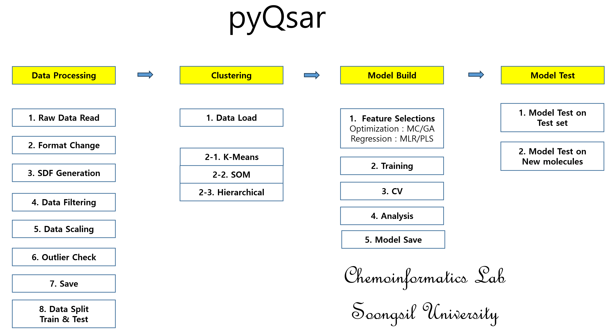
    


```python
# OLD : needs modification
#dt.man('workflow.png')
```

<h1>1. Data processing</h1>
<h2>1.1. Raw Data Read</h2>
<ul>
<li> the sample data(qdb.csv) is taken from 
<a href="https://qsardb.org/repository/handle/10967/229">qsarDB</a> </li>
<li> Training set(194) and Test set(98) are combined to make qdb.csv(292).</li>
<li> Then, descriptors are calculated using mordred.</li>
</ul>


```python
orgFormat = pd.read_csv("qdb.csv") 
orgFormat
```


<div>
<style scoped>
    .dataframe tbody tr th:only-of-type {
        vertical-align: middle;
    }

    .dataframe tbody tr th {
        vertical-align: top;
    }

    .dataframe thead th {
        text-align: right;
    }
</style>
<table border="1" class="dataframe">
  <thead>
    <tr style="text-align: right;">
      <th></th>
      <th>Name</th>
      <th>Cid</th>
      <th>Smiles</th>
      <th>logLC50</th>
      <th>ABC</th>
      <th>ABCGG</th>
      <th>nAcid</th>
      <th>nBase</th>
      <th>SpAbs_A</th>
      <th>SpMax_A</th>
      <th>...</th>
      <th>SRW10</th>
      <th>TSRW10</th>
      <th>MW</th>
      <th>AMW</th>
      <th>WPath</th>
      <th>WPol</th>
      <th>Zagreb1</th>
      <th>Zagreb2</th>
      <th>mZagreb1</th>
      <th>mZagreb2</th>
    </tr>
  </thead>
  <tbody>
    <tr>
      <th>0</th>
      <td>m001</td>
      <td>11859</td>
      <td>C1=C(C=C(C(=C1Cl)Cl)Cl)O</td>
      <td>-5.46</td>
      <td>7.427747</td>
      <td>7.188678</td>
      <td>0</td>
      <td>0</td>
      <td>11.643052</td>
      <td>2.307250</td>
      <td>...</td>
      <td>9.078065</td>
      <td>39.748909</td>
      <td>195.924948</td>
      <td>15.071150</td>
      <td>110</td>
      <td>13</td>
      <td>48.0</td>
      <td>54.0</td>
      <td>4.944444</td>
      <td>2.222222</td>
    </tr>
    <tr>
      <th>1</th>
      <td>m002</td>
      <td>11899</td>
      <td>C1=CC(=C(C=C1Cl)Cl)[N+](=O)[O-]</td>
      <td>-4.66</td>
      <td>8.134854</td>
      <td>7.770338</td>
      <td>0</td>
      <td>0</td>
      <td>12.675204</td>
      <td>2.302776</td>
      <td>...</td>
      <td>9.094144</td>
      <td>41.023148</td>
      <td>190.954084</td>
      <td>13.639577</td>
      <td>150</td>
      <td>14</td>
      <td>52.0</td>
      <td>58.0</td>
      <td>5.194444</td>
      <td>2.472222</td>
    </tr>
    <tr>
      <th>2</th>
      <td>m003</td>
      <td>2723704</td>
      <td>CNC(=S)N</td>
      <td>-3.98</td>
      <td>3.047207</td>
      <td>3.305183</td>
      <td>0</td>
      <td>0</td>
      <td>5.226252</td>
      <td>1.847759</td>
      <td>...</td>
      <td>6.834109</td>
      <td>27.254130</td>
      <td>90.025169</td>
      <td>8.184106</td>
      <td>18</td>
      <td>2</td>
      <td>16.0</td>
      <td>14.0</td>
      <td>3.361111</td>
      <td>1.333333</td>
    </tr>
    <tr>
      <th>3</th>
      <td>m004</td>
      <td>3032338</td>
      <td>CCNC(=S)N</td>
      <td>-4.00</td>
      <td>3.754314</td>
      <td>4.057055</td>
      <td>0</td>
      <td>0</td>
      <td>6.155367</td>
      <td>1.902113</td>
      <td>...</td>
      <td>7.131699</td>
      <td>29.439488</td>
      <td>104.040819</td>
      <td>7.431487</td>
      <td>32</td>
      <td>3</td>
      <td>20.0</td>
      <td>18.0</td>
      <td>3.611111</td>
      <td>1.583333</td>
    </tr>
    <tr>
      <th>4</th>
      <td>m005</td>
      <td>2346</td>
      <td>C1=CC=C(C=C1)CN=C=S</td>
      <td>-6.54</td>
      <td>7.071068</td>
      <td>6.547760</td>
      <td>0</td>
      <td>0</td>
      <td>12.932143</td>
      <td>2.154341</td>
      <td>...</td>
      <td>8.438366</td>
      <td>38.130322</td>
      <td>149.029920</td>
      <td>8.766466</td>
      <td>133</td>
      <td>9</td>
      <td>42.0</td>
      <td>44.0</td>
      <td>3.111111</td>
      <td>2.500000</td>
    </tr>
    <tr>
      <th>...</th>
      <td>...</td>
      <td>...</td>
      <td>...</td>
      <td>...</td>
      <td>...</td>
      <td>...</td>
      <td>...</td>
      <td>...</td>
      <td>...</td>
      <td>...</td>
      <td>...</td>
      <td>...</td>
      <td>...</td>
      <td>...</td>
      <td>...</td>
      <td>...</td>
      <td>...</td>
      <td>...</td>
      <td>...</td>
      <td>...</td>
      <td>...</td>
    </tr>
    <tr>
      <th>287</th>
      <td>m288</td>
      <td>15292</td>
      <td>CC1=CC(=CC(=C1O)Cl)Cl</td>
      <td>-5.65</td>
      <td>7.427747</td>
      <td>7.188678</td>
      <td>0</td>
      <td>0</td>
      <td>11.643052</td>
      <td>2.307250</td>
      <td>...</td>
      <td>9.078065</td>
      <td>39.748909</td>
      <td>175.979570</td>
      <td>10.998723</td>
      <td>110</td>
      <td>13</td>
      <td>48.0</td>
      <td>54.0</td>
      <td>4.944444</td>
      <td>2.222222</td>
    </tr>
    <tr>
      <th>288</th>
      <td>m289</td>
      <td>15767</td>
      <td>COC1=C(C(=C(C(=C1Cl)Cl)Cl)Cl)Cl</td>
      <td>-7.01</td>
      <td>9.496696</td>
      <td>9.522267</td>
      <td>0</td>
      <td>0</td>
      <td>15.688761</td>
      <td>2.426720</td>
      <td>...</td>
      <td>9.602855</td>
      <td>44.616134</td>
      <td>277.862653</td>
      <td>17.366416</td>
      <td>220</td>
      <td>23</td>
      <td>64.0</td>
      <td>77.0</td>
      <td>6.916667</td>
      <td>3.000000</td>
    </tr>
    <tr>
      <th>289</th>
      <td>m290</td>
      <td>1551919</td>
      <td>CCCCNC(=S)N</td>
      <td>-3.85</td>
      <td>5.168527</td>
      <td>5.361851</td>
      <td>0</td>
      <td>0</td>
      <td>8.762573</td>
      <td>1.949856</td>
      <td>...</td>
      <td>7.475906</td>
      <td>33.090360</td>
      <td>132.072119</td>
      <td>6.603606</td>
      <td>79</td>
      <td>5</td>
      <td>28.0</td>
      <td>26.0</td>
      <td>4.111111</td>
      <td>2.083333</td>
    </tr>
    <tr>
      <th>290</th>
      <td>m291</td>
      <td>2566</td>
      <td>CC1(CC2=C(O1)C(=CC=C2)OC(=O)NC)C</td>
      <td>-6.52</td>
      <td>12.367162</td>
      <td>11.107564</td>
      <td>0</td>
      <td>0</td>
      <td>19.625463</td>
      <td>2.470049</td>
      <td>...</td>
      <td>9.709599</td>
      <td>62.929068</td>
      <td>221.105193</td>
      <td>7.132426</td>
      <td>425</td>
      <td>22</td>
      <td>84.0</td>
      <td>97.0</td>
      <td>6.256944</td>
      <td>3.472222</td>
    </tr>
    <tr>
      <th>291</th>
      <td>m292</td>
      <td>13905</td>
      <td>CCNC1=NC(=NC(=N1)SC)NCC</td>
      <td>-3.63</td>
      <td>9.899495</td>
      <td>9.242468</td>
      <td>0</td>
      <td>0</td>
      <td>17.184731</td>
      <td>2.298128</td>
      <td>...</td>
      <td>9.110410</td>
      <td>44.568778</td>
      <td>213.104816</td>
      <td>7.348442</td>
      <td>318</td>
      <td>17</td>
      <td>62.0</td>
      <td>68.0</td>
      <td>5.333333</td>
      <td>3.500000</td>
    </tr>
  </tbody>
</table>
<p>292 rows × 1830 columns</p>
</div>


<h2>1.2. format change</h2>
<ul>
<li> pyQsar needs the data with the following orders </li>
<li> "ID",  "EP",  "SMI", ~Descriptors~~~~ </li>
<li> "ID" = index or name, "EP" = End Point, "SMI" = smiles code</li>
</ul>


```python
changed = orgFormat.rename(columns={'Smiles': 'SMI', 'Cid': 'ID', "logLC50" : "EP"})
newFormat = changed[["ID", "EP", "SMI"]+ list(changed.columns)[4:]]
newFormat.to_csv("qdb1.csv", index=False)
newFormat
```


<div>
<style scoped>
    .dataframe tbody tr th:only-of-type {
        vertical-align: middle;
    }

    .dataframe tbody tr th {
        vertical-align: top;
    }

    .dataframe thead th {
        text-align: right;
    }
</style>
<table border="1" class="dataframe">
  <thead>
    <tr style="text-align: right;">
      <th></th>
      <th>ID</th>
      <th>EP</th>
      <th>SMI</th>
      <th>ABC</th>
      <th>ABCGG</th>
      <th>nAcid</th>
      <th>nBase</th>
      <th>SpAbs_A</th>
      <th>SpMax_A</th>
      <th>SpDiam_A</th>
      <th>...</th>
      <th>SRW10</th>
      <th>TSRW10</th>
      <th>MW</th>
      <th>AMW</th>
      <th>WPath</th>
      <th>WPol</th>
      <th>Zagreb1</th>
      <th>Zagreb2</th>
      <th>mZagreb1</th>
      <th>mZagreb2</th>
    </tr>
  </thead>
  <tbody>
    <tr>
      <th>0</th>
      <td>11859</td>
      <td>-5.46</td>
      <td>C1=C(C=C(C(=C1Cl)Cl)Cl)O</td>
      <td>7.427747</td>
      <td>7.188678</td>
      <td>0</td>
      <td>0</td>
      <td>11.643052</td>
      <td>2.307250</td>
      <td>4.614501</td>
      <td>...</td>
      <td>9.078065</td>
      <td>39.748909</td>
      <td>195.924948</td>
      <td>15.071150</td>
      <td>110</td>
      <td>13</td>
      <td>48.0</td>
      <td>54.0</td>
      <td>4.944444</td>
      <td>2.222222</td>
    </tr>
    <tr>
      <th>1</th>
      <td>11899</td>
      <td>-4.66</td>
      <td>C1=CC(=C(C=C1Cl)Cl)[N+](=O)[O-]</td>
      <td>8.134854</td>
      <td>7.770338</td>
      <td>0</td>
      <td>0</td>
      <td>12.675204</td>
      <td>2.302776</td>
      <td>4.605551</td>
      <td>...</td>
      <td>9.094144</td>
      <td>41.023148</td>
      <td>190.954084</td>
      <td>13.639577</td>
      <td>150</td>
      <td>14</td>
      <td>52.0</td>
      <td>58.0</td>
      <td>5.194444</td>
      <td>2.472222</td>
    </tr>
    <tr>
      <th>2</th>
      <td>2723704</td>
      <td>-3.98</td>
      <td>CNC(=S)N</td>
      <td>3.047207</td>
      <td>3.305183</td>
      <td>0</td>
      <td>0</td>
      <td>5.226252</td>
      <td>1.847759</td>
      <td>3.695518</td>
      <td>...</td>
      <td>6.834109</td>
      <td>27.254130</td>
      <td>90.025169</td>
      <td>8.184106</td>
      <td>18</td>
      <td>2</td>
      <td>16.0</td>
      <td>14.0</td>
      <td>3.361111</td>
      <td>1.333333</td>
    </tr>
    <tr>
      <th>3</th>
      <td>3032338</td>
      <td>-4.00</td>
      <td>CCNC(=S)N</td>
      <td>3.754314</td>
      <td>4.057055</td>
      <td>0</td>
      <td>0</td>
      <td>6.155367</td>
      <td>1.902113</td>
      <td>3.804226</td>
      <td>...</td>
      <td>7.131699</td>
      <td>29.439488</td>
      <td>104.040819</td>
      <td>7.431487</td>
      <td>32</td>
      <td>3</td>
      <td>20.0</td>
      <td>18.0</td>
      <td>3.611111</td>
      <td>1.583333</td>
    </tr>
    <tr>
      <th>4</th>
      <td>2346</td>
      <td>-6.54</td>
      <td>C1=CC=C(C=C1)CN=C=S</td>
      <td>7.071068</td>
      <td>6.547760</td>
      <td>0</td>
      <td>0</td>
      <td>12.932143</td>
      <td>2.154341</td>
      <td>4.308683</td>
      <td>...</td>
      <td>8.438366</td>
      <td>38.130322</td>
      <td>149.029920</td>
      <td>8.766466</td>
      <td>133</td>
      <td>9</td>
      <td>42.0</td>
      <td>44.0</td>
      <td>3.111111</td>
      <td>2.500000</td>
    </tr>
    <tr>
      <th>...</th>
      <td>...</td>
      <td>...</td>
      <td>...</td>
      <td>...</td>
      <td>...</td>
      <td>...</td>
      <td>...</td>
      <td>...</td>
      <td>...</td>
      <td>...</td>
      <td>...</td>
      <td>...</td>
      <td>...</td>
      <td>...</td>
      <td>...</td>
      <td>...</td>
      <td>...</td>
      <td>...</td>
      <td>...</td>
      <td>...</td>
      <td>...</td>
    </tr>
    <tr>
      <th>287</th>
      <td>15292</td>
      <td>-5.65</td>
      <td>CC1=CC(=CC(=C1O)Cl)Cl</td>
      <td>7.427747</td>
      <td>7.188678</td>
      <td>0</td>
      <td>0</td>
      <td>11.643052</td>
      <td>2.307250</td>
      <td>4.614501</td>
      <td>...</td>
      <td>9.078065</td>
      <td>39.748909</td>
      <td>175.979570</td>
      <td>10.998723</td>
      <td>110</td>
      <td>13</td>
      <td>48.0</td>
      <td>54.0</td>
      <td>4.944444</td>
      <td>2.222222</td>
    </tr>
    <tr>
      <th>288</th>
      <td>15767</td>
      <td>-7.01</td>
      <td>COC1=C(C(=C(C(=C1Cl)Cl)Cl)Cl)Cl</td>
      <td>9.496696</td>
      <td>9.522267</td>
      <td>0</td>
      <td>0</td>
      <td>15.688761</td>
      <td>2.426720</td>
      <td>4.853440</td>
      <td>...</td>
      <td>9.602855</td>
      <td>44.616134</td>
      <td>277.862653</td>
      <td>17.366416</td>
      <td>220</td>
      <td>23</td>
      <td>64.0</td>
      <td>77.0</td>
      <td>6.916667</td>
      <td>3.000000</td>
    </tr>
    <tr>
      <th>289</th>
      <td>1551919</td>
      <td>-3.85</td>
      <td>CCCCNC(=S)N</td>
      <td>5.168527</td>
      <td>5.361851</td>
      <td>0</td>
      <td>0</td>
      <td>8.762573</td>
      <td>1.949856</td>
      <td>3.899712</td>
      <td>...</td>
      <td>7.475906</td>
      <td>33.090360</td>
      <td>132.072119</td>
      <td>6.603606</td>
      <td>79</td>
      <td>5</td>
      <td>28.0</td>
      <td>26.0</td>
      <td>4.111111</td>
      <td>2.083333</td>
    </tr>
    <tr>
      <th>290</th>
      <td>2566</td>
      <td>-6.52</td>
      <td>CC1(CC2=C(O1)C(=CC=C2)OC(=O)NC)C</td>
      <td>12.367162</td>
      <td>11.107564</td>
      <td>0</td>
      <td>0</td>
      <td>19.625463</td>
      <td>2.470049</td>
      <td>4.778732</td>
      <td>...</td>
      <td>9.709599</td>
      <td>62.929068</td>
      <td>221.105193</td>
      <td>7.132426</td>
      <td>425</td>
      <td>22</td>
      <td>84.0</td>
      <td>97.0</td>
      <td>6.256944</td>
      <td>3.472222</td>
    </tr>
    <tr>
      <th>291</th>
      <td>13905</td>
      <td>-3.63</td>
      <td>CCNC1=NC(=NC(=N1)SC)NCC</td>
      <td>9.899495</td>
      <td>9.242468</td>
      <td>0</td>
      <td>0</td>
      <td>17.184731</td>
      <td>2.298128</td>
      <td>4.596257</td>
      <td>...</td>
      <td>9.110410</td>
      <td>44.568778</td>
      <td>213.104816</td>
      <td>7.348442</td>
      <td>318</td>
      <td>17</td>
      <td>62.0</td>
      <td>68.0</td>
      <td>5.333333</td>
      <td>3.500000</td>
    </tr>
  </tbody>
</table>
<p>292 rows × 1829 columns</p>
</div>


<h2>1.3. Generating SDF</h2>
<ul>
<li> Generates SDF from SMILES for future use </li>
</ul>


```python
dt.SDFgeneration()
```

    Path :/home/jun/pyqsar/pyqsar3r25
    Index   File Name
       0    qdb.csv
       1    qdb1.csv


    Enter .csv file index to load :  1


    
    
              ID    EP                               SMI
    0      11859 -5.46          C1=C(C=C(C(=C1Cl)Cl)Cl)O
    1      11899 -4.66   C1=CC(=C(C=C1Cl)Cl)[N+](=O)[O-]
    2    2723704 -3.98                          CNC(=S)N
    3    3032338 -4.00                         CCNC(=S)N
    4       2346 -6.54               C1=CC=C(C=C1)CN=C=S
    ..       ...   ...                               ...
    287    15292 -5.65             CC1=CC(=CC(=C1O)Cl)Cl
    288    15767 -7.01   COC1=C(C(=C(C(=C1Cl)Cl)Cl)Cl)Cl
    289  1551919 -3.85                       CCCCNC(=S)N
    290     2566 -6.52  CC1(CC2=C(O1)C(=CC=C2)OC(=O)NC)C
    291    13905 -3.63           CCNC1=NC(=NC(=N1)SC)NCC
    
    [292 rows x 3 columns]


    /home/jun/pyqsar/pyqsar3r25/pyqsar/data_tools.py:600: SettingWithCopyWarning: 
    A value is trying to be set on a copy of a slice from a DataFrame.
    Try using .loc[row_indexer,col_indexer] = value instead
    
    See the caveats in the documentation: https://pandas.pydata.org/pandas-docs/stable/user_guide/indexing.html#returning-a-view-versus-a-copy
      smi_df['Molecule'] = smi_df['SMI'].apply(Chem.MolFromSmiles)


<h2>1.4.  Data Filtering</h2>
<ul>
<li> eliminating non-numerical data </li>
</ul>


```python
X_data = newFormat.iloc[:,3:]
X_data
```


<div>
<style scoped>
    .dataframe tbody tr th:only-of-type {
        vertical-align: middle;
    }

    .dataframe tbody tr th {
        vertical-align: top;
    }

    .dataframe thead th {
        text-align: right;
    }
</style>
<table border="1" class="dataframe">
  <thead>
    <tr style="text-align: right;">
      <th></th>
      <th>ABC</th>
      <th>ABCGG</th>
      <th>nAcid</th>
      <th>nBase</th>
      <th>SpAbs_A</th>
      <th>SpMax_A</th>
      <th>SpDiam_A</th>
      <th>SpAD_A</th>
      <th>SpMAD_A</th>
      <th>LogEE_A</th>
      <th>...</th>
      <th>SRW10</th>
      <th>TSRW10</th>
      <th>MW</th>
      <th>AMW</th>
      <th>WPath</th>
      <th>WPol</th>
      <th>Zagreb1</th>
      <th>Zagreb2</th>
      <th>mZagreb1</th>
      <th>mZagreb2</th>
    </tr>
  </thead>
  <tbody>
    <tr>
      <th>0</th>
      <td>7.427747</td>
      <td>7.188678</td>
      <td>0</td>
      <td>0</td>
      <td>11.643052</td>
      <td>2.307250</td>
      <td>4.614501</td>
      <td>11.643052</td>
      <td>1.164305</td>
      <td>3.206363</td>
      <td>...</td>
      <td>9.078065</td>
      <td>39.748909</td>
      <td>195.924948</td>
      <td>15.071150</td>
      <td>110</td>
      <td>13</td>
      <td>48.0</td>
      <td>54.0</td>
      <td>4.944444</td>
      <td>2.222222</td>
    </tr>
    <tr>
      <th>1</th>
      <td>8.134854</td>
      <td>7.770338</td>
      <td>0</td>
      <td>0</td>
      <td>12.675204</td>
      <td>2.302776</td>
      <td>4.605551</td>
      <td>12.675204</td>
      <td>1.152291</td>
      <td>3.294669</td>
      <td>...</td>
      <td>9.094144</td>
      <td>41.023148</td>
      <td>190.954084</td>
      <td>13.639577</td>
      <td>150</td>
      <td>14</td>
      <td>52.0</td>
      <td>58.0</td>
      <td>5.194444</td>
      <td>2.472222</td>
    </tr>
    <tr>
      <th>2</th>
      <td>3.047207</td>
      <td>3.305183</td>
      <td>0</td>
      <td>0</td>
      <td>5.226252</td>
      <td>1.847759</td>
      <td>3.695518</td>
      <td>5.226252</td>
      <td>1.045250</td>
      <td>2.408576</td>
      <td>...</td>
      <td>6.834109</td>
      <td>27.254130</td>
      <td>90.025169</td>
      <td>8.184106</td>
      <td>18</td>
      <td>2</td>
      <td>16.0</td>
      <td>14.0</td>
      <td>3.361111</td>
      <td>1.333333</td>
    </tr>
    <tr>
      <th>3</th>
      <td>3.754314</td>
      <td>4.057055</td>
      <td>0</td>
      <td>0</td>
      <td>6.155367</td>
      <td>1.902113</td>
      <td>3.804226</td>
      <td>6.155367</td>
      <td>1.025895</td>
      <td>2.595100</td>
      <td>...</td>
      <td>7.131699</td>
      <td>29.439488</td>
      <td>104.040819</td>
      <td>7.431487</td>
      <td>32</td>
      <td>3</td>
      <td>20.0</td>
      <td>18.0</td>
      <td>3.611111</td>
      <td>1.583333</td>
    </tr>
    <tr>
      <th>4</th>
      <td>7.071068</td>
      <td>6.547760</td>
      <td>0</td>
      <td>0</td>
      <td>12.932143</td>
      <td>2.154341</td>
      <td>4.308683</td>
      <td>12.932143</td>
      <td>1.293214</td>
      <td>3.179653</td>
      <td>...</td>
      <td>8.438366</td>
      <td>38.130322</td>
      <td>149.029920</td>
      <td>8.766466</td>
      <td>133</td>
      <td>9</td>
      <td>42.0</td>
      <td>44.0</td>
      <td>3.111111</td>
      <td>2.500000</td>
    </tr>
    <tr>
      <th>...</th>
      <td>...</td>
      <td>...</td>
      <td>...</td>
      <td>...</td>
      <td>...</td>
      <td>...</td>
      <td>...</td>
      <td>...</td>
      <td>...</td>
      <td>...</td>
      <td>...</td>
      <td>...</td>
      <td>...</td>
      <td>...</td>
      <td>...</td>
      <td>...</td>
      <td>...</td>
      <td>...</td>
      <td>...</td>
      <td>...</td>
      <td>...</td>
    </tr>
    <tr>
      <th>287</th>
      <td>7.427747</td>
      <td>7.188678</td>
      <td>0</td>
      <td>0</td>
      <td>11.643052</td>
      <td>2.307250</td>
      <td>4.614501</td>
      <td>11.643052</td>
      <td>1.164305</td>
      <td>3.206363</td>
      <td>...</td>
      <td>9.078065</td>
      <td>39.748909</td>
      <td>175.979570</td>
      <td>10.998723</td>
      <td>110</td>
      <td>13</td>
      <td>48.0</td>
      <td>54.0</td>
      <td>4.944444</td>
      <td>2.222222</td>
    </tr>
    <tr>
      <th>288</th>
      <td>9.496696</td>
      <td>9.522267</td>
      <td>0</td>
      <td>0</td>
      <td>15.688761</td>
      <td>2.426720</td>
      <td>4.853440</td>
      <td>15.688761</td>
      <td>1.206828</td>
      <td>3.465917</td>
      <td>...</td>
      <td>9.602855</td>
      <td>44.616134</td>
      <td>277.862653</td>
      <td>17.366416</td>
      <td>220</td>
      <td>23</td>
      <td>64.0</td>
      <td>77.0</td>
      <td>6.916667</td>
      <td>3.000000</td>
    </tr>
    <tr>
      <th>289</th>
      <td>5.168527</td>
      <td>5.361851</td>
      <td>0</td>
      <td>0</td>
      <td>8.762573</td>
      <td>1.949856</td>
      <td>3.899712</td>
      <td>8.762573</td>
      <td>1.095322</td>
      <td>2.887985</td>
      <td>...</td>
      <td>7.475906</td>
      <td>33.090360</td>
      <td>132.072119</td>
      <td>6.603606</td>
      <td>79</td>
      <td>5</td>
      <td>28.0</td>
      <td>26.0</td>
      <td>4.111111</td>
      <td>2.083333</td>
    </tr>
    <tr>
      <th>290</th>
      <td>12.367162</td>
      <td>11.107564</td>
      <td>0</td>
      <td>0</td>
      <td>19.625463</td>
      <td>2.470049</td>
      <td>4.778732</td>
      <td>19.625463</td>
      <td>1.226591</td>
      <td>3.704782</td>
      <td>...</td>
      <td>9.709599</td>
      <td>62.929068</td>
      <td>221.105193</td>
      <td>7.132426</td>
      <td>425</td>
      <td>22</td>
      <td>84.0</td>
      <td>97.0</td>
      <td>6.256944</td>
      <td>3.472222</td>
    </tr>
    <tr>
      <th>291</th>
      <td>9.899495</td>
      <td>9.242468</td>
      <td>0</td>
      <td>0</td>
      <td>17.184731</td>
      <td>2.298128</td>
      <td>4.596257</td>
      <td>17.184731</td>
      <td>1.227481</td>
      <td>3.514645</td>
      <td>...</td>
      <td>9.110410</td>
      <td>44.568778</td>
      <td>213.104816</td>
      <td>7.348442</td>
      <td>318</td>
      <td>17</td>
      <td>62.0</td>
      <td>68.0</td>
      <td>5.333333</td>
      <td>3.500000</td>
    </tr>
  </tbody>
</table>
<p>292 rows × 1826 columns</p>
</div>


```python
X_data, sel_desc=dt.NonNumricFilter(X_data)
```

    Start :  (292, 1826)
    Filterd : (292, 952)


```python
filtered = newFormat[["ID","EP","SMI"]+sel_desc]
filtered.to_csv("qdb1_F.csv", index=False)
filtered
```


<div>
<style scoped>
    .dataframe tbody tr th:only-of-type {
        vertical-align: middle;
    }

    .dataframe tbody tr th {
        vertical-align: top;
    }

    .dataframe thead th {
        text-align: right;
    }
</style>
<table border="1" class="dataframe">
  <thead>
    <tr style="text-align: right;">
      <th></th>
      <th>ID</th>
      <th>EP</th>
      <th>SMI</th>
      <th>ABC</th>
      <th>ABCGG</th>
      <th>nAcid</th>
      <th>nBase</th>
      <th>SpAbs_A</th>
      <th>SpMax_A</th>
      <th>SpDiam_A</th>
      <th>...</th>
      <th>SRW10</th>
      <th>TSRW10</th>
      <th>MW</th>
      <th>AMW</th>
      <th>WPath</th>
      <th>WPol</th>
      <th>Zagreb1</th>
      <th>Zagreb2</th>
      <th>mZagreb1</th>
      <th>mZagreb2</th>
    </tr>
  </thead>
  <tbody>
    <tr>
      <th>0</th>
      <td>11859</td>
      <td>-5.46</td>
      <td>C1=C(C=C(C(=C1Cl)Cl)Cl)O</td>
      <td>7.427747</td>
      <td>7.188678</td>
      <td>0</td>
      <td>0</td>
      <td>11.643052</td>
      <td>2.307250</td>
      <td>4.614501</td>
      <td>...</td>
      <td>9.078065</td>
      <td>39.748909</td>
      <td>195.924948</td>
      <td>15.071150</td>
      <td>110</td>
      <td>13</td>
      <td>48.0</td>
      <td>54.0</td>
      <td>4.944444</td>
      <td>2.222222</td>
    </tr>
    <tr>
      <th>1</th>
      <td>11899</td>
      <td>-4.66</td>
      <td>C1=CC(=C(C=C1Cl)Cl)[N+](=O)[O-]</td>
      <td>8.134854</td>
      <td>7.770338</td>
      <td>0</td>
      <td>0</td>
      <td>12.675204</td>
      <td>2.302776</td>
      <td>4.605551</td>
      <td>...</td>
      <td>9.094144</td>
      <td>41.023148</td>
      <td>190.954084</td>
      <td>13.639577</td>
      <td>150</td>
      <td>14</td>
      <td>52.0</td>
      <td>58.0</td>
      <td>5.194444</td>
      <td>2.472222</td>
    </tr>
    <tr>
      <th>2</th>
      <td>2723704</td>
      <td>-3.98</td>
      <td>CNC(=S)N</td>
      <td>3.047207</td>
      <td>3.305183</td>
      <td>0</td>
      <td>0</td>
      <td>5.226252</td>
      <td>1.847759</td>
      <td>3.695518</td>
      <td>...</td>
      <td>6.834109</td>
      <td>27.254130</td>
      <td>90.025169</td>
      <td>8.184106</td>
      <td>18</td>
      <td>2</td>
      <td>16.0</td>
      <td>14.0</td>
      <td>3.361111</td>
      <td>1.333333</td>
    </tr>
    <tr>
      <th>3</th>
      <td>3032338</td>
      <td>-4.00</td>
      <td>CCNC(=S)N</td>
      <td>3.754314</td>
      <td>4.057055</td>
      <td>0</td>
      <td>0</td>
      <td>6.155367</td>
      <td>1.902113</td>
      <td>3.804226</td>
      <td>...</td>
      <td>7.131699</td>
      <td>29.439488</td>
      <td>104.040819</td>
      <td>7.431487</td>
      <td>32</td>
      <td>3</td>
      <td>20.0</td>
      <td>18.0</td>
      <td>3.611111</td>
      <td>1.583333</td>
    </tr>
    <tr>
      <th>4</th>
      <td>2346</td>
      <td>-6.54</td>
      <td>C1=CC=C(C=C1)CN=C=S</td>
      <td>7.071068</td>
      <td>6.547760</td>
      <td>0</td>
      <td>0</td>
      <td>12.932143</td>
      <td>2.154341</td>
      <td>4.308683</td>
      <td>...</td>
      <td>8.438366</td>
      <td>38.130322</td>
      <td>149.029920</td>
      <td>8.766466</td>
      <td>133</td>
      <td>9</td>
      <td>42.0</td>
      <td>44.0</td>
      <td>3.111111</td>
      <td>2.500000</td>
    </tr>
    <tr>
      <th>...</th>
      <td>...</td>
      <td>...</td>
      <td>...</td>
      <td>...</td>
      <td>...</td>
      <td>...</td>
      <td>...</td>
      <td>...</td>
      <td>...</td>
      <td>...</td>
      <td>...</td>
      <td>...</td>
      <td>...</td>
      <td>...</td>
      <td>...</td>
      <td>...</td>
      <td>...</td>
      <td>...</td>
      <td>...</td>
      <td>...</td>
      <td>...</td>
    </tr>
    <tr>
      <th>287</th>
      <td>15292</td>
      <td>-5.65</td>
      <td>CC1=CC(=CC(=C1O)Cl)Cl</td>
      <td>7.427747</td>
      <td>7.188678</td>
      <td>0</td>
      <td>0</td>
      <td>11.643052</td>
      <td>2.307250</td>
      <td>4.614501</td>
      <td>...</td>
      <td>9.078065</td>
      <td>39.748909</td>
      <td>175.979570</td>
      <td>10.998723</td>
      <td>110</td>
      <td>13</td>
      <td>48.0</td>
      <td>54.0</td>
      <td>4.944444</td>
      <td>2.222222</td>
    </tr>
    <tr>
      <th>288</th>
      <td>15767</td>
      <td>-7.01</td>
      <td>COC1=C(C(=C(C(=C1Cl)Cl)Cl)Cl)Cl</td>
      <td>9.496696</td>
      <td>9.522267</td>
      <td>0</td>
      <td>0</td>
      <td>15.688761</td>
      <td>2.426720</td>
      <td>4.853440</td>
      <td>...</td>
      <td>9.602855</td>
      <td>44.616134</td>
      <td>277.862653</td>
      <td>17.366416</td>
      <td>220</td>
      <td>23</td>
      <td>64.0</td>
      <td>77.0</td>
      <td>6.916667</td>
      <td>3.000000</td>
    </tr>
    <tr>
      <th>289</th>
      <td>1551919</td>
      <td>-3.85</td>
      <td>CCCCNC(=S)N</td>
      <td>5.168527</td>
      <td>5.361851</td>
      <td>0</td>
      <td>0</td>
      <td>8.762573</td>
      <td>1.949856</td>
      <td>3.899712</td>
      <td>...</td>
      <td>7.475906</td>
      <td>33.090360</td>
      <td>132.072119</td>
      <td>6.603606</td>
      <td>79</td>
      <td>5</td>
      <td>28.0</td>
      <td>26.0</td>
      <td>4.111111</td>
      <td>2.083333</td>
    </tr>
    <tr>
      <th>290</th>
      <td>2566</td>
      <td>-6.52</td>
      <td>CC1(CC2=C(O1)C(=CC=C2)OC(=O)NC)C</td>
      <td>12.367162</td>
      <td>11.107564</td>
      <td>0</td>
      <td>0</td>
      <td>19.625463</td>
      <td>2.470049</td>
      <td>4.778732</td>
      <td>...</td>
      <td>9.709599</td>
      <td>62.929068</td>
      <td>221.105193</td>
      <td>7.132426</td>
      <td>425</td>
      <td>22</td>
      <td>84.0</td>
      <td>97.0</td>
      <td>6.256944</td>
      <td>3.472222</td>
    </tr>
    <tr>
      <th>291</th>
      <td>13905</td>
      <td>-3.63</td>
      <td>CCNC1=NC(=NC(=N1)SC)NCC</td>
      <td>9.899495</td>
      <td>9.242468</td>
      <td>0</td>
      <td>0</td>
      <td>17.184731</td>
      <td>2.298128</td>
      <td>4.596257</td>
      <td>...</td>
      <td>9.110410</td>
      <td>44.568778</td>
      <td>213.104816</td>
      <td>7.348442</td>
      <td>318</td>
      <td>17</td>
      <td>62.0</td>
      <td>68.0</td>
      <td>5.333333</td>
      <td>3.500000</td>
    </tr>
  </tbody>
</table>
<p>292 rows × 955 columns</p>
</div>


## Check if there are descriptors with one value


```python
dt.uCheck(filtered)
```


    
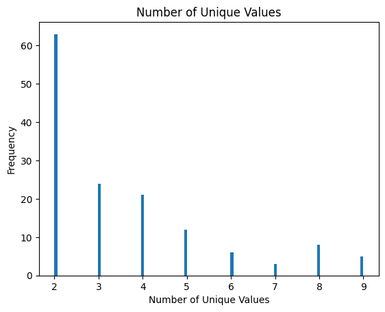
    


<h2>1.5.  Data scaling</h2>
<h3> ScalingTools(scale, ext='.csv') </h3>
<ul>
<li> scale : Scaling Method, 'minmax','standard' </li>
<li> ext : call csv format file with ext extension' </li>
</ul>


```python
st = dt.ScalingTools(scale='standard')
```

    Path :/home/jun/pyqsar/pyqsar3r25
    Index   File Name
       0    qdb.csv
       1    qdb1.csv
       2    qdb1_F.csv


    Enter .csv file index to load :  2


    
    


<h3> train_scaler() </h3>
<ul>
<li> * fit and transform data </li>
<li> * save scaler file to use in model information </li>
</ul>    


```python
st.train_scaler()
```

    Scaler File : qdb1_F_standard.info file saved


<div>
<style scoped>
    .dataframe tbody tr th:only-of-type {
        vertical-align: middle;
    }

    .dataframe tbody tr th {
        vertical-align: top;
    }

    .dataframe thead th {
        text-align: right;
    }
</style>
<table border="1" class="dataframe">
  <thead>
    <tr style="text-align: right;">
      <th></th>
      <th>ID</th>
      <th>EP</th>
      <th>SMI</th>
      <th>ABC</th>
      <th>ABCGG</th>
      <th>nAcid</th>
      <th>nBase</th>
      <th>SpAbs_A</th>
      <th>SpMax_A</th>
      <th>SpDiam_A</th>
      <th>...</th>
      <th>SRW10</th>
      <th>TSRW10</th>
      <th>MW</th>
      <th>AMW</th>
      <th>WPath</th>
      <th>WPol</th>
      <th>Zagreb1</th>
      <th>Zagreb2</th>
      <th>mZagreb1</th>
      <th>mZagreb2</th>
    </tr>
  </thead>
  <tbody>
    <tr>
      <th>0</th>
      <td>11859</td>
      <td>-5.46</td>
      <td>C1=C(C=C(C(=C1Cl)Cl)Cl)O</td>
      <td>-0.151062</td>
      <td>-0.093948</td>
      <td>-0.117851</td>
      <td>-0.162791</td>
      <td>-0.257506</td>
      <td>0.465983</td>
      <td>0.541285</td>
      <td>...</td>
      <td>0.420833</td>
      <td>-0.102373</td>
      <td>0.159083</td>
      <td>0.948995</td>
      <td>-0.374862</td>
      <td>-0.050123</td>
      <td>-0.111334</td>
      <td>-0.087220</td>
      <td>0.080589</td>
      <td>-0.324793</td>
    </tr>
    <tr>
      <th>1</th>
      <td>11899</td>
      <td>-4.66</td>
      <td>C1=CC(=C(C=C1Cl)Cl)[N+](=O)[O-]</td>
      <td>0.008807</td>
      <td>0.063539</td>
      <td>-0.117851</td>
      <td>-0.162791</td>
      <td>-0.112802</td>
      <td>0.449525</td>
      <td>0.524199</td>
      <td>...</td>
      <td>0.432253</td>
      <td>-0.000520</td>
      <td>0.102523</td>
      <td>0.676300</td>
      <td>-0.284085</td>
      <td>0.044915</td>
      <td>0.016656</td>
      <td>0.015890</td>
      <td>0.196860</td>
      <td>-0.113150</td>
    </tr>
    <tr>
      <th>2</th>
      <td>2723704</td>
      <td>-3.98</td>
      <td>CNC(=S)N</td>
      <td>-1.141451</td>
      <td>-1.145427</td>
      <td>-0.117851</td>
      <td>-0.162791</td>
      <td>-1.157113</td>
      <td>-1.223984</td>
      <td>-1.213185</td>
      <td>...</td>
      <td>-1.173080</td>
      <td>-1.101110</td>
      <td>-1.045867</td>
      <td>-0.362894</td>
      <td>-0.583651</td>
      <td>-1.095539</td>
      <td>-1.135254</td>
      <td>-1.118326</td>
      <td>-0.655795</td>
      <td>-1.077300</td>
    </tr>
    <tr>
      <th>3</th>
      <td>3032338</td>
      <td>-4.00</td>
      <td>CCNC(=S)N</td>
      <td>-0.981582</td>
      <td>-0.941853</td>
      <td>-0.117851</td>
      <td>-0.162791</td>
      <td>-1.026855</td>
      <td>-1.024075</td>
      <td>-1.005646</td>
      <td>...</td>
      <td>-0.961698</td>
      <td>-0.926429</td>
      <td>-0.886394</td>
      <td>-0.506258</td>
      <td>-0.551879</td>
      <td>-1.000502</td>
      <td>-1.007264</td>
      <td>-1.015215</td>
      <td>-0.539523</td>
      <td>-0.865657</td>
    </tr>
    <tr>
      <th>4</th>
      <td>2346</td>
      <td>-6.54</td>
      <td>C1=CC=C(C=C1)CN=C=S</td>
      <td>-0.231703</td>
      <td>-0.267480</td>
      <td>-0.117851</td>
      <td>-0.162791</td>
      <td>-0.076781</td>
      <td>-0.096403</td>
      <td>-0.042566</td>
      <td>...</td>
      <td>-0.033554</td>
      <td>-0.231750</td>
      <td>-0.374499</td>
      <td>-0.251963</td>
      <td>-0.322665</td>
      <td>-0.430274</td>
      <td>-0.303319</td>
      <td>-0.344997</td>
      <td>-0.772066</td>
      <td>-0.089634</td>
    </tr>
    <tr>
      <th>...</th>
      <td>...</td>
      <td>...</td>
      <td>...</td>
      <td>...</td>
      <td>...</td>
      <td>...</td>
      <td>...</td>
      <td>...</td>
      <td>...</td>
      <td>...</td>
      <td>...</td>
      <td>...</td>
      <td>...</td>
      <td>...</td>
      <td>...</td>
      <td>...</td>
      <td>...</td>
      <td>...</td>
      <td>...</td>
      <td>...</td>
      <td>...</td>
    </tr>
    <tr>
      <th>287</th>
      <td>15292</td>
      <td>-5.65</td>
      <td>CC1=CC(=CC(=C1O)Cl)Cl</td>
      <td>-0.151062</td>
      <td>-0.093948</td>
      <td>-0.117851</td>
      <td>-0.162791</td>
      <td>-0.257506</td>
      <td>0.465983</td>
      <td>0.541285</td>
      <td>...</td>
      <td>0.420833</td>
      <td>-0.102373</td>
      <td>-0.067860</td>
      <td>0.173252</td>
      <td>-0.374862</td>
      <td>-0.050123</td>
      <td>-0.111334</td>
      <td>-0.087220</td>
      <td>0.080589</td>
      <td>-0.324793</td>
    </tr>
    <tr>
      <th>288</th>
      <td>15767</td>
      <td>-7.01</td>
      <td>COC1=C(C(=C(C(=C1Cl)Cl)Cl)Cl)Cl</td>
      <td>0.316703</td>
      <td>0.537885</td>
      <td>-0.117851</td>
      <td>-0.162791</td>
      <td>0.309685</td>
      <td>0.905381</td>
      <td>0.997454</td>
      <td>...</td>
      <td>0.793598</td>
      <td>0.286676</td>
      <td>1.091388</td>
      <td>1.386213</td>
      <td>-0.125224</td>
      <td>0.900256</td>
      <td>0.400626</td>
      <td>0.505665</td>
      <td>0.997839</td>
      <td>0.333651</td>
    </tr>
    <tr>
      <th>289</th>
      <td>1551919</td>
      <td>-3.85</td>
      <td>CCCCNC(=S)N</td>
      <td>-0.661845</td>
      <td>-0.588572</td>
      <td>-0.117851</td>
      <td>-0.162791</td>
      <td>-0.661337</td>
      <td>-0.848482</td>
      <td>-0.823350</td>
      <td>...</td>
      <td>-0.717203</td>
      <td>-0.634606</td>
      <td>-0.567448</td>
      <td>-0.663959</td>
      <td>-0.445215</td>
      <td>-0.810426</td>
      <td>-0.751284</td>
      <td>-0.808994</td>
      <td>-0.306981</td>
      <td>-0.442372</td>
    </tr>
    <tr>
      <th>290</th>
      <td>2566</td>
      <td>-6.52</td>
      <td>CC1(CC2=C(O1)C(=CC=C2)OC(=O)NC)C</td>
      <td>0.965682</td>
      <td>0.967113</td>
      <td>-0.117851</td>
      <td>-0.162791</td>
      <td>0.861594</td>
      <td>1.064743</td>
      <td>0.854826</td>
      <td>...</td>
      <td>0.869420</td>
      <td>1.750471</td>
      <td>0.445589</td>
      <td>-0.563225</td>
      <td>0.340012</td>
      <td>0.805218</td>
      <td>1.040576</td>
      <td>1.021218</td>
      <td>0.691012</td>
      <td>0.733421</td>
    </tr>
    <tr>
      <th>291</th>
      <td>13905</td>
      <td>-3.63</td>
      <td>CCNC1=NC(=NC(=N1)SC)NCC</td>
      <td>0.407771</td>
      <td>0.462127</td>
      <td>-0.117851</td>
      <td>-0.162791</td>
      <td>0.519414</td>
      <td>0.432433</td>
      <td>0.506455</td>
      <td>...</td>
      <td>0.443807</td>
      <td>0.282890</td>
      <td>0.354559</td>
      <td>-0.522077</td>
      <td>0.097182</td>
      <td>0.330029</td>
      <td>0.336631</td>
      <td>0.273667</td>
      <td>0.261455</td>
      <td>0.756937</td>
    </tr>
  </tbody>
</table>
<p>292 rows × 955 columns</p>
</div>


<h2>1.6.  Outlier Check - You can Skip this part!</h2>
<h3> 1.6.1. check_outlier(standard) - You can Skip! </h3>
<ul>
<li> * Check outlier value in data </li>
<li> * See with histogram, and delete if you want </li>
</ul>    


```python
data = st.check_outlier(9)
```


    interactive(children=(Dropdown(description='Descriptor', options=('nBase', 'VR1_A', 'VR2_A', 'nBridgehead', 'n…


<h3> 1.6.2. dt.outplot(figsize=(2000,2000)) - You can skip! </h3>

* Open File which ext is .out, show histogram of outlier molecule and scatter plot 
* Can Choose File by input index number 
* figsize= (default) (2000,2000) : (weight, height) 
* Return 
   output, dictionary type data   
 ** To import image about outlier index plot, requires the kaleido package : pip install -U kaleido 


```python
st.outplot()
```

    /home/jun/pyqsar/pyqsar3r25
    File Index   File Name
    0            qdb1_F_standard_9.out


    Enter File Index Num of Above List :  0


    qdb1_F_standard_9.out is selected


    interactive(children=(Dropdown(description='ID:', options=('11712', '12358480', '1269845', '12901', '13218779'…


<h2> 1.7. Save Scaled Data </h2>


```python
st.save()
```

    File name to save scaling as
    (default) qdb1_F_s.csv
    
    - 


    qdb1_F_s.csv is saved
    
    


<h2>1.8. Data Split</h2>
<h3> split data into training and test sets </h3>
<h3> data_split('.csv, test_num, Block) </h3>
    * test_num : number of test molecules, the rest of them is training date <br>
    * Random : True : select test_num molecues randomly<br>
               False : take test_num molecues from the end of the data 
                


```python
dt.data_split('.csv',test_num=98, Random=True)  # false는 뒤에서 가져온다 
```

    Path :/home/jun/pyqsar/pyqsar3r25
    Index   File Name
       0    qdb.csv
       1    qdb1.csv
       2    qdb1_F.csv
       3    qdb1_F_s.csv


    Enter .csv file index to load :  3


    
    
    drop_index : ['NaasN', 'SaasN', 'n6AHRing', 'n8FRing', 'n8FHRing', 'n8FARing', 'n8FAHRing']
    try   1
    ['NaasN', 'SaasN', 'n6AHRing', 'n8FRing', 'n8FHRing', 'n8FARing', 'n8FAHRing']
    --------------------
    drop_index : ['NddssS', 'SddssS', 'n6AHRing']
    try   2
    ['NddssS', 'SddssS', 'n6AHRing']
    --------------------
    drop_index : ['nI', 'C2SP1', 'NsI', 'SsI']
    try   3
    ['nI', 'C2SP1', 'NsI', 'SsI']
    --------------------
    drop_index : ['nI', 'C2SP1', 'NaaO', 'NsI', 'SaaO', 'SsI', 'n6AHRing', 'n7FRing', 'n7FARing', 'n9FARing', 'n9FAHRing']
    try   4
    ['nI', 'C2SP1', 'NaaO', 'NsI', 'SaaO', 'SsI', 'n6AHRing', 'n7FRing', 'n7FARing', 'n9FARing', 'n9FAHRing']
    --------------------
    drop_index : ['nI', 'C2SP1', 'NsI', 'SsI', 'n7FRing', 'n7FARing']
    try   5
    ['nI', 'C2SP1', 'NsI', 'SsI', 'n7FRing', 'n7FARing']
    --------------------
    drop_index : ['n7FRing', 'n8FRing', 'n8FHRing', 'n7FARing', 'n8FARing', 'n8FAHRing']
    try   6
    ['n7FRing', 'n8FRing', 'n8FHRing', 'n7FARing', 'n8FARing', 'n8FAHRing']
    --------------------
    drop_index : ['nI', 'C2SP1', 'NsI', 'SsI', 'n11FRing', 'n11FHRing', 'n11FARing', 'n11FAHRing']
    try   7
    ['nI', 'C2SP1', 'NsI', 'SsI', 'n11FRing', 'n11FHRing', 'n11FARing', 'n11FAHRing']
    --------------------
    drop_index : ['NaaO', 'NdssS', 'SaaO', 'SdssS', 'n7Ring', 'n7HRing', 'n7ARing', 'n7AHRing', 'n12FRing', 'n10FHRing', 'n12FHRing', 'n9FaRing', 'n9FaHRing', 'n10FaHRing', 'n12FARing', 'n12FAHRing']
    try   8
    ['NaaO', 'NdssS', 'SaaO', 'SdssS', 'n7Ring', 'n7HRing', 'n7ARing', 'n7AHRing', 'n12FRing', 'n10FHRing', 'n12FHRing', 'n9FaRing', 'n9FaHRing', 'n10FaHRing', 'n12FARing', 'n12FAHRing']
    --------------------
    drop_index : ['NdssS', 'SdssS', 'n7Ring', 'n7HRing', 'n7ARing', 'n7AHRing', 'n11FRing', 'n12FRing', 'n11FHRing', 'n12FHRing', 'nG12FaHRing', 'n11FARing', 'n12FARing', 'n11FAHRing', 'n12FAHRing']
    try   9
    ['NdssS', 'SdssS', 'n7Ring', 'n7HRing', 'n7ARing', 'n7AHRing', 'n11FRing', 'n12FRing', 'n11FHRing', 'n12FHRing', 'nG12FaHRing', 'n11FARing', 'n12FARing', 'n11FAHRing', 'n12FAHRing']
    --------------------
    drop_index : ['n7FRing', 'n8FRing', 'n11FRing', 'n8FHRing', 'n11FHRing', 'n7FARing', 'n8FARing', 'n11FARing', 'n8FAHRing', 'n11FAHRing']
    try  10
    ['n7FRing', 'n8FRing', 'n11FRing', 'n8FHRing', 'n11FHRing', 'n7FARing', 'n8FARing', 'n11FARing', 'n8FAHRing', 'n11FAHRing']
    train :  (194, 945)
    qdb1_F_s.train  is saved.
    test :  (98, 955)


    /home/jun/pyqsar/pyqsar3r25/pyqsar/data_tools.py:520: PerformanceWarning: DataFrame is highly fragmented.  This is usually the result of calling `frame.insert` many times, which has poor performance.  Consider joining all columns at once using pd.concat(axis=1) instead. To get a de-fragmented frame, use `newframe = frame.copy()`
      train_frame_scaled.insert(0, "ID", _id.iloc[train_index].values)
    /home/jun/pyqsar/pyqsar3r25/pyqsar/data_tools.py:521: PerformanceWarning: DataFrame is highly fragmented.  This is usually the result of calling `frame.insert` many times, which has poor performance.  Consider joining all columns at once using pd.concat(axis=1) instead. To get a de-fragmented frame, use `newframe = frame.copy()`
      train_frame_scaled.insert(1, "EP", _ep.iloc[train_index].values)
    /home/jun/pyqsar/pyqsar3r25/pyqsar/data_tools.py:522: PerformanceWarning: DataFrame is highly fragmented.  This is usually the result of calling `frame.insert` many times, which has poor performance.  Consider joining all columns at once using pd.concat(axis=1) instead. To get a de-fragmented frame, use `newframe = frame.copy()`
      train_frame_scaled.insert(2, "SMI", _smi.iloc[train_index].values)


    qdb1_F_s.test   is saved.


<h1> 2. Clustering</h1>
<h2> 2.1. Data Load </h2>
 * Split data by [descriptor, EP] set from train/test files 
   


```python
# You can restart from here
from pyqsar import data_tools as dt
from pyqsar import model_tools as mt
from pyqsar import draw_mol
import pandas as pd
import numpy as np
```


```python
X_train, y_train = mt.split_xy('.train')
```

    Path :/home/jun/pyqsar/pyqsar3r25
    Index   File Name
       0    qdb1_F_s.train
       1    qdb1_F_s_B.train


    Enter .train file index to load :  0


    
    


<h1> 2.2-1. KMeans</h1>
<h2> mt.FeatureCluster_KMeans(train_Data, K value=500, init='k-means++', algorithm='auto') : Apply KMeans Class </h2>

    * qstart = saved file name of clust info
    * K value = # cluster (default) 500
    * init = mthod of finding centroid 
        Possible : (default)'k-means++', 'random' = select centroid randomly in rows
    * algorithm
        Possible : (default)'auto', 'elkan', 'full'
            full : classical EM(expectaion maximization) algorithm => appropriate sparse data
            elkan : appropriate dense data
            auto : automatically select according to the data, usually choose elkan
    clust = fit KMeans(train_data, K) Model 
    set_cluster = get cluster value as array
    cluster_dist = clust evaluation by histogram
    model_evaluation = clust evaluation by silhouette score
         0 : cluster overlapped
         1 : clustering well
        -1 : clustering bad  


```python
dt.man('kmeans.png')
```


    
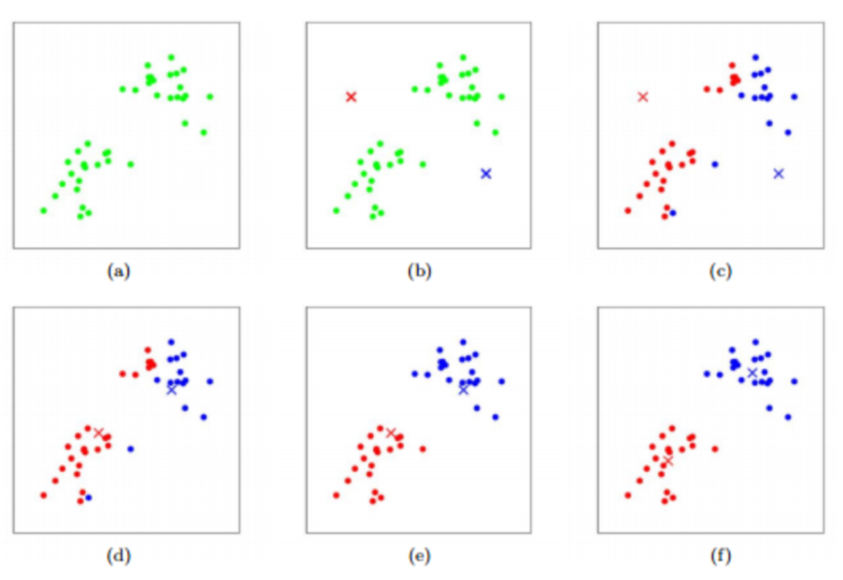
    


```python
# KMeans Clustering 
clust = mt.FeatureCluster_KMeans(X_train,400,init='k-means++',algorithm='auto')
clust_info = clust.set_cluster()
```

    
     Cluster 0 ['ATSC5s'] 
     Cluster 1 ['ATS4d', 'ATS4se', 'ATS4pe', 'ATS4are', 'ATS4i'] 
     Cluster 2 ['ATS3Z', 'ATS4Z', 'ATS3m', 'ATS4m'] 
     Cluster 3 ['ATSC8s'] 
     Cluster 4 ['VR1_A', 'VR2_A', 'C4SP3', 'Xch-4d', 'Xch-5d', 'Xch-4dv', 'Xch-5dv'] 
     Cluster 5 ['nO', 'SMR_VSA1', 'MID_O'] 
     Cluster 6 ['piPC2', 'piPC3', 'piPC4', 'piPC5', 'piPC6', 'TpiPC10'] 
     Cluster 7 ['VE2_A', 'VE2_DzZ', 'VE2_Dzm', 'VE2_Dzv', 'VE2_Dzse', 'VE2_Dzpe', 'VE2_Dzare', 'VE2_Dzp', 'VE2_Dzi', 'VE2_D'] 
     Cluster 8 ['AATS1Z', 'AATS1m', 'MZ', 'Mm', 'AMW'] 
     Cluster 9 ['SpAbs_DzZ', 'SpMax_DzZ', 'SpDiam_DzZ', 'SpAD_DzZ', 'LogEE_DzZ', 'SpAbs_Dzm', 'SpMax_Dzm', 'SpDiam_Dzm', 'SpAD_Dzm', 'LogEE_Dzm', 'SpAbs_D', 'SpMax_D', 'SpDiam_D', 'SpAD_D', 'LogEE_D', 'ECIndex', 'WPath'] 
     Cluster 10 ['nBridgehead', 'C3SP3', 'Xch-7dv'] 
     Cluster 11 ['LogEE_A', 'VE1_A', 'VE3_A', 'VE3_DzZ', 'VR3_DzZ', 'VE3_Dzm', 'VR3_Dzm', 'VE3_Dzv', 'VR3_Dzv', 'VE3_Dzse', 'VR3_Dzse', 'VE3_Dzpe', 'VR3_Dzpe', 'VE3_Dzare', 'VR3_Dzare', 'VE3_Dzp', 'VR3_Dzp', 'VE3_Dzi', 'VR3_Dzi', 'VE3_D', 'VR3_D', 'piPC1', 'VAdjMat', 'MWC02', 'SRW02'] 
     Cluster 12 ['MATS1se', 'MATS1pe', 'MATS1are'] 
     Cluster 13 ['AATS0i', 'AATS1i', 'Mi'] 
     Cluster 14 ['ETA_epsilon_2', 'ETA_epsilon_5'] 
     Cluster 15 ['AATSC2Z', 'AATSC2m'] 
     Cluster 16 ['n10FRing', 'n10FaRing'] 
     Cluster 17 ['nN', 'MID_N'] 
     Cluster 18 ['CIC2'] 
     Cluster 19 ['MIC2', 'MIC3', 'MIC4', 'MIC5'] 
     Cluster 20 ['SMR_VSA5', 'SlogP_VSA5'] 
     Cluster 21 ['NtsC', 'StsC'] 
     Cluster 22 ['naHRing'] 
     Cluster 23 ['C2SP2', 'SMR_VSA7'] 
     Cluster 24 ['NdssS', 'n7Ring', 'n7HRing', 'n7ARing', 'n7AHRing', 'n12FRing', 'n12FHRing', 'n12FARing', 'n12FAHRing'] 
     Cluster 25 ['SM1_Dzv', 'SM1_Dzp'] 
     Cluster 26 ['NaaO', 'SaaO'] 
     Cluster 27 ['ATSC6Z', 'ATSC6m'] 
     Cluster 28 ['ATSC4se', 'ATSC4pe', 'ATSC4are'] 
     Cluster 29 ['NaasN', 'SaasN'] 
     Cluster 30 ['ATSC0p'] 
     Cluster 31 ['ATSC5v', 'ATSC5p'] 
     Cluster 32 ['AATS0s', 'AATS2s', 'AATSC0s'] 
     Cluster 33 ['NaaaC', 'SaaaC', 'nFaRing'] 
     Cluster 34 ['IC3', 'IC4', 'IC5'] 
     Cluster 35 ['ATSC3pe', 'ATSC3are'] 
     Cluster 36 ['NdsN', 'SdsN'] 
     Cluster 37 ['ATSC2v', 'ATSC2p'] 
     Cluster 38 ['n9FRing', 'n9FHRing'] 
     Cluster 39 ['ATS0v', 'ATS1v', 'ATS4v', 'ATS0p', 'ATS1p', 'ATS2p', 'ATS3p', 'ATS4p', 'Xp-1dv', 'Sv', 'Sp', 'ETA_alpha', 'VMcGowan', 'apol', 'SMR'] 
     Cluster 40 ['ATSC7se', 'ATSC7pe', 'ATSC7are'] 
     Cluster 41 ['MATS2s'] 
     Cluster 42 ['NsNH2', 'SsNH2', 'VSA_EState4'] 
     Cluster 43 ['NsOH', 'SsOH'] 
     Cluster 44 ['BCUTdv-1l'] 
     Cluster 45 ['AATS1pe', 'AATS0are', 'AATS1are', 'AATS2are', 'Mare'] 
     Cluster 46 ['GATS1Z', 'GATS1m'] 
     Cluster 47 ['ATSC5se', 'ATSC5pe', 'ATSC5are'] 
     Cluster 48 ['SIC3', 'SIC4', 'SIC5', 'BIC3', 'BIC4', 'BIC5'] 
     Cluster 49 ['SIC1', 'BIC1'] 
     Cluster 50 ['SM1_DzZ', 'SM1_Dzm'] 
     Cluster 51 ['ATSC6dv'] 
     Cluster 52 ['nF', 'NsF', 'SsF'] 
     Cluster 53 ['ATSC8v'] 
     Cluster 54 ['ATSC3v'] 
     Cluster 55 ['AXp-0dv', 'AXp-1dv'] 
     Cluster 56 ['AATSC1i', 'MATS1i'] 
     Cluster 57 ['nP', 'NdsssP'] 
     Cluster 58 ['GATS2Z', 'GATS2m'] 
     Cluster 59 ['BCUTpe-1l', 'BCUTare-1l'] 
     Cluster 60 ['NdsCH', 'SdsCH'] 
     Cluster 61 ['TopoShapeIndex', 'PetitjeanIndex'] 
     Cluster 62 ['NsSH', 'SsSH'] 
     Cluster 63 ['n9FaRing', 'n9FaHRing'] 
     Cluster 64 ['nX', 'MID_X'] 
     Cluster 65 ['nBr', 'NsBr', 'SsBr', 'ETA_dPsi_B'] 
     Cluster 66 ['NaaNH', 'SaaNH'] 
     Cluster 67 ['ATSC6se', 'ATSC6pe', 'ATSC6are'] 
     Cluster 68 ['MATS1Z', 'MATS1m'] 
     Cluster 69 ['GATS2se', 'GATS2pe', 'GATS2are'] 
     Cluster 70 ['n5aRing'] 
     Cluster 71 ['ATS6d', 'ATS6v', 'ATS7v', 'ATS6p', 'ATS7p'] 
     Cluster 72 ['ATSC0Z', 'ATSC0m'] 
     Cluster 73 ['Xch-3d', 'Xch-3dv', 'n3Ring', 'n3ARing', 'SRW03'] 
     Cluster 74 ['ATSC2se', 'ATSC2pe', 'ATSC2are'] 
     Cluster 75 ['GATS1se', 'GATS1pe', 'GATS1are'] 
     Cluster 76 ['AATS0v', 'AATS1v', 'AATS2v', 'Mv'] 
     Cluster 77 ['NdCH2', 'SdCH2'] 
     Cluster 78 ['nI', 'C2SP1', 'NsI', 'SsI'] 
     Cluster 79 ['n9FARing', 'n9FAHRing'] 
     Cluster 80 ['SssssC'] 
     Cluster 81 ['nARing'] 
     Cluster 82 ['SM1_Dzse', 'SM1_Dzpe'] 
     Cluster 83 ['NaaN', 'SaaN'] 
     Cluster 84 ['AETA_eta_B', 'AETA_eta_BR', 'JGI1'] 
     Cluster 85 ['SRW05', 'SRW07', 'SRW09'] 
     Cluster 86 ['Xc-6d', 'Xc-5dv', 'Xc-6dv', 'NssssC'] 
     Cluster 87 ['ATSC4p'] 
     Cluster 88 ['C1SP2'] 
     Cluster 89 ['SpMax_A', 'SpDiam_A', 'MWC03', 'MWC04', 'MWC05', 'MWC06', 'MWC07', 'MWC08', 'MWC09', 'MWC10', 'SRW04', 'SRW06', 'SRW08', 'SRW10'] 
     Cluster 90 ['SlogP_VSA2'] 
     Cluster 91 ['NssNH', 'SssNH'] 
     Cluster 92 ['AATSC1dv', 'MATS1dv'] 
     Cluster 93 ['SpAbs_A', 'SpAD_A', 'nHeavyAtom', 'ATS0d', 'VR1_DzZ', 'VR1_Dzm', 'VR1_Dzv', 'VR1_Dzse', 'VR1_Dzpe', 'VR1_Dzare', 'VR1_Dzp', 'VR1_Dzi', 'nBondsO', 'Xp-0d', 'Xp-1d', 'Xp-2d', 'VR1_D', 'ETA_beta_s', 'ETA_eta_R', 'ETA_eta_RL', 'MID', 'MWC01'] 
     Cluster 94 ['MPC8', 'MPC9', 'MPC10'] 
     Cluster 95 ['ATS1Z', 'ATS1m', 'Xp-0dv', 'SZ', 'Sm', 'ZMIC0', 'LabuteASA', 'MW'] 
     Cluster 96 ['ATSC2c'] 
     Cluster 97 ['Xp-5d', 'Xp-6d', 'Xp-7d', 'MPC4', 'MPC5'] 
     Cluster 98 ['AETA_eta_RL'] 
     Cluster 99 ['BCUTi-1l'] 
     Cluster 100 ['AETA_beta', 'AETA_beta_ns', 'AETA_eta_FL', 'AETA_dBeta'] 
     Cluster 101 ['BCUTZ-1l', 'BCUTm-1l', 'BCUTse-1l'] 
     Cluster 102 ['AATS0dv', 'AATS1dv', 'AATS2dv'] 
     Cluster 103 ['ATSC2i', 'AATSC2i', 'MATS2i'] 
     Cluster 104 ['NssS', 'SssS'] 
     Cluster 105 ['ATSC0c'] 
     Cluster 106 ['NaaS', 'SaaS'] 
     Cluster 107 ['n10FHRing', 'n10FaHRing'] 
     Cluster 108 ['NsssN', 'SsssN'] 
     Cluster 109 ['AATSC2se', 'AATSC2pe', 'AATSC2are'] 
     Cluster 110 ['NddC', 'SddC'] 
     Cluster 111 ['BCUTv-1l', 'BCUTp-1l'] 
     Cluster 112 ['nBase'] 
     Cluster 113 ['ATSC7Z', 'ATSC7m'] 
     Cluster 114 ['ATSC1se', 'ATSC1pe', 'ATSC1are'] 
     Cluster 115 ['ATS0s', 'ATSC0s', 'EState_VSA10'] 
     Cluster 116 ['SlogP_VSA7'] 
     Cluster 117 ['NdS', 'SdS'] 
     Cluster 118 ['EState_VSA8'] 
     Cluster 119 ['nG12FRing', 'nG12FHRing'] 
     Cluster 120 ['EState_VSA7'] 
     Cluster 121 ['GGI9', 'GGI10'] 
     Cluster 122 ['SlogP_VSA11'] 
     Cluster 123 ['BCUTare-1h'] 
     Cluster 124 ['Xp-5dv', 'Xp-6dv', 'Xp-7dv'] 
     Cluster 125 ['NssCH2', 'SssCH2'] 
     Cluster 126 ['ATSC5Z', 'ATSC5m'] 
     Cluster 127 ['ATSC1s'] 
     Cluster 128 ['nAtom', 'ATS0se', 'ATS1se', 'ATS2se', 'ATS3se', 'ATS0pe', 'ATS1pe', 'ATS2pe', 'ATS3pe', 'ATS0are', 'ATS1are', 'ATS2are', 'ATS3are', 'ATS0i', 'ATS1i', 'ATS2i', 'ATS3i', 'ATSC0v', 'nBonds', 'nBondsKS', 'Sse', 'Spe', 'Sare', 'Si', 'TIC0'] 
     Cluster 129 ['EState_VSA5'] 
     Cluster 130 ['PEOE_VSA5'] 
     Cluster 131 ['AMID_C'] 
     Cluster 132 ['ETA_dEpsilon_D'] 
     Cluster 133 ['VSA_EState5'] 
     Cluster 134 ['C1SP3'] 
     Cluster 135 ['ZMIC3', 'ZMIC4', 'ZMIC5'] 
     Cluster 136 ['ATSC4d'] 
     Cluster 137 ['ATSC3Z', 'ATSC3m'] 
     Cluster 138 ['ATSC1p', 'AATSC1p'] 
     Cluster 139 ['CIC3', 'CIC4', 'CIC5'] 
     Cluster 140 ['ATSC6p'] 
     Cluster 141 ['SsssCH'] 
     Cluster 142 ['ATSC7c'] 
     Cluster 143 ['PEOE_VSA8'] 
     Cluster 144 ['SlogP_VSA3'] 
     Cluster 145 ['ATSC2Z', 'ATSC2m'] 
     Cluster 146 ['PEOE_VSA4'] 
     Cluster 147 ['GATS2v', 'GATS2p'] 
     Cluster 148 ['AATSC1c'] 
     Cluster 149 ['n6ARing'] 
     Cluster 150 ['AATSC1Z', 'AATSC1m'] 
     Cluster 151 ['ATSC8d'] 
     Cluster 152 ['ATSC5c'] 
     Cluster 153 ['SdssS'] 
     Cluster 154 ['ATSC3dv'] 
     Cluster 155 ['EState_VSA3'] 
     Cluster 156 ['ATS1s', 'ATS2s', 'ATS3s', 'ATS4s', 'ATS5s', 'ATSC0dv'] 
     Cluster 157 ['Xc-3dv'] 
     Cluster 158 ['NdO', 'SdO', 'VSA_EState2'] 
     Cluster 159 ['ATSC2s', 'AATSC2s'] 
     Cluster 160 ['nAromAtom', 'nAromBond', 'nBondsA', 'nBondsM', 'n6Ring', 'naRing', 'n6aRing'] 
     Cluster 161 ['ATSC2d'] 
     Cluster 162 ['NdssC'] 
     Cluster 163 ['JGI2'] 
     Cluster 164 ['AATSC0v'] 
     Cluster 165 ['GATS1v', 'GATS1p'] 
     Cluster 166 ['AATS0se', 'AATS1se', 'AATS2se', 'AATS0pe', 'AATS2pe', 'Mse', 'Mpe', 'ETA_epsilon_1', 'ETA_epsilon_4', 'ETA_dEpsilon_A'] 
     Cluster 167 ['SIC0', 'BIC0'] 
     Cluster 168 ['EState_VSA4'] 
     Cluster 169 ['AATSC0p'] 
     Cluster 170 ['ATSC3c'] 
     Cluster 171 ['nBondsT', 'NtN', 'StN', 'SMR_VSA2'] 
     Cluster 172 ['SdssC'] 
     Cluster 173 ['AXp-0d', 'ETA_shape_p'] 
     Cluster 174 ['nG12FaHRing'] 
     Cluster 175 ['JGI5'] 
     Cluster 176 ['PEOE_VSA11'] 
     Cluster 177 ['ATSC8i'] 
     Cluster 178 ['AATSC0Z', 'AATSC0m'] 
     Cluster 179 ['MIC0', 'MIC1'] 
     Cluster 180 ['ATSC8Z', 'ATSC8m'] 
     Cluster 181 ['GATS2i'] 
     Cluster 182 ['Xpc-4d', 'GGI2'] 
     Cluster 183 ['RPCG'] 
     Cluster 184 ['BCUTs-1l'] 
     Cluster 185 ['ATSC1v'] 
     Cluster 186 ['ATSC7p'] 
     Cluster 187 ['nFARing', 'nFAHRing'] 
     Cluster 188 ['AATSC0i'] 
     Cluster 189 ['BCUTd-1l'] 
     Cluster 190 ['ATSC3d'] 
     Cluster 191 ['piPC9'] 
     Cluster 192 ['ETA_dPsi_A'] 
     Cluster 193 ['SaasC'] 
     Cluster 194 ['NddsN'] 
     Cluster 195 ['NsssCH'] 
     Cluster 196 ['JGI7'] 
     Cluster 197 ['PEOE_VSA3'] 
     Cluster 198 ['PEOE_VSA6'] 
     Cluster 199 ['ATSC0se', 'ATSC0pe', 'ATSC0are'] 
     Cluster 200 ['ATS8Z', 'ATS8m', 'GGI7'] 
     Cluster 201 ['SIC2', 'BIC2'] 
     Cluster 202 ['nBondsKD', 'ETA_beta', 'ETA_beta_ns', 'ETA_eta_F', 'AETA_eta_F', 'ETA_eta_FL'] 
     Cluster 203 ['NsCH3', 'SsCH3'] 
     Cluster 204 ['GATS1c'] 
     Cluster 205 ['AATSC2v', 'AATSC2p', 'MATS2v', 'MATS2p'] 
     Cluster 206 ['SddssS'] 
     Cluster 207 ['ETA_shape_x'] 
     Cluster 208 ['JGI4'] 
     Cluster 209 ['JGI8'] 
     Cluster 210 ['MATS2Z', 'MATS2m'] 
     Cluster 211 ['BalabanJ'] 
     Cluster 212 ['RNCG'] 
     Cluster 213 ['PEOE_VSA12'] 
     Cluster 214 ['SMR_VSA3'] 
     Cluster 215 ['n5AHRing'] 
     Cluster 216 ['FilterItLogS'] 
     Cluster 217 ['EState_VSA2'] 
     Cluster 218 ['ATSC2dv', 'AATSC2dv', 'MATS2dv'] 
     Cluster 219 ['VSA_EState9'] 
     Cluster 220 ['BCUTZ-1h', 'BCUTm-1h'] 
     Cluster 221 ['Xc-3d', 'ETA_eta_B', 'ETA_eta_BR', 'GGI1', 'mZagreb1'] 
     Cluster 222 ['n6HRing', 'n6aHRing'] 
     Cluster 223 ['nFHRing'] 
     Cluster 224 ['AATSC1d'] 
     Cluster 225 ['MATS1s'] 
     Cluster 226 ['ATSC4i'] 
     Cluster 227 ['SlogP_VSA10'] 
     Cluster 228 ['nRot'] 
     Cluster 229 ['ATSC5d'] 
     Cluster 230 ['ATS0dv', 'ATS1dv', 'ATS2dv', 'ATS3dv', 'ATS4dv', 'ATS5dv', 'GGI5'] 
     Cluster 231 ['JGI3'] 
     Cluster 232 ['PEOE_VSA9'] 
     Cluster 233 ['BCUTi-1h'] 
     Cluster 234 ['ETA_beta_ns_d', 'AETA_beta_ns_d'] 
     Cluster 235 ['ATSC4Z', 'ATSC4m'] 
     Cluster 236 ['PEOE_VSA1'] 
     Cluster 237 ['PEOE_VSA10'] 
     Cluster 238 ['nHBAcc', 'TopoPSA'] 
     Cluster 239 ['AATSC0c'] 
     Cluster 240 ['ETA_dAlpha_B'] 
     Cluster 241 ['ATSC1Z', 'ATSC1m'] 
     Cluster 242 ['AATS0d', 'AATS1d', 'AATS2d'] 
     Cluster 243 ['SlogP_VSA8'] 
     Cluster 244 ['ATSC7v'] 
     Cluster 245 ['nG12FARing', 'nG12FAHRing'] 
     Cluster 246 ['AMID_X'] 
     Cluster 247 ['GATS2c'] 
     Cluster 248 ['ATSC8dv', 'ATSC8se', 'ATSC8pe', 'ATSC8are'] 
     Cluster 249 ['ATS5Z', 'ATS6Z', 'ATS5m', 'ATS6m'] 
     Cluster 250 ['EState_VSA1'] 
     Cluster 251 ['ATSC6c'] 
     Cluster 252 ['EState_VSA6'] 
     Cluster 253 ['NssO', 'SssO'] 
     Cluster 254 ['ATSC4c'] 
     Cluster 255 ['SdsssP'] 
     Cluster 256 ['AATS2Z', 'AATS2m'] 
     Cluster 257 ['ATSC3s'] 
     Cluster 258 ['VSA_EState7'] 
     Cluster 259 ['Xch-6d', 'Xch-7d', 'Xch-6dv'] 
     Cluster 260 ['SddsN'] 
     Cluster 261 ['NddssS'] 
     Cluster 262 ['PEOE_VSA7'] 
     Cluster 263 ['ATS5d', 'ATS5v', 'ATS5se', 'ATS5pe', 'ATS5are', 'ATS5p', 'ATS5i'] 
     Cluster 264 ['C3SP2'] 
     Cluster 265 ['JGI6'] 
     Cluster 266 ['SlogP_VSA1'] 
     Cluster 267 ['ATSC7i'] 
     Cluster 268 ['nH', 'nBondsS', 'bpol'] 
     Cluster 269 ['ATS2Z', 'ATS2m'] 
     Cluster 270 ['Xpc-4dv', 'Xpc-5dv', 'Xpc-6dv'] 
     Cluster 271 ['ATSC7d'] 
     Cluster 272 ['SMR_VSA9'] 
     Cluster 273 ['ATSC6i'] 
     Cluster 274 ['n3HRing', 'n3AHRing'] 
     Cluster 275 ['ATSC6d'] 
     Cluster 276 ['ATS0Z', 'ATS0m'] 
     Cluster 277 ['AATS2i', 'GATS1i'] 
     Cluster 278 ['ATSC1i'] 
     Cluster 279 ['ATSC3i'] 
     Cluster 280 ['ETA_epsilon_3', 'AMID', 'nRing'] 
     Cluster 281 ['AMID_N'] 
     Cluster 282 ['ATSC4dv'] 
     Cluster 283 ['GATS2s'] 
     Cluster 284 ['SMR_VSA4'] 
     Cluster 285 ['ATSC4s'] 
     Cluster 286 ['n5HRing'] 
     Cluster 287 ['BCUTd-1h'] 
     Cluster 288 ['AETA_eta'] 
     Cluster 289 ['GATS1s'] 
     Cluster 290 ['GATS2dv'] 
     Cluster 291 ['VSA_EState3'] 
     Cluster 292 ['ETA_shape_y'] 
     Cluster 293 ['SLogP'] 
     Cluster 294 ['SpMAD_DzZ', 'SpMAD_Dzm'] 
     Cluster 295 ['JGI9'] 
     Cluster 296 ['BCUTv-1h', 'BCUTp-1h'] 
     Cluster 297 ['MATS1v', 'MATS1p'] 
     Cluster 298 ['nBondsD'] 
     Cluster 299 ['AATS0p', 'AATS1p', 'AATS2p', 'Mp'] 
     Cluster 300 ['SlogP_VSA4'] 
     Cluster 301 ['IC1', 'IC2'] 
     Cluster 302 ['MATS2c'] 
     Cluster 303 ['BCUTc-1h'] 
     Cluster 304 ['NaasC'] 
     Cluster 305 ['C1SP1'] 
     Cluster 306 ['SpMAD_Dzv', 'SpMAD_Dzse', 'SpMAD_Dzpe', 'SpMAD_Dzare', 'SpMAD_Dzi'] 
     Cluster 307 ['AATSC1se', 'AATSC1pe', 'AATSC1are'] 
     Cluster 308 ['n6AHRing'] 
     Cluster 309 ['Xp-2dv', 'Xp-3dv', 'Xp-4dv'] 
     Cluster 310 ['ATSC1dv'] 
     Cluster 311 ['VR3_A', 'VE1_DzZ', 'VR2_DzZ', 'VE1_Dzm', 'VR2_Dzm', 'VE1_Dzv', 'VR2_Dzv', 'VE1_Dzse', 'VR2_Dzse', 'VE1_Dzpe', 'VR2_Dzpe', 'VE1_Dzare', 'VR2_Dzare', 'VE1_Dzp', 'VR2_Dzp', 'VE1_Dzi', 'VR2_Dzi', 'VE1_D', 'VR2_D', 'AETA_eta_R', 'TMWC10'] 
     Cluster 312 ['nAHRing'] 
     Cluster 313 ['RotRatio'] 
     Cluster 314 ['AATSC0dv', 'BCUTdv-1h'] 
     Cluster 315 ['ATSC5i'] 
     Cluster 316 ['ETA_psi_1'] 
     Cluster 317 ['NaaCH', 'SaaCH', 'SlogP_VSA6', 'VSA_EState6'] 
     Cluster 318 ['ATSC7dv'] 
     Cluster 319 ['AATSC2d'] 
     Cluster 320 ['ATS7dv', 'ATS8dv', 'GGI8'] 
     Cluster 321 ['Xc-4d', 'Xc-4dv'] 
     Cluster 322 ['MATS1c'] 
     Cluster 323 ['ATSC1c'] 
     Cluster 324 ['ATSC3p'] 
     Cluster 325 ['ETA_dEpsilon_B'] 
     Cluster 326 ['VSA_EState1'] 
     Cluster 327 ['nFaHRing'] 
     Cluster 328 ['GATS1dv'] 
     Cluster 329 ['AATS1s'] 
     Cluster 330 ['ZMIC1', 'ZMIC2'] 
     Cluster 331 ['SpMAD_A'] 
     Cluster 332 ['AETA_beta_s'] 
     Cluster 333 ['BCUTc-1l'] 
     Cluster 334 ['AMID_h'] 
     Cluster 335 ['PEOE_VSA13'] 
     Cluster 336 ['BCUTse-1h', 'BCUTpe-1h'] 
     Cluster 337 ['nHBDon'] 
     Cluster 338 ['C2SP3'] 
     Cluster 339 ['MATS2se', 'MATS2pe', 'MATS2are'] 
     Cluster 340 ['fragCpx', 'MPC6', 'MPC7', 'TMPC10'] 
     Cluster 341 ['ATSC8c'] 
     Cluster 342 ['nFRing'] 
     Cluster 343 ['SMR_VSA6'] 
     Cluster 344 ['TopoPSA(NO)'] 
     Cluster 345 ['ETA_dEpsilon_C'] 
     Cluster 346 ['AATSC1s'] 
     Cluster 347 ['ATS7d', 'ATS8d', 'ATS8s', 'ATS8v', 'ATS8se', 'ATS8pe', 'ATS8are', 'ATS8p', 'ATS8i'] 
     Cluster 348 ['AATSC0are', 'AMID_O'] 
     Cluster 349 ['ATS1d', 'ATS2d', 'ATS3d', 'ATS2v', 'ATS3v', 'ATSC0d', 'BertzCT', 'Xp-3d', 'Xp-4d', 'MPC2', 'MPC3', 'TSRW10', 'WPol', 'Zagreb1', 'Zagreb2'] 
     Cluster 350 ['IC0'] 
     Cluster 351 ['AATSC0d'] 
     Cluster 352 ['nC', 'MID_C'] 
     Cluster 353 ['ATSC3se'] 
     Cluster 354 ['FCSP3'] 
     Cluster 355 ['TIC1', 'TIC2', 'TIC3', 'TIC4', 'TIC5'] 
     Cluster 356 ['AATSC0se', 'AATSC0pe'] 
     Cluster 357 ['nHRing'] 
     Cluster 358 ['n5Ring', 'n5ARing'] 
     Cluster 359 ['SpAbs_Dzv', 'SpMax_Dzv', 'SpDiam_Dzv', 'SpAD_Dzv', 'LogEE_Dzv', 'SpAbs_Dzp', 'SpMax_Dzp', 'SpDiam_Dzp', 'SpAD_Dzp', 'SpMAD_Dzp', 'LogEE_Dzp'] 
     Cluster 360 ['nG12FaRing'] 
     Cluster 361 ['AXp-1d'] 
     Cluster 362 ['ATSC6s'] 
     Cluster 363 ['nS'] 
     Cluster 364 ['ATS6se', 'ATS6pe', 'ATS6are', 'ATS6i'] 
     Cluster 365 ['AATS0Z', 'AATS0m'] 
     Cluster 366 ['ATSC5dv'] 
     Cluster 367 ['ETA_dBeta'] 
     Cluster 368 ['ATSC7s'] 
     Cluster 369 ['VSA_EState8'] 
     Cluster 370 ['n5aHRing'] 
     Cluster 371 ['CIC0'] 
     Cluster 372 ['AATSC2c'] 
     Cluster 373 ['ETA_eta', 'ETA_eta_L'] 
     Cluster 374 ['AETA_eta_L'] 
     Cluster 375 ['ATS6dv', 'ATS6s'] 
     Cluster 376 ['JGT10'] 
     Cluster 377 ['CIC1'] 
     Cluster 378 ['piPC7', 'piPC8'] 
     Cluster 379 ['AATSC1v'] 
     Cluster 380 ['AETA_alpha', 'ETA_dAlpha_A'] 
     Cluster 381 ['ATSC4v'] 
     Cluster 382 ['Xc-5d', 'Xpc-5d', 'Xpc-6d', 'GGI3'] 
     Cluster 383 ['ATS7s', 'ATS7se', 'ATS7pe', 'ATS7are', 'ATS7i'] 
     Cluster 384 ['JGI10'] 
     Cluster 385 ['nCl', 'NsCl', 'SsCl', 'EState_VSA9'] 
     Cluster 386 ['ATSC8p'] 
     Cluster 387 ['fMF'] 
     Cluster 388 ['ATS7Z', 'ATS7m', 'GGI6'] 
     Cluster 389 ['ATSC1d'] 
     Cluster 390 ['piPC10'] 
     Cluster 391 ['nHetero', 'MID_h'] 
     Cluster 392 ['SpAbs_Dzse', 'SpMax_Dzse', 'SpDiam_Dzse', 'SpAD_Dzse', 'LogEE_Dzse', 'SpAbs_Dzpe', 'SpMax_Dzpe', 'SpDiam_Dzpe', 'SpAD_Dzpe', 'LogEE_Dzpe', 'SpAbs_Dzare', 'SpMax_Dzare', 'SpDiam_Dzare', 'SpAD_Dzare', 'LogEE_Dzare', 'SpAbs_Dzi', 'SpMax_Dzi', 'SpDiam_Dzi', 'SpAD_Dzi', 'LogEE_Dzi'] 
     Cluster 393 ['SpMAD_D', 'Kier1', 'Diameter', 'Radius', 'mZagreb2'] 
     Cluster 394 ['BCUTs-1h'] 
     Cluster 395 ['PEOE_VSA2'] 
     Cluster 396 ['ATSC6v'] 
     Cluster 397 ['ATSC0i'] 
     Cluster 398 ['GGI4'] 
     Cluster 399 ['SM1_Dzare', 'SM1_Dzi'] 
    
    Cluster info file qdb1_F_s_kmeans.cluster file saved


```python
# Evaluating clustered results
clust.cluster_dist()
```


    
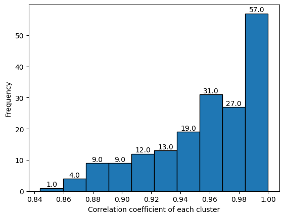
    


    interactive(children=(ToggleButtons(description='Bins Index', options=(0, 1, 2, 3, 4, 5, 6, 7, 8, 9), value=0)…


```python
clust.model_evaluation()
## Silhouette Score에 계산에 해당하는 Nearest Cluster 확인하는 방법 찾아볼 것. (아직 진행하지 못함)
```

    silhouette average score : 0.584343
    silhouette socre group by 
     Cluster
    0      0.000000
    1      0.794959
    2      0.711150
    3      0.000000
    4      0.604672
             ...   
    395    0.000000
    396    0.000000
    397    0.000000
    398    0.000000
    399    0.609406
    Name: silhouette_coeff, Length: 400, dtype: float64
    
    
    overlapped Cluseter Num :  [0, 3, 18, 22, 30, 41, 44, 51, 53, 54, 70, 80, 81, 87, 88, 90, 96, 98, 99, 105, 112, 116, 118, 120, 122, 123, 127, 129, 130, 131, 132, 133, 134, 136, 140, 141, 142, 143, 144, 146, 148, 149, 151, 152, 153, 154, 155, 157, 161, 162, 163, 164, 168, 169, 170, 172, 174, 175, 176, 177, 181, 183, 184, 185, 186, 188, 189, 190, 191, 192, 193, 194, 195, 196, 197, 198, 204, 206, 207, 208, 209, 211, 212, 213, 214, 215, 216, 217, 219, 223, 224, 225, 226, 227, 228, 229, 231, 232, 233, 236, 237, 239, 240, 243, 244, 246, 247, 250, 251, 252, 254, 255, 257, 258, 260, 261, 262, 264, 265, 266, 267, 271, 272, 273, 275, 278, 279, 281, 282, 283, 284, 285, 286, 287, 288, 289, 290, 291, 292, 293, 295, 298, 300, 302, 303, 304, 305, 308, 310, 312, 313, 315, 316, 318, 319, 322, 323, 324, 325, 326, 327, 328, 329, 331, 332, 333, 334, 335, 337, 338, 341, 342, 343, 344, 345, 346, 350, 351, 353, 354, 357, 360, 361, 362, 363, 366, 367, 368, 369, 370, 371, 372, 374, 376, 377, 379, 381, 384, 386, 387, 389, 390, 394, 395, 396, 397, 398]
    wrong/incorrect Cluster Num :  []
    
    
    kmeans.eval file saved


    
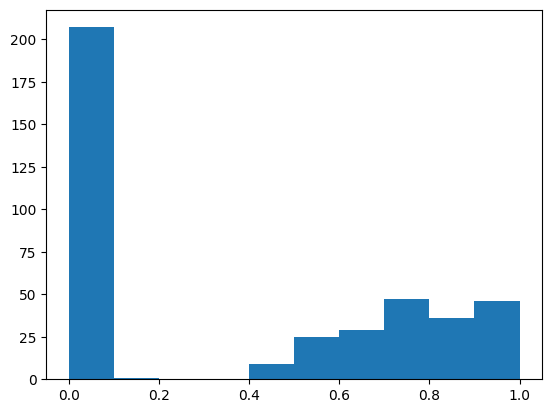
    


<h2> 2.2-2. S.O.M (Caution : Takes long time)</h2>
<h3> mt.FeatureCluster_Minisom(train_data, error, random_seed, train,neighborhood_function, topology) : Apply S.O.M Class </h3>

    * data = Train Data
    * Error = (default) qe, te
    * random_seed = (default) 0
    * train = time to init, (default) 1000
    * neighborhood_function = function weight neightborhookd of a position in mpa
        Possible : (default) 'gaussian', 'mexican_hat', 'bubble', 'triangle'
    * topology = (default) 'hexagonal', 'rectangular'
        - Error te can't use hexagonal topology
    
    Parameter_Combine(min_size,max_size) = expect #cluster n x n in range(min_size to max_size)
    
    set_cluster(map_n,sigma,lr,init) = get cluster value as array
        * map_n : map size
        * sigma
        * lr : initial learning_rate
        * init : metohd of initai weight
            Possible : 'pca', 'random'


```python
dt.man('som.png')
```


    
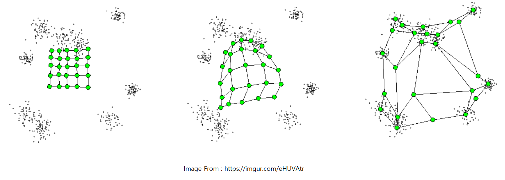
    


```python
# S.O.M의 경우 args에 따라서 cluster의 개수가 다양하기 때문에, 해당 부분을 미리 확인해보는 단계
clust = mt.FeatureCluster_Minisom(X_train)
clust.parameter_combine(18,19)
```

    시작시간: 2026-05-07 10:42:26.405380 
    


    /home/jun/pyqsar/pyqsar3r25/pyqsar/minisom.py:477: RuntimeWarning: invalid value encountered in sqrt
      return sqrt(-2 * cross_term + input_data_sq + weights_flat_sq.T)


    
    종료시간: 2026-05-07 10:43:20.050035 
    총 소요시간: 0 days 00:00:53.644655


<div>
<style scoped>
    .dataframe tbody tr th:only-of-type {
        vertical-align: middle;
    }

    .dataframe tbody tr th {
        vertical-align: top;
    }

    .dataframe thead th {
        text-align: right;
    }
</style>
<table border="1" class="dataframe">
  <thead>
    <tr style="text-align: right;">
      <th></th>
      <th>map_size</th>
      <th>sigma</th>
      <th>learning_rate</th>
      <th>init_method</th>
      <th>qe</th>
      <th>n_cluster</th>
    </tr>
  </thead>
  <tbody>
    <tr>
      <th>0</th>
      <td>18x18</td>
      <td>0.1</td>
      <td>0.9</td>
      <td>random_init</td>
      <td>3.243813</td>
      <td>317</td>
    </tr>
    <tr>
      <th>1</th>
      <td>18x18</td>
      <td>0.2</td>
      <td>0.9</td>
      <td>random_init</td>
      <td>3.243814</td>
      <td>317</td>
    </tr>
    <tr>
      <th>2</th>
      <td>18x18</td>
      <td>0.3</td>
      <td>0.9</td>
      <td>random_init</td>
      <td>3.244328</td>
      <td>315</td>
    </tr>
    <tr>
      <th>3</th>
      <td>18x18</td>
      <td>0.4</td>
      <td>0.9</td>
      <td>random_init</td>
      <td>3.256003</td>
      <td>303</td>
    </tr>
    <tr>
      <th>4</th>
      <td>18x18</td>
      <td>0.1</td>
      <td>0.8</td>
      <td>random_init</td>
      <td>3.266577</td>
      <td>317</td>
    </tr>
    <tr>
      <th>...</th>
      <td>...</td>
      <td>...</td>
      <td>...</td>
      <td>...</td>
      <td>...</td>
      <td>...</td>
    </tr>
    <tr>
      <th>175</th>
      <td>18x18</td>
      <td>0.3</td>
      <td>0.1</td>
      <td>random_init</td>
      <td>8.901528</td>
      <td>26</td>
    </tr>
    <tr>
      <th>176</th>
      <td>18x18</td>
      <td>0.2</td>
      <td>0.1</td>
      <td>random_init</td>
      <td>8.901602</td>
      <td>26</td>
    </tr>
    <tr>
      <th>177</th>
      <td>18x18</td>
      <td>0.1</td>
      <td>0.1</td>
      <td>random_init</td>
      <td>8.901602</td>
      <td>26</td>
    </tr>
    <tr>
      <th>178</th>
      <td>18x18</td>
      <td>0.4</td>
      <td>0.1</td>
      <td>random_init</td>
      <td>8.918685</td>
      <td>26</td>
    </tr>
    <tr>
      <th>179</th>
      <td>18x18</td>
      <td>0.5</td>
      <td>0.1</td>
      <td>random_init</td>
      <td>8.924816</td>
      <td>27</td>
    </tr>
  </tbody>
</table>
<p>180 rows × 6 columns</p>
</div>


```python
# SOM Clustering 
clust_info = clust.set_cluster(map_n=18,sigma=0.1,lr=0.9,init='random')
```

    /home/jun/pyqsar/pyqsar3r25/pyqsar/minisom.py:477: RuntimeWarning: invalid value encountered in sqrt
      return sqrt(-2 * cross_term + input_data_sq + weights_flat_sq.T)


    Quantization Error : 3.243813384760734
    
     Cluster 0 ['JGI3'] 
     Cluster 1 ['Xp-2d', 'Xp-3d', 'Xp-4d', 'MPC2', 'Zagreb1', 'Zagreb2'] 
     Cluster 2 ['nO', 'ATSC0c', 'SMR_VSA1', 'MID_O', 'AMID_O'] 
     Cluster 3 ['ATS8s'] 
     Cluster 4 ['VE3_Dzp', 'VE3_D'] 
     Cluster 5 ['SpAbs_D', 'SpMax_D', 'SpDiam_D', 'SpAD_D', 'LogEE_D'] 
     Cluster 6 ['NaaNH'] 
     Cluster 7 ['MIC5'] 
     Cluster 8 ['SdssC', 'VSA_EState5'] 
     Cluster 9 ['n9FRing', 'n9FHRing'] 
     Cluster 10 ['ATS3se', 'ATS3pe', 'ATS3are'] 
     Cluster 11 ['GATS1s', 'GATS1se', 'GATS1pe', 'GATS1are'] 
     Cluster 12 ['AATSC2dv', 'MATS2dv'] 
     Cluster 13 ['NssNH', 'SssNH'] 
     Cluster 14 ['ATSC1d'] 
     Cluster 15 ['ATS4se', 'ATS4pe', 'ATS4are'] 
     Cluster 16 ['MIC1', 'MIC2'] 
     Cluster 17 ['ATS2v', 'ATS3v'] 
     Cluster 18 ['C2SP3', 'NssCH2', 'SssCH2', 'VSA_EState7'] 
     Cluster 19 ['AETA_eta_B', 'JGI1'] 
     Cluster 20 ['SpAbs_Dzp', 'SpMax_Dzp', 'SpAD_Dzp', 'LogEE_Dzp'] 
     Cluster 21 ['BCUTs-1l', 'BCUTi-1l'] 
     Cluster 22 ['ATSC4c', 'ATSC4dv', 'ATSC4s', 'ATSC4se', 'ATSC4pe', 'ATSC4are'] 
     Cluster 23 ['nBridgehead', 'C3SP3', 'Xch-7dv', 'Xc-6d', 'Xc-5dv', 'Xc-6dv', 'Xpc-6dv', 'NsssCH', 'NssssC', 'SMR_VSA4', 'nARing', 'n5ARing'] 
     Cluster 24 ['AATSC0dv', 'BCUTdv-1h', 'BCUTs-1h', 'BCUTse-1h', 'BCUTpe-1h', 'BCUTare-1h'] 
     Cluster 25 ['AATSC0se'] 
     Cluster 26 ['ATSC1se', 'ATSC1pe', 'ATSC1are'] 
     Cluster 27 ['EState_VSA7'] 
     Cluster 28 ['nAtom', 'ATS0se', 'ATS1se', 'ATS2se', 'ATS0pe', 'ATS1pe', 'ATS2pe', 'ATS0are', 'ATS1are', 'ATS2are', 'ATS0i', 'ATS1i', 'ATS2i', 'ATSC0v', 'nBonds', 'nBondsS', 'nBondsKS', 'Sse', 'Spe', 'Sare', 'Si', 'bpol'] 
     Cluster 29 ['AATSC1Z', 'AATSC1m'] 
     Cluster 30 ['VR3_A'] 
     Cluster 31 ['PEOE_VSA5', 'AMID_X'] 
     Cluster 32 ['SsssCH'] 
     Cluster 33 ['AATS0s', 'AATS1s', 'AATS2s', 'AATSC0s'] 
     Cluster 34 ['nHBAcc', 'TopoPSA'] 
     Cluster 35 ['PEOE_VSA6', 'SLogP'] 
     Cluster 36 ['SIC1', 'SIC2', 'BIC1', 'BIC2'] 
     Cluster 37 ['SpAbs_Dzi', 'SpMax_Dzi', 'SpAD_Dzi', 'LogEE_Dzi'] 
     Cluster 38 ['ETA_epsilon_3', 'AMID', 'piPC3', 'piPC4', 'piPC5', 'piPC6', 'TpiPC10'] 
     Cluster 39 ['AATSC0Z', 'AATSC0m'] 
     Cluster 40 ['ATS7s', 'ATS7se', 'ATS7pe', 'ATS7are', 'ATS7i'] 
     Cluster 41 ['VE1_Dzse', 'VE1_Dzpe', 'VE1_Dzare'] 
     Cluster 42 ['VR2_Dzm'] 
     Cluster 43 ['Xp-5dv', 'Xp-6dv', 'Xp-7dv'] 
     Cluster 44 ['VE1_Dzi'] 
     Cluster 45 ['PEOE_VSA3'] 
     Cluster 46 ['SaaNH'] 
     Cluster 47 ['ATS1s', 'ATSC0dv'] 
     Cluster 48 ['VE1_D'] 
     Cluster 49 ['AATS0i', 'AATS1i', 'Mi'] 
     Cluster 50 ['SpDiam_Dzp'] 
     Cluster 51 ['ATSC7d', 'ATSC8d'] 
     Cluster 52 ['AATS0v', 'AATS1v', 'AATS2v', 'Mv'] 
     Cluster 53 ['VE1_A'] 
     Cluster 54 ['MATS1pe', 'MATS1are'] 
     Cluster 55 ['ATSC8Z', 'ATSC8m'] 
     Cluster 56 ['LogEE_A'] 
     Cluster 57 ['AATSC1pe', 'AATSC1are'] 
     Cluster 58 ['ATSC6dv', 'ATSC5d', 'ATSC6d'] 
     Cluster 59 ['NsOH', 'SsOH'] 
     Cluster 60 ['nRot', 'RotRatio'] 
     Cluster 61 ['AATS2se', 'AATS2pe'] 
     Cluster 62 ['ATSC0se', 'ATSC0pe', 'ATSC0are', 'VSA_EState1'] 
     Cluster 63 ['nHeavyAtom', 'Xp-1d', 'ETA_eta_RL', 'mZagreb2'] 
     Cluster 64 ['GATS2c'] 
     Cluster 65 ['Xc-4d', 'Xc-4dv'] 
     Cluster 66 ['EState_VSA3'] 
     Cluster 67 ['ATS0Z', 'ATS0m', 'ATSC0Z', 'ATSC0m', 'BCUTZ-1h', 'BCUTm-1h'] 
     Cluster 68 ['ETA_epsilon_4'] 
     Cluster 69 ['ATSC4Z', 'ATSC4m', 'ATSC4v', 'ATSC4p', 'ATSC4i'] 
     Cluster 70 ['NaaO', 'SaaO'] 
     Cluster 71 ['SpMAD_A'] 
     Cluster 72 ['nAromAtom', 'nAromBond', 'nBondsA', 'n6Ring', 'naRing', 'n6aRing'] 
     Cluster 73 ['MATS2i'] 
     Cluster 74 ['SpDiam_DzZ', 'SpDiam_Dzm'] 
     Cluster 75 ['ATSC6se', 'ATSC6pe', 'ATSC6are'] 
     Cluster 76 ['NdssC', 'ETA_eta', 'ETA_eta_L'] 
     Cluster 77 ['nBase', 'C1SP2'] 
     Cluster 78 ['n6AHRing'] 
     Cluster 79 ['VR1_Dzv', 'VR1_Dzp'] 
     Cluster 80 ['ATS4d', 'ATS4v'] 
     Cluster 81 ['TSRW10'] 
     Cluster 82 ['Xp-0d', 'ETA_beta_s', 'ETA_eta_R', 'Kier1'] 
     Cluster 83 ['AATS0Z', 'AATS2Z', 'AATS0m', 'AATS2m', 'AETA_alpha', 'ETA_dAlpha_A'] 
     Cluster 84 ['MZ', 'Mm', 'AMW'] 
     Cluster 85 ['AATS1Z', 'AATS1m'] 
     Cluster 86 ['CIC2', 'CIC3', 'CIC4', 'CIC5'] 
     Cluster 87 ['n9FaRing', 'n9FaHRing'] 
     Cluster 88 ['ATSC2i', 'AATSC2i'] 
     Cluster 89 ['ATS2Z', 'ATS2m', 'Xp-2dv'] 
     Cluster 90 ['JGI2'] 
     Cluster 91 ['ATS3i'] 
     Cluster 92 ['MIC4'] 
     Cluster 93 ['VE3_Dzv', 'VE3_Dzi'] 
     Cluster 94 ['AATSC0v', 'AETA_eta_RL', 'ETA_dEpsilon_C', 'AMID_C'] 
     Cluster 95 ['SpMAD_DzZ', 'SpMAD_Dzm'] 
     Cluster 96 ['NdCH2', 'SdCH2'] 
     Cluster 97 ['AATS0p', 'AATS1p', 'AATS2p', 'Mp'] 
     Cluster 98 ['fragCpx'] 
     Cluster 99 ['ATS2s', 'ATS3s', 'ATS4s', 'ATS5s'] 
     Cluster 100 ['AATS2i', 'GATS1i', 'BCUTZ-1l', 'BCUTm-1l', 'BCUTse-1l', 'FCSP3', 'AXp-0d'] 
     Cluster 101 ['AATSC1d', 'MATS1Z', 'MATS1m'] 
     Cluster 102 ['piPC1'] 
     Cluster 103 ['VR2_DzZ'] 
     Cluster 104 ['MATS2s'] 
     Cluster 105 ['ATS5d', 'ATS6d', 'ATS5v', 'ATS6v', 'ATS5p', 'ATS6p', 'GGI6'] 
     Cluster 106 ['ATSC1s', 'ATSC5s', 'AATSC1s', 'SddsN', 'SddssS'] 
     Cluster 107 ['nBondsT', 'NtN', 'StN', 'SMR_VSA2'] 
     Cluster 108 ['EState_VSA8'] 
     Cluster 109 ['Xc-5d', 'Xpc-4d', 'Xpc-5d', 'Xpc-6d', 'GGI2', 'GGI3'] 
     Cluster 110 ['LogEE_Dzm'] 
     Cluster 111 ['VR2_Dzse', 'VR2_Dzpe', 'VR2_Dzare', 'VR2_Dzi', 'VR2_D', 'TMWC10'] 
     Cluster 112 ['MPC3', 'GGI4', 'WPol'] 
     Cluster 113 ['GATS1c', 'PEOE_VSA1'] 
     Cluster 114 ['nG12FRing', 'nG12FHRing'] 
     Cluster 115 ['SIC3', 'SIC4', 'SIC5'] 
     Cluster 116 ['TIC0', 'TIC1'] 
     Cluster 117 ['VAdjMat', 'SRW02'] 
     Cluster 118 ['WPath'] 
     Cluster 119 ['IC1', 'IC2'] 
     Cluster 120 ['NaaS', 'SaaS'] 
     Cluster 121 ['Xp-5d', 'Xp-6d', 'MPC4', 'MPC5'] 
     Cluster 122 ['NdS', 'SdS'] 
     Cluster 123 ['nN', 'BCUTi-1h', 'SMR_VSA3', 'MID_N', 'AMID_N'] 
     Cluster 124 ['ATSC7v'] 
     Cluster 125 ['ATSC1c', 'AATSC1c', 'MATS1c'] 
     Cluster 126 ['AETA_eta_BR', 'JGT10'] 
     Cluster 127 ['SpAbs_Dzv', 'SpAD_Dzv'] 
     Cluster 128 ['EState_VSA1'] 
     Cluster 129 ['nHRing', 'n6HRing', 'naHRing', 'n6aHRing'] 
     Cluster 130 ['SIC0', 'BIC0'] 
     Cluster 131 ['SpMax_Dzv', 'LogEE_Dzv'] 
     Cluster 132 ['ATSC3d', 'ATSC4d', 'ATSC5Z', 'ATSC5m', 'ATSC5v', 'ATSC5p', 'ATSC5i'] 
     Cluster 133 ['Xp-7d'] 
     Cluster 134 ['VR1_A', 'VR2_A'] 
     Cluster 135 ['IC0'] 
     Cluster 136 ['SpMax_A', 'SpDiam_A', 'MWC10', 'SRW10'] 
     Cluster 137 ['AATS0d', 'AATS1d', 'AATS2d', 'ETA_shape_y', 'ETA_dEpsilon_B'] 
     Cluster 138 ['SpDiam_Dzse', 'SpDiam_Dzpe', 'SpDiam_Dzare', 'SpDiam_Dzi'] 
     Cluster 139 ['ATS0dv', 'ATS1dv', 'ATS2dv', 'ETA_eta_F'] 
     Cluster 140 ['AMID_h'] 
     Cluster 141 ['SpAbs_Dzse', 'SpMax_Dzse', 'SpAD_Dzse', 'LogEE_Dzse'] 
     Cluster 142 ['NsNH2', 'SsNH2', 'VSA_EState4'] 
     Cluster 143 ['AATS2are'] 
     Cluster 144 ['EState_VSA2'] 
     Cluster 145 ['ATSC8i', 'SssssC'] 
     Cluster 146 ['ATS1Z', 'ATS1m', 'ATS0p', 'ATSC0p', 'Xp-1dv'] 
     Cluster 147 ['AXp-0dv', 'AXp-1dv', 'AETA_eta_L'] 
     Cluster 148 ['SpAbs_DzZ', 'SpAbs_Dzm'] 
     Cluster 149 ['AATSC0p', 'BCUTv-1h'] 
     Cluster 150 ['ATSC7i'] 
     Cluster 151 ['piPC8', 'piPC9', 'piPC10'] 
     Cluster 152 ['ATS4i'] 
     Cluster 153 ['JGI6'] 
     Cluster 154 ['VR2_Dzv', 'VR2_Dzp'] 
     Cluster 155 ['ETA_dAlpha_B'] 
     Cluster 156 ['NaaN', 'SaaN', 'PEOE_VSA12'] 
     Cluster 157 ['ATS7Z', 'ATS7m', 'JGI7', 'JGI8'] 
     Cluster 158 ['MIC3'] 
     Cluster 159 ['C1SP3', 'SMR_VSA5', 'SlogP_VSA5', 'EState_VSA4', 'VSA_EState8'] 
     Cluster 160 ['AETA_eta_FL'] 
     Cluster 161 ['ATSC6c', 'ATSC6s'] 
     Cluster 162 ['VR3_DzZ', 'VR3_Dzm', 'VR3_Dzse', 'VR3_Dzpe', 'VR3_Dzare', 'VR3_Dzi', 'VR3_D'] 
     Cluster 163 ['BCUTd-1l', 'NaaaC', 'SaaaC', 'nFRing', 'nFHRing', 'nFaRing', 'nFaHRing'] 
     Cluster 164 ['TIC3', 'TIC4', 'TIC5'] 
     Cluster 165 ['SpMAD_Dzi'] 
     Cluster 166 ['AATS0dv', 'AATS1dv', 'AATS2dv', 'BCUTc-1h'] 
     Cluster 167 ['SdssS'] 
     Cluster 168 ['BCUTpe-1l', 'BCUTare-1l', 'SdsssP'] 
     Cluster 169 ['SpAD_DzZ', 'SpAD_Dzm'] 
     Cluster 170 ['NaasN', 'SaasN'] 
     Cluster 171 ['AATSC0d'] 
     Cluster 172 ['SpMAD_Dzse', 'SpMAD_Dzpe', 'SpMAD_Dzare'] 
     Cluster 173 ['NddC', 'NdsN', 'SddC', 'SdsN'] 
     Cluster 174 ['VE3_DzZ', 'VE3_Dzm'] 
     Cluster 175 ['nCl', 'nX', 'NsCl', 'SsCl', 'EState_VSA9', 'MID_X'] 
     Cluster 176 ['VE3_Dzse', 'VE3_Dzpe', 'VE3_Dzare'] 
     Cluster 177 ['VE1_Dzv', 'VE1_Dzp'] 
     Cluster 178 ['GATS2se', 'GATS2pe', 'GATS2are'] 
     Cluster 179 ['SaasC'] 
     Cluster 180 ['GATS1dv', 'BCUTc-1l', 'BCUTv-1l', 'BCUTp-1l', 'SM1_Dzv', 'SM1_Dzp'] 
     Cluster 181 ['AATS0are', 'AATS1are', 'Mare'] 
     Cluster 182 ['ATSC2se', 'ATSC2pe', 'ATSC2are'] 
     Cluster 183 ['AATSC0c', 'AATSC0pe', 'AATSC0are', 'ETA_dPsi_A'] 
     Cluster 184 ['MATS2se', 'MATS2pe', 'MATS2are'] 
     Cluster 185 ['MATS1v', 'MATS1i', 'GATS2i'] 
     Cluster 186 ['ATSC8c', 'ATSC8dv', 'ATSC8s', 'ATSC8se', 'ATSC8pe', 'ATSC8are'] 
     Cluster 187 ['NtsC', 'StsC'] 
     Cluster 188 ['VE3_A'] 
     Cluster 189 ['ATSC8v', 'ATSC8p'] 
     Cluster 190 ['ATSC0d', 'Xc-3d', 'ETA_eta_B', 'ETA_eta_BR', 'GGI1', 'mZagreb1'] 
     Cluster 191 ['ATSC2Z', 'ATSC2m', 'AATSC2Z', 'AATSC2m', 'NsCH3', 'SsCH3', 'PEOE_VSA8'] 
     Cluster 192 ['ATSC6Z', 'ATSC6m', 'ATSC6v', 'ATSC6p', 'ATSC6i'] 
     Cluster 193 ['NdsCH', 'SdsCH'] 
     Cluster 194 ['VE2_A', 'VE2_DzZ', 'VE2_Dzm', 'VE2_Dzv', 'VE2_Dzse', 'VE2_Dzpe', 'VE2_Dzare', 'VE2_Dzp', 'VE2_Dzi', 'RNCG', 'AXp-1d', 'VE2_D', 'FilterItLogS'] 
     Cluster 195 ['AATS1se', 'AATS1pe'] 
     Cluster 196 ['Xch-6d', 'Xch-7d', 'Xch-6dv'] 
     Cluster 197 ['BCUTd-1h'] 
     Cluster 198 ['nG12FaRing', 'nG12FaHRing'] 
     Cluster 199 ['IC3', 'IC4', 'IC5'] 
     Cluster 200 ['ATS5se', 'ATS6se', 'ATS5pe', 'ATS6pe', 'ATS5are', 'ATS6are', 'ATS5i', 'ATS6i'] 
     Cluster 201 ['NssO', 'SssO', 'SlogP_VSA3'] 
     Cluster 202 ['SlogP_VSA1'] 
     Cluster 203 ['ATS3p', 'ATS4p'] 
     Cluster 204 ['MWC03', 'MWC04', 'SRW04', 'SRW06'] 
     Cluster 205 ['SpDiam_Dzv'] 
     Cluster 206 ['ATS1d', 'ATS2d', 'ATS3d'] 
     Cluster 207 ['ETA_epsilon_2', 'ETA_epsilon_5'] 
     Cluster 208 ['Xch-3d', 'Xch-3dv', 'n3Ring', 'n3HRing', 'n3ARing', 'n3AHRing', 'SRW03'] 
     Cluster 209 ['BertzCT', 'ETA_beta', 'piPC7'] 
     Cluster 210 ['SpMax_DzZ', 'LogEE_DzZ', 'SpMax_Dzm'] 
     Cluster 211 ['SpAbs_Dzpe'] 
     Cluster 212 ['SpMax_Dzpe', 'LogEE_Dzpe'] 
     Cluster 213 ['nC', 'MID_C'] 
     Cluster 214 ['ATSC1dv', 'AATSC1dv', 'MATS1dv'] 
     Cluster 215 ['VR3_Dzv', 'VR3_Dzp'] 
     Cluster 216 ['n5Ring', 'n5HRing', 'SRW05', 'SRW07', 'SRW09'] 
     Cluster 217 ['SpAbs_A', 'SpAD_A'] 
     Cluster 218 ['BCUTdv-1l'] 
     Cluster 219 ['n6ARing'] 
     Cluster 220 ['nBr', 'NsBr', 'SsBr', 'ETA_psi_1', 'ETA_dPsi_B'] 
     Cluster 221 ['ATS1p', 'ATS2p'] 
     Cluster 222 ['n10FRing', 'n10FHRing', 'n10FaRing', 'n10FaHRing'] 
     Cluster 223 ['piPC2', 'MWC05', 'MWC06', 'MWC07', 'MWC08', 'MWC09', 'SRW08'] 
     Cluster 224 ['MATS1se'] 
     Cluster 225 ['NddssS', 'n5AHRing', 'n9FARing', 'n9FAHRing'] 
     Cluster 226 ['EState_VSA5'] 
     Cluster 227 ['SsF'] 
     Cluster 228 ['nF', 'NsF'] 
     Cluster 229 ['ATS5Z', 'ATS6Z', 'ATS5m', 'ATS6m'] 
     Cluster 230 ['SpAD_Dzpe'] 
     Cluster 231 ['ATS7dv', 'ATS8dv', 'GGI8', 'GGI9', 'GGI10', 'JGI10'] 
     Cluster 232 ['GATS1Z', 'GATS1m', 'GATS1v', 'GATS1p'] 
     Cluster 233 ['nBondsD', 'NdO', 'SdO', 'VSA_EState2'] 
     Cluster 234 ['ATSC7Z', 'ATSC7m'] 
     Cluster 235 ['ATSC1v', 'ATSC1i', 'AATSC1v', 'AATSC1i'] 
     Cluster 236 ['ATSC7p'] 
     Cluster 237 ['ATS3dv', 'ATS4dv'] 
     Cluster 238 ['C4SP3', 'Xch-4d', 'Xch-5d', 'Xch-4dv', 'Xch-5dv'] 
     Cluster 239 ['AETA_eta_R'] 
     Cluster 240 ['ATSC2c', 'AATSC2c', 'MATS2c'] 
     Cluster 241 ['ATS5dv', 'ATS6dv', 'ATS6s', 'GGI5'] 
     Cluster 242 ['fMF', 'nRing'] 
     Cluster 243 ['C1SP1'] 
     Cluster 244 ['ATSC7c'] 
     Cluster 245 ['SMR_VSA9'] 
     Cluster 246 ['nI', 'C2SP1', 'NsI', 'SsI'] 
     Cluster 247 ['TopoShapeIndex', 'PetitjeanIndex'] 
     Cluster 248 ['nBondsKD', 'ETA_beta_ns', 'AETA_eta_F', 'ETA_eta_FL'] 
     Cluster 249 ['GATS2dv'] 
     Cluster 250 ['AATSC0i'] 
     Cluster 251 ['MATS1s'] 
     Cluster 252 ['ATSC0i'] 
     Cluster 253 ['AETA_eta'] 
     Cluster 254 ['nHBDon'] 
     Cluster 255 ['SM1_Dzare', 'SM1_Dzi', 'SlogP_VSA10', 'TopoPSA(NO)'] 
     Cluster 256 ['SpAbs_Dzare', 'SpMax_Dzare', 'SpAD_Dzare', 'LogEE_Dzare'] 
     Cluster 257 ['NsssN', 'SsssN', 'VSA_EState9'] 
     Cluster 258 ['PEOE_VSA7'] 
     Cluster 259 ['MATS2Z', 'MATS2m'] 
     Cluster 260 ['AETA_beta_s'] 
     Cluster 261 ['JGI9'] 
     Cluster 262 ['ATSC3c'] 
     Cluster 263 ['ATSC3s', 'ATSC3se', 'ATSC3pe', 'ATSC3are'] 
     Cluster 264 ['nH', 'CIC0', 'CIC1'] 
     Cluster 265 ['AATSC1se'] 
     Cluster 266 ['ATSC2d', 'AATSC2d'] 
     Cluster 267 ['JGI5'] 
     Cluster 268 ['n5aRing', 'n5aHRing'] 
     Cluster 269 ['nBondsM', 'C2SP2', 'NaaCH', 'SaaCH', 'SMR_VSA7', 'SlogP_VSA6', 'VSA_EState6'] 
     Cluster 270 ['NaasC', 'ETA_beta_ns_d', 'AETA_beta_ns_d', 'SlogP_VSA7'] 
     Cluster 271 ['ATS8Z', 'ATS8m', 'EState_VSA6', 'GGI7'] 
     Cluster 272 ['ATS3Z', 'ATS4Z', 'ATS3m', 'ATS4m', 'Sm', 'ZMIC0', 'ZMIC1', 'MW'] 
     Cluster 273 ['Xpc-4dv', 'Xpc-5dv', 'Xp-3dv', 'Xp-4dv'] 
     Cluster 274 ['ATS0s', 'ATSC0s', 'ATSC2s', 'AATSC2s', 'EState_VSA10'] 
     Cluster 275 ['RPCG', 'ETA_shape_p'] 
     Cluster 276 ['NddsN', 'PEOE_VSA2', 'PEOE_VSA13', 'SlogP_VSA4', 'VSA_EState3'] 
     Cluster 277 ['MIC0'] 
     Cluster 278 ['SpMAD_Dzv', 'SpMAD_Dzp'] 
     Cluster 279 ['ATS7d', 'ATS8d', 'ATS7v', 'ATS8v', 'ATS8se', 'ATS8pe', 'ATS8are', 'ATS7p', 'ATS8p', 'ATS8i'] 
     Cluster 280 ['nS'] 
     Cluster 281 ['PEOE_VSA10', 'SlogP_VSA11'] 
     Cluster 282 ['BalabanJ', 'SMR_VSA6', 'SlogP_VSA2'] 
     Cluster 283 ['ATS0v', 'Xp-0dv', 'SZ', 'Sv', 'Sp', 'ETA_alpha', 'VMcGowan', 'LabuteASA', 'apol', 'SMR'] 
     Cluster 284 ['SpMAD_D', 'Diameter', 'Radius'] 
     Cluster 285 ['ATSC5c', 'ATSC5dv', 'ATSC5se', 'ATSC5pe', 'ATSC5are'] 
     Cluster 286 ['PEOE_VSA11', 'nAHRing', 'nFARing', 'nG12FARing', 'nFAHRing', 'nG12FAHRing'] 
     Cluster 287 ['BCUTp-1h'] 
     Cluster 288 ['ECIndex'] 
     Cluster 289 ['ATSC2v', 'ATSC2p', 'AATSC2v', 'AATSC2p', 'MATS2v', 'MATS2p'] 
     Cluster 290 ['VE1_DzZ', 'VE1_Dzm'] 
     Cluster 291 ['ATSC7dv', 'ATSC7s', 'ATSC7se', 'ATSC7pe', 'ATSC7are'] 
     Cluster 292 ['MPC6', 'MPC7', 'MPC8', 'MPC9', 'MPC10', 'TMPC10'] 
     Cluster 293 ['ATSC1p', 'AATSC1p', 'MATS1p'] 
     Cluster 294 ['ATSC2dv', 'ATSC3dv'] 
     Cluster 295 ['nHetero', 'SM1_Dzse', 'SM1_Dzpe', 'PEOE_VSA9', 'MID_h'] 
     Cluster 296 ['nP', 'ATSC1Z', 'ATSC1m', 'NdsssP'] 
     Cluster 297 ['NdssS', 'n7Ring', 'n7HRing', 'n7ARing', 'n7AHRing', 'n12FRing', 'n12FHRing', 'n12FARing', 'n12FAHRing'] 
     Cluster 298 ['BIC3', 'BIC4', 'BIC5'] 
     Cluster 299 ['JGI4'] 
     Cluster 300 ['TIC2'] 
     Cluster 301 ['MWC02'] 
     Cluster 302 ['ATSC3Z', 'ATSC3m', 'ATSC3v', 'ATSC3p', 'ATSC3i'] 
     Cluster 303 ['SM1_DzZ', 'SM1_Dzm', 'ZMIC2', 'ZMIC3', 'ZMIC4', 'ZMIC5'] 
     Cluster 304 ['AATSC2se', 'AATSC2pe', 'AATSC2are'] 
     Cluster 305 ['ATS0d', 'ATS1v', 'nBondsO', 'MID', 'MWC01'] 
     Cluster 306 ['NsSH', 'SsSH', 'PEOE_VSA4'] 
     Cluster 307 ['AETA_beta', 'AETA_beta_ns', 'ETA_dBeta', 'AETA_dBeta'] 
     Cluster 308 ['ETA_shape_x'] 
     Cluster 309 ['VR1_DzZ', 'VR1_Dzm', 'VR1_Dzse', 'VR1_Dzpe', 'VR1_Dzare', 'VR1_Dzi', 'VR1_D'] 
     Cluster 310 ['AATS0se', 'AATS0pe', 'Mse', 'Mpe', 'ETA_epsilon_1', 'ETA_dEpsilon_A'] 
     Cluster 311 ['GATS2s'] 
     Cluster 312 ['C3SP2', 'SlogP_VSA8'] 
     Cluster 313 ['GATS2Z', 'GATS2m', 'GATS2v', 'GATS2p'] 
     Cluster 314 ['Xc-3dv'] 
     Cluster 315 ['ETA_dEpsilon_D'] 
     Cluster 316 ['NssS', 'SssS'] 
    Cluster info file qdb1_F_s_som.cluster file saved


    
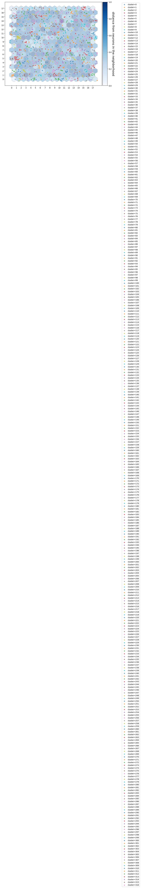
    


```python
# numbef of clusters within the distance range 
clust.cluster_dist()
```


    
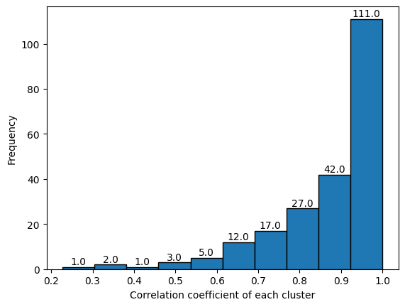
    


    interactive(children=(ToggleButtons(description='Bins Index', options=(0, 1, 2, 3, 4, 5, 6, 7, 8, 9), value=0)…


<h2> 2.2-3. Hierarchical </h2>
<h3> mt.FeatureCluster(X_data, method, depth) : Apply S.O.M Class </h3>

    *method = linkage method
        Possible values = 'average','complete','single'
    *depth = Standard cut branch
    
    cluster_dist = clust evaluation by histogram
    set_cluster() : get cluster value as array
    


```python
dt.man('hierarchical.png')
```


    
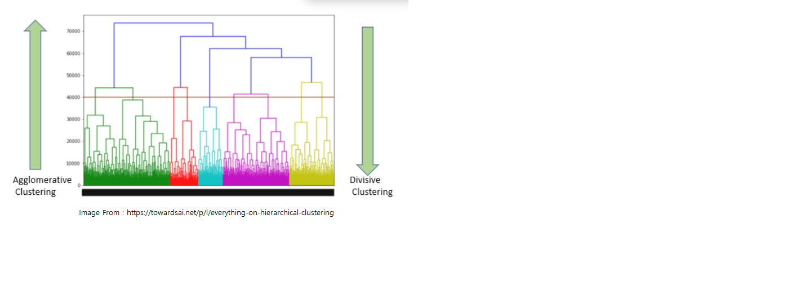
    


```python
# Calculating Cophenet values, chose the largest one
# Not working with BLOCK split 
clust = mt.FeatureCluster(X_train)
clust.cophenetic()
```

    average linkage cophenet: 0.8213907973584261
    complete linkage cophenet: 0.8070560318312705
    single linkage cophenet: 0.35883754064130347


```python
# Hierarchical Clustering 
clust_info = clust.set_cluster('average',1)
```

    
     Cluster 0 ['ATSC0pe'] 
     Cluster 1 ['ATSC0are'] 
     Cluster 2 ['ATSC0se'] 
     Cluster 3 ['ATS1s'] 
     Cluster 4 ['ATS3s'] 
     Cluster 5 ['ATS5s'] 
     Cluster 6 ['ATSC0dv'] 
     Cluster 7 ['ATS4dv'] 
     Cluster 8 ['ATS5dv'] 
     Cluster 9 ['ATS2s', 'ATS4s'] 
     Cluster 10 ['ATS0dv'] 
     Cluster 11 ['ATS6dv'] 
     Cluster 12 ['GGI5'] 
     Cluster 13 ['nC', 'MID_C'] 
     Cluster 14 ['Xp-3d', 'MPC2', 'WPol', 'Zagreb2'] 
     Cluster 15 ['Xp-4d'] 
     Cluster 16 ['MPC3'] 
     Cluster 17 ['TSRW10'] 
     Cluster 18 ['LogEE_A', 'VE3_A', 'VE3_DzZ', 'VR2_DzZ', 'VR3_DzZ', 'VE3_Dzm', 'VR2_Dzm', 'VR3_Dzm', 'VE3_Dzv', 'VR2_Dzv', 'VR3_Dzv', 'VE3_Dzse', 'VR2_Dzse', 'VR3_Dzse', 'VE3_Dzpe', 'VR2_Dzpe', 'VR3_Dzpe', 'VE3_Dzare', 'VR2_Dzare', 'VR3_Dzare', 'VE3_Dzp', 'VR2_Dzp', 'VR3_Dzp', 'VE3_Dzi', 'VR2_Dzi', 'VR3_Dzi', 'VE3_D', 'VR2_D', 'VR3_D', 'VAdjMat', 'TMWC10', 'SRW02'] 
     Cluster 19 ['MWC02', 'MWC03', 'SRW04'] 
     Cluster 20 ['VE1_A', 'VE2_A', 'VE2_DzZ', 'VE2_Dzm', 'VE2_Dzv', 'VE2_Dzse', 'VE2_Dzpe', 'VE2_Dzare', 'VE2_Dzp', 'VE2_Dzi', 'VE2_D'] 
     Cluster 21 ['piPC1'] 
     Cluster 22 ['ATSC0d'] 
     Cluster 23 ['AETA_eta_R'] 
     Cluster 24 ['ETA_alpha', 'LabuteASA'] 
     Cluster 25 ['ATS0v', 'SMR'] 
     Cluster 26 ['ATS1p', 'Sp', 'apol'] 
     Cluster 27 ['VMcGowan'] 
     Cluster 28 ['ATS1v'] 
     Cluster 29 ['Sv'] 
     Cluster 30 ['ATS4v'] 
     Cluster 31 ['ATS2d', 'ATS3d'] 
     Cluster 32 ['ATS2v', 'ATS3v'] 
     Cluster 33 ['ATS2p', 'ATS3p'] 
     Cluster 34 ['ATS4p'] 
     Cluster 35 ['SpMAD_D', 'mZagreb2'] 
     Cluster 36 ['Kier1'] 
     Cluster 37 ['VR1_DzZ', 'VR1_Dzm', 'VR1_Dzv', 'VR1_Dzse', 'VR1_Dzpe', 'VR1_Dzare', 'VR1_Dzp', 'VR1_Dzi', 'VR1_D'] 
     Cluster 38 ['Xp-0d', 'ETA_eta_R'] 
     Cluster 39 ['ABCGG', 'ETA_beta_s'] 
     Cluster 40 ['Xp-2d', 'Zagreb1'] 
     Cluster 41 ['VR3_A', 'VE1_DzZ', 'VE1_Dzm', 'VE1_Dzv', 'VE1_Dzse', 'VE1_Dzpe', 'VE1_Dzare', 'VE1_Dzp', 'VE1_Dzi', 'VE1_D'] 
     Cluster 42 ['ABC', 'SpAbs_A', 'SpAD_A', 'nHeavyAtom', 'ATS0d', 'ATS1d', 'nBondsO', 'Xp-1d', 'ETA_eta_RL', 'MID', 'MWC01'] 
     Cluster 43 ['ATS2dv', 'ATS3dv'] 
     Cluster 44 ['ATS1dv'] 
     Cluster 45 ['ETA_eta_F'] 
     Cluster 46 ['BertzCT'] 
     Cluster 47 ['ETA_beta'] 
     Cluster 48 ['ETA_eta_FL'] 
     Cluster 49 ['GGI4'] 
     Cluster 50 ['ATS8Z', 'ATS8m', 'GGI7'] 
     Cluster 51 ['ATS7Z', 'ATS7m'] 
     Cluster 52 ['GGI6'] 
     Cluster 53 ['ATS7se', 'ATS7pe', 'ATS7are', 'ATS7i'] 
     Cluster 54 ['ATS7d', 'ATS7v', 'ATS7p'] 
     Cluster 55 ['ATS8se', 'ATS8pe', 'ATS8are', 'ATS8i'] 
     Cluster 56 ['ATS8d', 'ATS8v', 'ATS8p'] 
     Cluster 57 ['ATS8s'] 
     Cluster 58 ['ATS7s'] 
     Cluster 59 ['ATS2i', 'nBondsKS'] 
     Cluster 60 ['ATS3i'] 
     Cluster 61 ['ATSC0v'] 
     Cluster 62 ['ATS6se', 'ATS6pe', 'ATS6are'] 
     Cluster 63 ['ATS6i'] 
     Cluster 64 ['ATSC0i'] 
     Cluster 65 ['SpMAD_Dzv'] 
     Cluster 66 ['SpMAD_Dzp'] 
     Cluster 67 ['SpMAD_Dzse', 'SpMAD_Dzpe', 'SpMAD_Dzare', 'SpMAD_Dzi'] 
     Cluster 68 ['ATS6d', 'ATS6v', 'ATS6p'] 
     Cluster 69 ['ATS5d', 'ATS5v'] 
     Cluster 70 ['ATS5p'] 
     Cluster 71 ['TIC1', 'TIC2'] 
     Cluster 72 ['TIC0'] 
     Cluster 73 ['ATS3se', 'ATS3pe', 'ATS3are'] 
     Cluster 74 ['ATS4d'] 
     Cluster 75 ['ATS4se', 'ATS4pe', 'ATS4are'] 
     Cluster 76 ['ATS4i'] 
     Cluster 77 ['ATS0se', 'ATS0pe', 'ATS0are'] 
     Cluster 78 ['ATS1se', 'ATS2se', 'ATS1pe', 'ATS2pe', 'ATS1are', 'ATS2are', 'ATS1i', 'nBonds', 'Sse', 'Spe', 'Sare'] 
     Cluster 79 ['nAtom', 'ATS0i', 'Si'] 
     Cluster 80 ['ATS5se', 'ATS5pe', 'ATS5are', 'ATS5i'] 
     Cluster 81 ['SpAbs_Dzv', 'SpMax_Dzv', 'SpDiam_Dzv', 'SpAD_Dzv', 'LogEE_Dzv', 'SpAbs_Dzp', 'SpMax_Dzp', 'SpDiam_Dzp', 'SpAD_Dzp', 'LogEE_Dzp'] 
     Cluster 82 ['SpAbs_Dzse', 'SpMax_Dzse', 'SpDiam_Dzse', 'SpAD_Dzse', 'LogEE_Dzse', 'SpAbs_Dzpe', 'SpMax_Dzpe', 'SpDiam_Dzpe', 'SpAD_Dzpe', 'LogEE_Dzpe', 'SpAbs_Dzare', 'SpMax_Dzare', 'SpDiam_Dzare', 'SpAD_Dzare', 'LogEE_Dzare', 'SpAbs_Dzi', 'SpMax_Dzi', 'SpDiam_Dzi', 'SpAD_Dzi', 'LogEE_Dzi', 'SpAbs_D', 'SpMax_D', 'SpDiam_D', 'SpAD_D', 'LogEE_D'] 
     Cluster 83 ['SpAbs_DzZ', 'SpMax_DzZ', 'SpDiam_DzZ', 'SpAD_DzZ', 'LogEE_DzZ', 'SpAbs_Dzm', 'SpMax_Dzm', 'SpDiam_Dzm', 'SpAD_Dzm', 'LogEE_Dzm', 'ECIndex'] 
     Cluster 84 ['WPath'] 
     Cluster 85 ['Diameter'] 
     Cluster 86 ['Radius'] 
     Cluster 87 ['SpMAD_DzZ', 'SpMAD_Dzm'] 
     Cluster 88 ['TIC3', 'TIC4', 'TIC5'] 
     Cluster 89 ['GGI1'] 
     Cluster 90 ['mZagreb1'] 
     Cluster 91 ['ATS0p', 'Xp-1dv'] 
     Cluster 92 ['Xp-0dv'] 
     Cluster 93 ['ATS1Z', 'ATS1m'] 
     Cluster 94 ['SZ', 'Sm', 'MW'] 
     Cluster 95 ['ZMIC0'] 
     Cluster 96 ['ETA_eta'] 
     Cluster 97 ['ETA_eta_L'] 
     Cluster 98 ['ATS6Z', 'ATS6m'] 
     Cluster 99 ['ATS5Z', 'ATS5m'] 
     Cluster 100 ['Xp-6dv'] 
     Cluster 101 ['Xp-7dv'] 
     Cluster 102 ['Xp-3dv'] 
     Cluster 103 ['Xp-4dv'] 
     Cluster 104 ['Xp-5dv'] 
     Cluster 105 ['Xp-2dv'] 
     Cluster 106 ['ATS2Z'] 
     Cluster 107 ['ATS2m'] 
     Cluster 108 ['Xc-3d'] 
     Cluster 109 ['ETA_eta_BR'] 
     Cluster 110 ['ATS4Z', 'ATS4m'] 
     Cluster 111 ['Xpc-5d', 'GGI3'] 
     Cluster 112 ['Xpc-4d'] 
     Cluster 113 ['GGI2'] 
     Cluster 114 ['ATS3Z', 'ATS3m'] 
     Cluster 115 ['Xpc-6d'] 
     Cluster 116 ['MWC04', 'MWC05', 'MWC06', 'MWC07', 'MWC08', 'MWC09', 'MWC10', 'SRW06', 'SRW08', 'SRW10'] 
     Cluster 117 ['SpMax_A', 'SpDiam_A'] 
     Cluster 118 ['piPC2'] 
     Cluster 119 ['IC3', 'IC4', 'IC5'] 
     Cluster 120 ['piPC3', 'piPC4'] 
     Cluster 121 ['piPC5', 'piPC6'] 
     Cluster 122 ['piPC7'] 
     Cluster 123 ['TpiPC10'] 
     Cluster 124 ['nBondsKD'] 
     Cluster 125 ['ETA_beta_ns'] 
     Cluster 126 ['nBondsM'] 
     Cluster 127 ['AETA_eta_F'] 
     Cluster 128 ['FilterItLogS'] 
     Cluster 129 ['SLogP'] 
     Cluster 130 ['ZMIC1'] 
     Cluster 131 ['piPC9'] 
     Cluster 132 ['piPC10'] 
     Cluster 133 ['piPC8'] 
     Cluster 134 ['Xp-6d'] 
     Cluster 135 ['MPC4'] 
     Cluster 136 ['Xp-5d'] 
     Cluster 137 ['MPC5'] 
     Cluster 138 ['Xp-7d'] 
     Cluster 139 ['MPC6', 'TMPC10'] 
     Cluster 140 ['MPC7'] 
     Cluster 141 ['fragCpx'] 
     Cluster 142 ['AATS0i', 'Mi'] 
     Cluster 143 ['AATS1i'] 
     Cluster 144 ['AETA_eta_L'] 
     Cluster 145 ['AETA_eta_FL'] 
     Cluster 146 ['FCSP3'] 
     Cluster 147 ['AETA_beta_ns'] 
     Cluster 148 ['AETA_beta'] 
     Cluster 149 ['AETA_dBeta'] 
     Cluster 150 ['AATSC1v'] 
     Cluster 151 ['MATS1v'] 
     Cluster 152 ['AATS2i'] 
     Cluster 153 ['GATS1i'] 
     Cluster 154 ['ETA_dEpsilon_B'] 
     Cluster 155 ['fMF'] 
     Cluster 156 ['GATS1v'] 
     Cluster 157 ['GATS1p'] 
     Cluster 158 ['AETA_beta_ns_d'] 
     Cluster 159 ['SlogP_VSA7'] 
     Cluster 160 ['CIC4', 'CIC5'] 
     Cluster 161 ['CIC3'] 
     Cluster 162 ['SIC4', 'SIC5'] 
     Cluster 163 ['BIC4', 'BIC5'] 
     Cluster 164 ['SIC3'] 
     Cluster 165 ['BIC3'] 
     Cluster 166 ['AATSC1i'] 
     Cluster 167 ['MATS1i'] 
     Cluster 168 ['AATSC1p'] 
     Cluster 169 ['MATS1p'] 
     Cluster 170 ['JGI4'] 
     Cluster 171 ['AATSC0se'] 
     Cluster 172 ['AATSC0pe'] 
     Cluster 173 ['AATS0are', 'Mare'] 
     Cluster 174 ['AATS1are'] 
     Cluster 175 ['AATS2are'] 
     Cluster 176 ['IC0'] 
     Cluster 177 ['AATS0se', 'Mse'] 
     Cluster 178 ['AATS0pe', 'Mpe'] 
     Cluster 179 ['ETA_epsilon_1', 'ETA_dEpsilon_A'] 
     Cluster 180 ['AATS1se'] 
     Cluster 181 ['AATS1pe'] 
     Cluster 182 ['AATS2pe'] 
     Cluster 183 ['ETA_epsilon_4', 'ETA_dEpsilon_C'] 
     Cluster 184 ['AATS2se'] 
     Cluster 185 ['ETA_epsilon_2'] 
     Cluster 186 ['ETA_epsilon_5'] 
     Cluster 187 ['AMID_h'] 
     Cluster 188 ['MIC0'] 
     Cluster 189 ['SIC2'] 
     Cluster 190 ['BIC2'] 
     Cluster 191 ['SIC1'] 
     Cluster 192 ['BIC1'] 
     Cluster 193 ['AETA_eta_RL'] 
     Cluster 194 ['JGI1'] 
     Cluster 195 ['BCUTd-1l'] 
     Cluster 196 ['EState_VSA8'] 
     Cluster 197 ['AATSC0v'] 
     Cluster 198 ['AATS0v'] 
     Cluster 199 ['Mv'] 
     Cluster 200 ['AATS1v'] 
     Cluster 201 ['AATS2v'] 
     Cluster 202 ['nX', 'MID_X'] 
     Cluster 203 ['nCl', 'NsCl', 'SsCl'] 
     Cluster 204 ['EState_VSA9'] 
     Cluster 205 ['BCUTZ-1h', 'BCUTm-1h'] 
     Cluster 206 ['AATSC0p'] 
     Cluster 207 ['BCUTv-1h'] 
     Cluster 208 ['BCUTdv-1l'] 
     Cluster 209 ['MZ', 'Mm', 'AMW'] 
     Cluster 210 ['AATS1Z', 'AATS1m'] 
     Cluster 211 ['AATS1p'] 
     Cluster 212 ['AATS2p'] 
     Cluster 213 ['AATS0p'] 
     Cluster 214 ['Mp'] 
     Cluster 215 ['AMID_X'] 
     Cluster 216 ['nBr', 'NsBr', 'SsBr', 'ETA_dPsi_B'] 
     Cluster 217 ['AETA_alpha'] 
     Cluster 218 ['ETA_dAlpha_A'] 
     Cluster 219 ['AATSC0Z', 'AATSC0m'] 
     Cluster 220 ['AATS2Z', 'AATS2m'] 
     Cluster 221 ['AATS0Z', 'AATS0m'] 
     Cluster 222 ['MATS1s'] 
     Cluster 223 ['ETA_dEpsilon_D'] 
     Cluster 224 ['ATSC1se', 'ATSC1are'] 
     Cluster 225 ['ATSC1pe'] 
     Cluster 226 ['MATS1pe', 'MATS1are'] 
     Cluster 227 ['MATS1se'] 
     Cluster 228 ['AATSC1se'] 
     Cluster 229 ['AATSC1pe'] 
     Cluster 230 ['AATSC1are'] 
     Cluster 231 ['GATS1se', 'GATS1pe'] 
     Cluster 232 ['GATS1are'] 
     Cluster 233 ['GATS1s'] 
     Cluster 234 ['GATS2pe'] 
     Cluster 235 ['GATS2are'] 
     Cluster 236 ['GATS2se'] 
     Cluster 237 ['GATS2s'] 
     Cluster 238 ['GATS2dv'] 
     Cluster 239 ['ATSC3i'] 
     Cluster 240 ['SdssC'] 
     Cluster 241 ['AATSC0are'] 
     Cluster 242 ['BCUTs-1h'] 
     Cluster 243 ['AMID_O'] 
     Cluster 244 ['AATS0s', 'AATSC0s'] 
     Cluster 245 ['NddsN', 'SddsN'] 
     Cluster 246 ['PEOE_VSA13'] 
     Cluster 247 ['VSA_EState3'] 
     Cluster 248 ['ATSC5s'] 
     Cluster 249 ['AATSC2s'] 
     Cluster 250 ['PEOE_VSA2'] 
     Cluster 251 ['AATS2s'] 
     Cluster 252 ['SlogP_VSA4'] 
     Cluster 253 ['AATSC0c'] 
     Cluster 254 ['ETA_dPsi_A'] 
     Cluster 255 ['ETA_psi_1'] 
     Cluster 256 ['AATSC1s'] 
     Cluster 257 ['ETA_dAlpha_B'] 
     Cluster 258 ['AATS1s'] 
     Cluster 259 ['BalabanJ'] 
     Cluster 260 ['ETA_dBeta'] 
     Cluster 261 ['NsCH3', 'SsCH3'] 
     Cluster 262 ['SlogP_VSA2'] 
     Cluster 263 ['NssCH2'] 
     Cluster 264 ['SssCH2'] 
     Cluster 265 ['C2SP3'] 
     Cluster 266 ['C1SP3'] 
     Cluster 267 ['VSA_EState8'] 
     Cluster 268 ['RotRatio'] 
     Cluster 269 ['ATSC1i'] 
     Cluster 270 ['SMR_VSA6'] 
     Cluster 271 ['ATSC1v'] 
     Cluster 272 ['n3HRing', 'n3AHRing'] 
     Cluster 273 ['nAHRing'] 
     Cluster 274 ['SRW05', 'SRW07', 'SRW09'] 
     Cluster 275 ['Xch-3dv', 'n3Ring', 'n3ARing', 'SRW03'] 
     Cluster 276 ['Xch-3d'] 
     Cluster 277 ['NdssS', 'SdssS', 'n7Ring', 'n7HRing', 'n7ARing', 'n7AHRing', 'n12FRing', 'n12FHRing', 'n12FARing', 'n12FAHRing'] 
     Cluster 278 ['nG12FARing', 'nG12FAHRing'] 
     Cluster 279 ['nFARing', 'nFAHRing'] 
     Cluster 280 ['Xc-6d'] 
     Cluster 281 ['Xc-6dv'] 
     Cluster 282 ['nBridgehead'] 
     Cluster 283 ['n5ARing'] 
     Cluster 284 ['nARing'] 
     Cluster 285 ['n5Ring'] 
     Cluster 286 ['Xc-5dv'] 
     Cluster 287 ['nG12FRing', 'nG12FHRing'] 
     Cluster 288 ['nFRing'] 
     Cluster 289 ['nFHRing'] 
     Cluster 290 ['SlogP_VSA8'] 
     Cluster 291 ['ATSC2c'] 
     Cluster 292 ['MATS2c'] 
     Cluster 293 ['PEOE_VSA1'] 
     Cluster 294 ['nN', 'MID_N'] 
     Cluster 295 ['BCUTv-1l'] 
     Cluster 296 ['BCUTi-1h'] 
     Cluster 297 ['AATSC0i'] 
     Cluster 298 ['ATSC3dv'] 
     Cluster 299 ['ATSC6dv'] 
     Cluster 300 ['TopoShapeIndex', 'PetitjeanIndex'] 
     Cluster 301 ['PEOE_VSA3'] 
     Cluster 302 ['PEOE_VSA12'] 
     Cluster 303 ['AATSC2d'] 
     Cluster 304 ['MATS1c'] 
     Cluster 305 ['GATS1c'] 
     Cluster 306 ['AATSC1c'] 
     Cluster 307 ['NssNH', 'SssNH'] 
     Cluster 308 ['ATSC3c'] 
     Cluster 309 ['AATSC2c'] 
     Cluster 310 ['SlogP_VSA1'] 
     Cluster 311 ['SMR_VSA3'] 
     Cluster 312 ['ATSC7pe', 'ATSC7are'] 
     Cluster 313 ['ATSC7se'] 
     Cluster 314 ['ATSC7s'] 
     Cluster 315 ['ATSC6pe'] 
     Cluster 316 ['ATSC6are'] 
     Cluster 317 ['ATSC6se'] 
     Cluster 318 ['ATSC6c'] 
     Cluster 319 ['ATSC6s'] 
     Cluster 320 ['ATSC4s'] 
     Cluster 321 ['ATSC4c'] 
     Cluster 322 ['NaaN', 'SaaN'] 
     Cluster 323 ['n6HRing', 'n6aHRing'] 
     Cluster 324 ['naHRing'] 
     Cluster 325 ['nHRing'] 
     Cluster 326 ['PEOE_VSA11'] 
     Cluster 327 ['VSA_EState5'] 
     Cluster 328 ['VSA_EState7'] 
     Cluster 329 ['NaasN', 'SaasN'] 
     Cluster 330 ['n6AHRing'] 
     Cluster 331 ['nBase'] 
     Cluster 332 ['n6ARing'] 
     Cluster 333 ['NddC', 'SddC'] 
     Cluster 334 ['NdsN', 'SdsN'] 
     Cluster 335 ['NsSH', 'SsSH'] 
     Cluster 336 ['nAcid'] 
     Cluster 337 ['NdCH2', 'SdCH2'] 
     Cluster 338 ['NdsCH', 'SdsCH'] 
     Cluster 339 ['NddssS', 'SddssS'] 
     Cluster 340 ['n5AHRing'] 
     Cluster 341 ['n9FARing', 'n9FAHRing'] 
     Cluster 342 ['n9FRing', 'n9FHRing'] 
     Cluster 343 ['n9FaRing', 'n9FaHRing'] 
     Cluster 344 ['NaaNH', 'SaaNH'] 
     Cluster 345 ['NaaS', 'SaaS'] 
     Cluster 346 ['n5aRing', 'n5aHRing'] 
     Cluster 347 ['n5HRing'] 
     Cluster 348 ['NaaO', 'SaaO'] 
     Cluster 349 ['n10FRing', 'n10FaRing'] 
     Cluster 350 ['n10FHRing', 'n10FaHRing'] 
     Cluster 351 ['nG12FaRing', 'nG12FaHRing'] 
     Cluster 352 ['NaaaC', 'SaaaC', 'nFaRing'] 
     Cluster 353 ['nFaHRing'] 
     Cluster 354 ['ATSC3se'] 
     Cluster 355 ['ATSC3are'] 
     Cluster 356 ['ATSC3pe'] 
     Cluster 357 ['ATSC3s'] 
     Cluster 358 ['ATSC5c'] 
     Cluster 359 ['nHBDon'] 
     Cluster 360 ['AMID_N'] 
     Cluster 361 ['NsOH', 'SsOH'] 
     Cluster 362 ['NsNH2', 'SsNH2'] 
     Cluster 363 ['VSA_EState4'] 
     Cluster 364 ['ATSC1p'] 
     Cluster 365 ['ATSC4i'] 
     Cluster 366 ['PEOE_VSA5'] 
     Cluster 367 ['EState_VSA5'] 
     Cluster 368 ['nI', 'C2SP1', 'NsI', 'SsI'] 
     Cluster 369 ['NtsC', 'StsC'] 
     Cluster 370 ['NtN', 'StN', 'SMR_VSA2'] 
     Cluster 371 ['nBondsT'] 
     Cluster 372 ['C1SP1'] 
     Cluster 373 ['C1SP2'] 
     Cluster 374 ['PEOE_VSA4'] 
     Cluster 375 ['SsssCH'] 
     Cluster 376 ['ATSC7i'] 
     Cluster 377 ['ATSC7c'] 
     Cluster 378 ['ATSC8se', 'ATSC8pe', 'ATSC8are'] 
     Cluster 379 ['ATSC8s'] 
     Cluster 380 ['ATSC8dv'] 
     Cluster 381 ['ATSC8c'] 
     Cluster 382 ['ATSC8Z', 'ATSC8m'] 
     Cluster 383 ['ATSC8v'] 
     Cluster 384 ['ATSC8p'] 
     Cluster 385 ['ATSC7d'] 
     Cluster 386 ['ATSC8d'] 
     Cluster 387 ['NssS', 'SssS'] 
     Cluster 388 ['NdS', 'SdS'] 
     Cluster 389 ['nS'] 
     Cluster 390 ['BCUTp-1h'] 
     Cluster 391 ['BCUTi-1l'] 
     Cluster 392 ['ATSC4Z', 'ATSC4m'] 
     Cluster 393 ['ATSC4p'] 
     Cluster 394 ['ATSC4v'] 
     Cluster 395 ['NsssN', 'SsssN'] 
     Cluster 396 ['VSA_EState9'] 
     Cluster 397 ['ATSC5p'] 
     Cluster 398 ['ATSC5i'] 
     Cluster 399 ['ATSC5v'] 
     Cluster 400 ['GATS2i'] 
     Cluster 401 ['GATS2c'] 
     Cluster 402 ['ATSC7Z', 'ATSC7m'] 
     Cluster 403 ['ATSC7v'] 
     Cluster 404 ['ATSC7p'] 
     Cluster 405 ['ATSC3Z', 'ATSC3m'] 
     Cluster 406 ['ATSC3v'] 
     Cluster 407 ['ATSC3p'] 
     Cluster 408 ['ATSC2d'] 
     Cluster 409 ['SpMAD_A'] 
     Cluster 410 ['AXp-0d'] 
     Cluster 411 ['ETA_shape_p'] 
     Cluster 412 ['ETA_epsilon_3'] 
     Cluster 413 ['AMID'] 
     Cluster 414 ['AXp-1d'] 
     Cluster 415 ['nRing'] 
     Cluster 416 ['BCUTZ-1l', 'BCUTm-1l'] 
     Cluster 417 ['BCUTse-1l'] 
     Cluster 418 ['SaaCH', 'VSA_EState6'] 
     Cluster 419 ['NaaCH', 'SlogP_VSA6'] 
     Cluster 420 ['nAromAtom', 'nAromBond', 'nBondsA', 'n6Ring', 'naRing', 'n6aRing'] 
     Cluster 421 ['C2SP2'] 
     Cluster 422 ['SMR_VSA7'] 
     Cluster 423 ['AATS1dv'] 
     Cluster 424 ['AATS2dv'] 
     Cluster 425 ['AATS0dv'] 
     Cluster 426 ['MIC3', 'MIC4', 'MIC5'] 
     Cluster 427 ['MIC2'] 
     Cluster 428 ['MIC1'] 
     Cluster 429 ['AATSC0d'] 
     Cluster 430 ['AATS0d', 'AATS1d'] 
     Cluster 431 ['AATS2d'] 
     Cluster 432 ['NaasC'] 
     Cluster 433 ['ETA_shape_y'] 
     Cluster 434 ['nBondsS'] 
     Cluster 435 ['bpol'] 
     Cluster 436 ['ATSC0p'] 
     Cluster 437 ['nRot'] 
     Cluster 438 ['nH'] 
     Cluster 439 ['ATSC1d'] 
     Cluster 440 ['CIC0'] 
     Cluster 441 ['ATS7dv'] 
     Cluster 442 ['ATS8dv'] 
     Cluster 443 ['GGI8'] 
     Cluster 444 ['GGI9'] 
     Cluster 445 ['GGI10'] 
     Cluster 446 ['JGI10'] 
     Cluster 447 ['NssO', 'SssO'] 
     Cluster 448 ['SlogP_VSA3'] 
     Cluster 449 ['VSA_EState1'] 
     Cluster 450 ['ATSC1c'] 
     Cluster 451 ['JGI7'] 
     Cluster 452 ['JGI8'] 
     Cluster 453 ['JGI6'] 
     Cluster 454 ['PEOE_VSA7'] 
     Cluster 455 ['RNCG'] 
     Cluster 456 ['ATSC1dv'] 
     Cluster 457 ['BCUTc-1l'] 
     Cluster 458 ['ATSC2pe', 'ATSC2are'] 
     Cluster 459 ['ATSC2se'] 
     Cluster 460 ['AATSC2dv'] 
     Cluster 461 ['MATS2dv'] 
     Cluster 462 ['ATSC2dv'] 
     Cluster 463 ['MATS2pe', 'MATS2are'] 
     Cluster 464 ['AATSC2se'] 
     Cluster 465 ['AATSC2pe'] 
     Cluster 466 ['AATSC2are'] 
     Cluster 467 ['MATS2se'] 
     Cluster 468 ['MATS2s'] 
     Cluster 469 ['ATS0s'] 
     Cluster 470 ['ATS6s'] 
     Cluster 471 ['nO', 'MID_O'] 
     Cluster 472 ['SMR_VSA1'] 
     Cluster 473 ['ATSC0c'] 
     Cluster 474 ['nHBAcc'] 
     Cluster 475 ['EState_VSA1'] 
     Cluster 476 ['nBondsD'] 
     Cluster 477 ['TopoPSA'] 
     Cluster 478 ['SlogP_VSA10'] 
     Cluster 479 ['JGI5'] 
     Cluster 480 ['SM1_Dzv', 'SM1_Dzp'] 
     Cluster 481 ['ATSC0s'] 
     Cluster 482 ['EState_VSA10'] 
     Cluster 483 ['ATSC2s'] 
     Cluster 484 ['NdO', 'SdO'] 
     Cluster 485 ['VSA_EState2'] 
     Cluster 486 ['TopoPSA(NO)'] 
     Cluster 487 ['AATSC0dv'] 
     Cluster 488 ['BCUTdv-1h'] 
     Cluster 489 ['BCUTse-1h'] 
     Cluster 490 ['BCUTpe-1h'] 
     Cluster 491 ['BCUTare-1h'] 
     Cluster 492 ['BCUTp-1l'] 
     Cluster 493 ['BCUTpe-1l'] 
     Cluster 494 ['BCUTare-1l'] 
     Cluster 495 ['BCUTd-1h'] 
     Cluster 496 ['AETA_beta_s'] 
     Cluster 497 ['SM1_Dzse', 'SM1_Dzpe'] 
     Cluster 498 ['SM1_Dzare'] 
     Cluster 499 ['SM1_Dzi'] 
     Cluster 500 ['nHetero', 'MID_h'] 
     Cluster 501 ['ETA_eta_B'] 
     Cluster 502 ['IC1'] 
     Cluster 503 ['IC2'] 
     Cluster 504 ['BCUTc-1h'] 
     Cluster 505 ['SM1_DzZ', 'SM1_Dzm'] 
     Cluster 506 ['ATS0Z'] 
     Cluster 507 ['ATS0m'] 
     Cluster 508 ['ZMIC4', 'ZMIC5'] 
     Cluster 509 ['ZMIC3'] 
     Cluster 510 ['ZMIC2'] 
     Cluster 511 ['Xc-3dv'] 
     Cluster 512 ['ATSC0Z'] 
     Cluster 513 ['ATSC0m'] 
     Cluster 514 ['AETA_eta'] 
     Cluster 515 ['Xch-7d'] 
     Cluster 516 ['Xch-6dv'] 
     Cluster 517 ['MPC9', 'MPC10'] 
     Cluster 518 ['MPC8'] 
     Cluster 519 ['Xch-6d'] 
     Cluster 520 ['NssssC'] 
     Cluster 521 ['SssssC'] 
     Cluster 522 ['C3SP3'] 
     Cluster 523 ['Xch-7dv'] 
     Cluster 524 ['NsssCH'] 
     Cluster 525 ['Xpc-4dv'] 
     Cluster 526 ['Xpc-5dv'] 
     Cluster 527 ['Xpc-6dv'] 
     Cluster 528 ['Xc-5d'] 
     Cluster 529 ['ATSC3d'] 
     Cluster 530 ['AXp-0dv'] 
     Cluster 531 ['AXp-1dv'] 
     Cluster 532 ['GATS1dv'] 
     Cluster 533 ['AATSC2Z', 'AATSC2m'] 
     Cluster 534 ['AATSC1Z', 'AATSC1m'] 
     Cluster 535 ['AATSC1dv'] 
     Cluster 536 ['MATS1dv'] 
     Cluster 537 ['AATSC1d'] 
     Cluster 538 ['CIC1'] 
     Cluster 539 ['CIC2'] 
     Cluster 540 ['SIC0'] 
     Cluster 541 ['BIC0'] 
     Cluster 542 ['RPCG'] 
     Cluster 543 ['C3SP2'] 
     Cluster 544 ['SMR_VSA9'] 
     Cluster 545 ['SaasC'] 
     Cluster 546 ['EState_VSA7'] 
     Cluster 547 ['ATSC4d'] 
     Cluster 548 ['PEOE_VSA6'] 
     Cluster 549 ['AMID_C'] 
     Cluster 550 ['ATSC5pe'] 
     Cluster 551 ['ATSC5are'] 
     Cluster 552 ['ATSC5se'] 
     Cluster 553 ['ATSC5dv'] 
     Cluster 554 ['EState_VSA6'] 
     Cluster 555 ['JGI9'] 
     Cluster 556 ['PEOE_VSA10'] 
     Cluster 557 ['SlogP_VSA11'] 
     Cluster 558 ['EState_VSA3'] 
     Cluster 559 ['nF', 'NsF', 'SsF'] 
     Cluster 560 ['ATSC8i'] 
     Cluster 561 ['VR1_A', 'VR2_A'] 
     Cluster 562 ['Xch-5d', 'Xch-5dv'] 
     Cluster 563 ['Xch-4d', 'Xch-4dv'] 
     Cluster 564 ['SMR_VSA4'] 
     Cluster 565 ['C4SP3'] 
     Cluster 566 ['ATSC6Z', 'ATSC6m'] 
     Cluster 567 ['ATSC6v'] 
     Cluster 568 ['ATSC6p'] 
     Cluster 569 ['ATSC6i'] 
     Cluster 570 ['ATSC6d'] 
     Cluster 571 ['NdssC'] 
     Cluster 572 ['SMR_VSA5'] 
     Cluster 573 ['SlogP_VSA5'] 
     Cluster 574 ['EState_VSA4'] 
     Cluster 575 ['ATSC7dv'] 
     Cluster 576 ['ATSC5d'] 
     Cluster 577 ['AETA_eta_BR'] 
     Cluster 578 ['JGT10'] 
     Cluster 579 ['AETA_eta_B'] 
     Cluster 580 ['GATS2v'] 
     Cluster 581 ['GATS2p'] 
     Cluster 582 ['JGI2'] 
     Cluster 583 ['PEOE_VSA9'] 
     Cluster 584 ['EState_VSA2'] 
     Cluster 585 ['GATS2Z', 'GATS2m'] 
     Cluster 586 ['JGI3'] 
     Cluster 587 ['GATS1Z', 'GATS1m'] 
     Cluster 588 ['ETA_beta_ns_d'] 
     Cluster 589 ['ATSC5Z', 'ATSC5m'] 
     Cluster 590 ['Xc-4d'] 
     Cluster 591 ['ETA_shape_x'] 
     Cluster 592 ['Xc-4dv'] 
     Cluster 593 ['AATSC2v', 'MATS2v', 'MATS2p'] 
     Cluster 594 ['AATSC2p'] 
     Cluster 595 ['ATSC2v'] 
     Cluster 596 ['ATSC2p'] 
     Cluster 597 ['AATSC2i', 'MATS2i'] 
     Cluster 598 ['ATSC2i'] 
     Cluster 599 ['PEOE_VSA8'] 
     Cluster 600 ['MATS1Z', 'MATS1m'] 
     Cluster 601 ['ATSC1Z', 'ATSC1m'] 
     Cluster 602 ['MATS2Z', 'MATS2m'] 
     Cluster 603 ['ATSC2Z', 'ATSC2m'] 
     Cluster 604 ['nP', 'NdsssP', 'SdsssP'] 
     Cluster 605 ['BCUTs-1l'] 
     Cluster 606 ['ATSC4pe', 'ATSC4are'] 
     Cluster 607 ['ATSC4se'] 
     Cluster 608 ['ATSC4dv'] 
     Cluster 609 ['ATSC1s'] 
    
    Cluster info file qdb1_F_s_hierarchical.cluster file saved


     Cluster 524 ['ATSC6v'] 
     Cluster 525 ['ATSC6p'] 
     Cluster 526 ['VR1_A', 'VR2_A'] 
     Cluster 527 ['Xch-5d', 'Xch-5dv'] 
     Cluster 528 ['Xch-4d', 'Xch-4dv'] 
     Cluster 529 ['SMR_VSA4'] 
     Cluster 530 ['PEOE_VSA10'] 
     Cluster 531 ['NdssC'] 
     Cluster 532 ['ATSC8Z', 'ATSC8m'] 
     Cluster 533 ['ATSC8v'] 
     Cluster 534 ['ATSC8p'] 
     Cluster 535 ['ATSC8i'] 
     Cluster 536 ['ATSC7d'] 
     Cluster 537 ['EState_VSA3'] 
     Cluster 538 ['EState_VSA6'] 
     Cluster 539 ['SMR_VSA9'] 
     Cluster 540 ['SlogP_VSA11'] 
     Cluster 541 ['C3SP2'] 
     Cluster 542 ['SaasC'] 
     Cluster 543 ['EState_VSA7'] 
     Cluster 544 ['PEOE_VSA6'] 
     Cluster 545 ['AATS1dv'] 
     Cluster 546 ['AATS2dv'] 
     Cluster 547 ['AATS0dv'] 
     Cluster 548 ['SIC0'] 
     Cluster 549 ['BIC0'] 
     Cluster 550 ['CIC1'] 
     Cluster 551 ['AXp-0dv'] 
     Cluster 552 ['AXp-1dv'] 
     Cluster 553 ['MATS1s'] 
     Cluster 554 ['GATS1s'] 
     Cluster 555 ['GATS1dv'] 
     Cluster 556 ['MATS1Z', 'MATS1m'] 
     Cluster 557 ['ATSC1Z', 'ATSC1m'] 
     Cluster 558 ['AATSC1dv'] 
     Cluster 559 ['MATS1dv'] 
     Cluster 560 ['AATSC1d'] 
     Cluster 561 ['RPCG'] 
     Cluster 562 ['BCUTd-1h'] 
     Cluster 563 ['ETA_eta_B'] 
     Cluster 564 ['nHetero', 'MID_h'] 
     Cluster 565 ['SM1_Dzse', 'SM1_Dzpe'] 
     Cluster 566 ['SM1_Dzare'] 
     Cluster 567 ['SM1_Dzi'] 
     Cluster 568 ['BCUTc-1h'] 
     Cluster 569 ['nBondsD'] 
     Cluster 570 ['TopoPSA'] 
     Cluster 571 ['ATSC5pe', 'ATSC5are'] 
     Cluster 572 ['ATSC5se'] 
     Cluster 573 ['ATSC5dv'] 
     Cluster 574 ['ATSC2se', 'ATSC2pe', 'ATSC2are'] 
     Cluster 575 ['AATSC2dv', 'MATS2dv'] 
     Cluster 576 ['ATSC2dv'] 
     Cluster 577 ['AATSC2pe', 'AATSC2are'] 
     Cluster 578 ['AATSC2se'] 
     Cluster 579 ['MATS2pe', 'MATS2are'] 
     Cluster 580 ['MATS2se'] 
     Cluster 581 ['MATS2s'] 
     Cluster 582 ['SlogP_VSA4'] 
     Cluster 583 ['EState_VSA1'] 
     Cluster 584 ['JGI5'] 
     Cluster 585 ['SM1_Dzv', 'SM1_Dzp'] 
     Cluster 586 ['TopoPSA(NO)'] 
     Cluster 587 ['ATSC0s'] 
     Cluster 588 ['EState_VSA10'] 
     Cluster 589 ['NdO', 'SdO'] 
     Cluster 590 ['VSA_EState2'] 
     Cluster 591 ['nO', 'MID_O'] 
     Cluster 592 ['SMR_VSA1'] 
     Cluster 593 ['nHBAcc'] 
     Cluster 594 ['ATS0s'] 
     Cluster 595 ['BCUTv-1l'] 
     Cluster 596 ['BCUTi-1h'] 
     Cluster 597 ['AATSC0dv'] 
     Cluster 598 ['BCUTdv-1h'] 
     Cluster 599 ['BCUTse-1h'] 
     Cluster 600 ['BCUTpe-1h'] 
     Cluster 601 ['BCUTare-1h'] 
     Cluster 602 ['BCUTp-1l'] 
     Cluster 603 ['BCUTs-1h'] 
    
    Cluster info file qdb1_F_s_hierarchical.cluster file saved


```python
# numbef of clusters within the distance range
clust.cluster_dist()
```


    
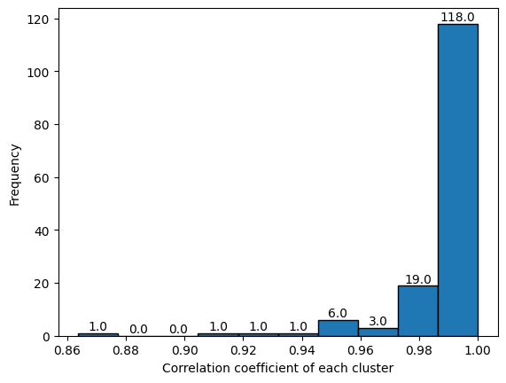
    


    interactive(children=(ToggleButtons(description='Bins Index', options=(0, 3, 4, 5, 6, 7, 8, 9), value=0), Outp…


```python

```

<h1> 3. Feature Selection </h1>
<h2>  3.1. Monte Carlo </h2>

    selection(X_train, y_train, clust_info, model, pop_info, learning, bank, component, pntinterval)
    X_train : Descriptor Data
    y_train : end point
    clust_info : clustering informatino after clustering
    model : model algorithm
        Possible : 'PLS', 'MLR'
    pop_info
        None = start with empty
        population = used previous data continuously
    learning : # learning
    bank : # bank
    component : # descriptor
    pntiniterval : print value interval
    
    * return
        - select : selected feature
        - population : save point to restart


```python
from pyqsar import data_tools as dt
from pyqsar import model_tools as mt
from pyqsar import draw_mol
import pandas as pd
import numpy as np
```

### 3.1-1 Monte Carlo Feature Selection


```python
# split train data into EP and Descriptors 
X_train, y_train = mt.split_xy('.train')
```

    Path :/home/jun/pyqsar/pyqsar3r25
    Index   File Name
       0    qdb1_F_s.train
       1    qdb1_F_s_B.train


    Enter .train file index to load :  1


    
    


```python
# Feature Selection with MC + MLR. 
descriptor = 5
model_algo='MLR'   # MLR or PLS 
N_learning = 500
N_bank = 200
N_component = descriptor
select, population = mt.selection_mc(X_train,y_train,model=model_algo,
                                     #pop_info=None,               
                                     pop_info=population,            
                                     learning=N_learning,
                                     bank=N_bank,
                                     component=N_component,
                                     pntinterval=20 )
```

    Start time :  10:54:22
    Index   File Name
    0       qdb1_F_s_B_kmeans.cluster
    1       qdb1_F_s_B_som.cluster
    2       qdb1_F_s_kmeans.cluster
    3       qdb1_F_s_som.cluster
    4       qdb1_F_s_hierarchical.cluster
    
    


    Enter Clust Info File Index :  1


    qdb1_F_s_B_som.cluster    file selected
    
    MLR
                           R^2                  RMSE


      0%|          | 0/500 [00:00<?, ?it/s]


         20 => 10:54:32 [ 0.7613, 0.8539] ['GATS1i', 'NddC', 'SMR_VSA9', 'SpAbs_A', 'Xp-0dv']
         40 => 10:54:35 [ 0.7613, 0.8539] ['GATS1i', 'NddC', 'SMR_VSA9', 'SpAbs_A', 'Xp-0dv']
         60 => 10:54:39 [ 0.7613, 0.8539] ['GATS1i', 'NddC', 'SMR_VSA9', 'SpAbs_A', 'Xp-0dv']
         80 => 10:54:43 [ 0.7613, 0.8539] ['GATS1i', 'NddC', 'SMR_VSA9', 'SpAbs_A', 'Xp-0dv']
        100 => 10:54:47 [ 0.7613, 0.8539] ['GATS1i', 'NddC', 'SMR_VSA9', 'SpAbs_A', 'Xp-0dv']
        120 => 10:54:50 [ 0.7613, 0.8539] ['GATS1i', 'NddC', 'SMR_VSA9', 'SpAbs_A', 'Xp-0dv']
        140 => 10:54:54 [ 0.7613, 0.8539] ['GATS1i', 'NddC', 'SMR_VSA9', 'SpAbs_A', 'Xp-0dv']
        160 => 10:54:58 [ 0.7613, 0.8539] ['GATS1i', 'NddC', 'SMR_VSA9', 'SpAbs_A', 'Xp-0dv']
        180 => 10:55:01 [ 0.7613, 0.8539] ['GATS1i', 'NddC', 'SMR_VSA9', 'SpAbs_A', 'Xp-0dv']
        200 => 10:55:05 [ 0.7613, 0.8539] ['GATS1i', 'NddC', 'SMR_VSA9', 'SpAbs_A', 'Xp-0dv']
        220 => 10:55:09 [ 0.7613, 0.8539] ['GATS1i', 'NddC', 'SMR_VSA9', 'SpAbs_A', 'Xp-0dv']
        240 => 10:55:13 [ 0.7613, 0.8539] ['GATS1i', 'NddC', 'SMR_VSA9', 'SpAbs_A', 'Xp-0dv']
        260 => 10:55:16 [ 0.7613, 0.8539] ['GATS1i', 'NddC', 'SMR_VSA9', 'SpAbs_A', 'Xp-0dv']
        280 => 10:55:20 [ 0.7613, 0.8539] ['GATS1i', 'NddC', 'SMR_VSA9', 'SpAbs_A', 'Xp-0dv']
        300 => 10:55:24 [ 0.7613, 0.8539] ['GATS1i', 'NddC', 'SMR_VSA9', 'SpAbs_A', 'Xp-0dv']
        320 => 10:55:27 [ 0.7613, 0.8539] ['GATS1i', 'NddC', 'SMR_VSA9', 'SpAbs_A', 'Xp-0dv']
        340 => 10:55:31 [ 0.7613, 0.8539] ['GATS1i', 'NddC', 'SMR_VSA9', 'SpAbs_A', 'Xp-0dv']
        360 => 10:55:35 [ 0.7613, 0.8539] ['GATS1i', 'NddC', 'SMR_VSA9', 'SpAbs_A', 'Xp-0dv']
        380 => 10:55:39 [ 0.7613, 0.8539] ['GATS1i', 'NddC', 'SMR_VSA9', 'SpAbs_A', 'Xp-0dv']
        400 => 10:55:42 [ 0.7613, 0.8539] ['GATS1i', 'NddC', 'SMR_VSA9', 'SpAbs_A', 'Xp-0dv']
        420 => 10:55:46 [ 0.7613, 0.8539] ['GATS1i', 'NddC', 'SMR_VSA9', 'SpAbs_A', 'Xp-0dv']
        440 => 10:55:50 [ 0.7613, 0.8539] ['GATS1i', 'NddC', 'SMR_VSA9', 'SpAbs_A', 'Xp-0dv']
        460 => 10:55:54 [ 0.7613, 0.8539] ['GATS1i', 'NddC', 'SMR_VSA9', 'SpAbs_A', 'Xp-0dv']
        480 => 10:55:57 [ 0.7613, 0.8539] ['GATS1i', 'NddC', 'SMR_VSA9', 'SpAbs_A', 'Xp-0dv']
        500 => 10:56:01 [ 0.7613, 0.8539] ['GATS1i', 'NddC', 'SMR_VSA9', 'SpAbs_A', 'Xp-0dv']
    R2       :  0.7613
    RMSE     :  0.8539
    Cluster  : ['GATS1i', 'NddC', 'SMR_VSA9', 'SpAbs_A', 'Xp-0dv']
    Model's cluster info [131, 70, 250, 216, 283]
    qdb1_F_s_B_mc_MLR_som.log  is updated!


##### Epoch Graph


```python
# Draw epoch vs. metrics
mt.Draw_epoch()
```

    Index   File Name
    0       qdb1_F_s_B_mc_MLR_som.log
    
    


    Enter Clust Info File Index :  0


    qdb1_F_s_B_mc_MLR_som.log    file selected
    


    
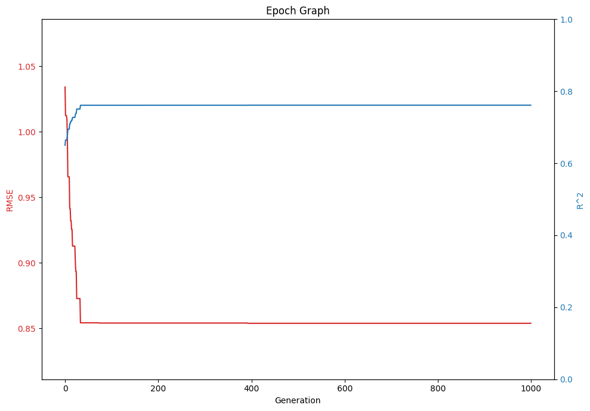
    


#### 3.1.2. Training with whole train set


```python
model = mt.GetModel(select,model_algo,n_component=descriptor)
```

    Path :/home/jun/pyqsar/pyqsar3r25
    Index   File Name
       0    qdb1_F_s.train
       1    qdb1_F_s_B.train


    Enter .train file index to load :  1


    
    


```python
# training with whole train set 
model.train_plot()
```


<div class="bk-root">
        <a href="https://bokeh.org" target="_blank" class="bk-logo bk-logo-small bk-logo-notebook"></a>
        <span id="1108">Loading BokehJS ...</span>
    </div>


<div>
<style scoped>
    .dataframe tbody tr th:only-of-type {
        vertical-align: middle;
    }

    .dataframe tbody tr th {
        vertical-align: top;
    }

    .dataframe thead th {
        text-align: right;
    }
</style>
<table border="1" class="dataframe">
  <thead>
    <tr style="text-align: right;">
      <th></th>
      <th>GATS1i</th>
      <th>NddC</th>
      <th>SMR_VSA9</th>
      <th>SpAbs_A</th>
      <th>Xp-0dv</th>
    </tr>
  </thead>
  <tbody>
    <tr>
      <th>Coef Value</th>
      <td>0.650119</td>
      <td>-0.307476</td>
      <td>-0.37946</td>
      <td>0.800424</td>
      <td>-1.744295</td>
    </tr>
  </tbody>
</table>
</div>


<div class="bk-root" id="3fb6bcc7-c966-409b-bc32-80baeb2abb1f" data-root-id="1111"></div>


<h3> 3.1.3. Train with cross validation </h3>


```python
# Cross Validation 
model.k_fold() # default : k=5, run=1000
```

    sklearn R^2CV mean: 0.762429
    sklearn Q^2CV mean: 0.752753
    RMSE CV : 0.873862
    Features set = ['GATS1i', 'NddC', 'SMR_VSA9', 'SpAbs_A', 'Xp-0dv']


<div class="bk-root" id="d36be0cc-fb57-4345-8e1c-efe52e458665" data-root-id="1229"></div>


#### 3.1.4. Analysis


```python
# Values for selected descriptor, EP, predicted  values, Error 
model.features_table()
```


<div>
<style scoped>
    .dataframe tbody tr th:only-of-type {
        vertical-align: middle;
    }

    .dataframe tbody tr th {
        vertical-align: top;
    }

    .dataframe thead th {
        text-align: right;
    }
</style>
<table border="1" class="dataframe">
  <thead>
    <tr style="text-align: right;">
      <th></th>
      <th>GATS1i</th>
      <th>NddC</th>
      <th>SMR_VSA9</th>
      <th>SpAbs_A</th>
      <th>Xp-0dv</th>
      <th>EP</th>
      <th>Predict</th>
      <th>Error</th>
    </tr>
    <tr>
      <th>ID</th>
      <th></th>
      <th></th>
      <th></th>
      <th></th>
      <th></th>
      <th></th>
      <th></th>
      <th></th>
    </tr>
  </thead>
  <tbody>
    <tr>
      <th>11859</th>
      <td>-0.995487</td>
      <td>-0.171398</td>
      <td>0.602304</td>
      <td>-0.257506</td>
      <td>-0.091129</td>
      <td>-5.46</td>
      <td>-5.472863</td>
      <td>0.012863</td>
    </tr>
    <tr>
      <th>11899</th>
      <td>-0.972881</td>
      <td>-0.171398</td>
      <td>-0.575593</td>
      <td>-0.112802</td>
      <td>-0.154874</td>
      <td>-4.66</td>
      <td>-4.784189</td>
      <td>0.124189</td>
    </tr>
    <tr>
      <th>2723704</th>
      <td>0.197154</td>
      <td>-0.171398</td>
      <td>-0.575593</td>
      <td>-1.157113</td>
      <td>-1.029226</td>
      <td>-3.98</td>
      <td>-3.334291</td>
      <td>-0.645709</td>
    </tr>
    <tr>
      <th>3032338</th>
      <td>0.249884</td>
      <td>-0.171398</td>
      <td>-0.575593</td>
      <td>-1.026855</td>
      <td>-0.822031</td>
      <td>-4.00</td>
      <td>-3.557157</td>
      <td>-0.442843</td>
    </tr>
    <tr>
      <th>2346</th>
      <td>-0.581662</td>
      <td>4.833418</td>
      <td>-0.575593</td>
      <td>-0.076781</td>
      <td>-0.307311</td>
      <td>-6.54</td>
      <td>-5.773984</td>
      <td>-0.766016</td>
    </tr>
    <tr>
      <th>...</th>
      <td>...</td>
      <td>...</td>
      <td>...</td>
      <td>...</td>
      <td>...</td>
      <td>...</td>
      <td>...</td>
      <td>...</td>
    </tr>
    <tr>
      <th>6348</th>
      <td>0.643948</td>
      <td>4.833418</td>
      <td>-0.575593</td>
      <td>-1.493278</td>
      <td>-1.279054</td>
      <td>-4.56</td>
      <td>-4.415984</td>
      <td>-0.144016</td>
    </tr>
    <tr>
      <th>2723790</th>
      <td>-0.985418</td>
      <td>-0.171398</td>
      <td>-0.575593</td>
      <td>-1.404159</td>
      <td>-1.299579</td>
      <td>-3.84</td>
      <td>-3.829269</td>
      <td>-0.010731</td>
    </tr>
    <tr>
      <th>2723949</th>
      <td>-0.812529</td>
      <td>-0.171398</td>
      <td>-0.575593</td>
      <td>-1.404159</td>
      <td>-1.175735</td>
      <td>-3.64</td>
      <td>-3.932891</td>
      <td>0.292891</td>
    </tr>
    <tr>
      <th>969491</th>
      <td>-0.539767</td>
      <td>-0.171398</td>
      <td>-0.575593</td>
      <td>1.643416</td>
      <td>1.924606</td>
      <td>-6.28</td>
      <td>-6.724121</td>
      <td>0.444121</td>
    </tr>
    <tr>
      <th>6228</th>
      <td>3.392620</td>
      <td>-0.171398</td>
      <td>-0.575593</td>
      <td>-1.157113</td>
      <td>-1.137432</td>
      <td>-0.70</td>
      <td>-1.068115</td>
      <td>0.368115</td>
    </tr>
  </tbody>
</table>
<p>194 rows × 8 columns</p>
</div>


```python
# Correlation between EP and Selected Descriptors 
model.feature_corr()
```


    
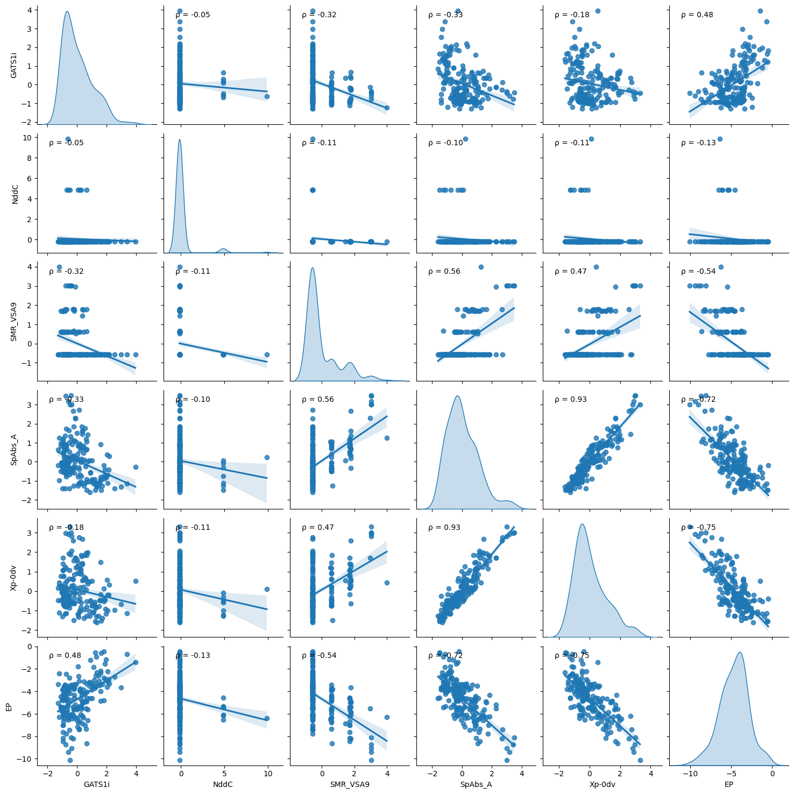
    


<div>
<style scoped>
    .dataframe tbody tr th:only-of-type {
        vertical-align: middle;
    }

    .dataframe tbody tr th {
        vertical-align: top;
    }

    .dataframe thead th {
        text-align: right;
    }
</style>
<table border="1" class="dataframe">
  <thead>
    <tr style="text-align: right;">
      <th></th>
      <th>GATS1i</th>
      <th>NddC</th>
      <th>SMR_VSA9</th>
      <th>SpAbs_A</th>
      <th>Xp-0dv</th>
      <th>EP</th>
    </tr>
  </thead>
  <tbody>
    <tr>
      <th>GATS1i</th>
      <td>1.000000</td>
      <td>-0.049496</td>
      <td>-0.323854</td>
      <td>-0.333575</td>
      <td>-0.176288</td>
      <td>0.479926</td>
    </tr>
    <tr>
      <th>NddC</th>
      <td>-0.049496</td>
      <td>1.000000</td>
      <td>-0.112251</td>
      <td>-0.102673</td>
      <td>-0.113369</td>
      <td>-0.130381</td>
    </tr>
    <tr>
      <th>SMR_VSA9</th>
      <td>-0.323854</td>
      <td>-0.112251</td>
      <td>1.000000</td>
      <td>0.561949</td>
      <td>0.468914</td>
      <td>-0.536796</td>
    </tr>
    <tr>
      <th>SpAbs_A</th>
      <td>-0.333575</td>
      <td>-0.102673</td>
      <td>0.561949</td>
      <td>1.000000</td>
      <td>0.926396</td>
      <td>-0.716174</td>
    </tr>
    <tr>
      <th>Xp-0dv</th>
      <td>-0.176288</td>
      <td>-0.113369</td>
      <td>0.468914</td>
      <td>0.926396</td>
      <td>1.000000</td>
      <td>-0.746864</td>
    </tr>
    <tr>
      <th>EP</th>
      <td>0.479926</td>
      <td>-0.130381</td>
      <td>-0.536796</td>
      <td>-0.716174</td>
      <td>-0.746864</td>
      <td>1.000000</td>
    </tr>
  </tbody>
</table>
</div>


```python
# Draw 2D images of selected molecules 
# to get a molecular ID, place mouse point on the dot  
mol = draw_mol.DrawMols(ID=['16115','6129','10107','40585'])
mol.show()
```

    Path :/home/jun/pyqsar/pyqsar3r25
    Index   File Name
       0    qdb1.sdf


    Enter .sdf file index to load :  0


    
    


    
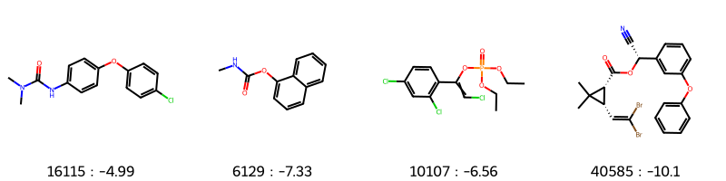
    


```python
# maximum common substructure of selected molecules
substr = mol.common_substr()
mol.show_substr(substr)
```


    
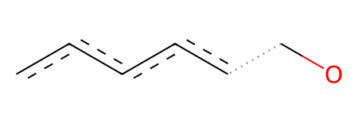
    


```python
# 3D Image
mol.show_3D()
```


    interactive(children=(Dropdown(description='ID', options=('16115', '6129', '10107', '40585'), value='16115'), …


### 3.1.5. Model Save


```python
model.save()
```

    Path :/home/jun/pyqsar/pyqsar3r25
    Index   File Name
       0    qdb1_F_standard.info


    Enter .info file index to load :  0


    
    


    Selected Algorithm in Feature Selection (MC/GA) :  MC
    Selected Model (MLR/PLS) :  MLR
    Enter model name to  save as
    (default) qdb1_F_s_B_MC_MLR.model
    - :  


    qdb1_F_s_B_MC_MLR.model file saved


## 4. Model Test 

#### ModelTest(test=True, scaled=True)
    * Model Test Part
    * If test is True, then show test R2, RMSE, and train/test plot
    * if test if False, Just show abut Train
    
    * Scaled False means test data is external, (not from split module) so if scaled=False, scale the test data by scale_obj above stetp


```python
from pyqsar import data_tools as dt
from pyqsar import model_tools as mt
from pyqsar import draw_mol
import pandas as pd
import numpy as np
```

## 4.1. Test on test set


```python
ModelTest = mt.ModelTest()
```

    Path :/home/jun/pyqsar/pyqsar3r25
    Index   File Name
       0    qdb1_F_s_B_MC_MLR.model


    Enter .model file index to load :  0


    
    


<div>
<style scoped>
    .dataframe tbody tr th:only-of-type {
        vertical-align: middle;
    }

    .dataframe tbody tr th {
        vertical-align: top;
    }

    .dataframe thead th {
        text-align: right;
    }
</style>
<table border="1" class="dataframe">
  <thead>
    <tr style="text-align: right;">
      <th></th>
      <th>GATS1i</th>
      <th>NddC</th>
      <th>SMR_VSA9</th>
      <th>SpAbs_A</th>
      <th>Xp-0dv</th>
      <th>Description</th>
    </tr>
    <tr>
      <th>Row</th>
      <th></th>
      <th></th>
      <th></th>
      <th></th>
      <th></th>
      <th></th>
    </tr>
  </thead>
  <tbody>
    <tr>
      <th>Scale</th>
      <td>0.277416</td>
      <td>0.878603</td>
      <td>21.954656</td>
      <td>0.294521</td>
      <td>0.066528</td>
      <td>Per feature relative scaling of the data to ac...</td>
    </tr>
    <tr>
      <th>Mean</th>
      <td>0.918409</td>
      <td>0.284247</td>
      <td>26.083008</td>
      <td>0.047945</td>
      <td>0.496183</td>
      <td>The mean value for each feature in the trainin...</td>
    </tr>
    <tr>
      <th>Var</th>
      <td>0.076960</td>
      <td>0.771944</td>
      <td>482.006927</td>
      <td>0.086742</td>
      <td>0.004426</td>
      <td>The variance for each feature in the training set</td>
    </tr>
    <tr>
      <th>Coef</th>
      <td>0.650119</td>
      <td>-0.307476</td>
      <td>-0.379460</td>
      <td>0.800424</td>
      <td>-1.744295</td>
      <td>Coef value of each feature</td>
    </tr>
    <tr>
      <th>Padel Index</th>
      <td>350.000000</td>
      <td>581.000000</td>
      <td>763.000000</td>
      <td>3.000000</td>
      <td>537.000000</td>
      <td>PaDEL descriptor index</td>
    </tr>
  </tbody>
</table>
</div>


<div>
<style scoped>
    .dataframe tbody tr th:only-of-type {
        vertical-align: middle;
    }

    .dataframe tbody tr th {
        vertical-align: top;
    }

    .dataframe thead th {
        text-align: right;
    }
</style>
<table border="1" class="dataframe">
  <thead>
    <tr style="text-align: right;">
      <th></th>
      <th>GATS1i</th>
      <th>NddC</th>
      <th>SMR_VSA9</th>
      <th>SpAbs_A</th>
      <th>Xp-0dv</th>
      <th>EP</th>
      <th>Predict</th>
      <th>Error</th>
    </tr>
    <tr>
      <th>ID</th>
      <th></th>
      <th></th>
      <th></th>
      <th></th>
      <th></th>
      <th></th>
      <th></th>
      <th></th>
    </tr>
  </thead>
  <tbody>
    <tr>
      <th>11859</th>
      <td>-0.995487</td>
      <td>-0.171398</td>
      <td>0.602304</td>
      <td>-0.257506</td>
      <td>-0.091129</td>
      <td>-5.46</td>
      <td>-5.472863</td>
      <td>0.012863</td>
    </tr>
    <tr>
      <th>11899</th>
      <td>-0.972881</td>
      <td>-0.171398</td>
      <td>-0.575593</td>
      <td>-0.112802</td>
      <td>-0.154874</td>
      <td>-4.66</td>
      <td>-4.784189</td>
      <td>0.124189</td>
    </tr>
    <tr>
      <th>2723704</th>
      <td>0.197154</td>
      <td>-0.171398</td>
      <td>-0.575593</td>
      <td>-1.157113</td>
      <td>-1.029226</td>
      <td>-3.98</td>
      <td>-3.334291</td>
      <td>-0.645709</td>
    </tr>
    <tr>
      <th>3032338</th>
      <td>0.249884</td>
      <td>-0.171398</td>
      <td>-0.575593</td>
      <td>-1.026855</td>
      <td>-0.822031</td>
      <td>-4.00</td>
      <td>-3.557157</td>
      <td>-0.442843</td>
    </tr>
    <tr>
      <th>2346</th>
      <td>-0.581662</td>
      <td>4.833418</td>
      <td>-0.575593</td>
      <td>-0.076781</td>
      <td>-0.307311</td>
      <td>-6.54</td>
      <td>-5.773984</td>
      <td>-0.766016</td>
    </tr>
    <tr>
      <th>...</th>
      <td>...</td>
      <td>...</td>
      <td>...</td>
      <td>...</td>
      <td>...</td>
      <td>...</td>
      <td>...</td>
      <td>...</td>
    </tr>
    <tr>
      <th>6348</th>
      <td>0.643948</td>
      <td>4.833418</td>
      <td>-0.575593</td>
      <td>-1.493278</td>
      <td>-1.279054</td>
      <td>-4.56</td>
      <td>-4.415984</td>
      <td>-0.144016</td>
    </tr>
    <tr>
      <th>2723790</th>
      <td>-0.985418</td>
      <td>-0.171398</td>
      <td>-0.575593</td>
      <td>-1.404159</td>
      <td>-1.299579</td>
      <td>-3.84</td>
      <td>-3.829269</td>
      <td>-0.010731</td>
    </tr>
    <tr>
      <th>2723949</th>
      <td>-0.812529</td>
      <td>-0.171398</td>
      <td>-0.575593</td>
      <td>-1.404159</td>
      <td>-1.175735</td>
      <td>-3.64</td>
      <td>-3.932891</td>
      <td>0.292891</td>
    </tr>
    <tr>
      <th>969491</th>
      <td>-0.539767</td>
      <td>-0.171398</td>
      <td>-0.575593</td>
      <td>1.643416</td>
      <td>1.924606</td>
      <td>-6.28</td>
      <td>-6.724121</td>
      <td>0.444121</td>
    </tr>
    <tr>
      <th>6228</th>
      <td>3.392620</td>
      <td>-0.171398</td>
      <td>-0.575593</td>
      <td>-1.157113</td>
      <td>-1.137432</td>
      <td>-0.70</td>
      <td>-1.068115</td>
      <td>0.368115</td>
    </tr>
  </tbody>
</table>
<p>194 rows × 8 columns</p>
</div>


<div>
<style scoped>
    .dataframe tbody tr th:only-of-type {
        vertical-align: middle;
    }

    .dataframe tbody tr th {
        vertical-align: top;
    }

    .dataframe thead th {
        text-align: right;
    }
</style>
<table border="1" class="dataframe">
  <thead>
    <tr style="text-align: right;">
      <th></th>
      <th>Value</th>
    </tr>
    <tr>
      <th>Row</th>
      <th></th>
    </tr>
  </thead>
  <tbody>
    <tr>
      <th>R2_CV</th>
      <td>0.7624294186002666</td>
    </tr>
    <tr>
      <th>Q2_CV</th>
      <td>0.7527528997291147</td>
    </tr>
    <tr>
      <th>RMSE_CV</th>
      <td>0.8738619202147496</td>
    </tr>
    <tr>
      <th>Model_Algo</th>
      <td>MLR</td>
    </tr>
    <tr>
      <th>Preprocessing</th>
      <td>standard</td>
    </tr>
  </tbody>
</table>
</div>


```python
ModelTest.model_test(scaled=True)
```

    Path :/home/jun/pyqsar/pyqsar3r25
    Index   File Name
       0    qdb1_F_s.test
       1    qdb1_F_s_B.test


    Enter .test file index to load :  1


    
    


<div class="bk-root" id="8fb5248e-f1ba-4f54-bbe6-f2bec30e21e7" data-root-id="1385"></div>


    Test R2 : 0.562727
    Test RMSE : 1.177887


```python
# Draw 2D images of selected molecules 
# to get a molecular ID, place mouse point on the dot  
mol = draw_mol.DrawMols(ID=['61198','7847','9395'])
mol.show()
```

    Path :/home/jun/pyqsar/pyqsar3r25
    Index   File Name
       0    qdb1.sdf


    Enter .sdf file index to load :  0


    
    


    
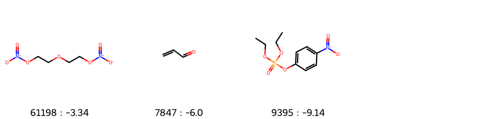
    


```python
# maximum common substructure of selected molecules
substr = mol.common_substr()
mol.show_substr(substr)
```


    

    


## 4.2. Test on new molecules


```python
ModelTest.editor()
```


<style>.bk-root, .bk-root .bk:before, .bk-root .bk:after {
  font-family: var(--jp-ui-font-size1);
  font-size: var(--jp-ui-font-size1);
  color: var(--jp-ui-font-color1);
}
</style>


<div id='1551'>
  <div class="bk-root" id="3bbcfb37-7c17-42ba-8c59-321c59d01d78" data-root-id="1551"></div>
</div>
<script type="application/javascript">(function(root) {
  function embed_document(root) {
    var docs_json = {"8c58dbed-5aeb-4108-8f9f-7243b423d783":{"defs":[{"extends":null,"module":null,"name":"ReactiveHTML1","overrides":[],"properties":[]},{"extends":null,"module":null,"name":"FlexBox1","overrides":[],"properties":[{"default":"flex-start","kind":null,"name":"align_content"},{"default":"flex-start","kind":null,"name":"align_items"},{"default":"row","kind":null,"name":"flex_direction"},{"default":"wrap","kind":null,"name":"flex_wrap"},{"default":"flex-start","kind":null,"name":"justify_content"}]},{"extends":null,"module":null,"name":"GridStack1","overrides":[],"properties":[{"default":"warn","kind":null,"name":"mode"},{"default":null,"kind":null,"name":"ncols"},{"default":null,"kind":null,"name":"nrows"},{"default":true,"kind":null,"name":"allow_resize"},{"default":true,"kind":null,"name":"allow_drag"},{"default":[],"kind":null,"name":"state"}]},{"extends":null,"module":null,"name":"click1","overrides":[],"properties":[{"default":"","kind":null,"name":"terminal_output"},{"default":"","kind":null,"name":"debug_name"},{"default":0,"kind":null,"name":"clears"}]},{"extends":null,"module":null,"name":"NotificationAreaBase1","overrides":[],"properties":[{"default":"bottom-right","kind":null,"name":"position"},{"default":0,"kind":null,"name":"_clear"}]},{"extends":null,"module":null,"name":"NotificationArea1","overrides":[],"properties":[{"default":[],"kind":null,"name":"notifications"},{"default":"bottom-right","kind":null,"name":"position"},{"default":0,"kind":null,"name":"_clear"},{"default":[{"background":"#ffc107","icon":{"className":"fas fa-exclamation-triangle","color":"white","tagName":"i"},"type":"warning"},{"background":"#007bff","icon":{"className":"fas fa-info-circle","color":"white","tagName":"i"},"type":"info"}],"kind":null,"name":"types"}]},{"extends":null,"module":null,"name":"Notification","overrides":[],"properties":[{"default":null,"kind":null,"name":"background"},{"default":3000,"kind":null,"name":"duration"},{"default":null,"kind":null,"name":"icon"},{"default":"","kind":null,"name":"message"},{"default":null,"kind":null,"name":"notification_type"},{"default":false,"kind":null,"name":"_destroyed"}]},{"extends":null,"module":null,"name":"TemplateActions1","overrides":[],"properties":[{"default":0,"kind":null,"name":"open_modal"},{"default":0,"kind":null,"name":"close_modal"}]},{"extends":null,"module":null,"name":"MaterialTemplateActions1","overrides":[],"properties":[{"default":0,"kind":null,"name":"open_modal"},{"default":0,"kind":null,"name":"close_modal"}]}],"roots":{"references":[{"attributes":{"children":[{"id":"1555"},{"id":"1558"},{"id":"1559"},{"id":"1560"}],"margin":[0,0,0,0],"name":"Column00112","sizing_mode":"stretch_width"},"id":"1554","type":"Column"},{"attributes":{"height":30,"margin":[5,10,5,10],"max_length":5000,"placeholder":"Enter File Name; File Extension is .csv ","sizing_mode":"fixed","width":400},"id":"1559","type":"TextAreaInput"},{"attributes":{"children":[{"id":"1556"},{"id":"1557"}],"margin":[5,5,5,5],"name":"","sizing_mode":"stretch_width","width":300},"id":"1555","type":"Column"},{"attributes":{"disabled":true,"height":50,"margin":[5,10,5,10],"max_length":5000,"sizing_mode":"fixed","title":"SMILES","width":400},"id":"1557","type":"TextAreaInput"},{"attributes":{"button_type":"primary","icon":null,"label":"Evaluation","margin":[5,10,5,10],"sizing_mode":"stretch_width","subscribed_events":["button_click"]},"id":"1561","type":"Button"},{"attributes":{"margin":[5,10,5,10],"name":"","sizing_mode":"stretch_width","text":"<b></b>"},"id":"1556","type":"Div"},{"attributes":{"active":[0],"labels":["New File?"],"margin":[5,10,5,10],"sizing_mode":"stretch_width"},"id":"1558","type":"CheckboxGroup"},{"attributes":{"height":320,"margin":[5,10,5,10],"max_length":5000,"sizing_mode":"fixed","value":"Ready","width":400},"id":"1560","type":"TextAreaInput"},{"attributes":{"children":[{"id":"1552"},{"id":"1561"}],"margin":[0,0,0,0],"name":"Column00114","sizing_mode":"stretch_width"},"id":"1551","type":"Column"},{"attributes":{"format":"smiles","guicolor":"#c0c0c0","height":500,"jme":"Not Subscribed","margin":[5,10,5,10],"mol":"Not Subscribed","mol3000":"Not Subscribed","name":"","sdf":"Not Subscribed","sizing_mode":"stretch_width","smiles":"Not Subscribed"},"id":"1553","type":"panel_chemistry.bokeh_extensions.jsme_editor.JSMEEditor"},{"attributes":{"children":[{"id":"1553"},{"id":"1554"}],"margin":[0,0,0,0],"name":"Row00113","sizing_mode":"stretch_width"},"id":"1552","type":"Row"},{"attributes":{"client_comm_id":"98666e793bfe471a9114460cdb3ff05a","comm_id":"700eabd67a974f0e9e3084056a735a52","plot_id":"1551"},"id":"1562","type":"panel.models.comm_manager.CommManager"},{"attributes":{"reload":false},"id":"1563","type":"panel.models.location.Location"}],"root_ids":["1551","1562","1563"]},"title":"Bokeh Application","version":"2.4.3"}};
    var render_items = [{"docid":"8c58dbed-5aeb-4108-8f9f-7243b423d783","root_ids":["1551"],"roots":{"1551":"3bbcfb37-7c17-42ba-8c59-321c59d01d78"}}];
    root.Bokeh.embed.embed_items_notebook(docs_json, render_items);
    for (const render_item of render_items) {
      for (const root_id of render_item.root_ids) {
	const id_el = document.getElementById(root_id)
	if (id_el.children.length && (id_el.children[0].className === 'bk-root')) {
	  const root_el = id_el.children[0]
	  root_el.id = root_el.id + '-rendered'
	}
      }
    }
  }
  if (root.Bokeh !== undefined && root.Bokeh.Panel !== undefined) {
    embed_document(root);
  } else {
    var attempts = 0;
    var timer = setInterval(function(root) {
      if (root.Bokeh !== undefined && root.Bokeh.Panel !== undefined) {
        clearInterval(timer);
        embed_document(root);
      } else if (document.readyState == "complete") {
        attempts++;
        if (attempts > 200) {
          clearInterval(timer);
          console.log("Bokeh: ERROR: Unable to run BokehJS code because BokehJS library is missing");
        }
      }
    }, 25, root)
  }
})(window);</script>


```python
ModelTest.new_molecule('new.csv')
```

# Below is the exmaple for Genetic Algorithm 

# Sample for GA + MLR 

### Genetic Algorithm
    selection(X_train, y_train, clust_info, clustering, model, pop_info, n_pop_size, N_generation, component)
    X_train : Descriptor Data
    y_train : end point
    clust_info : clustering informatino after clustering
    clustering : method of clustering
        Possible : 'hierarchical', 'kmeans', 'som'
    model : model algorithm
        Possible : 'PLS', 'MLR'
    pop_info
        None = start with empty
        population = used previous data continuously
    N_generation : # learning
    n_pop_size : # bank
    component : # descriptor


```python
from pyqsar import data_tools as dt
from pyqsar import model_tools as mt
from pyqsar import draw_mol
import pandas as pd
import numpy as np
# Train 데이터를 Descriptor에 해당하는 부분과 EP에 해당하는 값으로 나누는 단계
X_train, y_train = mt.split_xy('.train')
```

    Path :/home/jun/pyqsar/pyqsar3r25
    Index   File Name
       0    qdb1_F_s.train
       1    qdb1_F_s_B.train


    Enter .train file index to load :  1


    
    


```python
# GA + PLS을 이용한 Feature Selection 예
descriptor = 5
model_algo='MLR'
N_learning = 200
N_bank = 200
N_component = descriptor
select, population = mt.selection_ga(X_train,y_train,model=model_algo,
                                     pop_info=None,
                                     #pop_info=population,
                                     n_pop_size=N_bank,
                                     N_generation=N_learning,
                                     component=N_component,
                                    )
```

    MLR
    Index   File Name
    0       qdb1_F_s_B_kmeans.cluster
    1       qdb1_F_s_B_som.cluster
    2       qdb1_F_s_kmeans.cluster
    3       qdb1_F_s_som.cluster
    4       qdb1_F_s_hierarchical.cluster
    
    


    Enter Clust Info File Index :  0


    qdb1_F_s_B_kmeans.cluster    file selected
    
    ---------------  Initialization  ---------------


      0%|          | 0/200 [00:00<?, ?it/s]


      1.023459   0.657182   0.896157% 
    Generation        RMSD        R2      Portion
             1 :   0.932336   0.715509   1.075042% 
             2 :   0.932336   0.715509   0.916662% 
             3 :   0.920281   0.722819   0.858753% 
             4 :   0.920281   0.722819   0.772628% 
             5 :   0.920281   0.722819   0.723299% 
             6 :   0.918280   0.724022   0.667369% 
             7 :   0.909156   0.729480   0.656658% 
             8 :   0.909156   0.729480   0.615554% 
             9 :   0.904750   0.732095   0.610864% 
            10 :   0.904750   0.732095   0.601702% 
            11 :   0.904750   0.732095   0.575212% 
            12 :   0.904750   0.732095   0.574346% 
            13 :   0.904750   0.732095   0.559688% 
            14 :   0.904750   0.732095   0.536423% 
            15 :   0.890763   0.740315   0.567041% 
            16 :   0.890763   0.740315   0.566254% 
            17 :   0.890763   0.740315   0.569545% 
            18 :   0.890763   0.740315   0.557126% 
            19 :   0.890763   0.740315   0.567638% 
            20 :   0.886450   0.742823   0.578561% 
            21 :   0.884638   0.743873   0.555912% 
            22 :   0.875943   0.748884   0.572390% 
            23 :   0.860984   0.757387   0.616812% 
            24 :   0.860984   0.757387   0.594476% 
            25 :   0.860984   0.757387   0.601345% 
            26 :   0.858075   0.759024   0.604617% 
            27 :   0.858075   0.759024   0.602086% 
            28 :   0.858075   0.759024   0.608674% 
            29 :   0.858075   0.759024   0.602948% 
            30 :   0.858075   0.759024   0.611481% 
            31 :   0.858075   0.759024   0.612383% 
            32 :   0.858075   0.759024   0.593617% 
            33 :   0.858075   0.759024   0.595281% 
            34 :   0.858075   0.759024   0.566684% 
            35 :   0.858075   0.759024   0.588956% 
            36 :   0.858075   0.759024   0.598461% 
            37 :   0.858075   0.759024   0.590095% 
            38 :   0.858075   0.759024   0.594964% 
            39 :   0.858075   0.759024   0.577448% 
            40 :   0.858075   0.759024   0.594622% 
            41 :   0.858075   0.759024   0.602755% 
            42 :   0.850381   0.763326   0.589734% 
            43 :   0.850381   0.763326   0.601404% 
            44 :   0.850381   0.763326   0.638427% 
            45 :   0.850381   0.763326   0.631942% 
            46 :   0.850381   0.763326   0.610559% 
            47 :   0.850381   0.763326   0.595082% 
            48 :   0.850215   0.763419   0.567399% 
            49 :   0.850215   0.763419   0.594726% 
            50 :   0.850215   0.763419   0.599074% 
            51 :   0.850215   0.763419   0.601234% 
            52 :   0.850215   0.763419   0.588719% 
            53 :   0.850215   0.763419   0.606841% 
            54 :   0.850215   0.763419   0.588262% 
            55 :   0.850215   0.763419   0.610245% 
            56 :   0.850215   0.763419   0.596253% 
            57 :   0.850215   0.763419   0.605206% 
            58 :   0.850215   0.763419   0.567937% 
            59 :   0.850215   0.763419   0.614141% 
            60 :   0.850215   0.763419   0.593419% 
            61 :   0.850215   0.763419   0.610180% 
            62 :   0.850215   0.763419   0.595413% 
            63 :   0.850215   0.763419   0.606065% 
            64 :   0.850215   0.763419   0.595287% 
            65 :   0.844810   0.766417   0.599449% 
            66 :   0.844810   0.766417   0.588064% 
            67 :   0.844810   0.766417   0.610841% 
            68 :   0.844810   0.766417   0.578432% 
            69 :   0.842796   0.767529   0.614661% 
            70 :   0.842796   0.767529   0.616812% 
            71 :   0.842796   0.767529   0.611121% 
            72 :   0.842796   0.767529   0.586034% 
            73 :   0.842796   0.767529   0.608772% 
            74 :   0.842796   0.767529   0.637771% 
            75 :   0.842796   0.767529   0.653855% 
            76 :   0.842796   0.767529   0.630697% 
            77 :   0.842796   0.767529   0.656531% 
            78 :   0.842796   0.767529   0.596226% 
            79 :   0.842796   0.767529   0.645798% 
            80 :   0.842796   0.767529   0.624628% 
            81 :   0.842796   0.767529   0.628077% 
            82 :   0.841839   0.768057   0.643363% 
            83 :   0.841839   0.768057   0.640988% 
            84 :   0.841839   0.768057   0.647340% 
            85 :   0.841839   0.768057   0.646072% 
            86 :   0.841839   0.768057   0.638042% 
            87 :   0.841839   0.768057   0.622135% 
            88 :   0.841839   0.768057   0.643509% 
            89 :   0.841839   0.768057   0.649068% 
            90 :   0.841839   0.768057   0.650728% 
            91 :   0.841839   0.768057   0.626636% 
            92 :   0.841839   0.768057   0.661544% 
            93 :   0.841839   0.768057   0.681305% 
            94 :   0.841839   0.768057   0.646065% 
            95 :   0.841839   0.768057   0.621469% 
            96 :   0.834891   0.771870   0.650749% 
            97 :   0.834891   0.771870   0.692281% 
            98 :   0.834891   0.771870   0.652003% 
            99 :   0.834891   0.771870   0.656738% 
           100 :   0.834891   0.771870   0.621883% 
           101 :   0.834891   0.771870   0.683390% 
           102 :   0.834891   0.771870   0.688958% 
           103 :   0.834891   0.771870   0.707486% 
           104 :   0.834891   0.771870   0.712590% 
           105 :   0.834891   0.771870   0.699436% 
           106 :   0.834891   0.771870   0.696882% 
           107 :   0.834891   0.771870   0.688858% 
           108 :   0.834891   0.771870   0.688719% 
           109 :   0.834891   0.771870   0.689320% 
           110 :   0.834891   0.771870   0.673938% 
           111 :   0.834891   0.771870   0.688842% 
           112 :   0.834891   0.771870   0.731186% 
           113 :   0.834891   0.771870   0.739667% 
           114 :   0.834891   0.771870   0.685925% 
           115 :   0.834891   0.771870   0.677661% 
           116 :   0.834891   0.771870   0.701339% 
           117 :   0.834891   0.771870   0.700543% 
           118 :   0.834891   0.771870   0.745563% 
           119 :   0.834891   0.771870   0.756046% 
           120 :   0.834891   0.771870   0.706712% 
           121 :   0.834891   0.771870   0.734583% 
           122 :   0.834891   0.771870   0.731948% 
           123 :   0.834891   0.771870   0.708713% 
           124 :   0.834891   0.771870   0.716997% 
           125 :   0.834891   0.771870   0.730688% 
           126 :   0.834891   0.771870   0.719982% 
           127 :   0.834891   0.771870   0.694916% 
           128 :   0.834891   0.771870   0.698458% 
           129 :   0.834891   0.771870   0.742783% 
           130 :   0.834891   0.771870   0.710483% 
           131 :   0.834891   0.771870   0.710101% 
           132 :   0.834891   0.771870   0.709370% 
           133 :   0.834891   0.771870   0.724714% 
           134 :   0.834891   0.771870   0.696862% 
           135 :   0.834891   0.771870   0.729289% 
           136 :   0.834891   0.771870   0.740347% 
           137 :   0.834891   0.771870   0.763258% 
           138 :   0.834891   0.771870   0.730993% 
           139 :   0.834891   0.771870   0.748140% 
           140 :   0.834891   0.771870   0.774732% 
           141 :   0.834891   0.771870   0.759414% 
           142 :   0.834891   0.771870   0.735120% 
           143 :   0.834891   0.771870   0.734554% 
           144 :   0.834891   0.771870   0.742146% 
           145 :   0.834891   0.771870   0.710556% 
           146 :   0.834891   0.771870   0.716994% 
           147 :   0.834891   0.771870   0.744108% 
           148 :   0.834891   0.771870   0.741567% 
           149 :   0.834891   0.771870   0.744557% 
           150 :   0.834891   0.771870   0.723289% 
           151 :   0.834891   0.771870   0.797403% 
           152 :   0.834891   0.771870   0.777516% 
           153 :   0.834891   0.771870   0.727969% 
           154 :   0.834891   0.771870   0.748080% 
           155 :   0.834891   0.771870   0.734471% 
           156 :   0.834891   0.771870   0.725796% 
           157 :   0.834891   0.771870   0.689813% 
           158 :   0.834891   0.771870   0.719328% 
           159 :   0.834891   0.771870   0.739740% 
           160 :   0.834891   0.771870   0.748382% 
           161 :   0.834891   0.771870   0.762900% 
           162 :   0.834891   0.771870   0.769227% 
           163 :   0.834891   0.771870   0.748044% 
           164 :   0.834891   0.771870   0.770813% 
           165 :   0.834891   0.771870   2.003274% 
           166 :   0.834891   0.771870   1.135646% 
           167 :   0.834891   0.771870   0.848887% 
           168 :   0.834891   0.771870   0.732654% 
           169 :   0.834891   0.771870   0.698804% 
           170 :   0.834891   0.771870   0.641889% 
           171 :   0.834891   0.771870   0.630723% 
           172 :   0.834891   0.771870   0.607518% 
           173 :   0.834891   0.771870   0.621363% 
           174 :   0.834891   0.771870   0.658822% 
           175 :   0.834891   0.771870   0.622790% 
           176 :   0.834891   0.771870   0.649694% 
           177 :   0.834891   0.771870   0.613736% 
           178 :   0.834891   0.771870   0.597820% 
           179 :   0.834891   0.771870   0.623882% 
           180 :   0.834891   0.771870   0.652260% 
           181 :   0.834891   0.771870   0.661051% 
           182 :   0.834891   0.771870   0.640270% 
           183 :   0.834891   0.771870   0.656483% 
           184 :   0.834891   0.771870   0.651284% 
           185 :   0.834891   0.771870   0.646368% 
           186 :   0.834891   0.771870   0.631881% 
           187 :   0.834891   0.771870   0.678613% 
           188 :   0.834891   0.771870   0.675008% 
           189 :   0.834891   0.771870   0.654332% 
           190 :   0.834891   0.771870   0.696828% 
           191 :   0.834891   0.771870   0.642341% 
           192 :   0.834891   0.771870   0.635671% 
           193 :   0.834891   0.771870   0.649271% 
           194 :   0.834891   0.771870   0.640641% 
           195 :   0.834891   0.771870   0.677181% 
           196 :   0.834891   0.771870   0.661407% 
           197 :   0.834891   0.771870   0.662011% 
           198 :   0.834891   0.771870   0.654082% 
           199 :   0.834891   0.771870   0.646612% 
           200 : ---------------  End of Generation  ---------------
    Fit Val   RMSE    R2      Portion 
    1.5886    0.8349  0.7719  0.647%  ['ATSC4p', 'MIC1', 'NddC', 'SlogP_VSA2', 'Xp-0dv']
    1.5354    0.8411  0.7685  0.625%  ['JGI9', 'MIC1', 'NddC', 'SlogP_VSA2', 'Xp-0dv']
    1.5344    0.8412  0.7684  0.625%  ['MIC1', 'NddC', 'SlogP_VSA2', 'VSA_EState9', 'Xp-0dv']
    qdb1_F_s_B_ga_MLR_kmeans.log  is saved!


#### Epoch Graph


```python
mt.Draw_epoch()
```

    Index   File Name
    0       qdb1_F_s_B_mc_MLR_som.log
    1       qdb1_F_s_B_ga_MLR_kmeans.log
    
    


    Enter Clust Info File Index :  1


    qdb1_F_s_B_ga_MLR_kmeans.log    file selected
    


    
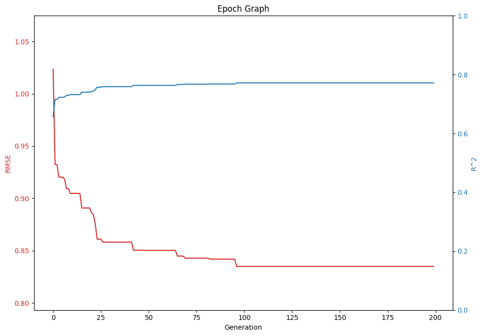
    


#### Model Information and Save


```python
model = mt.GetModel(select,model_algo,descriptor)
```

    Path :/home/jun/pyqsar/pyqsar3r25
    Index   File Name
       0    qdb1_F_s.train
       1    qdb1_F_s_B.train


    Enter .train file index to load :  1


    
    


```python
model.train_plot()
```


<div class="bk-root">
        <a href="https://bokeh.org" target="_blank" class="bk-logo bk-logo-small bk-logo-notebook"></a>
        <span id="1582">Loading BokehJS ...</span>
    </div>


<div>
<style scoped>
    .dataframe tbody tr th:only-of-type {
        vertical-align: middle;
    }

    .dataframe tbody tr th {
        vertical-align: top;
    }

    .dataframe thead th {
        text-align: right;
    }
</style>
<table border="1" class="dataframe">
  <thead>
    <tr style="text-align: right;">
      <th></th>
      <th>ATSC4p</th>
      <th>MIC1</th>
      <th>NddC</th>
      <th>SlogP_VSA2</th>
      <th>Xp-0dv</th>
    </tr>
  </thead>
  <tbody>
    <tr>
      <th>Coef Value</th>
      <td>0.206766</td>
      <td>-0.349078</td>
      <td>-0.313306</td>
      <td>0.633987</td>
      <td>-1.280102</td>
    </tr>
  </tbody>
</table>
</div>


<div class="bk-root" id="1d840afc-be03-4065-ab77-c70d4b2864cb" data-root-id="1585"></div>


```python
model.k_fold()
```

    sklearn R^2CV mean: 0.773204
    sklearn Q^2CV mean: 0.759639
    RMSE CV : 0.85897
    Features set = ['ATSC4p', 'MIC1', 'NddC', 'SlogP_VSA2', 'Xp-0dv']


<div class="bk-root" id="4ed496e7-0a26-45b4-be6e-0e7aa3e1c28a" data-root-id="1741"></div>


```python
model.features_table()
```


<div>
<style scoped>
    .dataframe tbody tr th:only-of-type {
        vertical-align: middle;
    }

    .dataframe tbody tr th {
        vertical-align: top;
    }

    .dataframe thead th {
        text-align: right;
    }
</style>
<table border="1" class="dataframe">
  <thead>
    <tr style="text-align: right;">
      <th></th>
      <th>ATSC4p</th>
      <th>MIC1</th>
      <th>NddC</th>
      <th>SlogP_VSA2</th>
      <th>Xp-0dv</th>
      <th>EP</th>
      <th>Predict</th>
      <th>Error</th>
    </tr>
    <tr>
      <th>ID</th>
      <th></th>
      <th></th>
      <th></th>
      <th></th>
      <th></th>
      <th></th>
      <th></th>
      <th></th>
    </tr>
  </thead>
  <tbody>
    <tr>
      <th>11859</th>
      <td>0.400891</td>
      <td>1.010308</td>
      <td>-0.171398</td>
      <td>-0.521548</td>
      <td>-0.091129</td>
      <td>-5.46</td>
      <td>-5.041991</td>
      <td>-0.418009</td>
    </tr>
    <tr>
      <th>11899</th>
      <td>0.160976</td>
      <td>1.472546</td>
      <td>-0.171398</td>
      <td>-0.537675</td>
      <td>-0.154874</td>
      <td>-4.66</td>
      <td>-5.181579</td>
      <td>0.521579</td>
    </tr>
    <tr>
      <th>2723704</th>
      <td>-0.430709</td>
      <td>-0.026408</td>
      <td>-0.171398</td>
      <td>0.099304</td>
      <td>-1.029226</td>
      <td>-3.98</td>
      <td>-3.257571</td>
      <td>-0.722429</td>
    </tr>
    <tr>
      <th>3032338</th>
      <td>0.105913</td>
      <td>-0.062641</td>
      <td>-0.171398</td>
      <td>0.055038</td>
      <td>-0.822031</td>
      <td>-4.00</td>
      <td>-3.427263</td>
      <td>-0.572737</td>
    </tr>
    <tr>
      <th>2346</th>
      <td>0.271452</td>
      <td>-0.094217</td>
      <td>4.833418</td>
      <td>-0.516730</td>
      <td>-0.307311</td>
      <td>-6.54</td>
      <td>-5.971437</td>
      <td>-0.568563</td>
    </tr>
    <tr>
      <th>...</th>
      <td>...</td>
      <td>...</td>
      <td>...</td>
      <td>...</td>
      <td>...</td>
      <td>...</td>
      <td>...</td>
      <td>...</td>
    </tr>
    <tr>
      <th>6348</th>
      <td>0.375887</td>
      <td>-0.982260</td>
      <td>4.833418</td>
      <td>-0.591293</td>
      <td>-1.279054</td>
      <td>-4.56</td>
      <td>-4.443189</td>
      <td>-0.116811</td>
    </tr>
    <tr>
      <th>2723790</th>
      <td>0.716717</td>
      <td>-0.407856</td>
      <td>-0.171398</td>
      <td>-0.521028</td>
      <td>-1.299579</td>
      <td>-3.84</td>
      <td>-2.934370</td>
      <td>-0.905630</td>
    </tr>
    <tr>
      <th>2723949</th>
      <td>0.899870</td>
      <td>-0.222806</td>
      <td>-0.171398</td>
      <td>-0.531936</td>
      <td>-1.175735</td>
      <td>-3.64</td>
      <td>-3.126547</td>
      <td>-0.513453</td>
    </tr>
    <tr>
      <th>969491</th>
      <td>3.190576</td>
      <td>2.116495</td>
      <td>-0.171398</td>
      <td>1.342976</td>
      <td>1.924606</td>
      <td>-6.28</td>
      <td>-6.249588</td>
      <td>-0.030412</td>
    </tr>
    <tr>
      <th>6228</th>
      <td>0.902360</td>
      <td>-1.017566</td>
      <td>-0.171398</td>
      <td>1.265142</td>
      <td>-1.137432</td>
      <td>-0.70</td>
      <td>-1.758305</td>
      <td>1.058305</td>
    </tr>
  </tbody>
</table>
<p>194 rows × 8 columns</p>
</div>


```python
model.feature_corr()
```


    
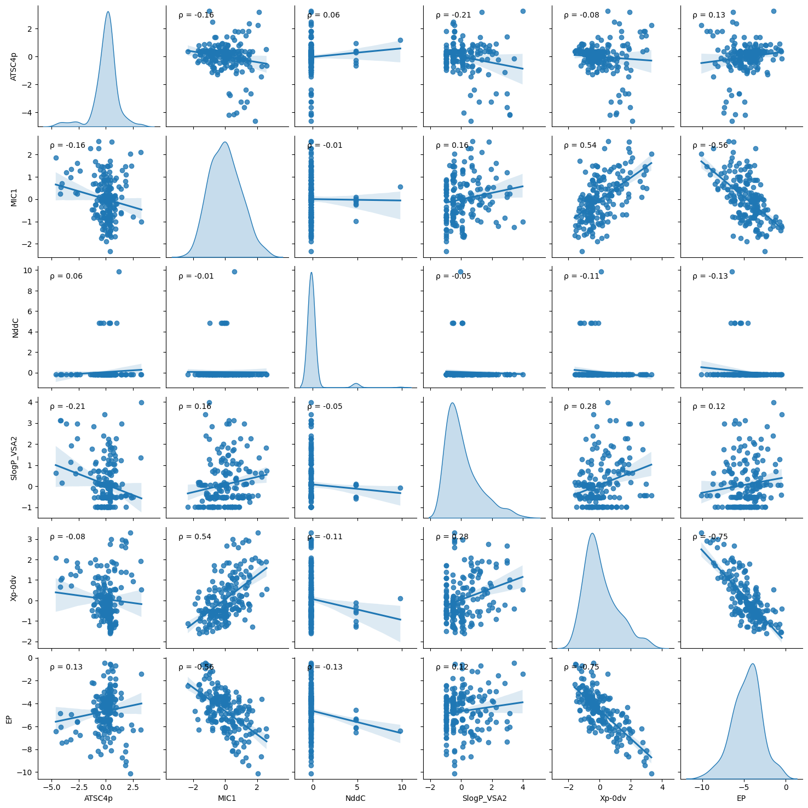
    


<div>
<style scoped>
    .dataframe tbody tr th:only-of-type {
        vertical-align: middle;
    }

    .dataframe tbody tr th {
        vertical-align: top;
    }

    .dataframe thead th {
        text-align: right;
    }
</style>
<table border="1" class="dataframe">
  <thead>
    <tr style="text-align: right;">
      <th></th>
      <th>ATSC4p</th>
      <th>MIC1</th>
      <th>NddC</th>
      <th>SlogP_VSA2</th>
      <th>Xp-0dv</th>
      <th>EP</th>
    </tr>
  </thead>
  <tbody>
    <tr>
      <th>ATSC4p</th>
      <td>1.000000</td>
      <td>-0.164075</td>
      <td>0.064593</td>
      <td>-0.207991</td>
      <td>-0.077051</td>
      <td>0.128154</td>
    </tr>
    <tr>
      <th>MIC1</th>
      <td>-0.164075</td>
      <td>1.000000</td>
      <td>-0.007424</td>
      <td>0.162557</td>
      <td>0.540639</td>
      <td>-0.563949</td>
    </tr>
    <tr>
      <th>NddC</th>
      <td>0.064593</td>
      <td>-0.007424</td>
      <td>1.000000</td>
      <td>-0.045657</td>
      <td>-0.113369</td>
      <td>-0.130381</td>
    </tr>
    <tr>
      <th>SlogP_VSA2</th>
      <td>-0.207991</td>
      <td>0.162557</td>
      <td>-0.045657</td>
      <td>1.000000</td>
      <td>0.284031</td>
      <td>0.120575</td>
    </tr>
    <tr>
      <th>Xp-0dv</th>
      <td>-0.077051</td>
      <td>0.540639</td>
      <td>-0.113369</td>
      <td>0.284031</td>
      <td>1.000000</td>
      <td>-0.746864</td>
    </tr>
    <tr>
      <th>EP</th>
      <td>0.128154</td>
      <td>-0.563949</td>
      <td>-0.130381</td>
      <td>0.120575</td>
      <td>-0.746864</td>
      <td>1.000000</td>
    </tr>
  </tbody>
</table>
</div>


```python
model.save()
```

    Path :/home/jun/pyqsar/pyqsar3r25
    Index   File Name
       0    qdb1_F_standard.info


    Enter .info file index to load :  0


    
    


    Selected Algorithm in Feature Selection (MC/GA) :  MC
    Selected Model (MLR/PLS) :  MLR
    Enter model name to  save as
    (default) qdb1_F_s_B_MC_MLR.model
    - :  


    qdb1_F_s_B_MC_MLR.model file saved


```python
mol = draw_mol.DrawMols(ID=['16115','6129'])
mol.show()
```

    Path :/home/jun/pyqsar/pyqsar3r25
    Index   File Name
       0    qdb1.sdf


    Enter .sdf file index to load :  0


    
    


    
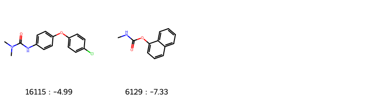
    


```python
substr = mol.common_substr()
mol.show_substr(substr)
```


    
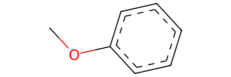
    


```python
mol.show_3D()
```


    interactive(children=(Dropdown(description='ID', options=('16115', '6129'), value='16115'), Dropdown(descripti…


## Model Information
-----------------------------------------------


```python
ModelTest = mt.ModelTest()
```

    Path :/home/jun/pyqsar/pyqsar3r25
    Index   File Name
       0    qdb1_F_s_B_MC_MLR.model


    Enter .model file index to load :  0


    
    


<div>
<style scoped>
    .dataframe tbody tr th:only-of-type {
        vertical-align: middle;
    }

    .dataframe tbody tr th {
        vertical-align: top;
    }

    .dataframe thead th {
        text-align: right;
    }
</style>
<table border="1" class="dataframe">
  <thead>
    <tr style="text-align: right;">
      <th></th>
      <th>ATSC4p</th>
      <th>MIC1</th>
      <th>NddC</th>
      <th>SlogP_VSA2</th>
      <th>Xp-0dv</th>
      <th>Description</th>
    </tr>
    <tr>
      <th>Row</th>
      <th></th>
      <th></th>
      <th></th>
      <th></th>
      <th></th>
      <th></th>
    </tr>
  </thead>
  <tbody>
    <tr>
      <th>Scale</th>
      <td>3.065640</td>
      <td>7.410414</td>
      <td>0.878603</td>
      <td>3.948729</td>
      <td>0.066528</td>
      <td>Per feature relative scaling of the data to ac...</td>
    </tr>
    <tr>
      <th>Mean</th>
      <td>-0.977846</td>
      <td>19.200235</td>
      <td>0.284247</td>
      <td>2.481973</td>
      <td>0.496183</td>
      <td>The mean value for each feature in the trainin...</td>
    </tr>
    <tr>
      <th>Var</th>
      <td>9.398148</td>
      <td>54.914237</td>
      <td>0.771944</td>
      <td>15.592459</td>
      <td>0.004426</td>
      <td>The variance for each feature in the training set</td>
    </tr>
    <tr>
      <th>Coef</th>
      <td>0.206766</td>
      <td>-0.349078</td>
      <td>-0.313306</td>
      <td>0.633987</td>
      <td>-1.280102</td>
      <td>Coef value of each feature</td>
    </tr>
    <tr>
      <th>Padel Index</th>
      <td>258.000000</td>
      <td>728.000000</td>
      <td>581.000000</td>
      <td>765.000000</td>
      <td>537.000000</td>
      <td>PaDEL descriptor index</td>
    </tr>
  </tbody>
</table>
</div>


<div>
<style scoped>
    .dataframe tbody tr th:only-of-type {
        vertical-align: middle;
    }

    .dataframe tbody tr th {
        vertical-align: top;
    }

    .dataframe thead th {
        text-align: right;
    }
</style>
<table border="1" class="dataframe">
  <thead>
    <tr style="text-align: right;">
      <th></th>
      <th>ATSC4p</th>
      <th>MIC1</th>
      <th>NddC</th>
      <th>SlogP_VSA2</th>
      <th>Xp-0dv</th>
      <th>EP</th>
      <th>Predict</th>
      <th>Error</th>
    </tr>
    <tr>
      <th>ID</th>
      <th></th>
      <th></th>
      <th></th>
      <th></th>
      <th></th>
      <th></th>
      <th></th>
      <th></th>
    </tr>
  </thead>
  <tbody>
    <tr>
      <th>11859</th>
      <td>0.400891</td>
      <td>1.010308</td>
      <td>-0.171398</td>
      <td>-0.521548</td>
      <td>-0.091129</td>
      <td>-5.46</td>
      <td>-5.041991</td>
      <td>-0.418009</td>
    </tr>
    <tr>
      <th>11899</th>
      <td>0.160976</td>
      <td>1.472546</td>
      <td>-0.171398</td>
      <td>-0.537675</td>
      <td>-0.154874</td>
      <td>-4.66</td>
      <td>-5.181579</td>
      <td>0.521579</td>
    </tr>
    <tr>
      <th>2723704</th>
      <td>-0.430709</td>
      <td>-0.026408</td>
      <td>-0.171398</td>
      <td>0.099304</td>
      <td>-1.029226</td>
      <td>-3.98</td>
      <td>-3.257571</td>
      <td>-0.722429</td>
    </tr>
    <tr>
      <th>3032338</th>
      <td>0.105913</td>
      <td>-0.062641</td>
      <td>-0.171398</td>
      <td>0.055038</td>
      <td>-0.822031</td>
      <td>-4.00</td>
      <td>-3.427263</td>
      <td>-0.572737</td>
    </tr>
    <tr>
      <th>2346</th>
      <td>0.271452</td>
      <td>-0.094217</td>
      <td>4.833418</td>
      <td>-0.516730</td>
      <td>-0.307311</td>
      <td>-6.54</td>
      <td>-5.971437</td>
      <td>-0.568563</td>
    </tr>
    <tr>
      <th>...</th>
      <td>...</td>
      <td>...</td>
      <td>...</td>
      <td>...</td>
      <td>...</td>
      <td>...</td>
      <td>...</td>
      <td>...</td>
    </tr>
    <tr>
      <th>6348</th>
      <td>0.375887</td>
      <td>-0.982260</td>
      <td>4.833418</td>
      <td>-0.591293</td>
      <td>-1.279054</td>
      <td>-4.56</td>
      <td>-4.443189</td>
      <td>-0.116811</td>
    </tr>
    <tr>
      <th>2723790</th>
      <td>0.716717</td>
      <td>-0.407856</td>
      <td>-0.171398</td>
      <td>-0.521028</td>
      <td>-1.299579</td>
      <td>-3.84</td>
      <td>-2.934370</td>
      <td>-0.905630</td>
    </tr>
    <tr>
      <th>2723949</th>
      <td>0.899870</td>
      <td>-0.222806</td>
      <td>-0.171398</td>
      <td>-0.531936</td>
      <td>-1.175735</td>
      <td>-3.64</td>
      <td>-3.126547</td>
      <td>-0.513453</td>
    </tr>
    <tr>
      <th>969491</th>
      <td>3.190576</td>
      <td>2.116495</td>
      <td>-0.171398</td>
      <td>1.342976</td>
      <td>1.924606</td>
      <td>-6.28</td>
      <td>-6.249588</td>
      <td>-0.030412</td>
    </tr>
    <tr>
      <th>6228</th>
      <td>0.902360</td>
      <td>-1.017566</td>
      <td>-0.171398</td>
      <td>1.265142</td>
      <td>-1.137432</td>
      <td>-0.70</td>
      <td>-1.758305</td>
      <td>1.058305</td>
    </tr>
  </tbody>
</table>
<p>194 rows × 8 columns</p>
</div>


<div>
<style scoped>
    .dataframe tbody tr th:only-of-type {
        vertical-align: middle;
    }

    .dataframe tbody tr th {
        vertical-align: top;
    }

    .dataframe thead th {
        text-align: right;
    }
</style>
<table border="1" class="dataframe">
  <thead>
    <tr style="text-align: right;">
      <th></th>
      <th>Value</th>
    </tr>
    <tr>
      <th>Row</th>
      <th></th>
    </tr>
  </thead>
  <tbody>
    <tr>
      <th>R2_CV</th>
      <td>0.7732035864945177</td>
    </tr>
    <tr>
      <th>Q2_CV</th>
      <td>0.759638991396595</td>
    </tr>
    <tr>
      <th>RMSE_CV</th>
      <td>0.858969974417255</td>
    </tr>
    <tr>
      <th>Model_Algo</th>
      <td>MLR</td>
    </tr>
    <tr>
      <th>Preprocessing</th>
      <td>standard</td>
    </tr>
  </tbody>
</table>
</div>


```python
ModelTest.model_test(scaled=True)
```

    Path :/home/jun/pyqsar/pyqsar3r25
    Index   File Name
       0    qdb1_F_s.test
       1    qdb1_F_s_B.test


    Enter .test file index to load :  1


    
    


<div class="bk-root" id="3cfe5354-895c-4661-bb31-4bac7f3ba729" data-root-id="2142"></div>


    Test R2 : 0.598894
    Test RMSE : 1.123991


```python
ModelTest.editor()
```


<style>.bk-root, .bk-root .bk:before, .bk-root .bk:after {
  font-family: var(--jp-ui-font-size1);
  font-size: var(--jp-ui-font-size1);
  color: var(--jp-ui-font-color1);
}
</style>


<div id='2359'>
  <div class="bk-root" id="dc42ebcf-cac2-4e18-94fe-5670c6014d14" data-root-id="2359"></div>
</div>
<script type="application/javascript">(function(root) {
  function embed_document(root) {
    var docs_json = {"4b9f0a9f-af56-4a1e-bce3-a85be840d880":{"defs":[{"extends":null,"module":null,"name":"ReactiveHTML1","overrides":[],"properties":[]},{"extends":null,"module":null,"name":"FlexBox1","overrides":[],"properties":[{"default":"flex-start","kind":null,"name":"align_content"},{"default":"flex-start","kind":null,"name":"align_items"},{"default":"row","kind":null,"name":"flex_direction"},{"default":"wrap","kind":null,"name":"flex_wrap"},{"default":"flex-start","kind":null,"name":"justify_content"}]},{"extends":null,"module":null,"name":"GridStack1","overrides":[],"properties":[{"default":"warn","kind":null,"name":"mode"},{"default":null,"kind":null,"name":"ncols"},{"default":null,"kind":null,"name":"nrows"},{"default":true,"kind":null,"name":"allow_resize"},{"default":true,"kind":null,"name":"allow_drag"},{"default":[],"kind":null,"name":"state"}]},{"extends":null,"module":null,"name":"click1","overrides":[],"properties":[{"default":"","kind":null,"name":"terminal_output"},{"default":"","kind":null,"name":"debug_name"},{"default":0,"kind":null,"name":"clears"}]},{"extends":null,"module":null,"name":"NotificationAreaBase1","overrides":[],"properties":[{"default":"bottom-right","kind":null,"name":"position"},{"default":0,"kind":null,"name":"_clear"}]},{"extends":null,"module":null,"name":"NotificationArea1","overrides":[],"properties":[{"default":[],"kind":null,"name":"notifications"},{"default":"bottom-right","kind":null,"name":"position"},{"default":0,"kind":null,"name":"_clear"},{"default":[{"background":"#ffc107","icon":{"className":"fas fa-exclamation-triangle","color":"white","tagName":"i"},"type":"warning"},{"background":"#007bff","icon":{"className":"fas fa-info-circle","color":"white","tagName":"i"},"type":"info"}],"kind":null,"name":"types"}]},{"extends":null,"module":null,"name":"Notification","overrides":[],"properties":[{"default":null,"kind":null,"name":"background"},{"default":3000,"kind":null,"name":"duration"},{"default":null,"kind":null,"name":"icon"},{"default":"","kind":null,"name":"message"},{"default":null,"kind":null,"name":"notification_type"},{"default":false,"kind":null,"name":"_destroyed"}]},{"extends":null,"module":null,"name":"TemplateActions1","overrides":[],"properties":[{"default":0,"kind":null,"name":"open_modal"},{"default":0,"kind":null,"name":"close_modal"}]},{"extends":null,"module":null,"name":"MaterialTemplateActions1","overrides":[],"properties":[{"default":0,"kind":null,"name":"open_modal"},{"default":0,"kind":null,"name":"close_modal"}]}],"roots":{"references":[{"attributes":{"active":[0],"labels":["New File?"],"margin":[5,10,5,10],"sizing_mode":"stretch_width"},"id":"2366","type":"CheckboxGroup"},{"attributes":{"children":[{"id":"2363"},{"id":"2366"},{"id":"2367"},{"id":"2368"}],"margin":[0,0,0,0],"name":"Column00130","sizing_mode":"stretch_width"},"id":"2362","type":"Column"},{"attributes":{"format":"smiles","guicolor":"#c0c0c0","height":500,"jme":"Not Subscribed","margin":[5,10,5,10],"mol":"Not Subscribed","mol3000":"Not Subscribed","name":"","sdf":"Not Subscribed","sizing_mode":"stretch_width","smiles":"Not Subscribed"},"id":"2361","type":"panel_chemistry.bokeh_extensions.jsme_editor.JSMEEditor"},{"attributes":{"children":[{"id":"2360"},{"id":"2369"}],"margin":[0,0,0,0],"name":"Column00132","sizing_mode":"stretch_width"},"id":"2359","type":"Column"},{"attributes":{"height":30,"margin":[5,10,5,10],"max_length":5000,"placeholder":"Enter File Name; File Extension is .csv ","sizing_mode":"fixed","width":400},"id":"2367","type":"TextAreaInput"},{"attributes":{"client_comm_id":"17bfff7910b143f7813e40086c48c32f","comm_id":"c82d20ff19d94eadb379ca5c491bbe7c","plot_id":"2359"},"id":"2370","type":"panel.models.comm_manager.CommManager"},{"attributes":{"height":320,"margin":[5,10,5,10],"max_length":5000,"sizing_mode":"fixed","value":"Ready","width":400},"id":"2368","type":"TextAreaInput"},{"attributes":{"children":[{"id":"2361"},{"id":"2362"}],"margin":[0,0,0,0],"name":"Row00131","sizing_mode":"stretch_width"},"id":"2360","type":"Row"},{"attributes":{"margin":[5,10,5,10],"name":"","sizing_mode":"stretch_width","text":"<b></b>"},"id":"2364","type":"Div"},{"attributes":{"button_type":"primary","icon":null,"label":"Evaluation","margin":[5,10,5,10],"sizing_mode":"stretch_width","subscribed_events":["button_click"]},"id":"2369","type":"Button"},{"attributes":{"children":[{"id":"2364"},{"id":"2365"}],"margin":[5,5,5,5],"name":"","sizing_mode":"stretch_width","width":300},"id":"2363","type":"Column"},{"attributes":{"disabled":true,"height":50,"margin":[5,10,5,10],"max_length":5000,"sizing_mode":"fixed","title":"SMILES","width":400},"id":"2365","type":"TextAreaInput"}],"root_ids":["2359","2370"]},"title":"Bokeh Application","version":"2.4.3"}};
    var render_items = [{"docid":"4b9f0a9f-af56-4a1e-bce3-a85be840d880","root_ids":["2359"],"roots":{"2359":"dc42ebcf-cac2-4e18-94fe-5670c6014d14"}}];
    root.Bokeh.embed.embed_items_notebook(docs_json, render_items);
    for (const render_item of render_items) {
      for (const root_id of render_item.root_ids) {
	const id_el = document.getElementById(root_id)
	if (id_el.children.length && (id_el.children[0].className === 'bk-root')) {
	  const root_el = id_el.children[0]
	  root_el.id = root_el.id + '-rendered'
	}
      }
    }
  }
  if (root.Bokeh !== undefined && root.Bokeh.Panel !== undefined) {
    embed_document(root);
  } else {
    var attempts = 0;
    var timer = setInterval(function(root) {
      if (root.Bokeh !== undefined && root.Bokeh.Panel !== undefined) {
        clearInterval(timer);
        embed_document(root);
      } else if (document.readyState == "complete") {
        attempts++;
        if (attempts > 200) {
          clearInterval(timer);
          console.log("Bokeh: ERROR: Unable to run BokehJS code because BokehJS library is missing");
        }
      }
    }, 25, root)
  }
})(window);</script>


```python
ModelTest.new_molecule('asdf.csv')
```


    ---------------------------------------------------------------------------

    FileNotFoundError                         Traceback (most recent call last)

    /tmp/ipykernel_17625/2019858943.py in <module>
    ----> 1 ModelTest.new_molecule('asdf.csv')
    

    ~/pyqsar/pyqsar3r25/pyqsar/model_tools.py in new_molecule(self, file_name)
       2069 
       2070     def new_molecule(self,file_name):
    -> 2071         data = pd.read_csv(file_name)
       2072         min_val = np.min(self.Feature['EP'].values)
       2073         work_path = os.getcwd().replace(sys.path[0]+'/','')


    ~/miniforge3/envs/pq3/lib/python3.9/site-packages/pandas/util/_decorators.py in wrapper(*args, **kwargs)
        209                 else:
        210                     kwargs[new_arg_name] = new_arg_value
    --> 211             return func(*args, **kwargs)
        212 
        213         return cast(F, wrapper)


    ~/miniforge3/envs/pq3/lib/python3.9/site-packages/pandas/util/_decorators.py in wrapper(*args, **kwargs)
        329                     stacklevel=find_stack_level(),
        330                 )
    --> 331             return func(*args, **kwargs)
        332 
        333         # error: "Callable[[VarArg(Any), KwArg(Any)], Any]" has no


    ~/miniforge3/envs/pq3/lib/python3.9/site-packages/pandas/io/parsers/readers.py in read_csv(filepath_or_buffer, sep, delimiter, header, names, index_col, usecols, squeeze, prefix, mangle_dupe_cols, dtype, engine, converters, true_values, false_values, skipinitialspace, skiprows, skipfooter, nrows, na_values, keep_default_na, na_filter, verbose, skip_blank_lines, parse_dates, infer_datetime_format, keep_date_col, date_parser, dayfirst, cache_dates, iterator, chunksize, compression, thousands, decimal, lineterminator, quotechar, quoting, doublequote, escapechar, comment, encoding, encoding_errors, dialect, error_bad_lines, warn_bad_lines, on_bad_lines, delim_whitespace, low_memory, memory_map, float_precision, storage_options)
        948     kwds.update(kwds_defaults)
        949 
    --> 950     return _read(filepath_or_buffer, kwds)
        951 
        952 


    ~/miniforge3/envs/pq3/lib/python3.9/site-packages/pandas/io/parsers/readers.py in _read(filepath_or_buffer, kwds)
        603 
        604     # Create the parser.
    --> 605     parser = TextFileReader(filepath_or_buffer, **kwds)
        606 
        607     if chunksize or iterator:


    ~/miniforge3/envs/pq3/lib/python3.9/site-packages/pandas/io/parsers/readers.py in __init__(self, f, engine, **kwds)
       1440 
       1441         self.handles: IOHandles | None = None
    -> 1442         self._engine = self._make_engine(f, self.engine)
       1443 
       1444     def close(self) -> None:


    ~/miniforge3/envs/pq3/lib/python3.9/site-packages/pandas/io/parsers/readers.py in _make_engine(self, f, engine)
       1733                 if "b" not in mode:
       1734                     mode += "b"
    -> 1735             self.handles = get_handle(
       1736                 f,
       1737                 mode,


    ~/miniforge3/envs/pq3/lib/python3.9/site-packages/pandas/io/common.py in get_handle(path_or_buf, mode, encoding, compression, memory_map, is_text, errors, storage_options)
        854         if ioargs.encoding and "b" not in ioargs.mode:
        855             # Encoding
    --> 856             handle = open(
        857                 handle,
        858                 ioargs.mode,


    FileNotFoundError: [Errno 2] No such file or directory: 'asdf.csv'


```python

```
